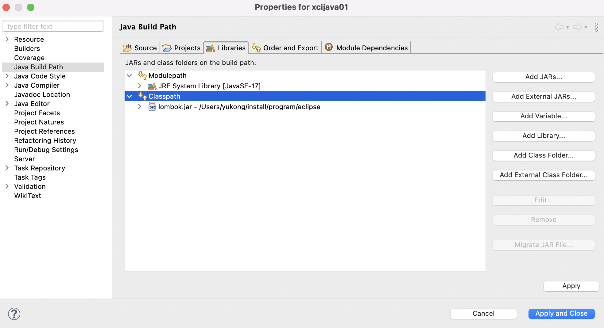
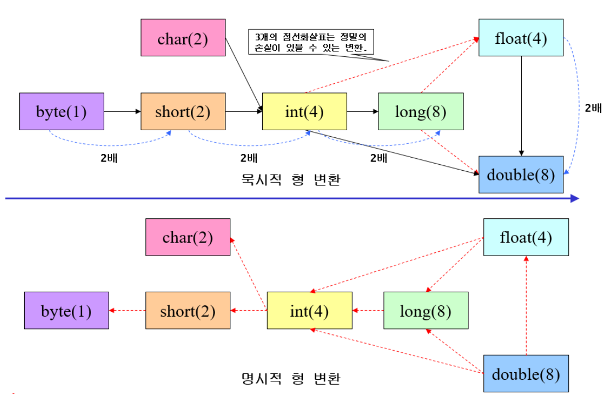

# [10/17] Java (lombok, 연산자, 제어문)

## 외부 의존성 추가

- 이클립스는 외부 의존성 파일을 자동으로 설치해주지 않아 직접 설치 필요
    - https://projectlombok.org/download
    - lombok 파일 실행 : java -jar lombok.jar

이클립스에 적용

## 비트연산

- 이전에는 감산기의 비용을 절감하기 위해 모든 연산을 가산으로 처리
- 7 - 4 —> 7 + (-4) = 3
- 00000111(7) + 11111100(-4) = 00000011(3)
- 곱하기의 경우 가산을 여러번 실행
- 나누기의 경우 감산(-가산) 을 여러번 실행

## 형변환

- 필드 폭이 좁은 타입에서 넓은 타입으로 갈 경우 자동 형변환 가능
- 그 반대의 경우 무조건 강제 형변환(캐스팅) 필요
- long(8byte) → float(4byte) 의 경우 예외로 `자동 형변환` 이 가능하나 일부 데이터가 유실될 수 있음
- float(4byte) → long(8byte) 의 경우 예외로 `강제 형변환` 을 해주어야 함

## 자바 기본 클래스

- JVM 실행 시 `java.lang` 패키지를 미리 호출해두기 때문에 import 를 하지 않아도 사용할 수 있다
    - System, String 등
