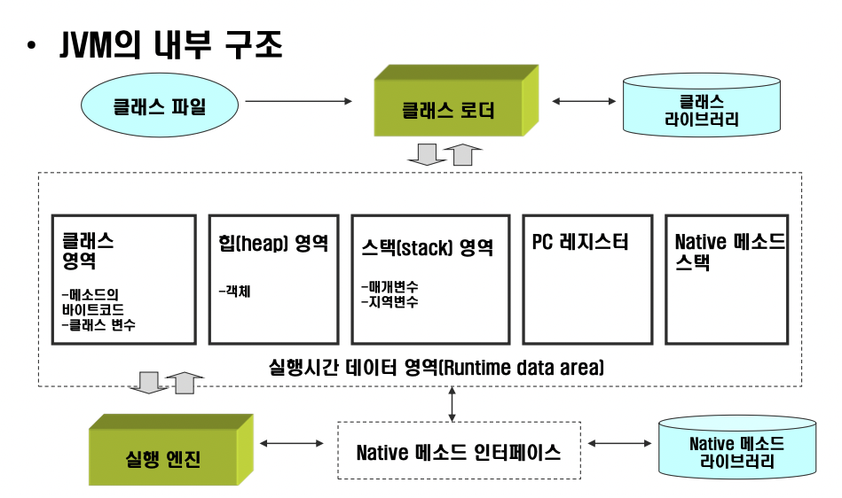

# [10/19] Java (생성자, 제어자, static, JVM, 상속과 다형성)

## 접근 제어자

- **클래스 내부 < 패키지 내부 < 상속 관계 < 관계없음**
- 패키지 내부 < 상속 관계 → jar 생성 시 묶이는 기준 : 패키지, 패키지 기준으로 생성 후 상속
- private OXXX
- default OOXX
- protected OOOX
- public OOOO

## JVM 의 구조와 메모리 모델

- 클래스 영역
    - **자바 어플리케이션 실행 시 클래스 로더에 의해 클래스가 바이트코드로 해석되어 저장**
        - 로드된 클래스, 메서드, 정적(static) 변수, 상수 풀 등 저장하는 영역
- 힙 영역
    - 클래스의 인스턴스를 저장
        - 인스턴스 데이터(필드), **메서드 참조 데이터(클래스 영역에서 관리)**, 인스턴스의 메타데이터 등
        - 메타데이터 : 클래스 정보(이름, 메서드, 필드 등), 상태 정보(필드에 저장된 값, 메서드의 호출 스택 정보 등), 메모리 주소 등

## 상속 관계에서 데이터 저장 과정

- Parent parent = new Child();
- 데이터 저장 과정
    - 힙 영역에 Parent 를 포함하는 Child 클래스의 인스턴스 저장
    - Parent 타입의 변수 parent 를 생성
        - 메서드 내부에서 선언했을 경우 스택 영역에, 인스턴스 내부(필드)에서 선언했을 경우 힙 영역에 저정
    - parent 에 Child 인스턴스 주소를 할당
- 변수 캐스팅 시 parent 의 타입이 변경
- **참조하고 있는 인스턴스 저장 내용에 따라 캐스팅 가능 여부가 다름**
    - Child 를 상속하는 Child2 가 있을 경우, 힙 영역에는 Parent 를 포함하는 Child 만 저장되어 있기 때문에 해당 정보가 없어 Child2 로 다운캐스팅 하지 못함

## 상속 관계에서 동일한 필드명에 대한 접근

- A 와 B 에 동일한 이름을 가지는 필드가 있을 경우 변수가 참조하는 타입의 필드에 접근 (p.340)
- **A** a = new B(); a.m; → A 에 저장된 필드에 접근
- **B** b = new B(); b.m → B 에 저장된 필드에 접근
- static 으로 선언시에도 동일함

## instanceof

- 참조하는 인스턴스의 타입을 기준으로 확인 (변수의 현재 타입 X)
    - parent instanceof Parent → true
    - parent instanceof Chile → true
- 캐스팅 가능 여부와 동일

## 생성자 선언

- 클래스 내 생성자가 하나도 없을 경우 JVM 의 컴파일러가 기본 생성자 자동 생성
    - 컴파일러가 직접 생성한 것만 기본 생성자라고 부르고, 개발자가 직접 생성한 파라미터 없는 생성자는 기본 생성자라고 하지 않음
    - https://docs.oracle.com/javase/tutorial/java/javaOO/constructors.html

## 상속 관계에서 생성자 선언

- 하위 클래스에서 생성자를 정의했을 경우 super() 를 호출하지 않아도 JVM 의 컴파일러가 자동 생성
    - 바이트코드로 확인 가능

## 추상클래스의 다중 상속 불가

- 상위 클래스가 여러 개 있을 경우 클래스들의 중복 필드명을 구분할 수 없음
