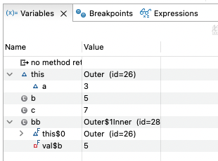

# [10/20] Java (추상클래스와 인터페이스, Thread, 이너클래스, 예외처리, 쓰레드)

## 추상클래스 다중 상속 불가능

- Java 는 여러 하드웨어(OS) 에 관계 없이 동작하도록 구성되어 있음
- 모든 환경에서 동일하게 동작하기 위해 메모리의 구조를 최대한 단순하게 관리
- 자바는 상속 시 상위 클래스의 인스턴스 생성 후 하위 클래스의 인스턴스 생성
- **만약 다중 상속을 지원할 경우 인스턴스 저장 시의 구조가 복잡해져 관리가 어려워짐**

## 인터페이스 간의 다중 상속은 가능

- 자바는 문법 적으로 추상클래스 다중 상속을 지원하지 않기 때문에 인터페이스를 활용할 수 있음
- 예를 들어 이미 다른 추상클래스를 상속하고 있는 상태에서 멀티쓰레드 기능을 구현한다고 하자
- class Thread 를 현재 클래스에 상속받으면 다중 상속이므로 불가능 → Runnable 인터페이스 활용
- Runnable 인터페이스 구현을 통해 run() 메서드를 오버라이딩하고, 메서드 내부에서 Thread 객체를 생성하여 이를 사용할 수 있음
    - Thread 는 내부적으로 run() 메서드 선언 및 활용

## 이너 클래스

- 이너 클래스의 인스턴스 생성 시 Nested Class 에 접근 후 new 키워드를 이용하여 생성 가능

## 지역 클래스

- 메서드 내부에서 선언한 클래스
- 지역 클래스는 메서드를 호출할 때 메모리에 클래스 정보 로드
  - JVM 이 구동될 때 클래스 로더에 의해 클래스 영역에 저장되는 다른 클래스와는 달리 로컬 클래스는 메서드가 호출 될 때 클래스 정보 로드
  - 메서드 내에서만 접근하여 메서드 접근 시에 메모리 영역에 클래스의 바이트 코드 로드
  - 메서드가 종료되면 소멸되므로 Stack Area 에 저장
  - 인스턴스 생성 시 Heap Area 에서 관리
  

  
Local Class 생성 시점 디버깅

  

  

  
지역 클래스의 정보(Outer$1Inner)는 메서드에서 읽어올 때 로드

  
Stack Area(Variables) 에 저장

  
  

  

- 지역 클래스에서 메서드 지역 변수에 접근 시 JVM 의 컴파일러가 해당 지역 변수를 final 로 변환
    - 지역변수는 스택 영역에 저장되어 메서드 종료 시 소멸
    - 지역 클래스의 인스턴스는 힙 영역에 저장되어 메서드 종료 시 참조 해제
    - 실행 순서 상 메서드 영역이 먼저 제거되기 때문에 지역 변수에 참조할 수 없어 재할당 제한
    - 지역 변수가 저장되는 메모리 영역의 변화 : **스택 영역 → 클래스 영역**
- 지역 클래스에서 접근하지 않는 지역 변수는 그대로 변수 없이 처리됨

## try-catch

- try 구문은 되도록 작게 관리한다
- 어플리케이션 상에서 try 를 실행할 때 예외 감지를 대기하고 있으므로 성능 저하 발생
- 최근에는 성능 최적화가 많이 처리되어 큰 차이는 없음

## try-with-resources

- 자바 7부터 추가된 문법 구문
- 자원에 대해 try 시 자동 close 지원
    - AutoCloseable 을 구현한 클래스에만 해당
    - AutoCloseable 의 close() 를 호출하여 자원 할당 종료
- try → `close()` → catch → finally

## thread

- 멀티 태스킹 : 여러 개의 작업이 동시에 실행되는 것
- 프로그램이 실행되기 위해서는 메모리에 할당되어야 하는데, 해당 단위가 프로세스
- 메모리에 할당된 프로세스를 실행할 때 CPU 에 할당하는데, 해당 단위가 스레드

## new Thread();

- **Thread 생성 시 JVM Runtime Memory Area 에 Stack Area 자체가 하나 더 생성**
- Thread 생성 전
    - Class Area / Stack Area / Heap Area
- Thread 생성 후
    - Class Area / Stack Area 1 / Stack Area 2 / Heap Area
