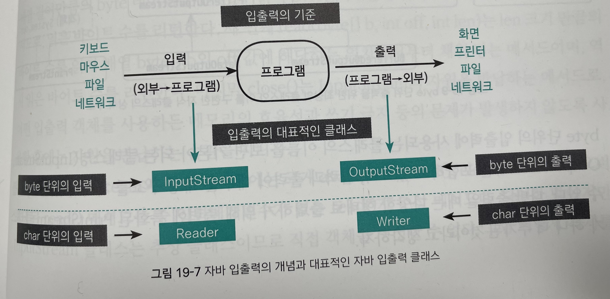
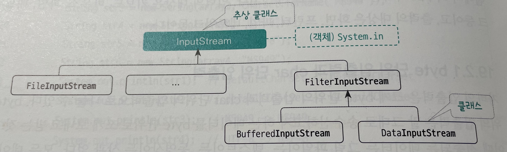
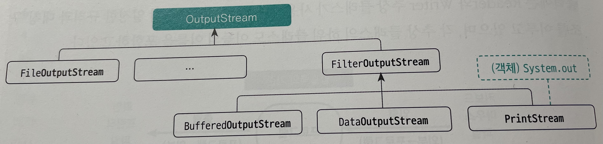

# [10/25] Java (람다식, 자바 입출력, 직렬화, 문자셋)

## 람다식 메서드 참조

- 인스턴스 메서드 참조
    - 클래스 객체::인스턴스 메서드명
    - A a. = b::bcd;
    - 리턴 타입과 매개변수의 타입이 반드시 동일해야 함
    - 해당 메서드가 오버로딩 되었을 경우 인터페이스에 포함된 추상 메서드의 매개변수에 맞는 메서드 호출
- 정적 메서드 참조
    - 클래스명::정적 메서드명
    - A a = B::bcd;
- 생성자 참조
    - 배열타입::new
    - int[]::new
- 클래스 생성자 참조
    - 클래스명::new
    - 생성자가 여러 개 있을 경우 인터페이스에 포함된 추상 메서드의 매개변수에 맞는 생성자 호출

## 자바 입출력

- new File(String pathname) : 클래스의 인스턴스 생성
    - 파일 인스턴스를 생성하는 시점에는 실제 파일의 존재 유무는 전혀 관련 X
    - 파일을 읽는 시점에 존재하지 않으면 FileNotFoundException 예외가 발생
- File.separator : OS 별 파일 구분자를 나타내는 상수
- System.getProperty(”user.dir”) : 현재 작업 폴더 → 상대경로 시 사용 가능
    - System.getProperty() : JVM 의 설정값 반환

## 문자셋

- 어떤 언어를 표현하는 데 사용하는 문자들의 집합
- 아스키코드 : 영문 알파벳, 숫자, 특수 기호, 제어 코드로 구성된 구성표
- 유니코드 : 하나의 문자셋 안에 전 세계 문자를 통합한 문자셋

### 한글 전용 문자셋

- KS C 601-1987 : 표준 맞춤법에 위배되는 문자를 제외한 모든 한글 문자에 대한 문자셋
- EUC-KR : 아스키코드 + KS 완성형
    - 한글 웹 페이지 표준 문자셋
    - 아스키(영문, 숫자, 특수 문자)는 1byte, 이외의 문자(한글, 한자)는 2byte 로 인코딩
- MS949 : EUC-KR + 누락된 한글 문자
    - 윈도우 운영체제의 기본 (mac 의 경우 UTF-8)

### 대표적인 유니코드 문자셋

- UTF-16 : 영문을 포함해 모든 문자를 고정 길이(2byte)로 인코딩하는 방식 → char 자료형 사용
    - UTF-16 으로 작성한 파일을 C  등 다른 프로그램에서 접근 시 오류가 발생할 수 있음
- UTF-8 : 가변 길이 문자 인코딩 방식
    - 웹 서버(Apache, IIS, NginX), 데이터베이스(MySQL 등), 리눅스, 맥, 시스템 등의 기본 인코딩 방식
    - 변환된 바이트값에 0 을 포함되지 않도록 설계됨
    - 영어와 숫자는 1byte 가 할당되며 한글은 3byte 로 표현

### Charset 클래스의 문자셋 이용

- 문자셋 객체의 생성 및 관리

### 명시적 문자셋 지정

- 특정 문자셋을 기준으로 문자열을 바이트 단위의 배열로 변환해 반환
    - byte[] getByte(Charset charset)
    - 매개변수로 들어온 문자셋에 따라 byte 가 다름

## 입출력

- byte 단위 입출력 : 송수신하고자 하는 데이터를 byte 단위로 쪼개 보내고 받는 것
- char 단위 입출력 : 텍스트 전송에 특화된 방법 (채팅 프로그램 등)
- Java 의 입출력은 방향성이 있으며 해당 가상의 통로를 Stream 이라 명칭

## InputStream

- byte 단위의 입력에 사용하는 최상위 **추상 클래스**
- System.in 은 InputStream 을 상속받아 추상 메서드를 구현한 클래스의 객체
- int available() : InputStream 의 남은 바이트 수를 리턴
- abstract int read() : int(4byte)의 하위 1byte에 읽은 데이터를 저장해 리턴 (추상 메서드)
    - 메서드 자체는 1byte 를 읽지만 실제로는 4byte를 반환
    - 속도 측면의 성능을 위해 JNI(Java Native Interface) 를 이용해 오버라이딩
        - JNI : JVM 을 거치지 않고 운영체제의 고유 기능을 직접 사용하기 위해 운영체제가 구현된 언어로 작성된 프로그램
- int read(byte[] b) : 읽은 데이터를 byte[] b의 0번째 위치부터 저장하며 읽은 바이트 수를 리턴
- int read(byte[] b, int off, int len) : len 개수만큼 읽은 데이터를 byte[] b 의 off 위치부터 저장
- void close() : InputStream 의 자원 반환

## OutputStream

- byte 단위의 출력에 사용하는 최상위 추상 클래스
- System.out 은 OuputStream 을 상속받은 FilterOutputStream 을 구현한 객체
- 사용 후 outputStream.flush() 권장
    - outputStream 의 버퍼에서 데이터 관리 → 해당 내용 반영
    - 경우에 따라 버퍼가 가득 차야 반영할 수 있음
- void flush() : 메모리 버퍼에 저장된 output stream 내보내기 (실제 출력 수행)
- abstract void write(int b) : int(4byte) 의 하위 1byte 를 output 버퍼에 출력 (추상 메서드)
- void write(byte[] b) : 매개변수로 넘겨진 byte[] b 의 0번째 위치에서부터 메모리 버퍼에 출력
- void write(byte[] b, int off, int len) : byte[] 의 off 위치에서 len 개를 읽은 후 출력
- void close() : OutputStream 의 자원 반환
