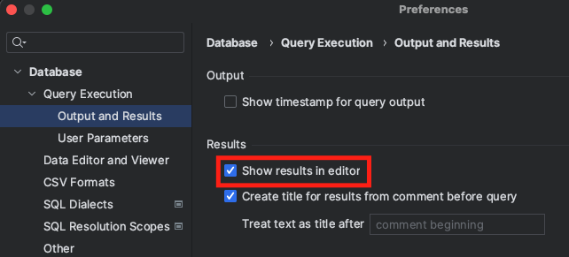

# [11/16] PL/SQL (연산자, Subprogram, Procedure, Function, Package, Identity)

- SQL (Structured Query Language)

## PL/SQL

- SQL(Manipulating Power) + 3GL(Processing Power)
- Block Structured Language

## 교재

- PL/SQL Tutorial : https://www.oracletutorial.com/plsql-tutorial/
- Oracle PL/SQL Articles : https://oracle-base.com/articles/plsql/articles-plsql
- 2 Day Developer's Guide : https://docs.oracle.com/en/database/oracle/oracle-database/21/tdddg/two-day-developer-intro.html
- Database PL/SQL Language Reference : https://docs.oracle.com/en/database/oracle/oracle-database/21/lnpls/index.html
- PL/SQL Packages and Types Reference : https://docs.oracle.com/en/database/oracle/oracle-database/21/arpls/index.html
- Oracle Live SQL의 Code Library : https://livesql.oracle.com/

## 연산자

|        | Java     | PL/SQL   |
|--------|----------|----------|
| 할당 연산자 | a = 100  | a := 100 |
| 비교 연산자 | a == 100 | a = 100  |

## set serveroutput on

- console 창에 프로시저 내용 출력
- / : sql*plus 에서 프로시저 종료를 의미

```sql
set serveroutput on;

begin
    for i in 1..10 loop
        dbms_output.put_line('Hello World!');
    end loop;
end;
/
```

- Data Grip 사용 시 해당 설정 변경
    - Preference > Database > Query Execution > Output and Results
    - check Show results in editor

  


## dbms_output.put_line

- 클라이언트 툴에 실행 결과 출력

## table_name.column_name%type;

- 호출 당시의 table_name 의 column_name 컬럼의 스펙을 가져와 그대로 선언

```sql
declare
    v_employee_id  employees.employee_id%type;
    v_salary       employees.salary%type;
begin
    select employee_id, salary into v_employee_id, v_salary
    from employees
    where employee_id = 141;

    if v_salary < 5000 then
      dbms_output.put_line('Are you kidding me?');
    else
      insert into t1(col1, col2)
      values (v_employee_id, v_salary);
    end if;
commit;
end;
/
```

## Anonymous(Unnamed) Block

- declare : 선언부
- begin ~ end : 실행부

## Named Block

- Java Class 작성 시 JVM 이 바이트코드로 해석하는 것처럼, Oracle Server 가 Procedure 을 바이트코드로 해석
- 프로시저 이름은 30자 이내 제한

```sql
-- procedure 생성
create or replace procedure p1
is
begin
    DBMS_OUTPUT.PUT_LINE('Hello World!');
end;
/

-- procedure 목록 조회
select * from USER_OBJECTS
where OBJECT_TYPE = 'PROCEDURE';

-- procedure 실행
-- 1. 
execute p1;

-- 2. 
begin
    p1;
end;
/
```

## 매개변수가 있는 프로시저 생성

```sql
-- 1
create or replace procedure p1(max_loop number)
is
begin
    for i in 1..max_loop loop
        dbms_output.put_line('Hello World!');
    end loop;
end;
/

-- 2
create or replace procedure p1(
    p_employee_id employees.employee_id%type
)
is
declare
    v_employee_id  employees.employee_id%type;
    v_salary       employees.salary%type;
begin
    select employee_id, salary into v_employee_id, v_salary
    from employees
    where employee_id = p_employee_id;

    if v_salary < 5000 then
      dbms_output.put_line('Are you kidding me?');
    else
      insert into t1(col1, col2)
      values (v_employee_id, v_salary);
    end if;
commit;
end;
/
```

- Quiz
    - 부서 번호를 입력하면 그 부서의 급여 합이 출력되도록 하는 프로시저 생성

    ```sql
    create or replace procedure get_employees_sum_sal_by_department_id(p_department_id number)
    is
        v_sum number;
    begin
        select sum(SALARY) into v_sum
        from EMPLOYEES
        where DEPARTMENT_ID = p_department_id;
    
        DBMS_OUTPUT.PUT_LINE(v_sum);
    end;
    /
    
    begin
        get_employees_sum_sal_by_department_id(50);
    end;
    /
    ```


## show errors

- 이름이 없는 프로시저의 경우 실행 시 바로 에러 발생
- 이름이 있는 프로시저의 경우 에러 없이 생성 진행
- 프로시저 생성 시 에러가 발생할 경우 error 를 보기 위해 해당 명령어 실행

```sql
show errors;
```

## Subprogram

- method 와 정확하게 비교할 수는 없지만 유사하게 의미를 설명하면 다음과 같음
- `procedure` : 반환값이 없는 method
- `function` : 반환값이 있는 method

## Function

```sql
-- function 생성
create or replace function tax(
    p_salary EMPLOYEES.salary%type
) return number
is
begin
    return p_salary * 0.013;
end;
/

-- function 호출
select EMPLOYEE_ID,
       LAST_NAME,
       upper(LAST_NAME) as upper_last_name,
       SALARY,
       tax(SALARY) as tax
from EMPLOYEES;
```

- Quiz
    - tax 계산
    - 10000 미만 > 0.013
    - 20000 미만 > 0.015
    - 20000 이상 > 0.02

    ```sql
    -- 1. if 문 풀이
    create or replace function tax_for_grade_with_if(
        p_salary number
    ) return number
    is
        v_tax number;
    begin
        if (p_salary < 10000) then
            v_tax := p_salary * 0.013;
        elsif (p_salary < 20000) then
            v_tax := p_salary * 0.015;
        else
            v_tax := p_salary * 0.02;
        end if;
        return v_tax;
    end;
    /
    
    -- 2. switch 문 풀이
    create or replace function tax_for_grade_with_switch(
        p_salary number
    ) return number
    is
        v_tax number;
    begin
        v_tax := case
            when p_salary < 10000 then p_salary * 0.013
            when p_salary < 20000 then p_salary * 0.015
            else p_salary * 0.02
        end;
        return v_tax;
    end;
    /
    
    -- 3. decode 문 풀이
    create or replace function tax_for_grade_with_decode(
      p_salary number
    ) return number
    is
      v_tax number;
    begin
      select decode(trunc(p_salary/10000), 0, p_salary*0.13,
                                           1, p_salary*0.15,
                                              p_salary*0.02)
             into v_tax
      from dual;
    
      return v_tax;
    
    end;
    /
    
    -- 4. create table 풀이
    drop table t_tax_rate purge;
    create table t_tax_rate
    (
        id          number generated as identity,
        lowest_sal  number,
        highest_sal number,
        tax_rate    number
    );
    
    insert into t_tax_rate(lowest_sal, highest_sal, tax_rate) values (0, 10000, 0.013);
    insert into t_tax_rate(lowest_sal, highest_sal, tax_rate) values (10000, 20000, 0.015);
    insert into t_tax_rate(lowest_sal, highest_sal, tax_rate) values (20000, null, 0.02);
    
    commit;
    
    create or replace function tax_for_grade_with_table(
        p_salary number
    ) return number
    is
        v_tax_rate t_tax_rate.tax_rate%type;
    begin
        select tax_rate into v_tax_rate
        from t_tax_rate
        where p_salary >= lowest_sal
          and p_salary < nvl(highest_sal, 10000000000000);
        return v_tax_rate;
    end;
    /
    
    select EMPLOYEE_ID,
           LAST_NAME,
           upper(LAST_NAME) as upper_last_name,
           SALARY,
           tax_for_grade_with_if(SALARY) as tax1,
           tax_for_grade_with_switch(SALARY) as tax2,
           SALARY * tax_for_grade_with_table(SALARY) as tax3
    from EMPLOYEES;
    ```


## Identity 컬럼

- Oracle Server 가 내부적으로 Sequence 테이블을 생성하여 관리

```sql
GENERATED [ ALWAYS | BY DEFAULT [ ON NULL ] ]
AS IDENTITY [ ( identity_options ) ]
```

- always : 해당 컬럼의 값을 ‘항상’ 생성
    - null 을 입력하거나 별도의 값을 이용하여 입력 시 에러 발생
- by default : 해당 컬럼의 값을 자동 생성하거나 직접 생성
    - null 입력 시 에러 발생
- on null : 해당 컬럼의 값을 자동 생성하거나 직접 생성하거나, null 입력
    - null 입력 시 자동 생성 카운트로 처리
    - 1(자동) → 999(수동) → null 입력 시 2 저장

## 자동 증가 컬럼 관리 (PK)

### trigger

- 전통적인 방법
- 편리하나 성능이 좋지 않음

```sql
CREATE TABLE trigger_identity (
  id           NUMBER  NOT NULL,
  description  VARCHAR2(30)
);

CREATE SEQUENCE trigger_identity_seq;

CREATE OR REPLACE TRIGGER trigger_identity_bir 
BEFORE INSERT ON trigger_identity 
FOR EACH ROW
WHEN (new.id IS NULL)
BEGIN
  :new.id := trigger_identity_seq.NEXTVAL;
END;
/
```

### sequence

- 전통적인 방법

```sql
CREATE TABLE sequence_identity (
  id           NUMBER  NOT NULL,
  description  VARCHAR2(30)
);

CREATE SEQUENCE sequence_identity_seq;
```

### identity

- 컬럼 설정으로 간단하게 처리 가능

```sql
CREATE TABLE real_identity (
  id          NUMBER GENERATED ALWAYS AS IDENTITY,
  description VARCHAR2(30)
);
```

## Package 만들기

### (1) 테이블 생성

```sql
drop table books purge;

create table books
(id    number generated as identity primary key,
 name  varchar2(30),
 price number(10, 2));
```

### (2) stand-alone subprogram(stored procedure 및 stored function) 구현

```sql
create or replace procedure insert_book (
  p_name  in varchar2,
  p_price in number)
as
begin
  insert into books (name, price)
  values (p_name, p_price);
end insert_book;
/

create or replace function read_book_by_id (
  p_id in number
)
  return sys_refcursor 
as
  v_cursor sys_refcursor;
begin
  open v_cursor for
    select name, price
    from books
    where id = p_id;

  return v_cursor;
end read_book_by_id;
/

create or replace procedure update_book_by_id (
  p_id    in number,
  p_name  in varchar2, 
  p_price in number)
as
begin
  update books
  set name = p_name,
      price = p_price
  where id = p_id;
end update_book_by_id;
/

create or replace procedure delete_book_by_id (
  p_id in number
)
as
begin
  delete from books
  where id = p_id;
end delete_book_by_id;
/
```

### (3) 실행

```sql
select * from books;

begin
  insert_book('자바 입문', 10000);
  insert_book('데이터베이스 활용', 15000);
  commit;
end;
/ 

select * from books;

declare
  v_cursor sys_refcursor;
  v_name   varchar2(30);
  v_price  number(10, 2);
begin
  v_cursor := read_book_by_id(1);

  fetch v_cursor into v_name, v_price;
  dbms_output.put_line('Name: ' || v_name || ', Price: ' || v_price);

  close v_cursor;
end;
/

select * from books;

begin
  update_book_by_id(1, '자바 입문', 12000);
  commit;
end;
/

select * from books;

begin
  delete_book_by_id(1);
  commit;
end;
/

select * from books;
```
