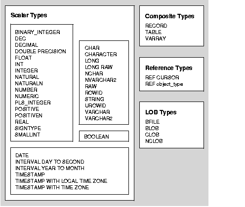

# [11/17] PL/SQL (View, 변수와 상수, 매개변수, 제어문, 예외처리, 트리거)

## View

- Named Select
- 이름이 붙여진 select 쿼리문

## DataType



### Scalar Types

- numeric, character, data, boolean, …

### Composite Types

- plsql record : 여러 개의 타입을 포함하고 있는 데이터 타입 (클래스)
- plsql table : record 타입의 배열

### Reference Types

- ref cursor, …

## PL/SQL 실행 과정

- PL/SQL 은 PL/SQL 과 SQL 이 한 곳에 선언되어 있음
- PL/SQL 을 실행하다가, SQL 을 마주하면 Oracle Server 가 SQL 실행
- 실행 결과를 into 등의 키워드를 이용하여 변수에 저장 (PL/SQL)

## Parameter

- PL/SQL 의 parameter 는 `call by value` 로 처리
- formal parameter : subprogram 선언 시 정의하는 값 (parameter)
    - in (default) : subprogram 내부에 사용할 값 정의
    - out : subprogram 외부에 활용할 값 정의
    - in out : in + out
- actual parameter : subprogram 실행 시 입력하는 값 (argument)
    - Position Notation (위치법)
    - Named Notation (명명법)
    - Mixed Notation (조합법)

## Constant

- 선언부에 정의한 변수 앞에 `constant` 키워드 붙여 상수 선언

## out vs return

- out : 매개변수로 받아온 변수에 값 할당
- return : 로직 처리 후 특정 값 반환
- 문법적으로는 function 에서도 out 과 return 을 모두 허용하나, return 사용하는 것을 권장

## procedure vs function

- procedure 는 sql 쿼리문에서 사용 불가하나, function 은 가능
- function 내에서 DML 선언 지양
- 기능 구현 시 procedure 와 function 중에서 반환값 여부가 아닌 쿼리문 실행 여부로 판단

## `%type`

```text
[table name].[column name]%type;
```

- 테이블 컬럼의 type 정보 접근
- 특정 테이블 컬럼의 type 정보를 이용하고 싶은 경우 사용
    - 동일한 스펙을 가지는 컬럼 생성
    - subprogram 의 매개변수 타입 지정

## `%rowtype`

```text
[table name]%rowtype;
```

- 테이블 row 자체의 정보 접근
- 특정 테이블 row 정보를 이용하고 싶은 경우 사용
    - subprogram 에서 table 의 row 자체를 처리할 때 변수 타입 지정
- SQL 이 아닌 PL/SQL 타입이기 때문에 SQL 연동 시 어려움이 있을 수 있음

## 변수에 값 지정하는 키워드

- into 와 bulk collect into 키워드는 plsql 키워드이므로, sql 를 모두 처리 후 할당 진행
- `into` : PL/SQL 에서 하나의 데이터를 변수에 저장하는 키워드

    ```sql
    begin
      select salary into v_salary
      from employees
      where employee_id = 1;
    end;
    /
    ```

- `bulk collect into` : PL/SQL 에서 여러 개의 데이터를 변수에 저장하는 키워드

    ```sql
    begin
      select salary BULK COLLECT INTO p_emp_sal_tab
      from employees
      where department_id = p_department_id;
    end;
    /
    ```


## 6가지 유형의 select 문장과 적절한 변수 설정

### 1. `값 하나` 를 리턴하는 select 문

- procedure 선언 시 out 키워드를 이용하여 반환값 정의
- 적절한 연산 처리 후 out 변수에 원하는 값 할당
- `column%type` 이용하여 컬럼 단위의 데이터 조회

```sql
-- create procedure
create or replace procedure p1 (
  p_employee_id in  employees.employee_id%type,
  p_salary      out employees.salary%type      
)
is
  v_salary employees.salary %type;
begin
  select salary into v_salary
  from employees
  where employee_id = p_employee_id;

  p_salary := v_salary;
end;
/

-- test code
declare
  v_id  number := 100;
  v_ret number;
begin
  p1(v_id, v_ret);
  dbms_output.put_line(v_id||'의 급여는 '||v_ret);
end;
/
```

### 2. `행 하나` 를 리턴하는 select 문

- `column%rowtype` 이용하여 행 단위 데이터 조회

```sql
-- create procedure
create or replace procedure p1 (
  p_employee_id  in  employees.employee_id%type,
  p_employee_row out employees%rowtype  
)
is
begin
  select * into p_employee_row
  from employees
  where employee_id = p_employee_id;
end;
/

-- test code
declare
  v_employee_id employees.employee_id%type := 100;
  employee_row  employees%rowtype ;
begin
  p1(v_employee_id, employee_row);
  dbms_output.put_line(v_employee_id);
  dbms_output.put_line(employee_row.last_name);
  dbms_output.put_line(employee_row.salary);
  dbms_output.put_line(employee_row.job_id);
end;
/
```

### 3. `특정 행` 을 리턴하는 select 문

- 테이블의 원하는 컬럼만을 조회하도록 package 에 record 데이터 타입 선언
- public 접근을 허용하도록 package spec 에 record 정의
- procedure 내부에도 선언 가능하나 관리의 편의성을 위해 보통 package 로 관리

```sql
-- create package
create or replace package pack_datatypes
is

  TYPE employee_record_type IS RECORD (
    last_name employees.last_name%type, 
    salary    employees.salary%type,
    job_id    employees.job_id%type);

end;
/

-- create procedure
create or replace procedure p1 (
  p_employee_id  in  employees.employee_id%type,
  p_employee_row out pack_datatypes.employee_record_type
)
is
begin
  select last_name, salary, job_id into p_employee_row
  from employees
  where employee_id = p_employee_id;
end;
/

-- test code
declare
  v_employee_id employees.employee_id%type := 100;
  employee_row  pack_datatypes.employee_record_type; 
begin
  p1(v_employee_id, employee_row);
  dbms_output.put_line(v_employee_id);
  dbms_output.put_line(employee_row.last_name);
  dbms_output.put_line(employee_row.salary);
  dbms_output.put_line(employee_row.job_id);
end;
/
```

- record 가 아닌 view 를 이용할 수도 있음

```sql
-- create view
create or replace view view_for_row_type
as
select last_name, salary, job_id 
from employees;

-- create procedure
create or replace procedure p1 (
  p_employee_id  in  employees.employee_id%type,
  p_employee_row out view_for_row_type%rowtype
)
is
  employee_row view_for_row_type%rowtype;
begin
  select last_name, salary, job_id into p_employee_row
  from employees
  where employee_id = p_employee_id;
end;
/

-- test code
declare
  v_employee_id employees.employee_id%type := 100;
  employee_row  view_for_row_type%rowtype; 
begin
  p1(v_employee_id, employee_row);
  dbms_output.put_line(v_employee_id);
  dbms_output.put_line(employee_row.last_name);
  dbms_output.put_line(employee_row.salary);
  dbms_output.put_line(employee_row.job_id);
end;
/
```

### 4. `같은 유형의 값 여러 개` 를 리턴하는 select 문

- package 에 record collections (plsql table) 객체 생성
- 복수 개의 데이터에 값을 할당하기 위해 bulk collect into 키워드 사용

```sql
-- create package
create or replace package pack_datatypes
is

  TYPE employees_salary_tab_type IS TABLE OF employees.salary%type
   INDEX BY pls_integer;

end;
/

-- create procedure
create or replace procedure p1 (
  p_department_id in  employees.department_id%type,
  p_emp_sal_tab   out pack_datatypes.employees_salary_tab_type
)
is
begin
  select salary BULK COLLECT INTO p_emp_sal_tab
  from employees
  where department_id = p_department_id;
end;
/

-- create test procedure
create or replace procedure p1_print (
  p_department_id in employees.department_id%type    
)
is
  emp_sal_tab pack_datatypes.employees_salary_tab_type;
begin
  p1(p_department_id, emp_sal_tab);

  for i in emp_sal_tab.first .. emp_sal_tab.last loop
    dbms_output.put_line(emp_sal_tab(i));
  end loop;
end;
/

-- test code
exec p1_print(20)
exec p1_print(50)
```

### 5. `행 여러 개` 를 리턴하는 select 문

- data type table 선언 시 rowtype 이용

```sql
-- create procedure
create or replace procedure p1(
  p_department_id in employees.department_id%type
)
is
  TYPE employees_table_type IS TABLE OF employees%rowtype
    INDEX BY pls_integer;
  
  employees_tab employees_table_type;
begin
  select * BULK COLLECT INTO employees_tab
  from employees
  where department_id = p_department_id;

  for i in employees_tab.first .. employees_tab.last loop
    dbms_output.put_line(employees_tab(i).last_name||', '||employees_tab(i).salary);
  end loop;
end;
/

-- test code
exec p1(20)
exec p1(50)
```

### 6. `몇몇 컬럼을 포함하는 행 여러 개` 를 리턴하는 select 문

- 원하는 컬럼 선정하여 record 정의
- 해당 record 이용하여 table 정의

```sql
-- create procedure
create or replace procedure p1(
  p_department_id in employees.department_id%type
)
is

	-- record
  TYPE employee_record_type IS RECORD (
    last_name employees.last_name%type, 
    salary    employees.salary%type,
    job_id    employees.job_id%type);

  -- table
  TYPE employees_table_type IS TABLE OF employee_record_type
    INDEX BY pls_integer;

  employees_tab employees_table_type;
begin
  select last_name, salary, job_id BULK COLLECT INTO employees_tab
  from employees
  where department_id = p_department_id;

  for i in employees_tab.first .. employees_tab.last loop
    dbms_output.put_line(employees_tab(i).last_name||', '||employees_tab(i).salary);
  end loop;
end;
/

-- test code
exec p1(20)
exec p1(50)
```

## 제어문

- Conditional Selection Statements : if, case
- Loop Statements : basic loop, while loop, for loop
    - basic loop : do while 문과 유사, 무조건 한 번 실행
- Sequential Control Statements : goto, null
    - goto : `<<label>>` 에 정의한 위치로 제어 이동
        - 실행부 앞에서만 선언 가능
    - null : 아무 처리도 하지 않음
        - goto 에 실행부 추가하고 싶은 경우 사용
        - stub function 을 만들고 싶을 때 사용

## 트리거 (Trigger)

- 특정 이벤트 발생 시 처리되는 기능
- 트리거에서 에러가 발생하면 트리거를 유발한 문장이 실패

### DML Trigger

- Statement Trigger (문장 트리거)
    - emp 테이블에 insert, update, delete 발생 시의 트리거 생성
    - 트리거 발생 시간에 따라 적절한 예외처리 진행

    ```sql
    -- create trigger
    CREATE OR REPLACE TRIGGER secure_emp
    BEFORE INSERT or UPDATE or DELETE ON emp
    BEGIN
      IF (TO_CHAR(SYSDATE,'DY') IN ('SAT','SUN')) OR (TO_CHAR(SYSDATE,'HH24:MI') BETWEEN '08:00' AND '12:00') THEN
        RAISE_APPLICATION_ERROR(-20500, 'You may insert into EMP table only during business hours.');
      END IF;
    END;
    /
    
    -- action
    UPDATE emp
    SET sal = sal + 100
    WHERE rownum = 1;
    ```

- Row Trigger (행 트리거)
    - emp 테이블의 sal 컬럼에 insert, update 발생 시의 트리거 생성
    - 변경된 sal 값에 따라 적절한 예외처리 진행

    ```sql
    -- create trigger
    CREATE OR REPLACE  TRIGGER restrict_salary
    BEFORE INSERT OR UPDATE OF sal ON emp
    FOR EACH ROW 
    BEGIN
      IF NOT (:NEW.job IN ('PRESIDENT', 'MANAGER')) AND :NEW.sal > 5000 THEN
        RAISE_APPLICATION_ERROR (-20202, 'Employee cannot earn more than $5,000.');
      END IF;
    END;
    /
    
    -- action
    UPDATE emp
    SET sal = sal + 4500
    WHERE deptno = 10;
    ```


### DDL Trigger

```sql
-- create trigger1
CREATE OR REPLACE TRIGGER grant_connect 
AFTER CREATE ON DATABASE
WHEN (dictionary_obj_type = 'USER')
begin
  execute immediate 'grant connect,resource to '||dictionary_obj_name;
end;
/ 

-- create trigger2
CREATE OR REPLACE TRIGGER grant_select 
AFTER CREATE ON schema
WHEN (sys.dictionary_obj_type = 'TABLE')
begin
  execute immediate 'grant select on '|| sys.dictionary_obj_name || ' to joo' ;
end;
/
```

### Database event Trigger

```sql
create table log_trig_table 
(user_id  varchar2(30),
 log_date date,
 action   varchar2(30));

CREATE OR REPLACE TRIGGER logon_trig
AFTER LOGON ON SCHEMA
BEGIN
  INSERT INTO log_trig_table(user_id,log_date,action)
  VALUES (USER, SYSDATE, 'Logging on');
END;
/

  ------

CREATE TABLE up_time
(action_date DATE,
 action       VARCHAR2(20));
 
CREATE OR REPLACE TRIGGER db_start 
AFTER STARTUP ON DATABASE
BEGIN
  insert into system.up_time values(sysdate,'STARTUP');
END;
/
```

### Trigger 구현 예제

<details>
<summary>보안 제어</summary>
<div>

```sql
GRANT SELECT, INSERT, UPDATE, DELETE
ON employees
TO clerk;    -- database role

GRANT clerk TO scott;

  ------

CREATE OR REPLACE TRIGGER secure_emp
BEFORE INSERT OR UPDATE OR DELETE ON employees
DECLARE
  dummy PLS_INTEGER;
BEGIN
  IF (TO_CHAR (SYSDATE, 'DY') IN ('SAT','SUN')) THEN
    RAISE_APPLICATION_ERROR(-20506,'You may only change data during normal business hours.');
  END IF;

  SELECT COUNT(*) INTO dummy FROM holiday
  WHERE holiday_date = TRUNC (SYSDATE);

  IF dummy > 0 THEN
    RAISE_APPLICATION_ERROR(-20507, 'You may not change data on a holiday.');
  END IF;
END;
/
```

</div>
</details>

<details>
<summary>데이터 무결성</summary>
<div>

```sql
ALTER TABLE employees ADD
CONSTRAINT ck_salary CHECK (salary >= 500);

  ------

CREATE OR REPLACE TRIGGER check_salary
BEFORE UPDATE OF salary ON employees
FOR EACH ROW
WHEN (NEW.salary < OLD.salary)
BEGIN
  RAISE_APPLICATION_ERROR (-20508, 'Do not decrease salary.');
END;
/
```

</div>
</details>

<details>
<summary>참조 무결성</summary>
<div>

```sql
ALTER TABLE employees
  ADD CONSTRAINT emp_deptno_fk
  FOREIGN KEY (department_id)
  REFERENCES departments(department_id)
  ON DELETE CASCADE;

  ------

CREATE OR REPLACE TRIGGER cascade_updates
AFTER UPDATE OF department_id ON departments
FOR EACH ROW
BEGIN
  UPDATE employees
  SET employees.department_id=:NEW.department_id
  WHERE employees.department_id=:OLD.department_id;

  UPDATE job_history
  SET department_id=:NEW.department_id
  WHERE department_id=:OLD.department_id;
END;
/
```

</div>
</details>

<details>
<summary>테이블 복제 (Replication)</summary>
<div>

```sql
CREATE MATERIALIZED VIEW emp_copy
NEXT sysdate + 7 
AS SELECT * FROM employees@ny;

  ------

CREATE OR REPLACE TRIGGER emp_replica
BEFORE INSERT OR UPDATE ON employees
FOR EACH ROW
BEGIN
  IF INSERTING THEN
    IF :NEW.flag IS NULL THEN
      INSERT INTO employees@sf 
      VALUES(:new.employee_id,...,'B');
      :NEW.flag := 'A';
    END IF;
  ELSE   /* Updating. */
    IF :NEW.flag = :OLD.flag THEN
      UPDATE employees@sf 
      SET ename=:NEW.last_name,...,flag=:NEW.flag
      WHERE employee_id = :NEW.employee_id;
    END IF;
    IF :OLD.flag = 'A' THEN
      :NEW.flag := 'B';
    ELSE
      :NEW.flag := 'A'; 
    END IF;
  END IF;
END;
/
```

</div>
</details>

<details>
<summary>파생된 데이터 계산</summary>
<div>

```sql
UPDATE departments d
SET total_sal=(SELECT SUM(salary)
               FROM employees d
               WHERE e.department_id = d.department_id);

  ------

CREATE PROCEDURE increment_salary
(id NUMBER, new_sal NUMBER) 
IS
BEGIN
  UPDATE departments
     SET total_sal = NVL (total_sal, 0)+ new_sal
   WHERE department_id = id;
END increment_salary;
/

CREATE OR REPLACE TRIGGER compute_salary
AFTER INSERT OR UPDATE OF salary OR DELETE ON employees
FOR EACH ROW
BEGIN
  IF DELETING THEN
    increment_salary(:OLD.department_id,(-1*:OLD.salary));
  ELSIF UPDATING THEN
    increment_salary(:NEW.department_id,(:NEW.salary-:OLD.salary));
  ELSE
    increment_salary(:NEW.department_id,:NEW.salary); --INSERT
  END IF;
END;
/
```

</div>
</details>

<details>
<summary>이벤트 로깅</summary>
<div>

```sql
CREATE OR REPLACE TRIGGER notify_reorder_rep
BEFORE UPDATE OF quantity_on_hand, reorder_point 
ON inventories FOR EACH ROW
DECLARE
  dsc product_descriptions.product_description%TYPE;
  msg_text VARCHAR2(2000);
BEGIN
  IF :NEW.quantity_on_hand <= :NEW.reorder_point THEN 
    SELECT product_description INTO dsc
    FROM product_descriptions 
    WHERE product_id = :NEW.product_id;
    msg_text := 'ALERT: INVENTORY LOW ORDER:'||'Yours,' ||CHR(10) ||user || '.'|| CHR(10);
  ELSIF :OLD.quantity_on_hand >= :NEW.quantity_on_hand THEN
    msg_text := 'Product #'||... CHR(10);    
  END IF;

  UTL_MAIL.SEND('inv@oracle.com','ord@oracle.com', message=>msg_text, subject=>'Inventory Notice');
END;
/
```

</div>
</details>


## Oracle 예외 구조

- error
    - logic error
    - syntax error
    - runtime error(exception)
        - Oracle-defined Exception : 번호가 있는 오라클 에러
            - Predefined Exception : 이름이 있는 오라클 에러
            - Non-predefined Exception : 이름이 없는 오라클 에러
        - User-defined Exception

## Cursor

- implicit cursor : 한 건 리턴 (select, insert, update, delete, merge)
- explicit cursor : 두 건 이상 리턴 (select)
