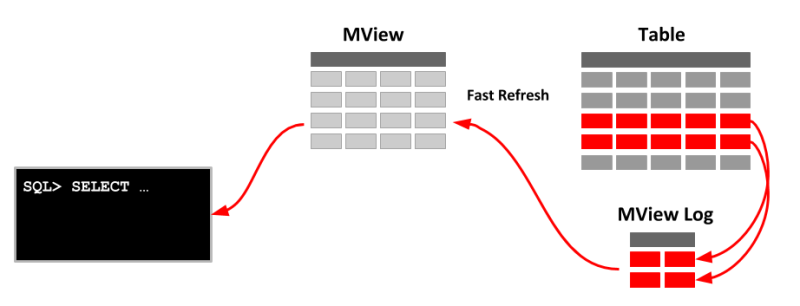

# [11/1] Oracle (뷰, TOP-IN)

<details>
<summary>도전 Quiz (p.423 ~429)</summary>
<div>
1. 4
2. 3
3. 2
4. 4
5. 1
6. 4
7. emp06 에 emp 의 데이터를 모두 삽입하는 쿼리문

    ```sql
    insert into emp06 select * from emp;
    ```

8. emp06 에 과장보다 많은 급여를 받는 사원 정보

    ```sql
    select ename, job, sal
    from emp06
    where sal >= (
        select min(sal)
        from emp06
        where job = '과장'
    ) and job <> '과장';
    ```

9. emp06 에 인천에 위치한 부서에 소속된 사원들의 급여 100 인상

    ```sql
    update emp06
    set sal = sal + 100
    where empno in (
        select empno
        from emp06 e
        inner join dept d
        on e.deptno = d.deptno
        where d.loc = '인천'
    );
    ```

10. emp06 의 경리부에 소속된 사원들 삭제

    ```sql
    delete emp06
    where empno  in (
        select empno
        from emp06 e
        inner join dept d
        on e.deptno = d.deptno
        where dname = '경리부'
    );
    ```

11. ‘이문세’ 와 같은 부서에 근무하는 사원의 이름과 부서 번호

    ```sql
    select ename, deptno
    from emp06
    where deptno = (
        select deptno
        from emp06
        where ename = '이문세'
    ) and ename <> '이문세';
    ```

12. ‘이문세’ 와 동일한 직급을 가진 사원

    ```sql
    select *
    from emp06
    where job = (
        select job
        from emp06
        where ename = '이문세'
    ) and ename <> '이문세';
    ```

13. ‘이문세’ 의 급여와 동일하거나 더 많이 받는 사원의 이름과 급여

    ```sql
    select ename, sal
    from emp06
    where sal >= (
        select sal
        from emp06
        where ename = '이문세'
    ) and ename <> '이문세';
    ```

14. ‘인천’ 에서 근무하는 사원의 이름, 부서 번호

    ```sql
    select e.ename, e.deptno
    from emp06 e
    inner join dept d
    on e.deptno = d.deptno
    where d.loc = '인천';
    ```

15. 직속상관이 감우성인 사원의 이름과 급여

    ```sql
    select e.ename, e.sal, e.mgr
    from emp06 e
    left join emp06 m
    on e.mgr = m.empno
    where m.ename = '감우성';
    ```

16. 부서별로 가장 급여를 많이 받는 사원의 정보 (사원 번호, 사원 이름, 급여, 부서번호)

    ```sql
    select e1.empno, e1.ename, e1.sal, e1.deptno
    from emp06 e1
    inner join (
            select deptno, max(sal) as sal
        from emp06
        group by deptno
    ) e2
    on e1.deptno = e2.deptno and e1.sal = e2.sal;
    ```

    ```sql
    -- 상은이 코드
    
    SELECT  empno, ename, sal, deptno
    FROM    emp e
    WHERE   sal = ( SELECT  max(sal)
                    FROM    emp e2
                    WHERE   e.deptno = e2.deptno
                    GROUP   BY deptno );
    ```

    ```sql
    -- 교수님 코드1
    
    select empno, ename, deptno, sal
    from emp e
    where exists (
        select deptno, max(sal)
        from emp d
        where d.deptno = e.deptno
        group by deptno
        having max(sal) = e.sal
    );
    ```

    ```sql
    -- 교수님 코드2
    
    select ename, sal,deptno
    from emp e
    where (deptno, sal) in (
        select deptno, max(sal) as sal
        from emp06
        group by deptno
    );
    ```

17. 직급(job)이 과장인 사원이 속한 부서의 부서 번호와 부서명, 지역

    ```sql
    select deptno, dname, loc
    from dept
    where deptno in (
        select distinct deptno
        from emp06 
        where job = '과장'
    );
    ```

18. 과장보다 급여를 많이 받는 사원들의 이름과 급여, 직급 (과장 제외)

    ```sql
    select ename, sal, job
    from emp06
    where sal > (
        select max(sal)
        from emp06
        where job = '과장'
    ) and job <> '과장';
    ```

</div>
</details>

## 뷰

```sql
create view testview
as
select last_name, salary from employees;

select * from testview;
```

- 쿼리를 저장하고 있는 오브젝트
- 서브쿼리 생성 시 내부적으로 임시의 뷰를 생성하여 처리
- create view 시 정의한 쿼리문(select) 저장
- view 호출 시 저장했던 쿼리문 호출하여 대체
- 데이터 변경 시 실제 테이블의 데이터가 변경됨

    ```sql
    insert into emp_view30
    values(1111, 'aaaa', 30);
    
    select * from emp_view30;
    select * from emp_copy;
    ```


### 뷰의 장점

- 복잡한 쿼리문 단순화

    ```sql
    create view emp_view_dept
    as
    select e.empno, e.ename, e.sal, e.deptno, d.dname, d.loc
    from emp_copy e
    left join dept d
    on e.deptno = d.deptno
    ;
    
    select * from emp_view_dept;
    ```

- 보안에 유리
    - 사용자에 따라 여러 뷰를 정의하고, 특정 사용자만 접근할 수 있도록 설정

### materialized view

- 물리적으로 존재하는 테이블
- 특정 쿼리문이 너무 자주 사용되는 경우 연산 과정을 줄이기 위해 물리적으로 만든 뷰 (ex. 통계)
    - 디스크에 저장



```sql
CREATE MATERIALIZED VIEW VIEW_NAME
BUILD IMMEDIATE[DEFERRED] REFRESH[FAST]
[COMPLETE]
[FORCE]
[NEVER]
ENABLE QUERY REWRITE
AS
-- SELECT 구문
```

- **BUILD IMMEDIATE** : MView 생성과 동시에 데이터들도 생성
- **BUILD DEFERRED** : MView 생성은 하지만, 그 안의 데이터는 추후에 생성
    - MView 생성 시 BUILD IMMEDIATE 대신 BUILD DEFERRED 옵션을 사용하면 조회되는 데이터 없음
- **BUILD IMMEDIATE REFRESH** : MView가 생성되자마자 바로 실행 가능한 상태
    - REFRESH 절은 아래에 정의된 AS 절에서 사용된 SELECT 문내의 원본 테이블의 데이터가 변경되면 구체화된 뷰를 언제 변경할 것인지에 대한 일정을 결정

## 뷰 제거하기

```sql
drop view emp_view_dept;
```

- 물리적으로 저장하지 않으므로 휴지통으로 이동하는 것이 아닌 바로 제거

## 뷰의 다양한 옵션

### OR REPLACE

```sql
create or replace view emp_view30
as
select empno, ename, sal, comm, deptno
from emp_copy
where deptno = 30;
```

- 해당 view 가 없으면 생성하고, 있으면 위의 쿼리문으로 대체

### FORCE

```sql
create or replace force view employees_view
as
select empno, ename, deptno
from employees
where deptno = 30;
```

- 기본 테이블 없이 뷰 생성
- 위의 view 호출 시 에러 발생

### NOFORCE

```sql
create or replace noforce view employees_view
as
select empno, ename, deptno
from employees
where deptno = 30;
```

- 기본 테이블이 반드시 있을 때 view 를 생성하도록 강제
- 해당 옵션을 생략했을 경우 noforce 가 default

### WITH CHECK OPTION

- 조건 제시(where)에 사용된 컬럼 값을 변경하지 못하도록 제한

### WITH READ ONLY

- 기본 테이블의 모든 컬럼에 대해 읽기 전용으로 취급

```sql
update view_chk30 set comm = 1000; -> 수정 가능

select *
from view_chk30;

create or replace view view_read30
as
select empno, ename, sal, comm, deptno
from emp_copy
where deptno = 30 with read only;

update view_read30 set comm = 2000; -> 에러 발생
```

## 인라인 뷰로 TOP-IN

- 정렬한 후 5번까지(1페이지) 정보 출력

    ```sql
    select rownum, empno, ename, hiredate
    from (
        select empno, ename, hiredate
        from emp
        order by hiredate
    )
    where rownum <= 5;
    ```

    - 서브쿼리 내에서 select 시 rownum 할당 후 order by 로 정렬하기 때문에 외부에서 where 절 사용
- 정렬한 후 6번부터 10번까지(2페이지) 정보 출력

    ```sql
    select *
    from (
        select rownum as r, empno, ename, hiredate
        from (
            select empno, ename, hiredate
            from emp
            order by hiredate
    ))
    where r between 6 and 10;
    ;
    ```

    - rownum 은 select 할 때 생성되는 일련번호
    - 서브쿼리로 감싸는 경우 새로운 rownum 이 할당됨
    - 원하는 순서로 정렬 > 그에 맞는 rownum 할당 > 페이징 처리

    ```sql
    -- 실패1
    select empno, ename, hiredate
    from emp
    where rownum between 6 and 10
    order by hiredate;
    ```

    - order by 보다 where 이 먼저 실행되기 때문에 원하는 정렬 기준을 설정할 수 없음

    ```sql
    -- 실패2
    select rownum, empno, ename, hiredate
    from (
        select empno, ename, hiredate
        from emp
        order by hiredate
    )
    where rownum between 6 and 10;
    ```

    - rownum 이 0부터 시작하지 않을 경우 결과값이 없음
    - from → where 절 실행 후 select 처리 (쿼리문 실행 순서)
    - where 절로 조건 처리 후 select 시에 rownum 이 부여되기 때문에 이미 그에 해당하는 rownum 이 존재하지 않아 빈 값이 출력됨

    ```sql
    select rownum, empno, ename, hiredate
    from (
        select empno, ename, hiredate
        from emp
        order by hiredate
    )
    where rownum between 6 and 10;
    ```

  ## OFFSET 을 이용한 페이징처리

    ```sql
    select B.*
    from   (select rownum as rnum, A.*
           from   (select no, title, re,
                           case to_char(regdate,'YYYY-MM-DD')
                           when to_char(sysdate,'YYYY-MM-DD')
                           then to_char(regdate,'HH24:MI:SS')
                           else to_char(regdate,'YYYY-MM-DD')
                           end as regdate
                   from   board
                   order  by no desc) A) B
    where   rnum between (&thisPage-1)*&pageSize+1
    and     &thisPage*&pageSize;
    ```

    - full table scan 하여 실행 시간이 비교적 늦어짐

    ```sql
    SELECT no, title, re,
           case to_char(regdate,'YYYY-MM-DD')
           when to_char(sysdate,'YYYY-MM-DD')
           then to_char(regdate,'HH24:MI:SS')
           else to_char(regdate,'YYYY-MM-DD')
           end as regdate
    from   board
    order  by no desc
    OFFSET 0 ROWS FETCH FIRST 5 ROWS ONLY;
    ```

    - index 를 거쳐 실행 시간이 개선됨
  
    <details>
    <summary>Quiz</summary>
    <div>
    - 부서별, 직무별 집계 (tester1)

            ```sql
            select 
                decode(no, 1, deptno, 2, deptno) deptno, 
                decode(no, 1, job) job, 
                sum(sumsal)
            from (
                select deptno, job, sum(sal) as sumsal
                from emp
                group by deptno, job
                order by 1, 2)
            cross join (
                select no
                from myno
                where no <= 3
                order by no)
            group by
                decode(no, 1, deptno, 2, deptno), 
                decode(no, 1, job)
            order by 1, 2;
            ```

        - 부서별, 직무별 집계 (ace)

            ```sql
            select
                decode(r, 1, department_id, 2, department_id) department_id,
                decode(r, 2, job_id) job_id,
                sum(sumsalary)
            from (
                select r, a.*
                from(
                    select department_id, job_id, sum(salary) as sumsalary
                    from employees
                    group by department_id, job_id
                    order by 1, 2) a
                cross join (
                    select rownum as r
                    from employees 
                    where rownum <= 3) b)
            group by
                decode(r, 1, department_id, 2, department_id),
                decode(r, 2, job_id)
            order by 1, 2;
            ```
    </div>
    </details>
