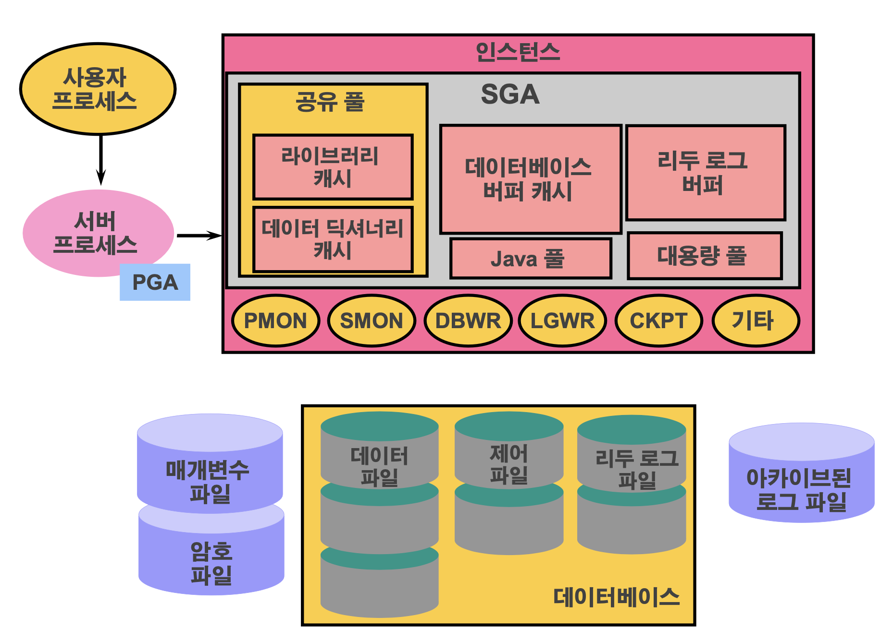
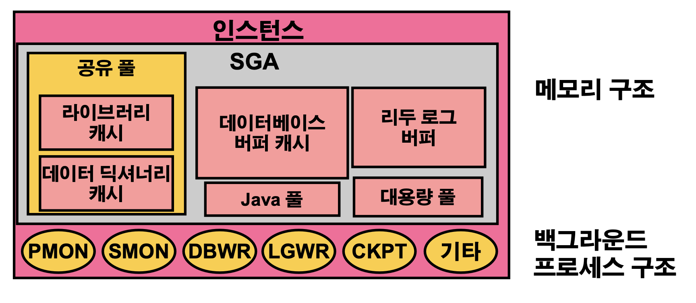
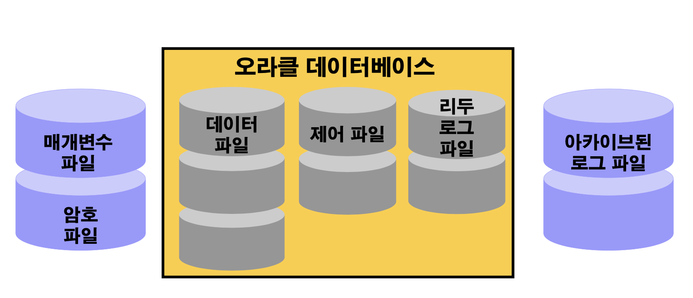
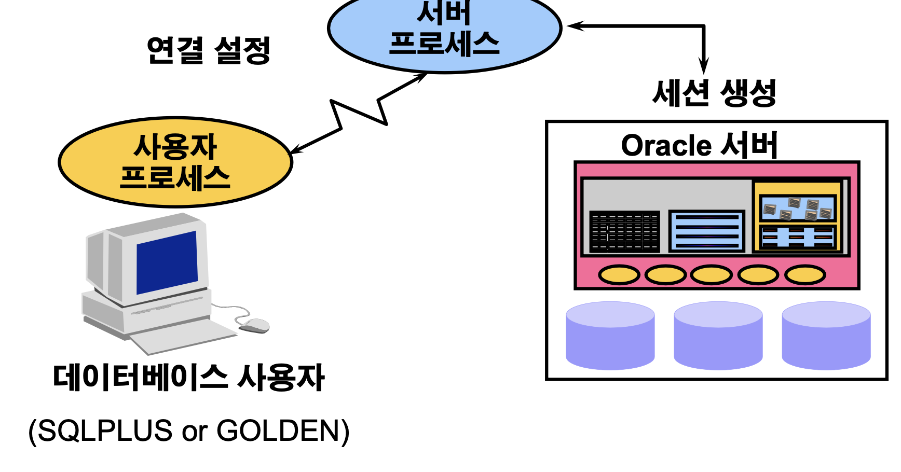
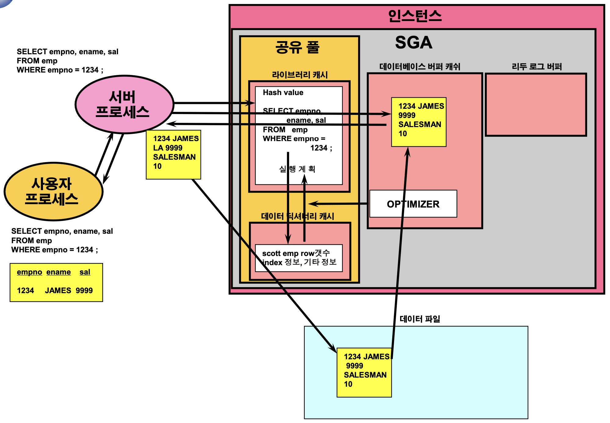
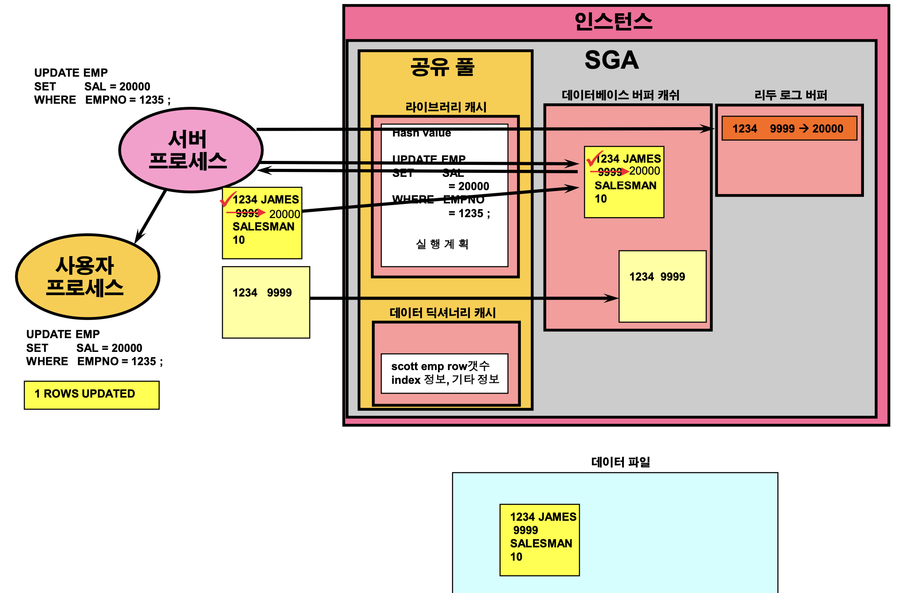
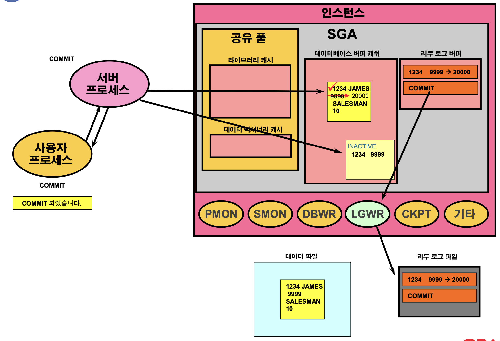
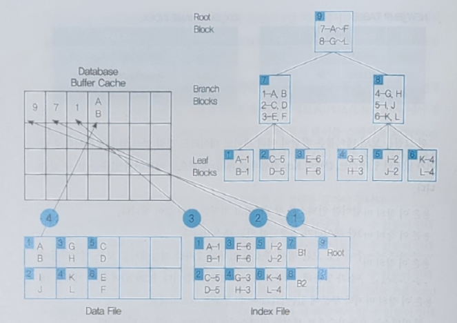

# [11/2] Oracle (시퀀스, DB 서버 구조, 인덱스, 권한, 롤, 동의어)

## 오라클 객체

- create 이후에 붙는 table, sequence, view 와 같은 것들

## 시퀀스

- 테이블 내의 유일한 숫자를 자동으로 생성하는 자동 번호 발생기

    ```sql
    create sequence sequence_name
    	start with n
    	increment by n
    	maxvalue n | nomaxvalue
    	minvalue n | nominvalue
    	cycle | nocycle
    	cache n | nocache
    ;
    ```

    - start with n : 시퀀스의 시작 번호
    - increment by n : 시퀀스 증가치 (n 씩 증가)
    - maxvalue n : 시퀀스의 최댓값
    - nomaxvalue : 최댓값을 지정하지 않음 (default, 10의 27승)
    - minvalue n : 시퀀스의 최솟값
    - nominvalue : 최솟값을 지정하지 않음 (default, 1)
    - cycle :  최댓값까지 도달하면 시작점에서 다시 시작
    - nocycle : 최댓값까지 도달하면 에러를 유발시킴
    - cache n : 메모리 상의 시퀀스 값 관리 (기본값 20)
        - n 까지 select 하지 않아도 cache 만큼 메모리에 저장
        - 메모리 상에서 관리하기 때문에 서버에 문제가 생겨 재시작할 경우 sequence 의 순서가 넘어갈 수 있음
            - n 이 10일 때 3까지 호출 후 재시작할 경우 11번부터 시작
        - 시퀀스는 pk 나 unique 키에서 주로 사용하기 때문에 순서를 맞추기 위해 수정할 필요 없음
    - nocache : 메모리 상에서 시퀀스 관리하지 않음

### 시퀀스 관련 데이터 딕셔너리

- 시퀀스 관련은 user_sequences 데이터 딕셔너리에 저장됨
    - 시퀀스 생성 시 설정했던 값 + 현재 시퀀스 값 등 관리

```sql
select sequence_name, min_value, max_value, increment_by, cycle_flag
from user_sequences;
```

```sql
SEQ_BOARD	1	9999999999999999999999999999	1	N
```

### CURRVAL, NEXTVAL

- currval(current value) : 시퀀스의 현재 값
    - nextval 을 최소 한 번 호출 후에야 값이 조회됨 → 현재 값을 알 수 없음
    - nextval 을 호출하지 않았을 경우 에러 발생
- nextval(next value) : 시퀀스의 다음 값
- nextval, currval 을 사용할 수 있는 경우
    - 서브 쿼리가 아닌 select 문
    - insert 문의 select 절
    - insert 문의 value 절
    - update 문의 set 절
- nextval, currval 을 사용할 수 없는 경우
    - view 의 select 절
    - distinct 키워드가 있는 select 문
    - group by, having, order by 절이 있는 select 문
    - select, delete, update 의 서브 쿼리
    - create table, alter table 명령의 default 값

### 시퀀스 제거하고 수정하기

- table 제거하듯이 drop 으로 제거 가능

    ```sql
    drop sequence dept_deptno_seq;
    ```

- 시퀀스 수정

    ```sql
    alter sequence sequence_name
    	increment by n
    	maxvalue n | nomaxvalue
    	minvalue n | nominvalue
    	cycle | nocycle
    	cache n | nocache
    ;
    ```

    ```sql
    alter sequence dept_deptno_seq
    maxvalue 1000;
    ```


## Oracle Startup 절차

- 오라클 : 오라클 인스턴스와 오라클 데이터베이스의 구성
- Oracle Startup : 오라클 서버 시작

```sql
sql> startup
```

1. nomount
    - parameter file(initSID.ora) 읽음
    - SGA 구성
    - Background process 를 생성
    - 순서 : 매개변수 파일 > SGA > Background process
2. mount
    - control file 읽음
    - 일반적인 데이터베이스 정보 확인
    - datafile, redolog file 의 위치와 상태 기억
    - 동기화 정보(SCN) 확인
3. open
    - 오라클이 강제 종료되었을 경우 서버 오픈 후 이전 작업 수행
        - 상태 : 리두 로그에는 기록이 남아있으나 데이터 파일에는 없음
        - 리두 로드를 사용하여 이전의 상태로 돌려놓고, 비정상 처리되었으므로 rollback 처리
    - datafile open
    - 데이터베이스 read, write 가능 상태 → 커넥션 가능

## Oracle 의 구성



- 라이브러리 캐시 : 최근에 수행한, 자주 사용하는 명령어들의 캐시
- 데이터 딕셔너리 캐시 : 테이블 내부 정보
- 데이터베이스 버퍼 캐시 : 실제 파일의 값을 로드하여 캐시 (→ 사용)
    - 데이터를 읽고 수정하기 위해 디스크에 존재하는 데이터를 읽어 저장하는 메모리 공간
- 리두 로그 버퍼 : 데이터베이스에 생긴 변경 이력을 기록해놓은 파일 (복구용)
- 대용량 풀 : 규모가 큰 쿼리 실행
- 서버 프로세스 : 사용자 프로세스 요청 시 서버 프로세스가 접수하여 수행

## Oracle 인스턴스



- 오라클 데이터베이스를 액세스 하는 수단
- 오라클 서버당 하나의 데이터베이스 접근 가능
- 메모리와 백그라운드 프로세스 구조로 구성

## Oracle 데이터베이스



- 물리적으로 저장되는 데이터들의 모음
- 파일들의 모음
- 리두 로그 파일 : 오라클 서버 시작 후 실행된 모든 명령어들을 관리

## Oracle 의 메모리 구조

- SGA(시스템 글로벌 영역) : 인스턴스가 시작될 때 할당되며 Oracle 인스턴스의 기본적인 구성 요소
    - SGA_MAX_SIZE 매개변수로 크기를 동적으로 할당 (연속적인 가상 메모리 할당)
        - sga_target (xe 버전 기준 약 1.6~2GB)
    - 기본적인 구성 요소
        - 공유 풀
        - 데이터베이스 버퍼 캐시
        - 리두 로그 버퍼
        - 기타 구조 (예: 잠금 및 래치 관리, 통계 데이터)
    - 추가 요소
        - 대용량 풀
        - Java 풀
- PGA(프로그램 글로벌 영역) : 서버 프로세스가 시작될 때 할당 (프로세스별 생성)

## Oracle Connection 및 Session 설정



- 데이터베이스 서버 오픈 후 Connection 가능
- 사용자 연결 설정 > 오라클 서버의 세션 생성

## SELECT 문 수행 순서



1. parse
    - 이전에 수행한 문장이 있는지 확인
        - 이전에 동일한 문장으로 수행했던 이력이 있으면 빠르게 실행 계획을 세울 수 있음
        - 자주 사용하는 쿼리문에 where 절만 다른 경우 다른 쿼리문으로 인식하여 성능에 좋지 않음
            - 변수 처리하여 동일 문장으로 처리 가능
        - 동일한 문장이 존재하면 기존 공간을 사용, 존재하지 않으면 새롭게 공간을 확보
    - **문법 검사 > schema 검사 > 권한 검사**
    - 실행 계획 생성 (optimizer)
2. bind
    - bind variable 을 사용하는 경우 ? 에 변수 삽입
3. execute
    - 찾고자 하는 block 이 데이터베이스 버퍼 캐시에 존재하는지 확인
        - 존재할 경우 그대로 사용
        - 존재하지 않을 경우 데이터베이스 파일로부터 메모리로 로드
    - 서버 프로세스에 의한 데이터 처리
    - select 에 일부 컬럼만 호출했더라도 레코드 자체를 가져온 후 select 처리
4. fetch

## DML(UPDATE) 문 수행 순서



1. parse
    - select 문과 동일
2. bind
3. execute
    - 데이터 로드는 select 문과 동일
    - 데이터베이스 버퍼 캐시에 undo(rollback) segment block 을 점유
    - 해당 row 에 락을 걸면서 데이터를 변경
        - undo segment block 에 이전 이미지 기록
            - 언두 로그는 데이터베이스 버퍼 캐시에서 관리
    - 리두 로그 버퍼에 리두 엔트리 기록

## COMMIT



- commit 요청이 들어오면 데이터 버퍼 캐시에 있는 데이터를 오라클 데이터베이스 데이터 파일에 적용

## Index

- 오라클은 인덱스를 B+ 트리 형식으로 관리
- 기본키나 유일키는 제약 조건을 설정하면 인덱스를 추가하지 않아도 자동으로 생성
    - 데이터 무결성을 위해 수시로 데이터를 검색하기 때문에 자동 생성
- 서브 쿼리를 이용하여 테이블을 복사할 경우 인덱스와 같은 제약 조건은 복사되지 않음 (PK, FK 등)
- 오라클 객체이기 때문에 이름이 있어야 함 (자동 생성 가능)

### 장점

- 검색 속도가 빠름
- 시스템에 걸리는 부하를 줄여서 시스템 전체 성능을 향상

### 단점

- 인덱스를 위한 추가적인 공간이 필요
- 인덱스를 생성하는 데 시간이 걸림
- 데이터의 변경 작업(INSERT, UPDATE, DELETE)이 자주 일어날 경우에는 오히려 성능이 저하

### 인덱스를 사용해야 하는 경우

- 테이블에 행의 수가 많을 때
- WHERE 문에 해당 컬럼이 많이 사용될 때
- 검색 결과가 전체 데이터의 2%~4% 정도일 때
- JOIN 에 자주 사용되는 컬럼이나 NULL 을 포함하는 컬럼이 많은 경우

### 인덱스를 사용하지 말아야 하는 이유

- 테이블에 DML 작업이 많은 경우 즉, 입력, 수정, 삭제 등이 자주 일어날 때

### 인덱스의 물리적인 구조와 인덱스의 재생성



- 위의 인덱스 구조에서 A 또는 B 의 값을 찾는다고 가정
    1. 루트 노드에 접근
        - 현재까지의 접근 경로를 남기기 위해 데이터베이스 버퍼 캐시에 루트 노드의 주소인 9 저장
        - 자식 노드들의 범위값을 보고 적절한 자식 노드 찾기
    2. 중간 노드에 접근
        - 현재까지의 접근 경로를 남기기 위해 데이터베이스 버퍼 캐시에 현재 노드의 주소인 7 저장
        - 자식 노드들의 범위값을 보고 적절한 자식 노드 찾기
    3. 리프 노드에 접근
        - 현재까지의 접근 경로를 남기기 위해 데이터베이스 버퍼 캐시에 현재 노드의 주소인 1 저장
        - 데이터파일에 접근하여 리프 노드의 데이터값을 데이터베이스 버퍼 캐시에 저장
    4. 데이터 파일에 접근
        - 리프 노드의 주소값으로 데이터 파일에 접근하여 실제 데이터 조회
        - 데이터베이스 버퍼 캐시에 저장
- 만약 update 시 이를 수정하는 과정 수행
     5. 현재 데이터 상태 저장
        - 이전 데이터 이력을 남기기 위해 데이터베이스 버퍼 캐시에 변경 전 정보 저장 (언두 로그)
        - 데이터 수정
- delete 명령 시 인덱스 엔트리는 논리적으로만 제거
    - 제거된 인덱스가 많을 경우 공간을 차지하기 때문에 종종 인덱스를 재생성 시켜야 함

## 인덱스의 종류

- 고유 인덱스 (Unique Index)
    - 기본키가 유일키처럼 유일한 값을 갖는 컬럼에 대해 생성하는 인덱스

    ```sql
    create unique index index_name
    on table_name (column_name);
    ```

- 비고유 인덱스 (NonUnique Index)
    - 중복된 데이터를 갖는 컬럼에 대해서 인덱스를 생성하는 경우
    - 컬럼의 값을 조합하거나 컬럼끼리 더할 때에는 비고유 인덱스를 생성할 수 없음
        - 인덱스가 걸린 컬럼이 수식으로 정의되어 있거나, substr 등의 함수를 사용해서 변형이 일어나는 경우 인덱스를 거치지 않음

    ```sql
    create index index_name
    on table_name (column_name);
    ```

- 단일 인덱스 (Single Index)
    - 하나의 컬럼으로 인덱스를 구성하는 것
- 결합 인덱스 (Composite Index)
    - 두 개 이상의 컬럼으로 인덱스를 구성하는 것

    ```sql
    create index index_name
    on table_name (column_name1, column_name2);
    ```

- 함수 기반 인덱스 (Function Based Index)
    - 수식이나 조합을 사용하여 조회해야 하는 경우 그 수식 자체를 기반으로 인덱스 생성

    ```sql
    create index index_name
    on table_name(수식);
    
    create index idx_emp01_annsal
    on emp01(sal * 12);
    ```


## 데이터베이스 보안을 위한 권한

- 시스템 권한 : 사용자의 생성과 제거, DB 접근 및 각종 객체를 생성할 수 있는 권한
    - 데이터베이스 관리자의 시스템 권한
        - create user, drop user, drop any table, query rewrite, backup any table
        - query rewrite : 함수 기반 인덱스를 생성하는 권한
    - 사용자를 위한 시스템 권한
        - create session, create table, create view, create sequence, create procedure
        - create session : 데이터베이스에 접속할 수 있는 권한
- 객체 권한 : 객체를 조작할 수 있는 권한
    - 테이블, 뷰, 시퀀스, 인덱스 등

### WITH ADMIN OPTION

- 본인이 부여받은 **시스템 권한**을 다른 사용자에게도 부여할 수 있는 권한
- 시스템 관리자가 아니더라도 가능

### 객체 권한

- 특정 객체에 조작할 수 있는 권한
- 객체와 권한 설정 명령어


    | 권한 | table | view | sequence | procedure |
    | --- | --- | --- | --- | --- |
    | alter | O |  | O |  |
    | delete | O | O |  | O |
    | execute |  |  |  |  |
    | index | O |  |  |  |
    | insert | O | O |  |  |
    | references | O |  |  |  |
    | select | O | O | O |  |
    | update | O | O |  |  |
- 어떤 객체(2) 에게 어떠한 권한(1) 을 어느 사용자(3) 에게 부여하는지 설정

    ```sql
    grant privilege_name (column_name) | all -- 1
    	on object_name | role_name | public -- 2
    	to user_name; -- 3
    
    grant select 
    	on dept 
    	to tester2;
    ```

    - 특정 객체에 대한 권한은 그 객체를 만든 사용자에게만 기본적으로 주어짐

### 스키마 (Schema)

- 객체를 소유한 사용자명
- 본인 스키마에 있는 테이블 접근 시에는 생략 가능

### 사용자에게 부여된 권한 조회

- user_tab_privs_made : 현재 사용자가 다른 사용자에게 부여한 권한 정보를 관리하는 데이터 딕셔너리
- user_tab_privs_recd : 자신에게 부여된 사용자 권한 정보를 관리하는 데이터 딕셔너리
    - user_role_privs

### 사용자에게서 권한을 뺏기 위한 revoke 명령어

- 사용자에게 부여한 객체 권한을 데이터베이스 관리자나 객체 소유자로부터 철회

    ```sql
    revoke (privilege_name | all)
    	on object_name
    	from (user_name | role_name | public);
    ```


### WITH GRANT OPTION

- 자신에게 부여된 **객체의 권한**을 다른 사용자에게 부여할 수 있는 권한 부여

## 롤을 사용한 권한 부여

- 롤(role) : 여러 개의 권한을 묶어놓은 것

    ```sql
    create role role_name;
    grant create session, create table, create view to role_name;
    grant object_priv to role_name;
    grant role_name to user_name;
    ```

    - 사용자에게 권한 부여 시 해당 사용자가 접속 상태라면 권한이 저장은 되나 적용은 안됨
        - 재접속 필요

### 사전 정의된 롤의 종류

- connect 롤
    - 사용자가 데이터베이스에 접속 가능하도록 하기 위한 권한
    - alter session, create cluster, create database link, create sequence, create session, create synonym, create table, create view
- resource 롤
    - 사용자가 객체(테이블, 뷰, 인덱스)를 생성할 수 있도록 하기 위한 시스템 권한
    - create cluster, create procedure, create sequence, create table, create trigger
- dba 롤
    - 사용자들이 소유한 데이터베이스 객체를 관리하고, 사용자들을 작성하고 변경하고 제거할 수 있도록 하는 모든 권한
    - 시스템 자원을 무제한적으로 사용하며, 시스템 관리에 필요한 모든 권한을 부여할 수 있는 강력한 권한

### 롤 회수하기

- 롤 회수

    ```sql
    revoke (role_name) from (user_name);
    ```

- 롤 삭제

    ```sql
    drop role (role_name);
    ```


## 동의어

- 다른 데이터베이스 객체에 대한 별명
- 비공개 동의어 : 객체에 대한 접근 권한을 부여받은 사용자가 정의한 동의어, 해당 사용자만 사용 가능
    - 객체에 대한 접근 부여 > 해당 사용자로 접속하여 동의어 설정
- 공개 동의어 : 권한을 주는 사용자가 정의한 동의어, 누구나 사용 가능
    - dba 권한을 가진 사용자만 생성 가능
    - synonym 앞에 public 선언
    - dual 테이블은 sys 의 테이블이나, 공개 동의어로 설정되어 있어 sys.dual 이 아닌 dual 로 접근 가능

```sql
create (public) synonym synonym_name
for user_name.object_name;
```
