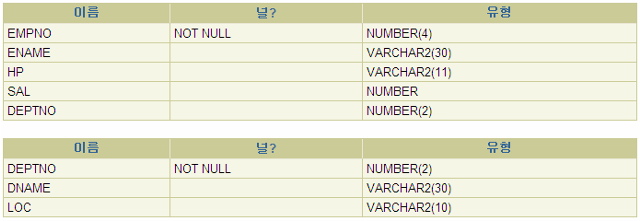

# [11/3] Oracle (Rollup, Cube, 계층형 쿼리, 수도 컬럼, Grouping Sets, With 절, Muliple Column 서브 쿼리, JDBC 연결)

## Rollup, Cube

- Group by 의 확장으로 기본적인 수행 성능이 보장됨
- 두 개 이상의 group by 를 사용할 때 그룹별 집계를 간단하게 처리

### Rollup

- 나열되는 컬럼을 기준으로 집계 기준이 달라짐
- **부서별(deptno), 업무별(job)** 로 집계를 내는 경우
    - 기본) 단순 group by 를 사용하는 경우

        ```sql
        select deptno, job, avg(sal)
        from emp
        group by deptno, job;
        ```

        ```sql
        사원	375
        20	사원	300
        30	대리	250
        30	과장	475
        20	부장	580
        30	부장	480
        10	부장	520
        30	차장	500
        20	사장	1000
        10	과장	500
        30	사원	280
        ```

        - 특정 부서의 업무별로 세분화한 값만 집계됨
    - rollup 만 사용하는 경우

        ```sql
        select deptno, job, avg(sal)
        from emp
        group by rollup(deptno, job)
        order by deptno;
        ```

        ```sql
        10	과장	500
        10	부장	520
        10		510
        20	부장	580
        20	사원	300
        20	사장	1000
        20		552
        30	과장	475
        30	대리	250
        30	부장	480
        30	사원	280
        30	차장	500
        30		410
        	사원	375
        		375
        		466
        ```

        - 특정 부서의 업무별로 세분화한 값 집계
        - **부서별 통합 집계 존재**
    - rollup + grouping 사용하는 경우

        ```sql
        select deptno, grouping(deptno), job, grouping(job), count(*), avg(sal) * 12
        from emp
        group by rollup(deptno, job)
        order by deptno;
        ```

        ```sql
        10	0	과장	0	1	6000
        10	0	부장	0	1	6240
        10	0		1	2	6120
        20	0	부장	0	2	6960
        20	0	사원	0	2	3600
        20	0	사장	0	1	12000
        20	0		1	5	6624
        30	0	과장	0	2	5700
        30	0	대리	0	1	3000
        30	0	부장	0	1	5760
        30	0	사원	0	1	3360
        30	0	차장	0	1	6000
        30	0		1	6	4920
        	0	사원	0	2	4500
        	0		1	2	4500
        	1		1	15	5592
        ```

        - grouping() : 해당 row 가 group by 에 의한 것인지, rollup 또는 cube 에 의한 것인지 판단
            - 0 → group by 에 의해 산출된 row
            - 1 → rollup 또는 cube 에 의해 산출된 row

### Cube

- 나열되는 컬럼의 순서와는 관계 없이 모든 경우의 집계를 처리
- 부서별(deptno), 업무별(job) 로 집계내는 경우

    ```sql
    select deptno, grouping(deptno), job, grouping(job), count(*), avg(sal) * 12
    from emp
    group by cube(deptno, job)
    order by job, deptno;
    ```

    ```sql
    10	0	과장	0	1	6000
    30	0	과장	0	2	5700
    	1	과장	0	3	5799.999999999999999999999999999999999996
    30	0	대리	0	1	3000
    	1	대리	0	1	3000
    10	0	부장	0	1	6240
    20	0	부장	0	2	6960
    30	0	부장	0	1	5760
    	1	부장	0	4	6480
    20	0	사원	0	2	3600
    30	0	사원	0	1	3360
    	0	사원	0	2	4500
    	1	사원	0	5	3912
    20	0	사장	0	1	12000
    	1	사장	0	1	12000
    30	0	차장	0	1	6000
    	1	차장	0	1	6000
    10	0		1	2	6120  -> 업무별 집계
    20	0		1	5	6624
    30	0		1	6	4920
    	0		1	2	4500
    	1		1	15	5592
    ```

    - 먼저 나열된 부서별 집계만 냈던 rollup 과는 달리 그 다음에 나열된 업무별로도 집계 처리
    - **즉, 나열된 순서에 관계 없이 모든 컬럼에 대한 집계 처리**

## 계층형 쿼리 (Hierachical Query)

- ANSI 가 아닌 Oracle 의 문법 (connect by)
- 계층 구조를 가진 데이터를 쿼리하고 조작하는데 사용
- 계층 구조 데이터는 트리 구조로 표현
- 시작점을 기준으로 레코드의 특정 컬럼과 연결되어 있는 다른 레코드들을 찾아 트리 형식으로 출력

    ```sql
    select last_name, level
    from employees
    start with manager_id is null
    connect by manager_id = prior employee_id;
    ```

    - employees 테이블에 자신의 아이디를 manager_id 로 가지는 레코드들 출력
    - 모든 레코드를 순회할 때까지 실행

    ```sql
    King	1
    Kochhar	2
    Whalen	3
    Higgins	3
    Gietz	4
    De Haan	2
    Hunold	3
    Ernst	4
    Lorentz	4
    Mourgos	2
    Rajs	3
    Davies	3
    Matos	3
    Vargas	3
    Zlotkey	2
    Abel	3
    Taylor	3
    Grant	3
    Hartstein	2
    Fay	3
    ```

- 응용코드

    ```sql
    SELECT employee_id, 
        manager_id,
        LEVEL,
        CONNECT_BY_ROOT last_name AS 대표, 
        CONNECT_BY_ISLEAF AS 막내, 
        sys_connect_by_path(last_name, '/') AS PATH, 
        lpad(' ', (LEVEL - 1) * 3) || last_name AS last_name, 
        PRIOR last_name
    FROM employees
    START WITH manager_id IS NULL
    CONNECT BY manager_id = PRIOR employee_id 
    ORDER SIBLINGS BY employee_id ASC;
    ```

    - CONNECT_BY_ROOT : 루트 노드 출력
    - CONNECT_BY_ISLEAF : 자식 노드가 없으면 1 있으면 0
    - sys_connect_by_path : 현재까지의 경로
    - lpad : 왼쪽에 특정 문자 삽입 → 공백을 이용하여 레벨별로 정렬
    - PRIOR : 현재 단계로 오기 전의 바로 전 레코드
    - ORDER SIBLINGS BY : 형제 노드간의 정렬 기준 설정
        - 자식 노드들 모두 출력 후 그 다음 형제 노드의 정렬 기준 설정
        - 반드시 계층형 구조에서 연결된 컬럼으로 설정해야 함
        - connect by 는 이미 정렬된 트리 구조이기 때문에 order by 하면 안됨

## Pseude Columns (수도 컬럼)

- 개발자가 생성하지 않아도 미리 정의되어 있는 컬럼
- rowid, rownum, level

## Grouping Sets

- 각각 다른 기준으로 group by 하여 조회한 데이터들을 하나의 테이블로 간단하게 합쳐줌
    - 이전에는 포함되지 않은 컬럼을 null 로 선언 후 union 처리함

        ```sql
        SELECT deptno, job, NULL, avg(sal) FROM emp
        GROUP BY deptno, job
        UNION ALL
        SELECT NULL, job, mgr, avg(sal) FROM emp
        GROUP BY job, mgr;
        ```

        ```sql
        사원		375
        20	사원		300
        30	대리		250
        30	과장		475
        20	부장		580
        30	부장		480
        10	부장		520
        30	차장		500
        20	사장		1000
        10	과장		500
        30	사원		280
        	사원	1010	500
        	사원	1013	300
        	대리	1005	250
        	과장	1005	500
        	부장	1009	540
        	과장	1006	450
        	차장	1004	500
        	사장		1000
        	과장	1003	500
        	사원	1007	280
        	사원	1006	275
        ```

    - grouping sets 를 사용하면 위와 같은 과정을 간단하게 처리할 수 있음

        ```sql
        select deptno, job, mgr, avg(sal)
        from emp
        group by grouping sets ((deptno, job), (job, mgr));
        ```

        ```sql
        사원	1010	500
        	사원	1013	300
        	대리	1005	250
        	과장	1005	500
        	부장	1009	540
        	과장	1006	450
        	차장	1004	500
        	사장		1000
        	과장	1003	500
        	사원	1007	280
        	사원	1006	275
        	사원		375
        20	사원		300
        30	대리		250
        30	과장		475
        20	부장		580
        30	부장		480
        10	부장		520
        30	차장		500
        20	사장		1000
        10	과장		500
        30	사원		280
        ```


## With 절

- 반복적으로 사용되는 쿼리문에 이름을 붙여 재사용 (Query Block)
    - 동일 테이블 접근을 최소화
    - 메모리에 생성된 임시 테이블에서 필요한 데이터를 메모리로 접근
    - 디스크 IO 로 테이블에 접근하는 것보다 성능 개선
- with 절을 먼저 선언 후 사용 가능
- 여러 개의 서브 쿼리가 사용된다면 순서대로 선언
    - 서브 쿼리에서 서브 쿼리를 참조해야 하는 경우, 가장 먼저 사용되는 것을 먼저 선언
- with 절을 사용하지 않은 경우

    ```sql
    select 'sum', sum(sum_sal)
    from (
        select deptno, 
                sum(sal) as sum_sal, 
                count(*) as cnt
        from emp
        group by deptno
    )
    union all
    select 'avg', 
        sum_sal/cnt
    from (
        select deptno, 
                sum(sal) as sum_sal, 
                count(*) as cnt
        from emp
        group by deptno
    );
    ```

    ```sql
    sum	6990
    avg	375
    avg	552
    avg	410
    avg	510
    ```

    - 동일 테이블이 반복적으로 선언됨
    - 서브 쿼리 실행 시 해당 실행이 종료되면 인라인 뷰가 삭제됨
        - 동일 테이블에 대한 동일한 접근이 2 번 실행됨
- with 절을 사용하는 경우

    ```sql
    with a as (
        select deptno, 
            sum(sal) as sum_sal, 
            count(*) as cnt
        from emp
        group by deptno
    )
    select 'sum', sum(sum_sal)
    from a
    union all
    select 'avg', sum_sal/cnt from a;
    ```

    ```sql
    sum	6990
    avg	375
    avg	552
    avg	410
    avg	510
    ```

- 응용

    ```sql
    with
    dept_costs as (select d.deptno,
    	                  sum(e.sal) as dept_total
    	              from emp e
    	              inner join dept d
    	              on e.deptno = d.deptno
    	              group by d.deptno),
    avg_cost as (select sum(dept_total) / count(*) as dept_avg
                  from dept_costs)
    select * from dept_costs
    where dept_total > (select dept_avg from avg_cost)
    order by deptno
    /
    ```

    ```sql
    20	2760
    30	2460
    ```


## Muliple Column 서브 쿼리

- 결과 컬럼이 2개 이상인 서브 쿼리

    ```sql
    SELECT *
    FROM fruits
    WHERE (name, grade) in (SELECT name, grade FROM purchases);
    ```

  <details>
  <summary>Quiz</summary>
  <div>
    1. dept 테이블과 emp 테이블을 이용하여 각 부서별 최저 연봉을 받고 있는 사원의 이름(ename), 부서번호(deptno), 급여(sal)를 출력

    ```sql
    select ename, deptno, sal
    from emp
    where (deptno, sal) in (select deptno, min(sal)
                            from emp
                            group by deptno);
    ```

    ```sql
    김사랑	20	300
    강혜정	20	300
    한예슬	30	250
    이병헌	10	500
    ```

    - 서브 쿼리의 결과에 null 이 있을 경우 메인 쿼리에 반영되지 않음
    1. table instance chart 를 보고 생성하기위한 sql을 작성해주세요

  

    - 컬럼 레벨로 제약 조건 추가

        ```sql
        create table t_dept (
        deptno   number(2),
        dname    varchar2(30),
        loc      varchar2(10)
        );
        
        create table t_emp (
        empno    number(4),
        ename    varchar2(30),
        hp       varchar2(11),
        sal      number,
        deptno   number(2)
        );
        ```

    - 컬럼 레벨에서 이름이 있는 제약 조건 추가

        ```sql
        drop  table t_emp purge;
        drop table t_dept purge;
        
        create table t_dept (
        deptno   number(2)    primary key,
        dname    varchar2(30) not null,
        loc      varchar2(10)
        );
        
        create table t_emp (
        empno    number(4)      primary key,
        ename    varchar2(30)   not null,
        hp       varchar2(11)   unique,
        sal      number         check(sal >= 100),
        deptno   number(2)      references t_dept(deptno)
        );
        ```

    - 테이블 레벨로 제약 조건 추가

        ```sql
        drop table t_emp purge;
        drop table t_dept purge;
        
        create table t_dept (
        deptno   number(2),
        dname    varchar2(30),
        loc      varchar2(10),
            constraint t_dept_deptno_pk primary key(deptno),
            constraint t_dept_dname_nn  check(dname is not null)
        );
        ```

  </div>
  </details>

## JDBC 연결

- 이클립스 프로젝트에 ojdbc11.jar 라이브러리 설정

    <details>
    <summary>드라이브 호출</summary>
    <div>

    ```java
    package jdbc;
    
    import java.sql.Connection;
    import java.sql.ResultSet;
    import java.sql.Statement;
    
    public class JdbcTest {
    
        public static void main(String[] args) {
            Connection conn = null;
            Statement stmt = null;
            ResultSet rs = null;
    		
            try {
                Class.forName("oracle.jdbc.driver.OracleDriver");
                System.out.println("jdbc driver 로드");
            } catch (Exception e) {
                System.out.println("드라이버 로드 실패");
            }
    		
            System.out.println("종료");
        }
    }
    ```
  
    </div>
    </details>

    <details>
    <summary>DB 데이터 조회 (try-catch-finally)</summary>
    <div>

    ```java
    package jdbc;
    
    import java.sql.Connection;
    import java.sql.DriverManager;
    import java.sql.ResultSet;
    import java.sql.Statement;
    
    public class JdbcTest {
    
        public static void main(String[] args) {
            Connection conn = null;
            Statement stmt = null;
            ResultSet rs = null;
    		
            String sql = """
                    SELECT employee_id, last_name, salary
                    FROM employees
                    """;
            try {
                Class.forName("oracle.jdbc.driver.OracleDriver");
    			
                conn = DriverManager.getConnection(
                        "jdbc:oracle:thin:@localhost:1521/xepdb1", "id", "password");
    			
                stmt = conn.createStatement();
                rs = stmt.executeQuery(sql);
    			
                while (rs.next()) {
                    System.out.print(rs.getInt("employee_id") + "\t");
                    System.out.print(rs.getString("last_name") + "\t");
                    System.out.print(rs.getLong("salary") + "\n");
                }
            } catch (Exception e) {
                System.out.println("실패: " + e.getMessage());
            } finally {
                if (rs != null) try {rs.close();} catch(Exception e) {}
                if (stmt != null) try {stmt.close();} catch(Exception e) {}
                if (conn != null) try {conn.close();} catch(Exception e) {}
            }
    		
            System.out.println("종료");
        }
    }
    ```

    </div>
    </details>

    <details>
    <summary>DB 데이터 조회 (try-with-resources)</summary>
    <div>
    - try-with-resources 사용 시 OracleDriver 호출을 생략할 수 있음

    ```java
    package jdbc;
    
    import java.sql.Connection;
    import java.sql.DriverManager;
    import java.sql.ResultSet;
    import java.sql.Statement;
    
    public class JdbcTest2 {
    
        public static void main(String[] args) {
            String sql = """
                    SELECT employee_id, last_name, salary
                    FROM employees
                    """;
            try (
                    Connection conn = DriverManager.getConnection(
                            "jdbc:oracle:thin:@localhost:1521/xepdb1", "id", "password");
                    Statement stmt = conn.createStatement();
                    ResultSet rs = stmt.executeQuery(sql);
            ){
                Class.forName("oracle.jdbc.driver.OracleDriver");
    			
                while (rs.next()) {
                    System.out.print(rs.getInt("employee_id") + "\t");
                    System.out.print(rs.getString("last_name") + "\t");
                    System.out.print(rs.getLong("salary") + "\n");
                }
            } catch (Exception e) {
                System.out.println("실패: " + e.getMessage());
            }
    		
            System.out.println("종료");
        }
    }
    ```

    ```java
    package jdbc;
    
    import java.sql.Connection;
    import java.sql.DriverManager;
    import java.sql.PreparedStatement;
    import java.sql.ResultSet;
    
    public class JdbcTest3 {
    
        public static void main(String[] args) {
            String sql = """
                    SELECT employee_id, last_name, salary
                    FROM employees
                    WHERE department_id >= ?
                    """;
            try (
                    Connection conn = DriverManager.getConnection(
                            "jdbc:oracle:thin:@localhost:1521/xepdb1", "id", "password");
                    PreparedStatement stmt = conn.prepareStatement(sql);
    				
            ){
                stmt.setInt(1, 80);
                try (ResultSet rs = stmt.executeQuery();) {
                    while (rs.next()) {
                        System.out.print(rs.getInt("employee_id") + "\t");
                        System.out.print(rs.getString("last_name") + "\t");
                        System.out.print(rs.getLong("salary") + "\n");
                    }
                }
            } catch (Exception e) {
                System.out.println("실패: " + e.getMessage());
            }
    		
            System.out.println("종료");
        }
    }
    ```

    </div>
    </details>

    <details>
    <summary>로그인</summary>
    <div>

    ```java
    package jdbc;
    
    import java.sql.Connection;
    import java.sql.DriverManager;
    import java.sql.ResultSet;
    import java.sql.Statement;
    import java.util.Scanner;
    
    import org.apache.commons.codec.digest.DigestUtils;
    
    public class LoginTest1 {
    
        public static void main(String[] args) {
            Scanner sc = new Scanner(System.in);
    		
            System.out.print("id : ");
            String userid = sc.nextLine();
            System.out.print("pw : ");
            String userpw = DigestUtils.sha512Hex(sc.nextLine());
    		
            String sql = 
                    "SELECT userid, name " +
                    "FROM members " + 
                    "WHERE userid = '" + userid + "' AND userpw = '" + userpw + "' ";
            try (
                    Connection conn = DriverManager.getConnection(
                            "jdbc:oracle:thin:@localhost:1521/xepdb1", "id", "password");
                    Statement stmt = conn.createStatement();
                    ResultSet rs = stmt.executeQuery(sql);
            ){
                if (rs.next()) {
                    System.out.print(
                            rs.getString("name") + "(" + 
                            rs.getString("userid") + ") 님이 로그인 하였습니다.");
                } else {
                    System.out.println("아이디 혹은 비번이 틀립니다.");
                }
            } catch (Exception e) {
                System.out.println("실패: " + e.getMessage());
            }
    		
            System.out.println("종료");
        }
    }
    ```

    </div>
    </details>

- DB 데이터 조회 (PreparedStatement)
    - PreparedStatement 를 사용하여 Oracle 서버에 쿼리문 미리 전송
        - 변수를 ? 처리하여 조건이 다르더라도 동일한 쿼리문으로 취급
        - 동일 쿼리문 요청 시 버퍼 캐시에 있는 이력 그래도 실행하여 성능 이점
    - 이후 Oracle 서버에서 변수 바인딩하여 실제 쿼리문 실행

### Dynamic Query vs Parameter Query

- Dynamic Query : 여러 문자열을 조합하여 만든 쿼리문
- Parameter Query : 변수가 포함된 쿼리문
    - 쿼리 작성이 용이
    - 성능이 좋음
    - SQL Injection 을 대비
