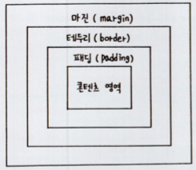
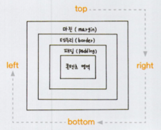
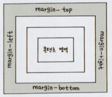
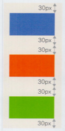
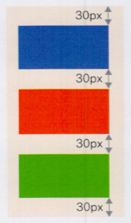
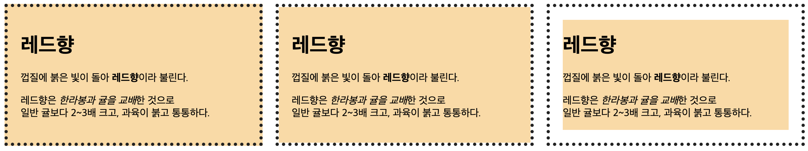

# [11/7] CSS (Font, 박스 모델, Margin 과 Padding, float, position)

## CSS (Cascading Style Sheets)

- cascading : 우선순위가 위에서 아래, 즉 계단식으로 적용
    - 웹 요소에 둘 이상의 스타일을 적용할 때 우선순위에 따라 적용할 스타일 결정
- Style Sheets
    - 브라우저 기본 스타일
    - 사용자 스타일
        - 인라인 스타일 : 태그
        - 내부 스타일 시트 : html 파일 내 `<style>` 태그
        - 외부 스타일 시트 : 별도의 css 파일
- 우선순위
    - 사용자 스타일 > 제작자 스타일 > 브라우저 기본 스타일
    - !important > 인라인 스타일 > id 스타일 > 클래스 스타일 > 타입 스타일
- 스타일 상속
    - 부모 요소의 스타일 속성이 자식 요소에게 전달되는 것

## Font

- font-size: (절대 크기) | (상대 크기) | (크기) | (백분율)
    - 절대 크기 : 브라우저에서 지정한 글자 크기
    - 상대 크기 : 부모 요소의 글자 크기를 기준으로 상대적인 글자 크기를 지정
    - 크기 : 브라우저와 상관없이 글자 크기를 직접 지정
    - 백분율 : 부모 요소의 글자 크기를 기준으로 백분율(%)로 표시

### 키워드를 사용하여 글자 크기 지정

- xx-small < x-small < small < medium < large < x-large < xx-large

### 단위를 사용하여 글자 크기 지정

| 종류  | 기준   | 설명                                             |
|-----|------|------------------------------------------------|
| em  | 상대크기 | 부모 요소에서 지정한 글꼴의 대문자M의 너비를 기준(1em)으로 한 후 비율값 저장 |
| rem | 상대크기 | 문서 시작 부분(root)에서 지정한 크기를 기준(1rem)으로 한 후 비율값 저장 |
| ex  | 절대크기 | 해당글꼴의 소문자 x의 높이를 기준(1ex)으로 한 후 비율값 저장          |
| px  | 절대크기 | 모니터의 1픽셀을 기준(1px)으로 한 후 비율값 저장                 |
| pt  | 절대크기 | 포인트라고 하며, 일반 문서에서 많이 사용                        |

### 백분율을 사용하여 글자 크기 지정

- 백분율로 지정 시 부모 요소의 글꼴 크기가 단위로 표현되어 있어야 함

## 웹 폰트

- 웹 문서 작성 시 글꼴 정보 서버에 업로드 필요
    - 사용자 접속 시 웹 문서를 받으면서 웹 폰트도 함께 다운로드
    - 사용자에게 없는 글꼴 사용 가능
- 인터넷 사이트에 있는 폰트가 아닌 직접 지정하려면 TTF 폰트를 변환해서 사용
    - TTF 폰트 : 글자 크기에 따라 세밀하게 표현하는 폰트
- @font-face : 온라인 폰트 적용

    ```html
    <!DOCTYPE html>
    <html lang="ko">
    <head>
        <meta charset="UTF-8">
        <title>웹 폰트 사용하기</title>
        <style>
          @font-face {
            font-family: 'Ostrich';  /* 폰트 이름 */
            src: local('Ostrich Sans'), 
                  url('fonts/ostrich-sans-bold.woff') format('woff'), 
                  url('fonts/ostrich-sans-bold.ttf') format('truetype'), 
                  url('fonts/ostrich-sans-bold.svg') format('svg');
          }
          .wfont {
            font-family:'Ostrich', sans-serif; /* 웹 폰트 지정 */
          }
          p {
            font-size:30px; /* 글자 크기 */
          }
        </style>
    </head>
    <body>
      <p>Using Default Fonts</p>
      <p class="wfont">Using Web Fonts</p>
    </body>
    </html>
    ```

    - font-family : 온라인에서 받아온 폰트의 이름 지정
        - 글꼴 파일 이름과 동일하게 짓도록 권장
    - src : 사용할 글꼴 파일의 경로 지정
        - local() : 사용자 시스템에 해당 글꼴이 있는지 먼저 확인
            - 없을 경우에만 온라인 경로로 다운로드하여 사용
        - TTF 포맷은 용량이 커서 대부분의 모던 브라우저에서 지원하는 WOFF 먼저 선언
- @import : 다른 스타일 시트에서 스타일 규칙 가져오기

    ```html
    <!DOCTYPE html>
    <html lang="ko">
      <head>
        <meta charset="UTF-8">
        <title>구글 폰트 사용하기</title>
        <style>
          @import url('https://fonts.googleapis.com/css2?family=Nanum+Pen+Script&display=swap');
          h1 {
            font-size:60px;
            font-weight:bold;       
    				/* google 에서 지정한 폰트 이름 사용 */
            font-family:'Nanum Pen Script', cursive;
          }
        </style>
      </head>
      <body>
        <h1>HTML+CSS+JavaScript</h1>
      </body>
    </html>
    ```


## 텍스트 정렬

- text-align: start | end | left | right | center | justify | match-parent
    - justify : 양쪽에 맞추어 문단 정렬
        - 오른쪽에 여백이 생기지 않음
    - match-parent : 부모 요소를 따라 문단 정렬
- line-hegiht : 줄 간격 조절
- letter-spacing : 글자 간격 조절
- word-spacing : 단어 간격 조절

## CSS 와 박스 모델

- 블록 레벨 요소 : 한 줄을 모두 차지하는 요소 (너비 100%)
- 인라인 레벨 요소 : 콘텐츠 만큼만 영역을 차지하는 요소
- 박스 모델 요소 : 박스 형태인 요소 (= 블록 레벨 요소)
    - 박스 모델 요소는 내부가 다음과 같이 구성됨

  


### 박스 모델의 크기를 계산하는 box-sizing 속성

- border-box : 테두리까지 포함한 너빗값 지정
- content-box : 콘텐츠 영역만 너빗값 지정 (default)

## 테두리 스타일 지정하기

### 박스 모델의 방향



## 여백을 조절하는 속성

### 요소 주변의 여백을 설정하는 Margin 속성



### margin 중첩 (마진 상쇄)

 


```html
<!DOCTYPE html>
<html lang="ko">
<head>
	<meta charset="UTF-8">
	<title>박스모델 - 마진 중첩</title>
	<style>
    * {
      box-sizing:border-box;
    }
		div {
			width:200px;  /* 너비 */
			height:100px;  /* 높이 */
  		margin:30px;  /* 마진 */
		}
    #box1 {
      background:rgb(0, 77, 243);
    }
    #box2 {
      background:rgb(255, 72, 0);
    }
    #box3 {
      background:rgb(18, 219, 0);
    }
	</style>
</head>
<body>
	<div id="box1"></div>
	<div id="box2"></div>
	<div id="box3"></div>
</body>
</html>
```

- 여러 요소를 세로로 배치할 때 마진이 지나치게 커지는 것을 방지하기 위해 마진 중첩이 일어남
- 가로로 배치할 때에는 중첩되지 않음

## 웹 문서의 레이아웃 만들기

### 배치 방법을 결정하는 display 속성

- block : 인라인 레벨 요소 → 블록 레벨 요소
- inline : 블록 레벨 요소 → 인라인 레벨 요소
- inline-block : 인라인 레벨 요소 + 블록 레벨 요소 (마진과 패딩 지정 가능)
- none : 요소를 화면에 표시하지 않음

### 왼쪽이나 오른쪽으로 배치하는 float 속성

- left, right, none

### float 속성을 해제하는 clear 속성

- style 이 전파되어 원치않는 요소에 적용될 경우 사용
- left : `float: left` 해제
- right : `float: right` 해제
- both : `float: left` 와 `float: right` 해제

## 웹 요소의 위치 지정하기

### 배치 방법을 지정하는 position 속성

- static : 문서의 흐름에 맞춰 배치 (default)
- relative : static + 위치값 지정
- absolute : 가장 가까운 위치에 있는 조상 요소 중 position 을 가지는 요소를 기준으로 배치 (static 제외)
    - 조상 요소 중 position 을 가지는 요소가 없을 경우 window 객체의 viewport(static) 를 기준으로 함
    - viewport 를 기준으로 하며 해당 위치에 고정하고 싶은 경우 조상 요소를 `position: fixed` 로 설정
- fixed : 브라우저 창을 기준으로 위치를 지정해 배치

## 배경색과 배경 범위 지정하기

### 배경색을 지정하는 backgroud-color 속성

- 다른 요소와는 달리 background-color 속성은 상속되지 않음
    - 모든 웹 문서의 배경이 투명색이라 상속되는 것처럼 보임

### 배경색의 적용 범위를 조절하는 background-clip 속성

- border-box : 박스 모델의 가장 외곽인 테두리까지 적용 (default)
- padding-box : 박스 모델에서 테두리를 뺀 패딩 범위까지 적용
- content-box : 박스 모델에서 내용(콘텐츠) 부분에만 적용

```html
<!DOCTYPE html>
<html lang="ko">
<head>
  <meta charset="UTF-8">
  <title>상품 소개 페이지</title>
  <style>
    .desc {
      border:5px dotted #222;
      background-color:#ffd9a0;
      width:350px;
      padding:20px;
      margin-right:20px;
      float:left;
    }
    #clip-border {
      background-clip: border-box;
    }
    #clip-padding {
      background-clip: padding-box;
    }
    #clip-content {
      background-clip: content-box;
    }
  </style>
</head>
<body>
  <div id="container">
    <div class="desc" id="clip-border">
      <h1>레드향</h1>
      <p>껍질에 붉은 빛이 돌아 <b>레드향</b>이라 불린다.</p>
      <p>레드향은 <em>한라봉과 귤을 교배</em>한 것으로<br>일반 귤보다 2~3배 크고, 과육이 붉고 통통하다.</p>
    </div>
    <div class="desc" id="clip-padding">
      <h1>레드향</h1>
      <p>껍질에 붉은 빛이 돌아 <b>레드향</b>이라 불린다.</p>
      <p>레드향은 <em>한라봉과 귤을 교배</em>한 것으로<br>일반 귤보다 2~3배 크고, 과육이 붉고 통통하다.</p>
    </div>
    <div class="desc" id="clip-content">
      <h1>레드향</h1>
      <p>껍질에 붉은 빛이 돌아 <b>레드향</b>이라 불린다.</p>
      <p>레드향은 <em>한라봉과 귤을 교배</em>한 것으로<br>일반 귤보다 2~3배 크고, 과육이 붉고 통통하다.</p>
    </div>        
  </div>
</body>
</html>
```



## 배경 이미지 저장하기

### 웹 요소에 배경 이미지를 넣는 background-image 속성

```html
<style>
  body {
    background-image :url('images/bg1.jpg');
  }
</style>
```

### 배경 이미지의 반복 방법을 저장하는 background-repeat 속성

- repeat : 브라우저 화면에 가득 찰 때까지 가로와 세로로 반복 (default)
- repeat-x : 브라우저 화면 너비에 가득 찰 때까지 가로로 반복
- repeat-y : 브라우저 화면 높이에 가득 찰 때까지 세로로 반복
- no-repeat : 한 번만 표시하고 반복하지 않음
