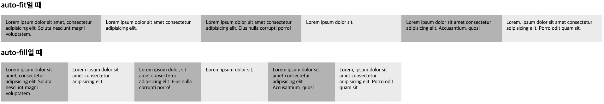

# [11/8] CSS (연결 선택자, 속성 선택자, 가상 클래스와 가상 요소, 반응형, 미디어 쿼리, 플렉스, 그리드)

## 연결 선택자

- 하위 선택자 : 부모 요소에 포함된 모든 하위 요소를 선택

    ```html
    상위요소 하위요소
    ```

    <details>
    <summary>Code</summary>
    <div>

    ```html
    <!DOCTYPE html>
    <html lang="ko">
    <head>
      <meta charset="UTF-8">
      <title>고급 선택자</title>
      <style>
        body {
          background-color:#eee;
        }
        section {
          width:600px;
          margin:20px auto;
        }
        p {
          width:500px;
          padding:10px;
          background-color:#fff;
          border:1px solid #ccc;
          line-height:2;
        }
       section p {  /* section 요소의 모든 하위 p 요소에 적용 */
          color:blue;   /* 글자색을 파란색으로 */
        }
      </style>
    </head>
    <body>
      <section>
        <h1>예약 방법 & 사용 요금</h1>
        <p>아직 온라인 예약 신청이 준비되어 있지 않습니다. <br>전화(xxx-xxxx-xxxx)로 문의 바랍니다.</p>
        <div>
          <p>가족실(2~4인) : 60,000원/일</p>
          <p>도미토리(4인 공용) : 25,000원/일</p>
      </section>   
    </body>
    </html>
    ```

    
    </div>
    </details>

- 자식 선택자 : 자식 요소만 선택
    - 하위 선택자는 자식 요소 뿐만 아니라 모든 하위 요소에 적용되나, 자식 선택자는 자식 요소만 선택

    ```html
    부모요소 > 자식요소
    ```

    <details>
    <summary>Code</summary>
    <div>

    ```html
    <!DOCTYPE html>
    <html lang="ko">
    <head>
      <meta charset="UTF-8">
      <title>고급 선택자</title>
      <style>
        ...
       section > p {  /* section 요소의 자식 p 요소에 적용 */
          color:blue;  /* 글자색을 파란색으로 */
        }
      </style>
    </head>
    <body>
      <section>
        <h1>예약 방법 & 사용 요금</h1>
        <p>아직 온라인 예약 신청이 준비되어 있지 않습니다. <br>전화(xxx-xxxx-xxxx)로 문의 바랍니다.</p>
        <div>
          <p>가족실(2~4인) : 60,000원/일</p>
          <p>도미토리(4인 공용) : 25,000원/일</p>
      </section>   
    </body>
    </html>
    ```

  
    </div>
    </details>

- 인접 형제 선택자 : 형제 요소 중에서 첫 번째 동생 요소만 선택
    - 요소1과 요소2는 같은 레벨이며, 요소1 이후 가장 먼저 오는 요소2 선택

    ```html
    요소1 + 요소2
    ```

    <details>
    <summary>Code</summary>
    <div>

    ```html
    <!DOCTYPE html>
    <html lang="ko">
    <head>
      <meta charset="UTF-8">
      <title>고급 선택자</title>
      <style>
        ...
        h1 + p {  /* h1 요소의 형제 요소 중 첫번째 p 요소에 적용 */
          background-color:#222;  /* 배경은 검은색으로 */
          color:#fff;  /* 글자는 흰색으로 */
        }
      </style>
    </head>
    <body>
      <section>
        <h1>예약 방법 & 이용 요금</h1>
        <p>아직 온라인 예약 신청이 준비되어 있지 않습니다. <br>전화(xxx-xxxx-xxxx)로 문의 바랍니다.</p>
        <p>가족실(2~4인) : 60,000원/일</p>
        <p>도미토리(4인 공용) : 25,000원/일</p>
      </section>  
    </body>
    </html>
    ```

  
    </div>
    </details>

- 형제 선택자 : 모든 형제 요소를 선택

    ```html
    요소1 ~ 요소2
    ```

    <details>
    <summary>Code</summary>
    <div>

    ```html
    <!DOCTYPE html>
    <html lang="ko">
    <head>
      <meta charset="UTF-8">
      <title>고급 선택자</title>
      <style>
        ...
        h1 ~ p {  /* h1 요소와 형제인 모든 p 요소에 적용 */
          background-color:#222;  /* 배경은 검은색으로 */
          color:#fff;  /* 글자는 흰색으로 */
        }
      </style>
    </head>
    <body>
      <section>
        <h1>예약 방법 & 이용 요금</h1>
        <p>아직 온라인 예약 신청이 준비되어 있지 않습니다. <br>전화(xxx-xxxx-xxxx)로 문의 바랍니다.</p>
        <p>가족실(2~4인) : 60,000원/일</p>
        <p>도미토리(4인 공용) : 25,000원/일</p>
      </section>    
    </body>
    </html>
    ```

    
    
    </div>
    </details>


## 속성 선택자

- [속성] 선택자 : 특정 속성이 있는 요소 선택

    ```html
    a[href] {...}
    ```

    <details>
    <summary>Code</summary>
    <div>

    ```html
    <!DOCTYPE html>
    <html lang="ko">
    <head>
    <meta charset="UTF-8">
    <title>속성 선택자</title>
    <style>
       ...
         a[href] {
             background:yellow;
             border:1px solid #ccc;
             font-weight:normal;
         }
    </style>
    </head>
    
    <body>
        <ul>
            <li><a>메인 메뉴 : </a></li>
            <li><a href="#">메뉴 1</a></li>
            <li><a href="#">메뉴 2</a></li>
            <li><a href="#">메뉴 3</a></li>
            <li><a href="#">메뉴 4</a></li>
        </ul>
      </body>
     </html>
    ```

  

    </div>
    </details>

- [속성 = 속성값] 선택자 : 특정 속성값이 있는 요소 선택

    ```html
    a[target = _black] {...}
    ```

    <details>
    <summary>Code</summary>
    <div>

    ```html
    <!DOCTYPE html>
    <html lang="ko">
    <head>
    <meta charset="UTF-8">
    <title>속성 선택자</title>
    <style>
      ...
        a[target="_blank"] {
         padding-right:30px;
         background:url(images/newwindow.png) no-repeat center right;
        }
    </style>
    </head>
    
    <body>
        <ul>
            <li><a href="hhttps://html.spec.whatwg.org" target="_blank">HTML</a></li>
            <li><a href="https://www.w3.org/TR/selectors">CSS Selector Level 3</a></li>
            <li><a href="https://www.w3.org/TR/css3-mediaqueries">미디어쿼리</a></li>		
        </ul>
      </body>
     </html>
    ```

  

    </div>
    </details>

- [속성 ~= 값] 선택자 : 여러 값 중에서 특정 속성값이 포함된 속성 요소 선택

    ```html
    a[class ~= button] {...}
    ```

    <details>
    <summary>Code</summary>
    <div>

    ```html
    <!DOCTYPE html>
    <html lang="ko">
    <head>
    <meta charset="UTF-8">
    <title>속성 선택자</title>
    <style>
       ...
            a[class ~="button"] {           
          box-shadow:rgba(0,0,0,0.5) 4px 4px; /* 그림자 지정 */
          border-radius: 5px;  /* 테두리를 둥글게 */
          border:1px solid #222;
            }
    </style>
    </head>
    <body>
        <ul>
            <li><a href="#" class="flat">메뉴 1</a></li>
            <li><a href="#" class="flat">메뉴 2</a></li>
            <li><a href="#" class="button">메뉴 3</a></li>
            <li><a href="#" class="flat button" >메뉴 4</a></li>
        </ul>
      </body>
     </html>
    ```

  

    </div>
    </details>

- [속성 |= 값] 선택자 : 특정 속성값이 포함된 속성 요소를 선택
    - 특정 값과 완전히 일치해야 하는 다른 선택자와는 달리 해당 선택자는 하이픈(-)으로 연결된 값도 선택

    ```html
    a[title |= us] {...}
    ```

    <details>
    <summary>Code</summary>
    <div>

    ```html
    <!DOCTYPE html>
    <html lang="ko">
    <head>
    <meta charset="UTF-8">
    <title>속성 선택자</title>
    <style>
       ...
        a[title |= "us"] {  /* 속성값이 "us"이거나 "us-"로 시작하는 요소를 찾는 선택자 */
            background: url(images/us.png) no-repeat left center;
        }
        a[title |= "jap"] {  /* 속성값이 "jap"이거나 "jap-"로 시작하는 요소를 찾는 선택자 */
            background: url(images/jp.png) no-repeat left center;
        }
        a[title |= "chn"] {  /* 속성값이 "chn"이거나 "chn-"로 시작하는 요소를 찾는 선택자 */
            background: url(images/ch.png) no-repeat left center;
        }
    </style>
    </head>
    
    <body>
        <ul>
            <li>외국어 서비스 : </li>
            <li><a href="#" title="us-english">영어</a></li>
            <li><a href="#" title="ja">일본어</a></li>
            <li><a href="#" title="chn">중국어</a></li>
        </ul>
    </body>
     </html>
    ```

  

    </div>
    </details>

- [속성 ^= 값] 선택자 : 특정 속성값으로 **시작하는** 속성 요소를 선택

    ```html
    a[title ^= eng] {...}
    ```

    <details>
    <summary>Code</summary>
    <div>

    ```html
    <!DOCTYPE html>
    <html lang="ko">
    <head>
    <meta charset="UTF-8">
    <title>속성 선택자</title>
    <style>
       ...
            a[title ^="eng"] {  /* 속성값이 "eng"로 시작하는 요소를 찾는 선택자 */
                background: url(images/us.png) no-repeat left center;
                padding: 5px 25px;
            }
            a[title ^="jap"] {  /* 속성값이 "jap"로 시작하는 요소를 찾는 선택자 */
                background: url(images/jp.png) no-repeat left center;
                padding: 5px 25px;
            }
            a[title ^="chin"] {  /* 속성값이 "chn"로 시작하는 요소를 찾는 선택자 */
                background: url(images/ch.png) no-repeat left center;
                padding: 5px 25px;
            }
    </style>
    </head>
    
    <body>
        <ul>
            <li>외국어 서비스 : </li>
            <li><a href="#" title="english">영어</a></li>
            <li><a href="#" title="japanese">일본어</a></li>
            <li><a href="#" title="chinese">중국어</a></li>
        </ul>
      </body>
     </html>
    ```

  

    </div>
    </details>

- [속성 $= 값] 선택자 : 특정한 값으로 **끝나는** 속성의 요소를 선택

    ```html
    [href $= xls] {...}
    ```

    <details>
    <summary>Code</summary>
    <div>

    ```html
    <!DOCTYPE html>
    <html lang="ko">
    <head>
    <meta charset="UTF-8">
    <title>속성 선택자</title>
    <style>
       ...
        a[href$=hwp] { /* 연결한 파일의 확장자가 hwp인 링크 */
            background: url(images/hwp_icon.gif) center right no-repeat; /* 배경으로 hwp 아이콘 표시 */
            padding-right: 25px; /* 아이콘을 표시할 수 있도록 오른쪽에 25px 여백 */
        }
    
        a[href$=xls] { /* 연결한 파일의 확장자가 hwp인 링크 */
            background: url(images/excel_icon.gif) center right no-repeat; /* 배경으로 hwp 아이콘 표시 */
            padding-right: 25px; /* 아이콘을 표시할 수 있도록 오른쪽에 25px 여백 */
        }
    </style>
    </head>
    
    <body>
        <h3>회사 소개 파일 다운 받기</h3>
        <ul>
            <li><a href="intro.hwp">hwp 파일</a></li>
            <li><a href="intro.xls">엑셀 파일</a></li>
        </ul>
      </body>
     </html>
    ```

  

    </div>
    </details>

- [속성 *= 값] 선택자 : 일부 속성값이 일치하는 요소를 선택
    - 문자열 위치에 관계 없음

    ```html
    [href *= w3] {...}
    ```

    <details>
    <summary>Code</summary>
    <div>

    ```html
    <!DOCTYPE html>
    <html lang="ko">
    <head>
    <meta charset="UTF-8">
    <title>속성 선택자</title>
    <style>
       ...
        a[href *= "w3"] {  /* href 속성값 중에 w3가 있는 a 요소를 찾는 선택자 */ 
         background:blue;
         color:white;		 
        }
    </style>
    </head>
    
    <body>
        <h1>HTML5 참고 사이트 </h1>
        <p>(아래 링크 중 파란색 배경의 링크는 W3C 사이트로 연결됩니다.)</p>
        <ul>
            <li><a href="https://html.spec.whatwg.org/">HTML 표준안 사이트</a></li>
            <li><a href="https://caniuse.com/">HTML 지원 여부 체크</a></li>
            <li><a href="https://www.w3.org/TR/css3-mediaqueries">미디어쿼리</a></li>		
        </ul>
    </body>
    </html>
    ```

  

    </div>
    </details>

## 가상 클래스와 가상 요소

- 가상 클래스 : 실제로 존재하는 요소에 특정 이벤트나 환경에 맞춰 **가상 클래스**를 주어 css 로 제어하는 것
- 가상 요소 : 실제로 존재하지 않는 **가상의 요소**를 만들어 스타일 적용
    - 불필요한 태그 방지

### 사용자 동작에 반응하는 가상 클래스

- `:link` : 방문하지 않은 링크에 스타일 적용
- `:visited` : 방문한 링크에 스타일 적용
- `:hover` : 특정 요소에 마우스 포인털르 올려놓으면 스타일 적용
- `:active` : 웹 요소를 활성화했을 때 스타일 적용
- `:focus` : 웹 요소에 초점이 맞춰졌을 때 스타일 적용

### 요소 상태에 따른 가상 클래스

- `:target` : 앵커 대상에 스타일 적용
    - 다른 앵커 선택 시 비활성화되어 스타일 초기화
- `:enabled` `:disabled` : 요소의 사용 여부에 따라 스타일 적용
- `:checked` : 선택한 항목의 스타일 적용
- `:not 가상 클래스 선택자` : 특정 요소를 제외하고 스타일 적용

### 구조 가상 클래스

- 특정 위치의 자식 요소 선택

  | 종류                    | 설명                                   |
  |-----------------------|--------------------------------------|
  | :only-child           | 부모 안에 자식 요소가 하나뿐일 때 자식 요소를 선택        |
  | A:only-type-of        | 부모 안에 A 요소가 하나뿐일 때 선택                |
  | :first-child          | 부모 안에 있는 모든 요소 중에서 첫 번째 자식 요소 선택     |
  | :last-child           | 부모 안에 있는 모든 요소 중에서 마지막 자식 요소 선택      |
  | A:first-of-type       | 부모 안에 있는 A 요소 중에서 첫 번째 요소를 선택        |
  | A:last-of-type        | 부모 안에 있는 A 요소 중에서 마지막 요소를 선택         |
  | :nth-child(n)         | 부모 안에 있는 모든 요소 중에서 n 번째 자식 요소 선택     |
  | :nth-last-child(n)    | 부모 안에 있는 모든 요소 중에서 끝에서 n 번째 자식 요소 선택 |
  | A:nth-of-type(n)      | 부모 안에 있는 A 요소 중에서 n 번째 요소 선택         |
  | A:nth-last-of-type(n) | 부모 안에 있는 A 요소 중에서 끝에서 n 번째 요소 선택     |

    <details>
    <summary>Code</summary>
    <div>
        
    ```html
    <!DOCTYPE html>
    <html lang="ko">
    <head>
    <meta charset="UTF-8">
    <title>가상 선택자</title>
    <style>
      ...
     .contents :nth-child(3) {
        background-color:#ffff00;
      }
      .contents p:nth-of-type(3) {
        background-color:#00b900;
      }  
    </style>
    </head>
    
    <body>
    <div class="container">
        <nav class="navi">
          <ul>
            <li><a href="#">이용 안내</a></li>
            <li><a href="#">객실 소개</a></li>
            <li><a href="#">예약 방법 및 요금</a></li>
            <li><a href="#">예약하기</a></li>
          </ul>
        </nav>  
        <div class="contents">
          <h2>이용 안내</h2>
          <p>Excepteur do est eiusmod nulla et veniam. Labore officia officia ex aliqua exercitation aliqua laborum Lorem deserunt ut ullamco labore anim. Officia eu duis aliquip incididunt. Do laborum et consequat aliqua sint consectetur.</p> 
          <p>Qui magna culpa minim reprehenderit magna in nisi ipsum. Ad cillum tempor minim fugiat est dolor. Cillum sit qui minim sint officia nostrud cillum cupidatat pariatur ipsum eiusmod velit labore. Sit in non fugiat minim sit.</p>
          <h2>객실 소개</h2>
          <p>Irure incididunt duis ut cupidatat laborum adipisicing veniam irure.</p>
          <h2>예약 방법 및 요금</h2>
          <p>Fugiat aliquip mollit proident velit magna esse ea officia eu. Esse do aliqua proident culpa eiusmod duis minim deserunt eu reprehenderit ut tempor. </p>
        </div>
      </div>
    </body>
    </html>
    ```
    
    

    </div>
    </details>
  

- 수식을 사용해 위치 지정하기

    <details>
    <summary>Code</summary>
    <div>

    ```html
    <!DOCTYPE html>
    <html lang="ko">
    <head>
      <meta charset="UTF-8">
      <title>가상 클래스</title>
        <style>
            ...
            table tr:nth-of-type(2n+1) {  /* 홀수 번째 열에만 스타일 적용 */
                background:lightgray;
                color:black;
            }
        </style>
    </head>
    <body>
        <div id="container">
            <h1>웹 개발</h1>
            <table>
                <tr>
                    <td>HTML</td>
                </tr>
                <tr>
                    <td>CSS</td>
                </tr>
                <tr>
                    <td>Javascirpt</td>
                </tr>
                <tr>
                    <td>React</td>
                </tr>
                <tr>
                    <td>node.js</td>
                </tr>			
            </table>
        </div>
    </body>
    </html>
    ```

  

    </div>
    </details>

### 첫번째 줄, 첫번째 글자에 스타일을 적용하는 ‘::first-line’, ‘::first-letter’

- ::first-letter 요소의 첫 번째 글자는 반드시 첫 번째 줄에 있어야 함
- 만약 `<p>` 안에 `<br>` 태그가 있을 경우 적용 안됨

### 내용 앞뒤에 콘텐츠를 추가하는 ‘::before’, ‘::after’

<details>
<summary>Code</summary>
<div>

```html
<!DOCTYPE html>
<html lang="ko">
<head>
  <meta charset="UTF-8">
  <title>가상 요소</title>
  <style>
    ...
    li.new::after {
      content:"NEW!!";
      font-size:x-small;
      padding:2px 4px;
      margin: 0 10px;
      border-radius:2px;
      background:#f00;
      color:#fff;
    }
  </style>
</head>

<body>
  <div class="container">
    <h1>제품 목록</h1>
    <ul>
      <li class="new">제품 A</li>
      <li>제품 B</li>
      <li>제품 C</li>
      <li class="new">제품 D</li>
    </ul>
  </div>
</body>
</html>
```


</div>
</details>

## 변형

- transform: 함수

    ```css
    .photo { transform: translate(50px, 100px); }
    ```


## 반응형 웹 디자인

- 뷰포트 : 스마트폰 화면에서 실제 내용이 표시되는 영역

    ```html
    <meta name="viewport" content="width-device-width, initial-scale=1">
    ```

    - width : 뷰포트 너비
    - height : 뷰포트 높이
    - user-scalable : 확대축소 가능 여부
    - initial-scale : 초기 확대축소 값
- 뷰포트 단위
    - vw(viewport width) : 1vw 는 뷰포트 너비의 1%
    - vh(viewport hegiht) : 1vh 는 뷰포트 높이의 1%
    - vmin(viewport minimum) : 뷰포트의 너비와 높이 중에서 작은 값의 1%
    - vmax(viewport maximum) : 뷰포트의 너비와 높이 중에서 큰 값의 1%

## 미디어 쿼리

- 사이트에 접속하는 장치에 따라 특정한 CSS 스타일을 사용하는 방법

### 미디어 쿼리 구문

```css
@media [only|not] 미디어 유형 [and 조건] * [and 조건]
```

- only : 미디어 쿼리를 지원하지 않는 웹 브라우저에서는 미디어 쿼리를 무시하고 실행하지 않음
- not : not 다음에 지정하는 미디어 유형 제외
- and : 조건을 여러개 연결해서 추가

### 미디어 유형의 종류

- all, print, screen, tv, aural, braille, handheld, tty, embossed

### 화면 회전 속성

- `orientation: portrait` : 단말기의 세로 모드
- `orientation: landscape` : 단말기의 가로 모드

### 미디어 쿼리의 중단점

- 중단점(break point) : 화면 크기에 따라 서로 다른 CSS를 적용할 분기점
    - 대부분 기기의 화면 크기를 기준으로 적용
    - 모바일, 태블릿, 데스크탑
    - 처리 속도나 화면 크기 등에서 다른기기보다 모바일이 제약 조건이 많아 주로 모바일로 시작

### 외부 CSS 파일 연결하기

- `<link>` 태그 이용

    ```html
    <link rel="stylesheet" media="미디어 쿼리 조건" href="css 파일 경로">
    ```

    ```html
    <link rel="stylesheet" media="print" href="css/print.css">
    ```

- `@import` 문 이용
    - 인터넷 익스플로러의 경우 자바스크립트를 먼저 내려 받은 후 `@import` 문을 처리하여 오류날 수 있음

    ```css
    @import url(css 파일 경로) 미디어 쿼리 조건
    ```

    ```css
    @import url("css/tablet.css") only screen and (min-width: 321px) and (max-width: 768px);
    ```


### 웹 문서에 직접 정의하기

- `<style>` 태그 이용
    - 하나의 태그에 하나의 조건 지정

    ```html
    <style media="<조건>"> {
    	<스타일 규칙>
    }
    </style>
    ```

    ```html
    <style media="screen and (max-width: 320px)">
    	body {
    		background-color: orange;
    	}
    </style>
    ```

- `@media` 문 이용
    - 여러 개의 조건에 따른 스타일 모두 나열

    ```html
    <style>
    	@media <조건> {
    		<스타일 규칙>
    	}
    </style>
    ```

    ```html
    <style>
    	@media screen and (max-width: 320px) {
    		body {
    			background-color: orange;
    		}
    	}
    </style>
    ```


## 그리드 레이아웃

- 웹 사이트를 여러 개의 컬럼으로 나눈 후 메뉴나 본문, 이미지 등의 웹 요소를 화면에 맞게 배치

### 그리드 레이아웃의 3가지 특징

- 시각적으로 안정된 디자인
- 업데이트가 편한 웹 디자인 구성
- 요소를 자유롭게 배치

### 그리드 레이아웃을 만드는 방법

- 플렉서블 박스 레이아웃(flexible box layout) : 그리드를 기본으로 하고 각 박스를 원하는 위치에 배치
    - 수평이나 수직 중 하나를 기준으로 요소를 배치
- CSS 그리드 레이아웃(css grid layout) : 수평과 수직 방향에 관계없이 모두 배치 가능

## 플렉스 박스 레이아웃


- 주축 : 플렉스 컨테이너 안에서 플렉스 항목을 배치하는 기본 방향
- 교차축 : 주축의 반대

### 플렉스 박스 항목을 배치하는 속성

- justify-content : 주축 방향의 정렬 방법
- align-items : 교차축 방향의 정렬 방법
- align-self : 교차축에 있는 개별 항목의 정렬 방법
- align-content : 교차축에서 여러 줄로 표시된 항목의 정렬 방법

### 플렉스 컨테이너를 지정하는 display 속성

- flex : 컨테이너 안의 플렉스 항목을 블록 레벨 요소로 배치
- inline-flex : 컨테이너 안의 플렉스 항목을 인라인 레벨 요소로 배치

### 플렉스 방향을 지정하는 flex-direction 속성

- row : 주축 가로 (왼쪽 → 오른쪽, default)
- row-reverse : 주축 가로 (오른쪽 → 왼쪽)
- column : 주축 세로 (위쪽 → 아래쪽)
- column-reverse : 주축 세로 (아래쪽 → 위쪽)

### 플렉스 항목의 줄을 바꾸는 flex-wrap 속성

- nowrap : 플렉스 항목을 한 줄에 표시 (default)
- wrap : 플렉스 항목을 여러 줄에 표시
- wrap-reverse : 플렉스 항목을 여러 줄에 표시하되, 시작점과 끝점이 반대

```html
<style>
  ...
  #opt1{
    flex-wrap: nowrap;           /* 한 줄에 표시 */
  }
  #opt2{
    flex-wrap: wrap;             /* 여러 줄에 표시 */
  }
  #opt3{
    flex-wrap: wrap-reverse;     /* 시작점과 끝점 바꿔 여러 줄에 표시 */   
  } 
</style>
```


### 배치 방향과 줄 바꿈을 한꺼번에 지정하는 flex-flow 속성

```html
<style>
  ...
  #opt1{
    flex-flow: row wrap;   /* 왼쪽에서 오른쪽, 여러 줄 */     
  }
  #opt2{
    flex-flow: row nowrap;  /* 왼쪽에서 오른쪽, 한 줄 */         
  } 
</style>
```


### 주축 정렬 방법을 지정하는 justify-content 속성

- flex-start : 주축의 시작점에 맞춰 배치
- flex-end : 주축의 끝점에 맞춰 배치
- center : 주축의 중앙에 맞춰 배치
- space-between : 첫 번째 항목과 끝 항목을 주축의 시작점과 끝점에 배치한 후 나머지 항목은 그 사이에 같은 간격으로 배치
- space-around : 모든 항목을 주축에 같은 간격으로 배치

```html
<style>
  .container {
    display:flex;  /* 플렉스 컨테이너 지정 */
    background-color:#eee;
    border:1px solid #222;
    margin-bottom:30px;
  }
  #opt1{
    justify-content: flex-start;    /* 주축 시작점 기준으로 배치 */
  }
  #opt2{
    justify-content: flex-end;      /* 주축 끝점 기준으로 배치 */  
  }
  #opt3{
    justify-content: center;       /* 주축 중앙 기준으로 배치 */
  }
  #opt4{
    justify-content: space-between;      /* 시작점과 끝점 배치 후 중간 항목은 같은 간격으로 배치 */ 
  }    
  #opt5{
    justify-content: space-around;       /* 전체 항목을 같은 간격으로 배치 */ 
  }
</style>
```


### 교차축 정렬 방법을 지정하는 align-items 속성

- flex-start : 교차축의 시작점에 맞춰 배치
- flex-end : 교차축의 끝점에 맞춰 배치
- center : 교차축의 중앙에 배치
- baseline : 교차축의 문자 기준선에 맞춰 배치
- stretch : 플렉스 항목을 늘려 교차축에 가득 차게 배치

```html
<style>
  .container {
    width:100%;
    height:150px;
    display:flex;
    background-color:#eee;
    border:1px solid #222;
    margin-bottom:20px;
  }
  #opt1{
    align-items: flex-start;   /* 교차축 시작점 기준으로 배치 */
  }
  #opt2{
    align-items: flex-end;     /* 교차축 끝점 기준으로 배치 */     
  }
  #opt3{
    align-items: center;       /* 교차축 중앙 기준으로 배치 */
  }
  #opt4{
    align-items: baseline;      /* 문자 기준선에 맞춰 배치 */
  } 
  #opt5{
    align-items: stretch;       /* 항목을 늘려 교차축에 가득차게 배치 */
  }    
</style>
```


### 특정 항목만 정렬 방법을 지정하는 align-self 속성

- 속성값은 align-items 와 동일

```html
<style>
  .container {
    width:450px;
    height:150px;
    background-color:#eee;
    border:1px solid #222;
    margin-bottom:20px;
    display:flex;         /* 플렉스 컨테이너 지정 */
    align-items: center;  /* 교차축의 중앙에 배치 */
  }    
  #box1 {
    align-self: flex-start;  /* 교차축의 시작점에 배치 */
  }
  #box3 {
    align-self:stretch;       /* 교차축에 가득 차게 늘림 */
  }
</style>
```


### 여러 줄일 때 교차축 정렬 방법을 지정하는 align-content 속성

- flex-start : 교차축의 시작점에 맞춰 배치
- flex-end : 교차축의 끝점에 맞춰 배치
- center : 교차축의 중앙에 배치
- space-between : 첫 번째 항목과 끝 항목을 교차축의 시작점과 끝점에 맞추고 나머지 항목은 그 사이에 같은 간격으로 배치
- space-around : 모든 항목을 교차축에 같은 간격으로 배치
- stretch : 플렉스 항목을 늘려 교차축에 가득 차게 배치

```html
<style>
  .container {
    float:left;
    width:200px;
    height:150px;
    display:flex;          /* 플렉스 컨테이너 지정 */
    flex-flow: row wrap;   /* 왼쪽에서 오른쪽, 여러 줄 표시 */
    border:1px solid #222;
    background-color:#eee;
    margin:30px;
  }
  #opt1{
    align-content: flex-start;    /* 교차축 시작점 기준 */
  }
  #opt2{
    align-content: flex-end;       /* 교차축 끝점 기준 */
  }
  #opt3{
    align-content: center;         /* 교차축 중앙 기준 */
  }
  #opt4{
    align-content: space-between;     /* 시작점과 끝점 배치 후 중간 항목은 같은 간격으로 배치 */    
  }    
  #opt5{
    align-content: space-around;       /* 전체 항목을 같은 간격으로 배치 */  
  }
  #opt6{
    align-content: stretch;             /* 항목을 늘려 교차축에 가득 차게 배치 */
  }  
</style>
```


### 플렉스 레이아웃을 활용해 항상 중앙에 표시하기

```html
<style>
  * {
    margin:0;
    box-sizing: border-box;
  }
  body {      
    background:url('images/bg5.jpg') no-repeat left top fixed;
    background-size:cover;
    display: flex;
    justify-content: center;
    align-items: center;
    min-height:100vh;
  }
  button {
    ...
  }
</style>
```

## CSS 그리드 레이아웃

### CSS 그리드 레이아웃에서 사용하는 용어

- 플렉스 항목은 1차원, 그리드 레이아웃은 2차원


### 그리드 컨테이너를 지정하는 display 속성

- grid : 컨테이너 안의 항목을 블록 레벨 요소로 배치
- inline-grid : 컨테이너 안의 항목을 인라인 레벨 요소로 배치

### 컬럼과 줄을 지정하는 grid-template-columns, grid-template-rows 속성

```html
<style>
  #wrapper{
    display:grid;
    grid-template-columns: 200px 200px 200px;
    grid-template-rows:100px;
  }
</style>
```


### 상대적인 크기를 지정하는 fr(fraction) 단위

```css
grid-template-columns: 2fr 1fr 2fr; /* 2 : 1 : 2 */
```

### 값이 반복될 때 줄여서 표현할 수 있는 repeat() 함수

```css
grid-template-columns: repeat(3, 1fr); /* 1 : 1 : 1 */
```

### 최솟값과 최댓값을 지정하는 minmax() 함수

```html
<style>
 #wrapper{
  width:600px;
  display:grid;  /* 그리드 컨테이너 지정 */
  grid-template-columns:repeat(3, 1fr);  /* 너비가 같은 칼럼 3개 */
  grid-template-rows: minmax(100px, auto);  /* 줄 높이 최소 100px */
}
</style>
```


### 자동으로 컬럼 개수를 조절하는 auto-fill, auto-fit 값

- auto-fill : 컬럼의 최소 너비를 기준으로 표시
- auto-fit : 화면에 남는 공간 없이 꽉 채워서 표시

```html
<style>
 #wrapper1{
  display:grid;
  grid-template-columns:repeat(auto-fit, minmax(200px, 1fr));  /* 화면을 꽉 채울만큼 칼럼 너비를 늘려서 표시 */
  margin-bottom:20px;
}
#wrapper2{
  display:grid;
  grid-template-columns:repeat(auto-fill, minmax(200px, 1fr));  /* 칼럼 최소 너비만큼 채워서 표시 */
}  
</style>
```



### 그리드 항목의 간격을 지정하는 grid-column-gap, grid-row-gap, grid-gap 속성

```html
<style>
  #wrapper{
    display:grid;
    grid-template-columns:repeat(3, 200px);  /* 너비 200px인 칼럼 3개 */
    grid-template-rows: minmax(100px, auto);  
    grid-gap:20px 30px;  /* 칼럼 간격 30px, 줄 간격 20px  */
    /* grid-column-gap:30px; */
    /* grid-row-gap:20px; */
  }
  .items{
    padding:15px;
    background-color:#eee;
  }   
  .items:nth-child(odd){
    background-color:#bbb;
  }
</style>
```


### 그리드 라인을 이용해 배치하기

- grid-column-start : 컬럼 시작의 라인 번호 지정
- grid-column-end : 컬럼 마지막의 라인 번호 지정
- grid-column : 컬럼 시작 번호화 컬럼 끝 번호 사이에 슬래시를 넣어 사용
- grid-row-start : 줄 시작 라인 번호 지정
- grid-row-end : 줄 마지막의 라인 번호
- grid-row : 줄 시작 번호와 줄 끝 번호 사이에 슬래시를 넣어 사용

```html
<style>
  #wrapper{
    width:700px;
    display:grid;
    grid-template-columns:repeat(3, 1fr);
    grid-template-rows:repeat(3, 100px);
  }
  .box{
    padding:15px;
    color:#fff;
    font-weight:bold;
    text-align:center;
  }   
  .box1 {
    background-color:#3689ff;
    grid-column:1/4;
  }
  .box2 {
    background-color:#00cf12;
    grid-row:2/4;
    /* grid-column:1/2; */
    grid-column-start:1;
  }
  .box3 {
    background-color:#ff9019;
    grid-column:2/4;
    /* grid-row:2/3; */
    grid-row-start:2;
    }
  .box4 {
    background-color:#ffd000;
    grid-column-start:3;
    grid-row-start:3;
  }
</style>
```


### 템플릿 영역을 만들어 배치하기

```html
<style>
  #wrapper{
    width:700px;
    display:grid;
    grid-template-columns:repeat(3, 1fr);
    grid-template-rows:repeat(3, 100px);
    grid-template-areas: 
      "box1 box1 box1"
      "box2 box3 box3"
      "box2 . box4";
  }
  .box{
    padding:15px;
    color:#fff;
    font-weight:bold;
    text-align:center;
  }   
  .box1 {
    background-color:#3689ff;
    grid-area:box1;
  }
  .box2 {
    background-color:#00cf12;
    grid-area:box2;
  }
  .box3 {
    background-color:#ff9019;
    grid-area:box3;
    }
  .box4 {
    background-color:#ffd000;
    grid-area:box4;
  }
</style>
```
