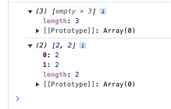
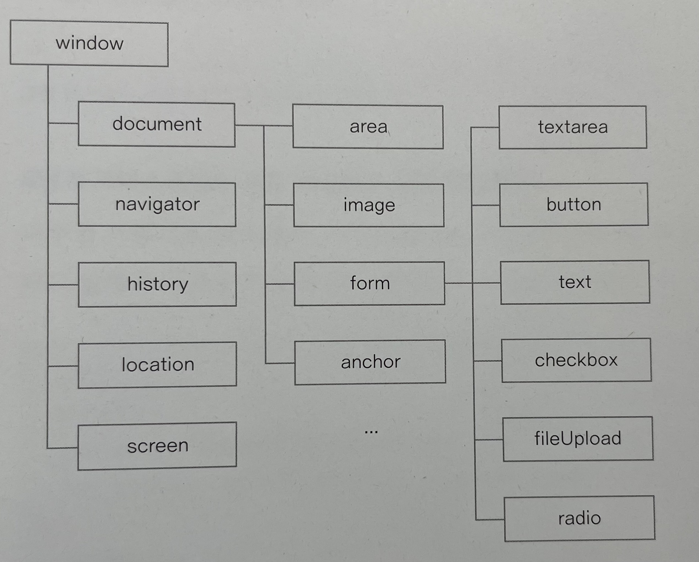
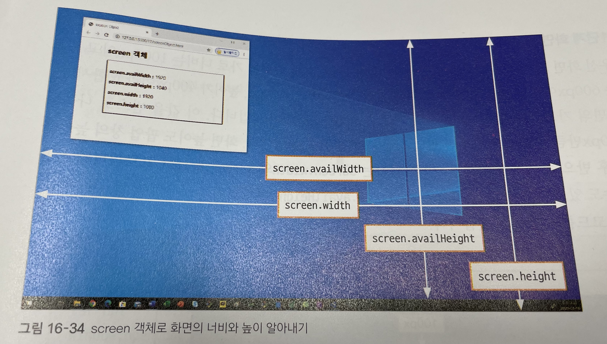
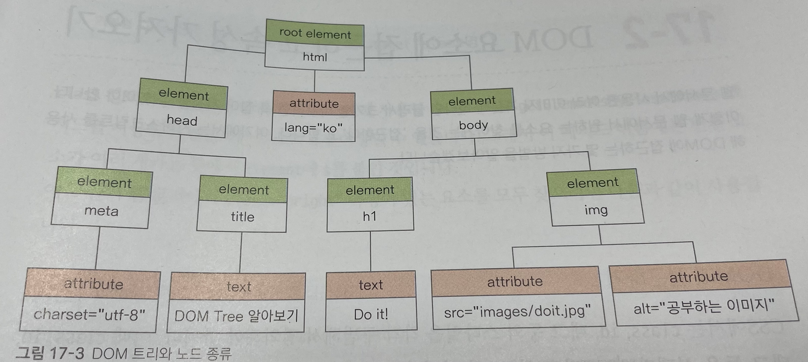
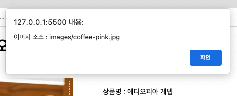
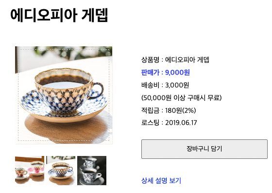
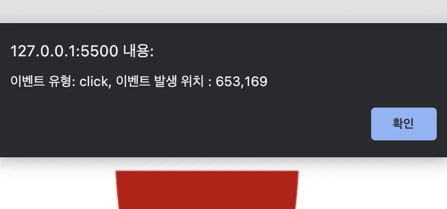

# [11/10] JS (이벤트, DOM, 내장 객체, 브라우저 객체, 노드 생성 및 제거)

## 이벤트(Event)

- 웹 브라우저나 사용자가 행하는 어떤 동작
- 웹 페이지를 읽어오거나 링크를 클릭하는 것처럼 웹 문서 영역 안에서 이루어지는 동작만을 의미
    - 웹 문서 영역을 벗어나는건 이벤트가 아님
        - 브라우저 창 맨 위에 제목 표시줄 클릭 등

### 마우스 이벤트

- click : 사용자가 HTML 요소를 클릭할 때
- dblclick : 사용자가 HTML 요소를 더블 클릭할 때
- mousedown : 사용자가 요소 위에서 마우스 버튼을 눌렀을 때
- mousemove : 사용자가 요소 위에 마우스 포인터를 움직일 때
- mouseover : 마우스 포인터가 요소 위로 옮겨질 때
- mouseout : 마우스 포인터가 요소를 벗어날 때
- mouseup : 사용자가 요소 위에 놓인 마우스 버튼에서 손을 뗄 때

### 키보드 이벤트

- keydown : 사용자가 키를 누르는 동안
- keypress : 사용자가 키를 눌렀을 때
- keyup : 사용자가 키에서 손을 땔 때

### 문서 로딩 이벤트

- abort : 문서가 완전히 로딩되기 전에 불러오기를 멈췄을 때
- error : 문서가 정확히 로딩되지 않았을 때
- load : 문서 로딩이 끝나면
- resize : 문서 화면 크기가 바뀌었을 때
- scroll : 문서 화면이 스크롤되었을 때
- unload : 문서에서 벗어날 때

### 폼 이벤트

- blur : 폼 요소에 포커스를 잃었을 때
- change : 목록이나 체크 상태 등이 변경될 때
- focus : 폼 요소에 포커스가 놓였을 때
- reset : 폼이 리셋되었을 때
- submit : submit 버튼을 클릭했을 때

## 이벤트 처리기 (이벤트 핸들러)

- HTML 태그에 이벤트를 직접 연결

    ```html
    <태그 on이벤트명="함수명">
    ```


## DOM 을 이용한 이벤트 처리기

- HTML 태그에 이벤트 연결 시 HTML 이 주인이 되어 자바스크립트 함수 실행
- DOM 에 이벤트 연결 시 자바스크립트가 주인이 되어 HTML 요소를 가져와 이벤트 처리기 연결

```text
웹 요소.onclick=함수;
```

- querySelector() 로 DOM 요소를 가져와 이벤트를 연결
    - 요소를 찾아야 하므로 DOM 트리가 모두 구성된 후에야 실행됨
    - 파일을 위에서 순차적으로 읽기 때문에 head 가 아닌 body 에 작성

    ```html
    <body>
    	<div id="item">
    		
    		<button class="over" id="open" onclick="showDetail()">상세 설명 보기</button>
    		<div id="desc" class="detail">
    			<h4>등심붓꽃</h4>
    			<p>북아메리카 원산으로 각지에서 관상초로 흔히 심고 있는 귀화식물이다. 길가나 잔디밭에서 흔히 볼 수 있다. 아주 작은 씨앗을 무수히 많이 가지고 있는데 바람을 이용해 씨앗들을 날려보내거나, 뿌리줄기를 통해 동일한 개체들을 많이 만들어 냄으로써 번식한다. </p>
    			<button id="close" onclick="hideDetail()">상세 설명 닫기</button>
    		</div>
    	</div>	
    
    	<script>
        function showDetail() {
          document.querySelector('#desc').style.display = "block";	// 상세 설명 부분을 화면에 표시
          document.querySelector('#open').style.display = "none";   // '상세 설명 보기' 단추를 화면에서 감춤
        }
    
        function hideDetail() {
          document.querySelector('#desc').style.display = "none";	   // 상세 설명 부분을 화면에서 감춤
          document.querySelector('#open').style.display = "block";	 // '상세 설명 보기' 단추를 화면에 표시
        }
      </script>
    </body>
    ```


## 객체

- 프로그램에서 인식할 수 있는 모든 대상
- 문서 객체 모델(DOM)
    - 웹 문서 자체도 객체이고 그 안에 삽입되어 있는 이미지와 링크, 텍스트 필드 등도 모두 객체
    - document, image, link 객체 등
- 브라우저 관련 객체
    - 웹 브라우저에서 사용하는 정보도 객체로 나타낼 수 있음
    - navigator 객체를 비롯해 history, location, screen 객체 등
- 내장 객체
    - 자바스크립트 안에 미리 정의되어 있는 객체
    - new Date 등

## 내장 객체

### Array 객체

- 요소 1개로 선언 시 선언한 크기에 맞는 배열 생성
- 요소 2개로 선언 시 해당 요소를 가지는 배열 생성

```javascript
let arr1 = new Array(3); 
console.log(arr1);

let arr2 = new Array(2, 2); // arr1 = [2, 2]
console.log(arr2);
```



### Array 객체 메서드

- concat : 기존 배열에 요소를 추가해 **새로운 배열 생성**
- every : 배열의 모든 요소가 주어진 함수에 대해 참이면 true, 그렇지 않으면 false
- filter : 배열 요소 중에서 주어진 필터링 함수에 대해 true 인 요소만 골라 **새로운 배열 생성**
- forEach : 배열의 모든 요소에 대해 주어진 함수 실행
- indexOf : 주어진 값과 일치하는 값이 있는 배열 요소의 첫 인덱스
- join : 배열 요소를 문자열로 합침
- push : 배열의 맨 끝에 새로운 요소 추가 후 length 반환
- unshift : 배열의 시작 부분에 새로운 요소 추가
- pop : 배열의 마지막 요소를 꺼내 그 값을 결과로 반환
- shift : 배열의 첫번째 요소를 꺼내 그 값을 결과로 반환
- splice : 배열의 요소를 추가하거나 삭제하여 **새로운 배열 생성**
- slice : 배열에서 특정한 부분만 잘라냄
- reverse : 배열의 배치 순서를 역순으로 변경
- sort : 배열 요소를 지정한 조건에 따라 정렬
- toString : 배열에서 지정한 부분을 문자열로 반환 (쉼표로 구분)

### Array 객체의 splice() 메서드

- 괄호 안에 들어 있는 인수에 따라 배열 요소를 삭제하거나 새로운 요소 추가
- **기존 배열에 변경이 반영**되며, 변경된 부분에 대해 반환값으로 얻을 수 있음
- Linked List
- 인수가 1개인 경우
    - 원본 배열은 인수가 지정한 인덱스의 요소부터 배열의 맨 끝 요소까지 제거
    - 반환된 배열은 제거된 부분 반환

        ```javascript
        var numbers = [1, 2, 3, 4, 5];
        var newNumbers = numbers.splice(2);
        document.write("반환된 배열 : " + newNumbers + "<br>" ); // 3,4,5
        document.write("변경된 배열 : " + numbers ); // 1,2
        document.write("<hr>");
        ```

- 인수가 2개인 경우
    - 첫번째 인수는 인덱스값, 두번째 인수는 삭제할 요소의 개수
    - 원본 배열은 인덱스부터 지정한 개수만큼 요소 제거
    - 반환된 배열은 제거된 부분 반환

        ```javascript
        var study = ["html", "css", "web", "jquery"];
        var newStudy = study.splice(2,1);
        document.write("반환된 배열 : " + newStudy + "<br>"); // web
        document.write("변경된 배열 : " + study); // html,css,jquery
        document.write("<hr>");
        ```

- 인수가 3개인 경우
    - 첫번째 인수는 인덱스값, 두번째 인수는 삭제할 요소의 개수, 세번째 인수는 삭제한 위치에 새로 추가할 요소
    - 원본 배열은 인덱스부터 지정한 개수만큼 요소 제거 후 새로운 요소 하나 추가
    - 반환된 배열은 제거된 부분 반환

        ```javascript
        var newStudy2 = study.splice(2, 1, "js"); // study : html,css,jquery
        document.write("반환된 배열 : " + newStudy2 + "<br>"); // jquery
        document.write("변경된 배열 : " + study); // html,css,js
        ```


### Array 객체의 slice() 메서드

- 배열에서 원하는 요소를 추출
- splice() 메서드와는 다르게 **기존 배열에 영향을 미치지 않음**
- 인수가 1개인 경우
    - 인수값부터 마지막 요소까지 꺼내서 반환

        ```javascript
        var colors = ["red", "green", "blue", "white", "black"];
        var colors2 = colors.slice(2); //인덱스 2부터 끝까지
        document.write(`원본 배열 : ${colors}`); // red,green,blue,white,black
        document.write("<br>"); 
        document.write(`추출한 배열 : ${colors2}`); // blue,white,black
        ```

- 인수가 2개인 경우
    - 첫번째 인수값부터 두번째 인수값까지 꺼내서 반환
    - 두번째 인수는 개수가 아닌 인덱스값

        ```javascript
        // colors : red,green,blue,white,black
        var colors3 = colors.slice(2,4);  // 인덱스 2,3
        document.write(colors3); // blue,white
        ```


### Date 객체

- 날짜를 다루는 객체
- 메서드
    - 날짜시간 정보 가져오기
    - 날짜시간 설정하기
    - 날짜시간 형식 바꾸기

### Math 객체

- Math 객체는 Array 나 Date 객체와는 달리 인스턴스를 생성하지 않고 사용
- abs : 절대값 반환
- ceil : 매개변수의 소수점 이하 부분을 올림
- cos : 코사인 함수값 반환
- exp : 지수 함수
- floor : 매개변수의 소수점 이하 부분 버림
- log : 매개변수에 대한 로그값 반환
- max : 최댓값
- min : 최솟값
- pow : 지숫값
- random : 0 이상 1 미만 사이의 랜덤값
- round : 매개변수의 소수점 이하 부분 반올림
- sin : 사인값 반환
- sprt : 제곱근 반환
- tan : 탄젠트

## 브라우저와 관련된 객체



- window : 브라우저 창이 열릴 때마다 하나씩 생성, 최상위 요소
    - 웹 브라우저의 상태 제어
- document : 웹 문서마다 하나씩 있으며, `<body>` 태그를 만나면 생성
    - HTML 문서의 정보를 담고 있음
- navigator : 현재 사용하는 브라우저의 정보
- history : 현재 창에서 사용자의 방문 기록 저장
- location : 현재 페이지의 URL 정보
- screen : 현재 사용하는 화면 정보

## window 객체

### window 객체의 프로퍼티

- document : 브라우저 창에 표시된 웹 문서에 접근
- frameElement : 현재 창이 다른 요소 안에 포함되어 있는 경우 그 요소를 반환하고, 포함되어 있지 않으면 null
- innerHeight : 내용 영역의 높이
- innerWidth : 내용 영역의 너비
- localStorage : 웹 브라우저에서 데이터를 저장하는 로컬 스토리지를 반환
- location : window 객체의 위치 또는 현재의 URL
- name : 브라우저 창의 이름을 가져오거나 수정
- outerHeight : 브라우저 창의 바깥 높이
- outerWidth : 브라우저 창의 바깥 너비
- pageXOffset : 스크롤했을 때 수평으로 이동하는 픽셀 수로 scrollX 와 동일
- pageYOffset : 스크롤했을 때 수직으로 이동하는 픽셀 수로 scrollY 와 동일
- parent : 현재 창이나 서브 프레임의 부모
- screenX : 브라우저 창의 왼쪽 테두리가 모니터 왼쪽 테두리에서 떨어져 있는 거리
- screenY : 브라우저 창의 위쪽 테두리가 모니터 위쪽 테두리에서 떨어져 있는 거리
- scrollX : 스크롤했을 때 수평으로 이동하는 픽셀 수
- scrollY : 스크롤했을 때 수직으로 이동하는 픽셀 수
- sessionStorage : 웹 브라우저에서 데이터를 저장하는 세션 스토리지 반환

### window 객체의 메서드

- alert : 알림창
- blur : 현재 창에서 포커스 제거
- close : 현재 창 닫음
- confirm : [확인], [취소] 버튼이 있는 확인창
- focus : 현재 창에 포커스 부여
- moveBy : 현재 창을 지정한 크기만큼 이동
- moveTo : 현재 창을 지정한 좌표로 이동
- open : 새로운 창 오픈
- postMessage : 메시지를 다른 창으로 전달
- print : 현재 문서 인쇄
- prompt : 프롬프트 창에 입력한 텍스트 반환
- resizeBy : 지정한 크기만큼 현재 창의 크기를 조절
- resizeTo : 동적으로 브라우저 창의 크기를 조절
- scroll : 문서에서 특정 위치로 스크롤
- scrollBy : 지정한 크기만큼 스크롤
- scrollTo : 지정한 위치까지 스크롤
- sizeToContent : 내용에 맞게 창의 크기를 맞춤
- stop : 로딩을 중지

### window 객체의 open() 메서드

- 팝업이 차단되었으면 null 이 반환됨
- window.open() 에 null 을 받으면 alert() 으로 이를 사용자에게 알려, 중요 정보를 전달할 수 있음
- window.open() 으로 새로운 창 생성 시 생성된 window.opener 프로퍼티에 부모 창 저장
    - 분리되어 있는 window 사이의 연결고리 생성

## navigator 객체

- 웹 브라우저의 버전을 비롯해 플러그인 설치 정보나 온오프라인 등의 여러 정보가 담겨있음

### 웹 브라우저와 렌더링 엔진

- 같은 코드라도 브라우저마다 HTML 이나 CSS 를 해석하는 렌더링하는 엔진이 다름
- 자바스크립트 엔진 또한 브라우저마다 다름

| 브라우저                         | 렌더링 엔진         | 자바스크립트 엔진                |
|------------------------------|----------------|--------------------------|
| 크롬(Chrome)                   | 블링크(Blink)     | V8                       |
| 파이어폭스(Firefox)               | 게코(Gecko)      | 스파이더몽키(SpiderMonkey)     |
| 인터넷 익스폴러로(Internet Explorer) | 트라이덴트(Trident) | 차크라(Chakra)              |
| 사파리(Safari)                  | 웹킷(Webkit)     | 자바스크립트코어(JavascriptCore) |
| 오페라(Opera)                   | 블링크(Blink)     | V8                       |

### navigator 객체의 프로퍼티

- userAgent : 현재 브라우저 정보를 담고 있는 사용자 에이전트 문자열
- battery : 배터리 충전 상태
- cookieEnabled : 쿠키 정보를 무시하면 false, 허용하면 true
- geolocation : 모바일 기기를 이용한 위치 정보
- language : 브라우저 UI 의 언어 정보
- oscpu : 현재 운영체제 정보

### navigator 객체의 메서드

- 대부분 일부 브라우저에서만 지원

## history 객체

- 방문한 사이트 주소를 배열 형태로 관리
- 보안 문제로 인해 읽기 전용 데이터

### history 객체의 프로퍼티

- length : 현재 브라우저 창의 history 목록에 있는 항목의 개수, 즉 방문한 사이트 개수

### history 객체의 메서드

- back : history 목록에서 이전 페이지를 현재 화면으로 불러옴
- forward : history 목록에서 다음 페이지를 현재 화면으로 불러옴
- go : history 목록에서 현재 페이지를 기준으로 상대적인 위치에 있는 페이지를 현재 화면으로 불러옴
    - history.go(1) : 다음 페이지 이동
    - history.go(-1) : 이전 페이지 이동

## location 객체

- 현재 문서의 URL 주소 정보
    - 이를 편집하여 현재 브라우저 창에서 띄우고 싶은 페이지로 이동 가능
- 브라우저의 주소 표시줄과 관련된 정보

### location 객체의 프로퍼티

- hash : URL 중에서 #으로 시작하는 해시 부분의 정보
- host : URL 의 호스트 이름과 포트 번호
- hostname : URL 의 호스트 이름
- href : 전체 URL, 해당 값 변경 시 해당 주소로 이동
- pathname : URL 경로
- port : URL 의 포트 번호
- protocol : URL 의 프로토콜
- password : 도메인 이름 앞에 username 과 password 를 입력하는 경우의 password 정보
- search : URL 중에서 ? 로 시작하는 검색 내용
- username : 도메인 이름 앞에 username 을 입력하는 경우의 username 정보

### location 객체의 메서드

- assign : 현재 문서에 새 문서 주소를 할당해서 새 문서를 가져옴
- reload : 현재 문서를 다시 불러옴
- replace : 현재 문서의 URL 을 지우고 다른 URL 의 문서를 교체
- toString : 현재 문서의 URL 을 문자열로 반환

## screen 객체

- 사용자의 화면 크기나 정보

<details>
<summary>Code</summary>
<div>

  - window.screenX or Y 의 값을 더하여 더블모니터 대응

  ```html
  <!DOCTYPE html>
  <html lang="ko">
  <head>
      <meta charset="UTF-8">
      <meta name="viewport" content="width=device-width, initial-scale=1.0">
      <title>Window 객체</title>
  </head>
  <body>
    <p>문서를 열면 팝업 창이 표시됩니다</p>
    <script>
      function openCenter(doc, win, w, h){        
        var left = window.screenX + (screen.availWidth-w) / 2;  // 팝업 창의 왼쪽 좌표
        var top = window.screenY + (screen.availHeight-h) / 2;   // 팝업 창의 위쪽 좌표 
        var opt = "left=" + left + ",top=" + top + ",width=" + w + ",height=" + h;
        window.open(doc, win, opt);
      }
      openCenter("notice.html","pop", 500, 400)        
    </script>
  </body>
  </html>
  ```

</div>
</details>




### screen 객체의 프로퍼티

- availHeight : UI 영역(윈도우의 작업 표시줄이나 Mac 의 독)을 제외한 영역의 높이
- availWidth : UI 영역을 제외한 내용 표시 영역의 너비
- colorDepth : 화면에서 픽셀을 렌더링할 때 사용하는 색상의 수
- height : UI 영역을 포함한 화면의 높이
- orientation : 화면의 현재 방향
- pixelDepth : 화면에서 픽셀을 렌더링할 때 사용하는 비트 수
- width : UI 영역을 포함한 화면의 너비

### screen 객체의 메서드

- lockOrientation : 화면 방향을 잠금
- unlockOrientation : 화면 방향 잠금 해제

## 문서 객체 모델 (DOM)



- 자바스크립트를 이용하여 웹 문서에 접근하고 제어할 수 있도록 객체를 사용해 웹 분서를 체계적으로 정리하는 방법
- DOM 문서 안의 요소뿐만 아니라 각 요소에서 사용한 내용과 속성도 자식으로 취급

### DOM 을 구성하는 기본 원칙

- 모든 HTML 태그는 `요소(element) 노드`
- HTML 태그에서 사용하는 텍스트 내용은 자식 노드인 `텍스트(text) 노드`
- HTML 태그에 있는 속성은 자식 노드인 `속성(attribute) 노드`
- 주석은 `주석(comment) 노드`

## DOM 요소에 접근하기

### 요소에 접근

- 반환값 : **HTMLElement 객체 또는 HTMLCollection 객체**
- getElementById(id명)
- getElementsByClassName(class명)
- getElementsByTagName(태그명)

### 노드에 접근

- 반환값 : **노드 또는 노드 리스트**
- querySelector(선택자)
- querySelectorAll(선택자 또는 태그)

### 웹 요소의 내용을 수정하는 프로퍼티

- innerText : 텍스트 내용 표시
- innerHTML : HTML 태그까지 반영하여 표시

```html
<body>
	<button onclick="inntext()">innerText로 표시하기</button>
	<button onclick="innhtml()">innerHTML로 표시하기</button>
	<h1>현재 시각: </h1>
	<div id="current"></div>
	
	<script>
		var now = new Date();

		function inntext(){
			document.getElementById("current").innerText = now;
		}
		function innhtml() {
			document.getElementById("current").innerHTML = "<em>" + now + "</em>";
		}
	</script>
</body>
```

### 속성을 가져오거나 수정하는 메서드

- getAttribute()

    ```html
    <script>
    	function displaySrc() {
    		var cup = document.querySelector("#cup");
    		alert("이미지 소스 : " + cup.getAttribute("src"));
    	}
    </script>
    ```

  


- setAttribute()

    ```html
    <script>
    		var cup = document.querySelector("#cup");
        var smallPics = document.querySelectorAll(".small");
          
        for(let i = 0; i < smallPics.length; i++) {
          smallPics[i].addEventListener("click", changePic);
        }
    
        function changePic() {
          var newPic = this.src;
          cup.setAttribute("src", newPic);
        }			
    	</script>
    ```

  


## DOM 에서 이벤트 처리하기

### DOM 요소에 함수 직접 연결하기

```html
<body>
  <div id="container">
    		
  </div>

	<script>
		var cup = document.querySelector("#cup");  // id = cup인 요소를 가져옴
    cup.onclick = function(){
      alert("이미지를 클릭했습니다");
    }
	</script>
</body>
```

### 함수 이름을 사용해 연결하기

- 이벤트 연결 시 함수 이름에 괄호()는 제외

```html
<body>
  <div id="container">
    		
  </div>

	<script>
		var cup = document.querySelector("#cup");  // id = cup인 요소를 가져옴
    cup.onclick = changePic;  // cup을 클릭하면 changePic 함수 실행

    function changePic() {
      cup.src = "images/cup-2.png";
		}
	</script>
</body>
```

## event 객체

- DOM 의 이벤트 정보 저장
- 다음과 같이 event 객체를 함수의 인수로 받아와 제어를 할 수 있음
- event 객체에는 이벤트 자체의 정보만 있어, 이벤트가 발생한 대상에 접근 시 `this` 사용

    ```html
    <script>
    	var cup = document.querySelector("#cup");  // id = cup인 요소를 가져옴
    	cup.onclick = function(event) {
    		alert("이벤트 유형: " + event.type + ", 이벤트 발생 위치 : " + event.pageX + "," + event.pageY);	
    	}
    </script>
    ```

  


### event 객체의 프로퍼티

- altKey : 이벤트가 발생할 때 `Alt` 를 눌렀는지의 여부
- button : 마우스에서 누른 버튼의 키값 반환
- charCode : keypress 이벤트가 발생할 때 어떤 키를 눌렀는지 유니코드 값으로 반환
- clientX : 이벤트가 발생한 가로 위치
- clientY : 이벤트가 발생한 세로 위치
- ctrlKey : 이벤트가 발생할 때 `Ctrl` 을 눌렀는지의 여부
- pageX : 현재 문서 기준으로 이벤트가 발생한 가로 위치
- pageY : 현재 문서 기준으로 이벤트가 발생한 세로 위치
- screenX : 현재 화면 기준으로 이벤트가 발생한 가로 위치
- screenY : 현재 화면 기준으로 이벤트가 발생한 세로 위치
- target : 이벤트가 최초로 발생한 대상
- timeStamp : 이벤트가 발생한 시간
- type : 발생한 이벤트 이름
- which : 키보드와 관련된 이벤트가 발생할 때 키의 유니코드값

### event 객체의 메서드

- preventDefault : 이벤트를 취소할 수 있는 경우에 취소

### addEventListener() 메서드

- 이전에는 한 요소에 하나의 이벤트 처리기만 연결함
- addEventListener() 메서드와 event 객체를 이용하면 하나의 요소에 여러 이벤트 처리기를 연결할 수 있음

    ```html
    요소.addEventListener(이벤트, 함수, 캡처 여부);
    ```

    - 이벤트 : 이벤트 유형 (click, keypress)
    - 함수 : 이벤트가 발생하면 실행할 명령이나 함수
        - 함수 정의 시 event 객체를 인수로 받음
    - 캡처 여부 : 이벤트 캡처 여부 지정 (default false)
        - true 시 캡처링
            - DOM 의 부모 노드에서 자식 노드로 전달
        - false 시 버블링
            - DOM 의 자식 노드에서 부모 노드로 전달

```html
<script>
	var cover = document.getElementById("cover");
	cover.addEventListener("mouseover",changePic, false);
  cover.addEventListener("mouseout",originPic, false);
  
  function changePic() {
    cover.src = "images/easys-2.jpg";
  }
  function originPic() {
    cover.src = "images/easys-1.jpg";
  }
</script>
```

## 새로운 노드 추가하기

- createElement() : DOM 에 새로운 요소 노드 생성
- createTextNode() : DOM 에 새로운 텍스트 노드 생성
    - appendChild() 로 각 노드간의 연결 필요
- createAttribute() : DOM 에 새로운 속성 노드 생성
    - setAttributeNode() 로 요소 노드와 연결 필요 (appendChild X)

```html
<script>
  function addContents() {
    var newP = document.createElement("p");
    var txtNode = document.createTextNode("DOM은 Document Object Model의 줄임말입니다.");
    newP.appendChild(txtNode);
    
    var newImg = document.createElement("img");
    var srcNode = document.createAttribute("src");
    var altNode = document.createAttribute("alt");
    srcNode.value = "images/dom.jpg";
    altNode.value = "돔 트리 예제 이미지";
    newImg.setAttributeNode(srcNode);
    newImg.setAttributeNode(altNode);

    document.getElementById("info").appendChild(newP);
    document.getElementById("info").appendChild(newImg);
  }
</script>
```

## 노드 제거하기

- 노드를 제거할 때는 부모 노드에서 자식 노드를 제거해야 함
- parentNode 프로퍼티 : 현재 노드의 부모 노드 접근
- removeChild() : 자식 노드 제거

```html
<script>
  function newRegister() {
    var newItem = document.createElement("li");  // 요소 노드 추가 
    var subject = document.querySelector("#subject");  // 폼의 텍스트 필드
    var newText = document.createTextNode(subject.value);  // 텍스트 필드의 값을 텍스트 노드로 만들기
    newItem.appendChild(newText);  // 텍스트 노드를 요소 노드의 자식 노드로 추가

    var itemList = document.querySelector("#itemList");  // 웹 문서에서 부모 노드 가져오기 
    itemList.insertBefore(newItem, itemList.childNodes[0]);  // 자식 노드중 첫번째 노드 앞에 추가

    subject.value="";

    var items = document.querySelectorAll("li");  // 모든 항목 가져오기
    for(i=0; i<items.length; i++) {
      items[i].addEventListener("click", function() {  // 항목 클릭했을 때 실행할 함수
        if(this.parentNode)    // 부모 노드가 있다면 
          this.parentNode.removeChild(this);  // 부모 노드에서 삭제
      });
    }
  }
</script>
```
