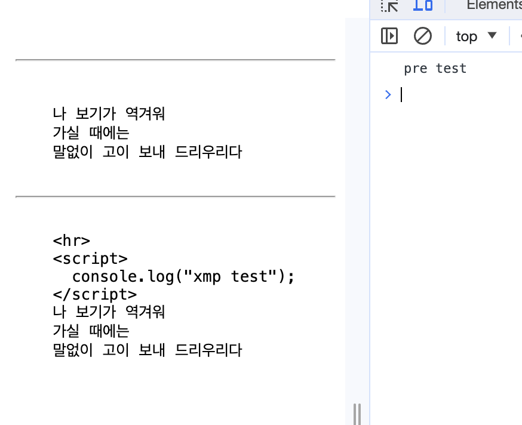
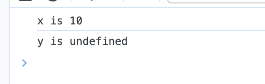
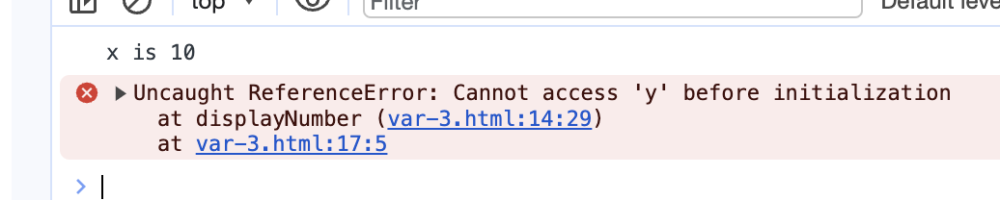

# [11/9] JS (script 위치, 입출력 함수, 자료형, var, let, const, 호이스팅)

## JS 로드 시점에 따른 실행의 차이

### body 에 script 를 배치하는 경우

- body 를 읽어오면서 script 도 읽기 때문에 정상 동작

```html
<!DOCTYPE html>
<html lang="ko">
<head>
	<meta charset="UTF-8">
	<meta name="viewport" content="width=device-width, initial-scale=1.0">
	<title>글자색 바꾸기</title>
	<style>
		body { text-align:center; }
		#heading { color:blue; }
		#text { 
			color:gray;
			font-size:15px;
		}
	</style>	
</head>
<body>
	<h1 id="heading">자바스크립트</h1>
	<p id="text">위 텍스트를 클릭해 보세요</p>

	<script>
	  var heading = document.querySelector('#heading');
	  heading.onclick = function() {
	  heading.style.color = "red";
	  }
	</script>
</body>
</html>
```

### head 에 script 를 배치하는 경우

- 브라우저 렌더링시 파일의 위에서 아래까지 순차적으로 읽음
- head 에 배치할 경우 script 내 DOM 객체를 접근하지 못함
    - body 의 태그들을 아직 읽지 않아 DOM 에 대한 정보가 부족
- **모든 파일을 읽은 후 실행하겠다는 함수 호출 필요 (window.onload)**
- 최근에는 두 방식의 차이가 없어 어떤 방식을 선택하던 무관

```html
<!DOCTYPE html>
<html lang="ko">
<head>
	<meta charset="UTF-8">
	<meta name="viewport" content="width=device-width, initial-scale=1.0">
	<title>글자색 바꾸기</title>
	<style>
		body { text-align:center; }
		#heading { color:blue; }
		#text { 
			color:gray;
			font-size:15px;
		}
	</style>	
	<script>
		window.onload = function() {
			var heading = document.querySelector('#heading');
			heading.onclick = function() {
				heading.style.color = "red";
			}
		}
	</script>
</head>
<body>
	<h1 id="heading">자바스크립트</h1>
	<p id="text">위 텍스트를 클릭해 보세요</p>
</body>
</html>
```

## 간단한 입출력

- alert()

    ```html
    <script>
    	alert("안녕하세요?");
    </script>
    ```

- confirm()

    ```html
    <script>		
      var reply = confirm("정말 배경 이미지를 바꾸겠습니까?");
    	document.write(reply);
    </script>
    ```

- prompt()
    - prompt() 로 받아온 값의 자료형은 문자열

    ```html
    <script>
    	var name=prompt("이름을 입력하세요.", "아무개");
    </script>
    ```


## document

- document 인터페이스는 브라우저가 불러온 웹 페이지를 나타냄
- 페이지 콘텐츠(DOM 트리)의 진입점 역할 수행
- 페이지의 URL 을 얻거나 문서에 새로운 요소를 생성하는 등의 기능을 전역적으로 제공

## 스타일 가이드

- [구글](https://google.github.io/styleguide/jsguide.html)

## 자료형

- 기본 유형
    - 숫자형
        - 자바스크립트는 정수와 실수를 구분하지 않음
        - 실수 계산 시 계산 결과가 정밀하지 않음
            - 실수를 2진수로 변환하여 계산하는데 그 과정에서 0.1~0.2의 차이가 발생
    - 문자열
    - 논리형
- 복합 유형
    - 배열
        - 다른 언어의 배열과는 다르게 자료형이 달라도 가능
    - 객체
- 특수 유형
    - undefined : 자료형이 지정되지 않은 상태
    - null : 값이 유효하지 않은 상태

### 자동 형변환

- 자바스크립트에서는 자동 형변환을 지원하여 예상대로 동작하지 않을 수 있음
    - `==` 비교 시 실제 값만 동일하면 true 반환

    ```jsx
    100 == '100'
    > true
    ```

- `===` 를 사용하여 타입 검증 후 값 검증

    ```jsx
    100 === '100'
    > false
    ```


## `<pre>` 태그와 `<xmp>` 태그

- `<pre>` 태그 : 텍스트 그대로 출력 + 태그 반영
- `<xmp>` 태그 : 텍스트 그대로 출력 + 태그 반영X

```html
<!DOCTYPE html>
<html lang="ko">
<head>
  <meta charset="UTF-8">
  <meta name="viewport" content="width=device-width, initial-scale=1.0">
  <title>Document</title>
</head>
<body>
  <pre>
    <hr>
    <script>
      console.log("pre test");
    </script>
    나 보기가 역겨워
    가실 때에는
    말없이 고이 보내 드리우리다
  </pre>
  <hr>
  <xmp>
    <hr>
    <script>
      console.log("xmp test");
    </script>
    나 보기가 역겨워
    가실 때에는
    말없이 고이 보내 드리우리다
  </xmp>
</body>
</html>
```



<details>
<summary>do-while Quiz</summary>
<div>

- 임의의 수 1~100 사이의 난수 발생해서 x 에 저장
- prompt 로 1~100 사이의 정수 입력해서 변수 you 에 저장
    - you > x 의 경우 Down!
    - you < x 의 경우 Up!
    - you === x 의 경우 축하합니다. n 번만에 맞추셨습니다.
- do-while, break

```html
<script>
    const randomNum = parseInt((Math.random() * 100) + 1);

    let you;
    let count = 0;
    do {
      you = prompt("1~100 사이의 정수를 입력해주세요!", "");

      if (you === null) {
        alert("게임을 종료하셨습니다.");
        break;
      }

      you = parseInt(you);
      count++;
      
      if (you > randomNum) {
        alert("Down!");
      } else if (you < randomNum) {
        alert("Up!");
      } else if (you === randomNum) {
        alert(`축하합니다. ${count}번만에 맞추셨습니다.`);
      }
    } while (randomNum !== you);
  </script>
```

</div>
</details>

## var 변수 타입

- 변수를 선언한 위치를 스코프로 가짐
    - 함수 외부에서 선언 시 전역 변수
    - 함수 내부에서 선언 시 지역 변수
- 재선언과 재할당 가능
- 아래와 같이 함수 외부와 내부에서 동일 이름을 가지는 변수 선언 시 예상과는 다르게 동작할 수 있음

    ```javascript
    var greeter = "hey hi";
    var times = 4;
    
    if (times > 3) {
        var greeter = "say Hello instead"; 
    }
    
    console.log(greeter) // "say Hello instead"
    ```


## 호이스팅

- 상황에 따라 변수의 선언과 할당을 분리해서 선언 부분을 스코프의 가장 위쪽으로 끌어올리는 것
    - `var` 타입에만 해당
    - 스코프(scope) : 변수가 적용되는 범위
    - 실제 코드

        ```html
        <script>		 
          var x = 10;
        
        	function displayNumber() { 								
            console.log("x is " + x);
            console.log("y is " + y);      
            var y = 20;
        	}
          displayNumber();
        </script>
        ```

    - 자바스크립트 해석기가 인식하는 코드

        ```html
        <script>		 
          var x = 10;
        	var y;
        
        	function displayNumber() { 								
            console.log("x is " + x);
            console.log("y is " + y);      
            y = 20;
        	}
          displayNumber();
        </script>
        ```

    - 결과

      


## let 변수 타입

- var 타입의 경우 재선언과 재할당이 자유로워 문제가 발생할 수 있음
- 이를 방지하기 위해 ES6 부터 let 과 const 등장
- **변수를 선언한 블록에서만 유효**
- 재할당은 가능하지만 재선언은 할 수 없음
    - 재선언 시 에러 발생
- 호이스팅을 지원하지 않음

  


```javascript
let greeting = "say Hi";
let times = 4;

if (times > 3) {
    let hello = "say Hello instead";
    console.log(hello); // "say Hello instead"
}
console.log(hello) // hello is not defined
```

## const 변수 타입

- 변수를 선언한 블록에서만 유효
- **재할당과 재선언 모두 불가능 (상수)**
- 호이스팅을 지원하지 않음

```javascript
const greeting = "say Hi";
greeting = "say Hello instead"; // error: Assignment to constant variable.
```

```javascript
const greeting = "say Hi";
const greeting = "say Hello instead"; // error: Identifier 'greeting' has already been declared
```
