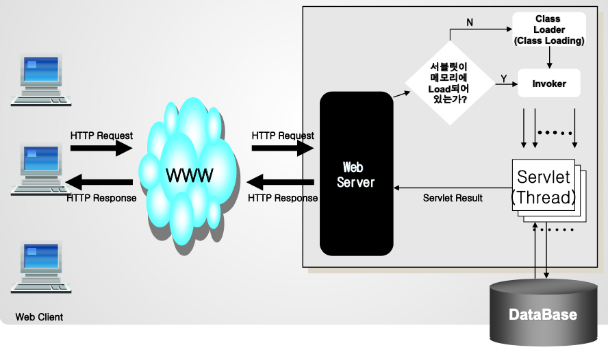
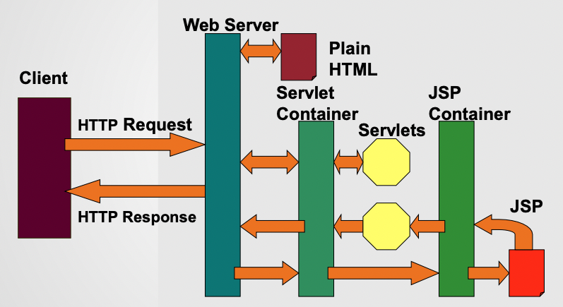

# [11/13] JSP (HTTP, Tomcat, JSP, Servlet)

## HTTP (HyperText Transper Protocol)

- HTTP : 웹 클라이언트와 웹 서버가 소켓(Socket) 통신 시 사용하는 메시지의 규약
    - TCP/IP 프로토콜로 데이터 전달
    - TCP : Transmission Control Protocol
    - POST : **스트림 형태로 입력 데이터가 전송**되므로 전송 용량에 제한 받지 않음
        - 문자 및 바이너리(파일)를 전송할 수 있음


- HTTP Request Message

    ```
    [요청방식] [요청 자료의 경로] [HTTP 버전]
    헤더명: 헤더값
    헤더명: 헤더값
    ...
    
    전달 데이터 (옵션)
    ```

    ```
    GET /index.jsp HTTP/1.1
    Host: localhost:80
    ```

- HTTP Response Message

    ```
    [HTTP 버전] [응답코드] [간단한 설명]
    헤더명: 헤더값
    헤더명: 헤더값
    ...
    
    전달 데이터 (옵션)
    ```

    ```
    Http/1.1 200
    Set-Cookie: JSESSION=asdf; Path=/; HttpOnly
    Content-Type: text/html;charset=UTF-8
    Content-Length: 169
    Date: Mon, 13 Nov 2023 02:36:13 GMT
    
    <!DOCTYPE html>
    <html>
    <head>
    <meta charset="UTF-8">
    <title>Insert title here</title>
    </head>
    <body>
    	<h1>Hello Servlet/JSP</h1>
    	Hello World
    </body>
    </html>
    ```

    - JSESSION : session key
        - 첫 접속 시 발급
        - 이후의 통신 시 session key 값으로 connection

## Tomcat 설치 및 설정

- tomcat 9 버전 설치
    - tomcat 10 에서 패키지 구조가 많이 변경되어 9 버전 선택
- server.xml 설정 변경

    ```html
    <!-- A "Connector" represents an endpoint by which requests are received
         and responses are returned. Documentation at :
         Java HTTP Connector: /docs/config/http.html
         Java AJP  Connector: /docs/config/ajp.html
         APR (HTTP/AJP) Connector: /docs/apr.html
         Define a non-SSL/TLS HTTP/1.1 Connector on port 8080
    -->
    <Connector port="80" URIEncoding="UTF-8" protocol="HTTP/1.1"
               connectionTimeout="20000"
               redirectPort="8443"
               maxParameterCount="1000"
               />
    ```

## Servlet 프로그래밍

- 서버에서 인스턴스 생성 후 사용



## Servlet 생성하기 (초기의 방법)

### 1. XML 파일에 선언

1. java servlet 코드 작성
    - servlet : HttpServlet 를 상속받은 자바 클래스
    - HttpServletRequest : HTTP 요청
    - HttpServletResponse : HTTP 응답
        - 해당 내용을 브라우저에게 전달

    ```java
    package basic;
    
    import java.io.IOException;
    import java.io.PrintWriter;
    
    import javax.servlet.ServletException;
    import javax.servlet.http.HttpServlet;
    import javax.servlet.http.HttpServletRequest;
    import javax.servlet.http.HttpServletResponse;
    
    public class HelloServlet extends HttpServlet {
    
    	@Override
    	protected void service(HttpServletRequest request, HttpServletResponse response) throws ServletException, IOException {
    		response.setContentType("text/html;charset=UTF-8");
    		PrintWriter out = response.getWriter();
    		out.println("<html>");
    		out.println("<head><title>first servlet</title></head>");
    		out.println("<body><h1>Hello Servlet~</h1></body>");
    		out.println("</html>");
    		out.flush();
    		out.close();
    	}
    }
    ```

2. xml 작성
    1. servlet 선언

        ```xml
        <?xml version="1.0" encoding="UTF-8"?>
        <web-app xmlns:xsi="http://www.w3.org/2001/XMLSchema-instance" xmlns="http://xmlns.jcp.org/xml/ns/javaee" xsi:schemaLocation="http://xmlns.jcp.org/xml/ns/javaee http://xmlns.jcp.org/xml/ns/javaee/web-app_4_0.xsd" version="4.0">
          <display-name>xciwep01</display-name>
          <welcome-file-list>
            <welcome-file>index.html</welcome-file>
            <welcome-file>index.htm</welcome-file>
            <welcome-file>index.jsp</welcome-file>
            <welcome-file>default.html</welcome-file>
            <welcome-file>default.htm</welcome-file>
            <welcome-file>default.jsp</welcome-file>
          </welcome-file-list>
          
        	<!-- servlet 추가 -->
          <servlet>
          	<servlet-name>helloServlet</servlet-name>
          	<servlet-class>basic.HelloServlet</servlet-class>
          </servlet>
        </web-app>
        ```

    2. servlet mapping

        ```xml
        <?xml version="1.0" encoding="UTF-8"?>
        <web-app xmlns:xsi="http://www.w3.org/2001/XMLSchema-instance" xmlns="http://xmlns.jcp.org/xml/ns/javaee" xsi:schemaLocation="http://xmlns.jcp.org/xml/ns/javaee http://xmlns.jcp.org/xml/ns/javaee/web-app_4_0.xsd" version="4.0">
          <display-name>xciwep01</display-name>
          <welcome-file-list>
            <welcome-file>index.html</welcome-file>
            <welcome-file>index.htm</welcome-file>
            <welcome-file>index.jsp</welcome-file>
            <welcome-file>default.html</welcome-file>
            <welcome-file>default.htm</welcome-file>
            <welcome-file>default.jsp</welcome-file>
          </welcome-file-list>
          
          <servlet>
          	<servlet-name>helloServlet</servlet-name>
          	<servlet-class>basic.HelloServlet</servlet-class>
          </servlet>
          
        	<!-- servlet-mapping 추가 -->
          <servlet-mapping>
          	<servlet-name>helloServlet</servlet-name>
          	<url-pattern>/helloServlet</url-pattern>
          </servlet-mapping>
        </web-app>
        ```


### 2. Servlet 에 선언

1. java servlet 코드 작성

    ```java
    package basic;
    
    import java.io.IOException;
    import java.io.PrintWriter;
    
    import javax.servlet.ServletException;
    import javax.servlet.annotation.WebServlet;
    import javax.servlet.http.HttpServlet;
    import javax.servlet.http.HttpServletRequest;
    import javax.servlet.http.HttpServletResponse;
    
    @WebServlet(urlPatterns = "/helloServlet")
    public class HelloServlet extends HttpServlet {
    
    	@Override
    	protected void service(HttpServletRequest request, HttpServletResponse response) throws ServletException, IOException {
    		response.setContentType("text/html;charset=UTF-8");
    		PrintWriter out = response.getWriter();
    		out.println("<html>");
    		out.println("<head><title>first servlet</title></head>");
    		out.println("<body><h1>Hello Servlet~</h1></body>");
    		out.println("</html>");
    		out.flush();
    		out.close();
    	}
    }
    ```

2. xml 작성
    - url-mapping 을 Servlet 에게 주었기 때문에 별다른 설정은 없음

    ```xml
    <?xml version="1.0" encoding="UTF-8"?>
    <web-app xmlns:xsi="http://www.w3.org/2001/XMLSchema-instance" xmlns="http://xmlns.jcp.org/xml/ns/javaee" xsi:schemaLocation="http://xmlns.jcp.org/xml/ns/javaee http://xmlns.jcp.org/xml/ns/javaee/web-app_4_0.xsd" version="4.0">
      <display-name>xciwep01</display-name>
      <welcome-file-list>
        <welcome-file>index.html</welcome-file>
        <welcome-file>index.htm</welcome-file>
        <welcome-file>index.jsp</welcome-file>
        <welcome-file>default.html</welcome-file>
        <welcome-file>default.htm</welcome-file>
        <welcome-file>default.jsp</welcome-file>
      </welcome-file-list>
    </web-app>
    ```


## XMl 설정값 load-on-startup

- load-on-startup : 0 이상일 경우 서버 구동 당시 초기화 후 메모리 로드
    - servlet 특성상 미리 로드하지 않고 처음 접근 시 생성 후 메모리 로드 → 해당 과정 생략
    - 여러 servlet 에게 설정 시 우선순위대로 초기화 진행(1이 높은 우선순위)
    - 음수일 경우 무조건 요청 후 생성 및 메모리 로드

    ```xml
    <servlet>
    	<servlet-name>helloServlet</servlet-name>
    	<servlet-class>basic.HelloServlet</servlet-class>
    	<load-on-startup>10</load-on-startup>
    </servlet>
    
    <servlet-mapping>
    	<servlet-name>helloServlet</servlet-name>
    	<url-pattern>/helloServlet</url-pattern>
    </servlet-mapping>
    
    <servlet>
    	<servlet-name>helloServlet2</servlet-name>
    	<servlet-class>basic.HelloServlet2</servlet-class>
    	<load-on-startup>1</load-on-startup>
    </servlet>
    
    <servlet-mapping>
    	<servlet-name>helloServlet2</servlet-name>
    	<url-pattern>/helloServlet2</url-pattern>
    </servlet-mapping>
    ```

  


## JSP (Java Server Page)

- Servlet Class 로 변환 후 컴파일
- 서버에서 인스턴스 생성 후 사용
- 클라이언트가 URL 로 실행 요청



## Servlet vs JSP

### Servlet

- 자바 언어 중심적 동적 파일
- HTML 응답을 생성하기 보다는 바이너리 응답을 생성
- 요청 흐름을 제어하는 역할을 주로 진행

### JSP

- 태그 중심적 동적 파일
- HTML 응답을 생성하여 클라이언트에 보내는 역할
- 클라이언트의 프레젠테이션이 목적

## JSP 의 활용

### 1. 내장 객체 JspWriter out 이용

- JSP 에서는 자바를 몰라도 브라우저에 출력할 수 있도록 내장 객체인 out 을 미리 선언해두었음

```html
<%@ page import="java.util.Calendar" %>
<%@ page language="java" contentType="text/html; charset=UTF-8"
    pageEncoding="UTF-8"%>
<!DOCTYPE html>
<html>
<head>
<meta charset="UTF-8">
<title>Insert title here</title>
</head>
<body>
	<%
		Calendar cal = Calendar.getInstance();
		
		int year = cal.get(Calendar.YEAR);
		int month = cal.get(Calendar.MONTH) + 1;
		
		// JspWriter out;
		out.println(year + ", " + month);
		...
	%>
</body>
</html>
```

### 2. JSP 문법 이용

- `<%=  %>`

```html
<%@ page import="java.util.Calendar" %>
<%@ page language="java" contentType="text/html; charset=UTF-8"
    pageEncoding="UTF-8"%>
<!DOCTYPE html>
<html>
<head>
<meta charset="UTF-8">
<title>Insert title here</title>
</head>
<body>
	<%
		Calendar cal = Calendar.getInstance();
		
		int year = cal.get(Calendar.YEAR);
		int month = cal.get(Calendar.MONTH) + 1;
	%>
	<table>
		<caption><%= year + "," + month %></caption>
		<caption><%= year %>,<%= month %></caption>
	</table>
</body>
</html>
```
