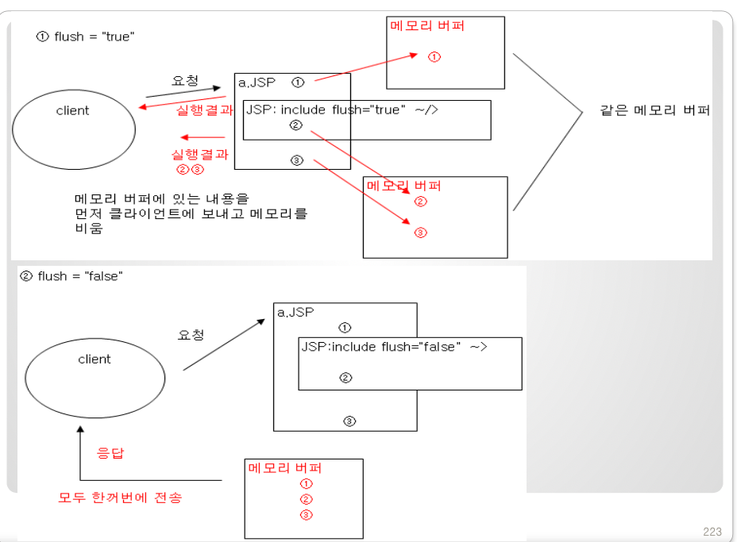
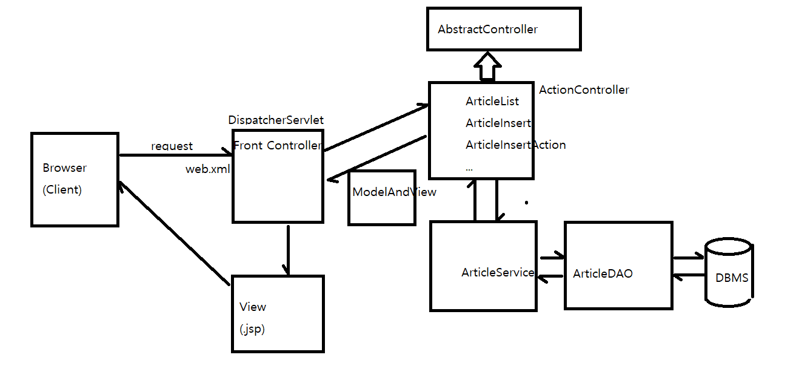

# [11/14] JSP&Servlet (지시문, Action, 내장객체 request, filter, JSTL, Servlet 실습)

## JSP 지시문 (Directive)

- `@page` : 실행에 관련된 정보를 JSP 컨테이너에게 제공하도록 지시
- `@include` : 외부 파일에 있는 내용 복사하도록 지시
- `@taglib` : 태그 라이브러리를 사용할 수 있도록 지시

## JSP 표준 Action

- 자주 사용되는 자바 코드를 표준 태그화한 것
- `<jsp:include>` : 다른 jsp 파일 include
- `<jsp:forward>`
- `<jsp:param>` : include 로 불러온 다른 jsp 파일에게 파라미터 전달
- `<jsp:useBean>` : Java Bean 생성
- `<jsp:setProperty>` : Java Bean 필드값 변경
- `<jsp:getProperty>` : Java Bean 필드값 조회
    - Bean 의 getter 메서드 사용 가능

## `@include` vs `<jsp:include>`

- `@include` 의 경우 Servlet 으로 변환하는 과정에서 하나의 클래스로 병합
    - 결국 하나의 클래스로 병합되기 때문에 파일 간의 변수 공유 가능
- `<jsp:include>` 의 경우 Servlet 으로 변환하는 과정에서 별도의 클래스로 관리
    - 별도의 클래스로 관리되기 때문에 파일 간의 변수 공유 불가능
    - jsp 파일 간 변수를 공유하기 위해 내장 객체인 request 사용
        - 파일 간 실행 요청

  *main.jsp*

    ```html
    <body>
    <%
       String msg = "안녕하세요~";
    %>
    <table>
    <tr>
       <td colspan="2" id="top">
    		<!-- top.jsp 에게 변수인 msg 전달 -->
       	<jsp:include page="top.jsp">
       		<jsp:param name="msg" value="<%= msg %>" />
       	</jsp:include>
       </td>
    </tr>
    <tr>
       <td id="menu"><jsp:include page="menu.jsp" /></td>
       <td id="content"><jsp:include page="content.jsp" /></td>
    </tr>
    </table>
    </body>
    ```

  *top.jsp*

    ```html
    <body>
    <h1>top</h1>
    <%
    	// HttpServletRequest 타입의 내장 객체
    	request.setCharacterEncoding("UTF-8");
    	String msg = request.getParameter("msg");
    	out.println(msg);
    %>
    </body>
    ```


## JSP 내장객체 request

- 내장 객체인 `out` 과 마찬가지로 jsp 에서 자주 사용하는 객체를 내장해둔 것
- Java 의 HttpServletRequest 타입을 가짐

## `@include` 의 flush 속성

- 페이지 이동 시 출력 버퍼에 저장한 결과를 처리하는 방법 설정
- true : 페이지가 이동될 때마다 버퍼의 내용을 반영하고 비움
    - 헤더 정보 포함 → 미리 전송할 경우 변경사항이 반영되지 않을 수 있음
- false : 페이지 이동 시 포함되어 있는 모든 파일 한번에 전송 (default)



## `<jsp:useBean>`

- jsp 파일에서 Java Bean 생성
- `<jsp:setProperty>` 를 이용하여 클래스의 setter 메서드 호출
    - jsp 파일에게 넘어온 value 들을 setter 네임에 맞게 매칭
    - name → setName();

```java
package beans;

import java.io.Serializable;

public class Reservation implements Serializable {

	private String name;
	private String phone;
	private String email;
	
	public String getName() {
		return name;
	}
	
	...
	
	public void setName(String name) {
		this.name = name;
	}
	
	...
}
```

```html
<%@ page language="java" contentType="text/html; charset=UTF-8"
    pageEncoding="UTF-8"%>
<jsp:useBean id="reserv" class="beans.Reservation" scope="page" />
<jsp:setProperty property="*" name="reserv" />
<!DOCTYPE html>
<html>
<head>
<meta charset="UTF-8">
<title>Insert title here</title>
</head>
<body>
name : <%= reserv.getName() %><br />
phone : <%= reserv.getPhone() %><br />
email : <%= reserv.getEmail() %><br />
</body>
</html>
```

## web.xml filter

- HTTP 요청 시 특정 요청에 대해 전역적인 조건 설정 가능
- 서버로 HTTP 요청이 올 경우 `url-pattern` 에 해당되면 filter 수행 후 실제 로직 처리
- 예시) 모든 요청에 대해 Character Encoding 설정

    ```xml
    <?xml version="1.0" encoding="UTF-8"?>
    <web-app xmlns:xsi="http://www.w3.org/2001/XMLSchema-instance" xmlns="http://xmlns.jcp.org/xml/ns/javaee" xsi:schemaLocation="http://xmlns.jcp.org/xml/ns/javaee http://xmlns.jcp.org/xml/ns/javaee/web-app_4_0.xsd" version="4.0">
      <display-name>xciwep01</display-name>
      <welcome-file-list>
        <welcome-file>index.html</welcome-file>
        <welcome-file>index.htm</welcome-file>
        <welcome-file>index.jsp</welcome-file>
        <welcome-file>default.html</welcome-file>
        <welcome-file>default.htm</welcome-file>
        <welcome-file>default.jsp</welcome-file>
      </welcome-file-list>
      
    	<!-- 1. 원하는 filter 생성 -->
      <filter>
      	<filter-name>character encoding</filter-name>
      	<filter-class>org.apache.catalina.filters.SetCharacterEncodingFilter</filter-class>
      	<init-param>
      		<param-name>encoding</param-name>
      		<param-value>UTF-8</param-value>
      	</init-param>
      </filter>
      
    	<!-- 2. filter 설정 및 매핑 -->
      <filter-mapping>
      	<filter-name>character encoding</filter-name>
      	<url-pattern>/*</url-pattern>
      </filter-mapping>
    </web-app>
    ```


## JSTL

- JSP Standard Tag Library
- JSP 에서 자주 사용하는 기능들을 캡슐화한 라이브러리
- 태그 종류
    - Core : 일반적인 프로그래밍 기능 제공
    - Formatting : 날짜, 시간, 숫자, 텍스트 포매팅
    - SQL : RDBMS 와 상호작용
    - XML : XML 문서 생성 및 조작
    - Functions : 일반적인 문자열 가공 및 조작

```html
<%@ page language="java" contentType="text/html; charset=UTF-8"
    pageEncoding="UTF-8"%>
<!-- taglib 호출 -->
<%@ taglib uri="http://java.sun.com/jsp/jstl/core" prefix="c" %>
<!DOCTYPE html>
<html>
<head>
<meta charset="UTF-8">
<title>Insert title here</title>
</head>
<body>
<c:set var="i" value="10" />
${i}

<hr />

\${10 + 5} = ${10 + 5}<br />
\${10 - 5} = ${10 - 5}<br />
\${10 * 5} = ${10 * 5}<br />
\${10 / 5} = ${10 / 5}<br />
\${10 % 5} = ${10 % 5}<br />

<hr />

\${10 > 5} = ${10 > 5}<br />
\${10 < 5} = ${10 < 5}<br />
\${10 >= 5} = ${10 >= 5}<br />
\${10 <= 5} = ${10 <= 5}<br />
\${10 == 5} = ${10 == 5}<br />
\${10 != 5} = ${10 != 5}<br />

</body>
</html>
```

## Servlet 실습

- Spring 의 DispatcherServlet 구조와 유사하게 실습 진행
- Client 가 HTTP 요청 시 DispatcherServlet 에게 접근 (Front Controller Pattern)
- DispatcherServlet 은 AbstractController 를 상속받은 특정 Controller Search
    - AbstractController 상속 : DispatcherServlet 에서 요청할 타입 규격 통일
- Controller 에서 ModelAndView 반환
    - ModelAndView 반환 : DispatcherServlet 에서 응답받을 타입 규격 통일


