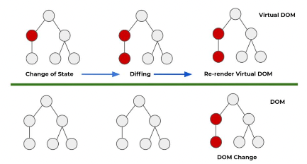

# [11/22] React (CRA, 모듈, CJS, MJS, 컴포넌트, ReactDOM, 이벤트, State)

## CRA(create-react-app)

- react 의 개발 환경을 자동으로 설정하여 개발에 집중하도록 함
- 폴더 구조
    - public : 컴파일이 필요 없는 정적인 파일이 저장되는 폴더 (resources)
    - src : 컴파일 되어 실행되는 소스와 컴포넌트 및 관련 파일이 저장되는 폴더 (src)
    - node_moduels : Nodejs 가 이용되는 패키지가 설치된 폴더 (lib)
    - package.json : 프로젝트, 패키지 등 프로젝트에 관련된 정보가 있는 설정 파일 (gradle)

## 기본 html 파일 설정

- node_moduels > react-scripts > config > webpack.config.js
- node_modules > react-scripts > config > paths.js

    ```javascript
    module.exports = {
      dotenv: resolveApp('.env'),
      appPath: resolveApp('.'),
      appBuild: resolveApp(buildPath),
      appPublic: resolveApp('public'),
      appHtml: resolveApp('public/index.html'),
      appIndexJs: resolveModule(resolveApp, 'src/index'),
      appPackageJson: resolveApp('package.json'),
      appSrc: resolveApp('src'),
    	...
      appNodeModules: resolveApp('node_modules'),...
    };
    ```


## 폴더 구조

- react 는 라이브러리이기 때문에 폴더 구조를 강제하지 않으나 일반적으로 다음과 같은 구조를 많이 사용
- components : 재사용 가능한 공통 컴포넌트와 관련 파일
- pages : 페이지 별로 사용되는 컴포넌트와 관련 파일
- store(context) : 상태 관리 라이브러리(Redux)와 관련된 코드
- utils : 공통 유틸리티
- assets : 이미지, 스타일시트, 폰트 등 폴더별로 자원 관리
- services : API 등 외부 연동 서비스에 관련된 기능
- hooks : 사용자화 훅 관리

## npm run eject

- CRA 가 자동으로 설정하고 노출시키지 않은 환경 설정을 수정할 수 있게 활성화
- config 와 scripts 폴더가 생성되고 관련 파일들이 생성
- 롤백되지 않아 되돌리고 싶은 경우 폴더 제거
- 환경 설정을 잘못할 경우 개발 및 실행에 문제가 발생할 수 있기 때문에 되도록 수정 X

## 배포

- 외부 서버에서 실행할 수 있는 형태의 파일로 변환

    ```javascript
    npm run build
    ```

- build 폴더 생성

## 모듈(Module)

- 자바의 클래스와 유사
- 함수나 코드로 구성된 프로그램의 기능적 단위
- 어플리케이션의 구성요소이며 자바스크립트의 경우 파일 단위로 생성
- 모듈 내 함수나 변수는 모듈 스코프(Module Scope)가 적용되고, export 로 지정하지 않는 이상 보호됨
- 어플리케이션을 기능 단위로 분류하여 복잡성과 코드 간의 정적인 의존성을 최소화하여 재사용성 및 유지보수 용이
- 모듈 내에 함수, 객체, 기본값 등을 외부에서 접근 가능하게 지정하고, 외부에서 참조하여 사용 가능하게 함
- 경로가 복잡한 경우 Subpath imports 를 이용하여 간단히 표기 (Nodejs v14 이후)

## 모듈 탐색

- 상대 경로 > Nodejs 코어 모듈 > node_modules(외부 모듈)
    - 우선순위가 높은 방식으로 동일한 경로 또는 파일명이 있을 경우 덮어씌워질 수 있음
- 파일 경로가 지정된 경우 상대 경로를 기본으로 탐색
    - 확장자는 생략 가능

    ```javascript
    import App from './App.js';
    ```

- Node.js 의 코어 모듈인지 확인

    ```javascript
    import http from 'http';
    ```

- 코어 모듈이 아닌 경우 node_moduels 폴더를 기준으로 파일 또는 하위 경로 탐색

    ```javascript
    import React from 'React';
    ```


## CommonJSModule (CJS Module)

- CommonJS 는 웹 브라우저에서 머물던 Javascript 생태계를 서버, 데스크탑 등으로 확장하여 응용 프로그램을 개발하기 위해 진행된 프로젝트
- ECMA 표준 사양과 별개로 Node.js 위주로 발전하여 독자적인 체계를 가지고 있음
    - 표준을 준수하는 브라우저 기반 실행 환경과 완벽하게 호환되지 않음
- Node.js 의 기본 사양으로 지속적으로 지원되어 CommonJS 로 제작된 많은 패키지들을 이용할 수 있음
- 최근에 Node.js 는 ECMA 표준 및 모듈 사양 지원을 강화하고 있음
- **CommonJS 모듈은 동기식으로 처리됨**

### 문법

- **require(String 모듈명)** 함수
    - id 매개변수로 전달된 모듈명 또는 경로에서 지정된 모듈의 module.exprots 객체를 반환
        - module 생략 가능

        ```javascript
        // cjs03.js
        module.exports = {
          a: 10,
          fnA: function () {
            console.log('fnA');
          },
        };
        
        // n02_cjs.js
        const obj = require('#labs/cjs/cjs03.js');
        console.log(obj.a); // 10
        obj.fnA(); // fnA
        ```

    - 처음 호출 시 require.cache 에 저장되어, 동일 id 를 require 하면 cache 에 저장된 객체 반환
        - Singleton 패턴과 동일한 역할
    - 구조 분해 할당(Destructuring assignment)을 하는 경우 export 에 사용된 속성명 사용

        ```javascript
        const 변수명 = require(모듈명);
        const { 속성명1, 속성명2, ...} = require(모듈명); // 객체 구조 분해 할당
        ```

    - require 문의 위치는 정해지지 않음 (자유로움)
- module.exports 객체
    - 함수, 객체, 값들을 module.exports 에 담아 require 함수에서 반환할 수 있게 함
    - exports 는 module.exports 의 단축어

    ```javascript
    // default: 내보낼 대상이 하나만 정의된 경우
    module.exports = { ... };
    
    // named: 내보낼 대상이 여러 개가 정의된 경우
    exports.name = { ... };
    module.exports.name = { ..., ..., ... };
    ```

    - default 는 모호성이 있어 유지보수 시 문제가 될 수 있어 되도록 사용하지 말 것
    - module.exports 권장

## ECMAScript Module (ES Module, ESM)

- ECMA 가 ES6(ES2015) 부터 웹 표준으로 지원하는 모듈 관련 사양(Spec)
    - Node.js 는 표준 지원 전에 CommonJS 모듈 사양이 이용됨
- 최근에는 ECMAScript 모듈 사용이 권장되며, 지원이 강화됨
- ES 모듈은 비동기식으로 처리됨

### 문법

- 최상위 스코프(Top Level) 에 기술 (관례)
- 엄격 모드(use strict) 가 기본
- 확장자 `.mjs` 사용 또는 package.json 에서 type: module 설정 필요
    - 설정 없이 `.js` 파일에서 import 문 사용 시 아래 에러 발생

        ```javascript
        import a1 from '#labs/esm/esm01.mjs';
        ^^^^^^
        
        SyntaxError: Cannot use import statement outside a module
            at internalCompileFunction (node:internal/vm:77:18)
            at wrapSafe (node:internal/modules/cjs/loader:1288:20)
            at Module._compile (node:internal/modules/cjs/loader:1340:27)
            at Module._extensions..js (node:internal/modules/cjs/loader:1435:10)
            at Module.load (node:internal/modules/cjs/loader:1207:32)
            at Module._load (node:internal/modules/cjs/loader:1023:12)
            at Function.executeUserEntryPoint [as runMain] (node:internal/modules/run_main:135:12)
            at node:internal/main/run_main_module:28:49
        ```

- import ~ from
    - id 매개변수로 전달된 모듈명 또는 경로에서 지정된 모듈 참조
    - 동일 id 를 import 하면 singleton 으로 관리
    - 구조 분해 할당을 사용하는 경우 export 에서 사용된 속성명 사용
    - 와일드카드(*) 사용 가능, as 로 별칭 부여

    ```javascript
    import 변수명 from '모듈명';
    import { 속성명1, 속성명2, ... } from '모듈명'; // 객체 구조 분해 할당
    import * from '모듈명';
    import 속성명 as 별칭 from '모듈명';
    import { 속성명1 as 별칭1, 속성명2 as 별칭2, ...} from '모듈명';
    import * as 별칭 from '모듈명';
    ```

- export 문
    - 함수, 객체, 값들을 import 에서 접근할 수 있게 함
    - 내보내는 모듈은 엄격 모드

    ```javascript
    // default: 내보낼 대상이 하나만 정의된 경우
    export default { ... };
    
    // named: 내보낼 대상이 여러 개가 정의된 경우
    export { ... };
    export { 대상1 as 별칭1, ... };
    ```


## 컴포넌트(Component)

- 리액트 어플리케이션의 UI 를 구성하고 있는 재사용 가능한 기본 단위
    - 리액트 어플리케이션의 UI 는 컴포넌트들의 조합으로 구성
- props(properties) 를 이용하여 데이터를 받고, 일반 객체(plain object) 인 **리액트 엘리먼트를 반환**하는 것을 컴포넌트라고 함
    - 일반 객체 : 어느 것도 상속받지 않은 상태
    - 컴포넌트는 대문자로 시작하는 파스칼(Pascal) 표기법을 따름
- 리액트 요소는 주로 **JSX(JavaScriptXML) 을 이용하여 생성**
- 리액트는 라이브러리이기 때문에 디자인 패턴을 강제하지 않지만 다음과 같은 패턴을 사용하는 것을 권장
    - container : 데이터와 처리에 관련된 자바스크립트 부분 (Model)
    - presentational : 화면 출력 부분으로 JSX 부분 (View)
    - atomic : 컴포넌트를 중복을 피하기 위해 작은 단위로 나누는 구조
        - 수정이 많은 경우 부적합

## ReactDOM

- 브라우저 DOM 을 투영한 React element 로 구성된 Virtual DOM 생성
- ReactDOM.render() 를 이용하여 VirtualDOM 생성

    ```javascript
    ReactDOM.render(React.createElement(App), document.getElementById('root'));
    ```

    ```javascript
    ReactDOM.render(<App/>, document.getElementById('root'));
    ```

- 자식 요소를 생성하기 위해서는 단일 루트 요소(Root Element) 가 필요
- **React 엘리먼트는 순수 자바스크립트 객체이고, 상태가 변경되지 않는 불변임**
    - 수정할 경우 새 요소를 생성해서 갱신
    - 내부적으로 동작하기 때문에 고려하지 않아도 됨
- 이전 상태와 비교해 상태가 변경된 React 엘리먼트를 기준으로 브라우저 DOM 을 변경

  


## 함수 컴포넌트 (Function Component)

- 2019년에 발표되었으나 대부분의 프로젝트에서 사용

```javascript
function WelcomeMsg(props) {
	return <h1>안녕, {props.name}</h1>;
}
```

- 매개변수(props) 를 이용하여 데이터를 받을 수 있고, 리액트 엘리먼트를 반환하는 기본 함수가 있으면 함수 컴포넌트
- 기본으로 내보낼 함수명은 소스코드명(파일명) 과 동일하게 지정
- 리액트 v16.8 버전부터 지원되는 리액트 훅(React Hook) 전까지는 정적(Static) 인 컴포넌트로 많이 이용
- 컴포넌트 내에 함수는 모듈 내 최상위 스코프(Top Level Scope) 에 선언
    - **중첩함수(Nested Function) 는 성능과 디버깅에 문제가 있어 사용하지 않음** (클로저 포함)

### props (property)

- 값이나 함수 등을 **부모 컴포넌트에서 자식 컴포넌트로 단방향(one way) 으로 전달**하는 경우 사용
    - 대표적인 단방향 상태값
- 자식 컴포넌트 입장에서 불변형(immutable) 으로 읽기 전용임
- 배열을 이용하여 출력할 경우 key 필요
    - key 를 이용하여 리액트 요소의 고유 식별자로 이용되고, 리렌더링(re-rendering)에 이용되어 성능이 향상됨
        - 필수는 아님
        - 자동 생성 태그의 경우 리액트가 태그를 추적하기 위한 근거
    - key 값은 형제 노드에서만 유일하면 됨
- defaultprops : props 가 초기화되지 않아 undefined 되는 것을 피하기 위해 미리 초기화하는 방법
    - 함수 컴포넌트가 대세가 되면서 사용 중단 예정(deprecated)
    - defaultprops 키워드를 사용하지 않고 undefined 가 발생하지 않도록 고려

## 클래스 컴포넌트 (Class Component)

```javascript
class WelcomeMsg extends React.Component {
	render() { return <h1>안녕, {this.props.name}</h1> };
}
```

## 이벤트(Event)

- 리액트 엘리먼트의 이벤트 처리는 DOM 이벤트 처리와 유사
    - 리액트 엘리먼트 중 DOM 이벤트는 DOM 엘리먼트에 적용 가능
    - 리액트 엘리먼트에는 이벤트 적용 X
- 리액트 컴포넌트에서 선언된 이벤트 핸들러는 이벤트로 처리되지 않고 props 로 전달
    - 이벤트가 처리되는 DOM 엘리먼트의 이벤트 핸들러에서 함께 처리
- 카멜케이스 사용
- 발생된 이벤트 정보는 합성 이벤트(SyntheticEvent) 를 이용하여 확인
    - 합성 이벤트는 브라우저 이벤트의 래퍼(Wrapper)
- 브라우저 이벤트 정보가 필요할 경우 event.nativeEvent 속성 이용

## State

- **컴포넌트의 상태를 동적으로 관리**하기 위해 사용되는 기본 React Hooks 중 하나
- props 와 다르게 컴포넌트 내부에서 관리
- useState() Hook 을 이용하여 관리할 상태를 필요한 만큼 설정
    - 리액트의 Hook 은 useXXX() 와 같은 형태로 구성
    - useState() 는 State 라는 Hook 을 의미
- 상태값 변경 함수로 상태값을 변경하면 컴포넌트는 비동기적으로 리렌더링 됨
- 리렌더링을 효율적으로 하기 위해 변경 상태들을 순차적으로 관리하고, 일괄적으로 적용
- 리액트는 부모에서 자식 컴포넌트 방향으로만 데이터가 흐르는 단방향이 기본
- 필요할 경우 자식의 상태를 부모로 끌어올리는 방법인 state 끌어올리기(lifting state up)를 적용
    - 단방향은 형제 노드들 사이에서 직접 데이터 전달이 불가능한 구조
    - 부모가 같은 형제 요소 노드에게 데이터를 전달
    - 자식 컴포넌트에서 이벤트가 발생되면 부모가 전달한 이벤트 핸들러를 이용하여 상태 변경
    - 리액트 요소 트리 깊이가 깊을 경우 발생되는 props drilling 이 일어나 상태 끌어올리기가 복잡함
    - 상태 관리 라이브러리인 Context, Redux 등 사용 권장
