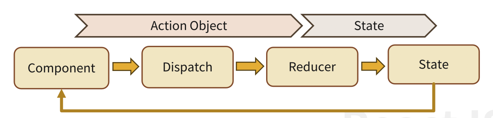

# [11/24] React (Outlet, Path Pattern, React Router Hooks, Styled Component, React Context, Context API, Redux, Redux Toolkit)

## Outlet

- 부모 컴포넌트에서 선언된 라우터를 자식 컴포넌트에서 사용할 경우 이용
- 중첩된 라우트의 부모 라우터를 자식 컴포넌트들에서 공통적으로 사용할 때 사용
    - Menu 하위에 Route 경로 추가

        ```javascript
        function Menu() {
        		return (
        			<div>
        				<h1>Menu</h1>
        				<Outlet />
        			</div>
        		);
        }
        ```

        ```javascript
        function App() {
        	return (
        		<Routes>
        			<Route path='/' element={<Menu />}>
        			<Route path='home' element={<Home />}>
        			<Route path='about' element={<About />}>
        		</Routes>
        	);
        }
        ```


## Path Pattern

### Star Segment

- `*` 를 이용하여 지정
- 지정된 하위 모든 경로 패턴 매칭

```javascript
path='/article/*'
/article
/article/1/2/3
/article/list/123
```

### Optional Segment

- 모든 세그먼트는 필수이나, 생략 가능한 세그먼트 지정

```javascript
path='/:articleId?/list'
/1/list
/2/list
/list
```

### React URL 파라미터(URL Parameter, Dynamic Segment)

- URL 을 이용하여 부가 정보를 보내는 방법
- `:` 로 시작되며 파라미터명을 지정

```javascript
path='/board/list/:boardId'
path='/board/:boardCode/list/:boardId'
path='/:articleId'
```

## React Router Hooks

- react-router-dom 의 다양한 Hooks

### useNavigate

- v6 이전에 사용되었던 useHistory 를 대치
- Navigate 컴포넌트와 기능과 사용법은 동일
- useNavigate : 원하는 경로로 이동하면서 state 도 넘겨줌
    - history + state
- createSearchParams : QueryString 값 생성
    - 매번 생성하는 것보다 객체를 활용하기도 함
    - 만약 createSearchParams 사용 시 navigate 와 함께 사용

```javascript
import {useNavigate} from 'react-router-dom';
import {createSeartchParams} from 'react-router-dom';

const navigate = useNavigate();

function handleHomeClick() { // handler, callback
	navigate('/home');
}

<button onClick={() => navigate(-1)>이전</button>
<button onClick={() => navigate(1)>이후</button>
<button onClick={() => navigate('/content', {state: {idx: '1'}})>내용</button>

// URL 생성
// QueryString => /content?idx=1
<button onClick={() => navigate('/content', {search: {createSearchParams({idx: '1'})}>내용</button>
```

### useLocation

- 현재 URL 정보를 가지고 있는 location 객체를 반환
- QueryString 데이터 처리를 위해 useSearchParams 와 같이 사용되는 경우가 많음
- 속성
    - pathname : QueryString 을 제외한 현재 URL 경로
    - search : QueryString 으로 전달된 파라미터
    - state : Link 나 navigate 가 전달한 state

    ```javascript
    import {useLocation, useSearchParams} from 'react-router-dom';
    
    // useNavigate 예제 코드 참조
    const {pathname, search, state} = useLocation();
    const state_idx = state.idx;
    
    // createSearchParams 예제 코드 참조
    const searchParams = new URLSearchParams(search);
    const search_idx = searchParams.get('idx');
    ```


### useParams

- React URL 파라미터로 넘어온 값 반환

```javascript
import {useParams} from 'react-router-dom';

path='/:articleId'; // 1

const boardParams = useParams();
const idx = boardParams.articleId;
```

### useSearchParams

- QueryString 으로 넘어온 데이터에 대한 처리
- useState 와 유사하게 배열 형태로 상태값과 변경 함수를 반환

```javascript
import {useSearchParams} from 'react-router-dom';

const [searchParams, setSearchParams] = useSearchParams();
const mode = searchParams.get('mode');

searchParams.set('mode', 'READ');
searchParams.append('readvn', '1');

setSearchParams(searchParams);
```

- 주요 메서드
    - get(key) : key 에 해당하는 값 1개 반환, key 가 같은 경우 첫번째 값
    - getAll(key) : key 에 해당하는 값 모두 반환
    - toString() : QueryString 을 반환
    - set(key, value) : key 값을 value 로 수정
    - append(key, value) : key 를 이용하여 값을 추가
    - delete(key) : key 에 해당하는 값 삭제

### useRoutes

- 너무 많은 Routes 를 선언했을 때 용도에 따라 분리할 수 있음
- `<Routes>` 컴포넌트가 아닌 JavaScript 객체로 Routes 를 생성할 때 이용
- 기존에는 react-router-config 를 이용
- 외부에 JavaScript 로 라우트를 구성하고 불러서 사용할 수 있음

```javascript
import {useRoutes} from 'react-router-dom';

export default function MenuRouter() {
	let element = useRoutes( [{
		element: <Menu />,
		children: [
			{path: '/home', element: <Home />},
			{path: 'about', element: <About />},
		],
	}]);
	return element;
}
```

```javascript
import MenuRouter from './menurouter'

<BrowserRouter>
	<div className='App'>
		<h1>useRoutes</h1>
		<MenuRouter />
	</div>
</BrowseRouter>
```

## Styled Components

- CSS 정의를 JavaScript 로 기술된 컴포넌트에 적용하는 방법을 CSS-in-JS 라고 함
- CSS-in-Js 는 JavaScript 에서 직접 사용 가능하기 때문에 동적인 환경에서도 쉽게 대응
- CSS-in-JS 중 인기가 있는 라이브러리 중 하나는 Styled Components 임
- **리액트 컴포넌트 별로 재사용 가능한 자체 스타일을 만들 수 있음**
- 스타일 속성을 자바스크립트 스타일이 아닌 CSS 스타일로 적용할 수 있음
- 내부적으로 class 가 자동으로 생성되어 적용되므로 스타일명으로 간단히 관리할 수 있음
- 리액트 컴포넌트에 CSS 를 적용한 뒤 리액트 요소 반환
- CSS 의 class 보다 **Tag 위주로 구현**
- 컴포넌트를 만들 때 백틱 안에 CSS 코드를 그대로 작성할 수 있고, 객체화한 CSS 주입도 가능
- 스타일드 컴포넌트를 사용 전에 다음과 같이 적용

```javascript
const HelloStyle = styled.div`
	color: 'blue',
	backgroud-color: 'yellow'
`

<HelloStyle>Hello World!!!</HelloStyle>;
```


### 설치 및 설정

- 외부 라이브러리이기 때문에 패키지 설치 필요

```javascript
npm install styled-components;
```

- 스타일드 컴포넌트는 템플릿 문자열(Template literals) 을 기반으로 한 태그드 템플릿 문자열(Tagged Template Literals) 을 이용
    - 백틱(``) 을 이용하여 생성하고 내부에서 줄 바꾸기 허용
    - `${~}` 를 이용한 표현식(Expression)을 삽입할 수 있음
    - 표현식 내부에 조건(삼항)연산자를 사용할 수 있고, 중첩 가능
    - 표현식 내에서 자바스크립트에서 사용 가능한 거의 대부분의 자료형 사용 가능

### HTML 요소 기반

```javascript
const HelloStyle = sytled.div`
	color: 'blue',
	backgroud-color: 'yellow'
`

<HelloStyle>Hello World!!!</HelloStyle>;
```

### React 컴포넌트 기반

```javascript
import OKButton from './OKButton';

const HelloButton = styled(OKButton)`
	color: 'blue',
	backgroud-color: 'yellow'
`

<HelloButton>Hello World!!!</HelloButton>;
```

### 기존 스타일드 컴포넌트 확장

- 미리 정의되어 있는 스타일드 컴포넌트를 확장 (상속)

```javascript
import OKButton from './OKButton';

const HelloButton = styled(OKButton)`
	color: 'blue',
	backgroud-color: 'yellow'
`

const HelloLargeButton = sytled(HelloButton)`
	...
`
```

### props 를 이용한 동적 적용

- 리액트 컴포넌트
    - mode 의 값이 없을 경우 자동으로 false 처리됨

    ```javascript
    const Button = ({props}) => (
    	<button className={(props.mode) ? 'enable' : 'disable'}>Save</button>
    )
    ```

- 리액트 컴포넌트 기반
    - 화살표 함수 사용

    ```javascript
    const HelloButton = styled.button`
    	color: 'blue',
    	backgroud-color: ${(props) => (props.mode) ? 'yellow' : 'gray'}
    `
    ```


### 속성 지정

- inline style 으로 적용

```javascript
const HelloButton = styled.button.attrs((props) => {
	enabled: true
})`
	color: 'blue',
	backgroud-color: %{(props) => (props.mode) ? 'yellow' : 'gray'}
`
```

### css helper

- 템플릿 문자열 내에 css 를 선언해야 하는 경우 사용

    ```javascript
    import styled, {css} from 'styled-components';
    
    const HelloButton = styled.button.attrs((props) => {
    	enabled: true
    })`
    	color: 'blue',
    	${(props) => (props.mode) ? css`
    		font-weight: bold;
    		color: white;` : 'gray'}
    `
    ```


### Mixin 기법

- 공통적으로 사용될 css 를 선언한 뒤 재사용하는 방법
- 다형성으로 구현 (프로토타입 복제)

```javascript
const buttonCSS = css`
	background-color: Blue;
	color: white;
`;

const BlueButton = button` // 백틱이 있어서 styled 생략 가능
	${buttonsCSS}
	color: silver;
`;
```

- Styled Component 예제 코드

    ```javascript
    import './App.css';
    import styled from 'styled-components';
    
    // styled components
    const SimpleButton = styled.button`
      color: white;
      background-color: green;
    `;
    
    const LargeButton = styled(SimpleButton)`
      font-size: 50px;
    `;
    
    // react components
    const ReactButton = (props) => {
      return <button className={props.className}>{props.children}</button>;
    };
    
    const ReactLargeButton = styled(ReactButton)`
      font-size: 50px;
    `;
    
    // dynamic components
    const PrimaryButton = styled.button`
      color: ${(props) => (props.primary ? 'white' : 'black')};
      background-color: ${(props) => (props.primary ? 'blue' : 'gray')};
    `;
    
    function App() {
      return (
        <div className="App">
          <SimpleButton>Simple</SimpleButton>
          <LargeButton>Large</LargeButton>
          <ReactButton>React</ReactButton>
          <ReactLargeButton>React Large</ReactLargeButton>
          <PrimaryButton>Normal</PrimaryButton>
          <PrimaryButton primary>Primary</PrimaryButton>
        </div>
      );
    }
    
    export default App;
    ```


## React Context

- 부모 자식을 기준으로 상태를 전달하는 props 는 다양한 컴포넌트들 전체에 상태를 전달하기에 한계가 있음
- 컨텍스트 API 는 컴포넌트 전체에서 전달할 수 있음
- props 는 부모와 자식 단계가 깊어질 수록 전달의 경로가 복잡해짐 (Props Drilling)
- 이런 경우 props 에 의존성이 생겨 수정할 때도 연결된 모든 props 를 수정해야 하고 중간에 있는 컴포넌트를 수정해도 많은 부분을 수정해야 함
- **React Context 를 사용한다면 지정한 target 사이에 값 공유 가능**


- 리액트는 Context 사용을 위해 Context API 를 제공
    - createContext, Provider, Consumer 등
- Content 를 제공하는 제공자(Provider) 와 구독하는 구독자(Consumer) 구조 제공

## Context API

### React.createContext

- Context 객체를 생성하여 반환
- 필요할 경우 하나 이상 생성

```javascript
import {createContext} from 'react';
const DataContext = createContext(defaultValue);
```

- defaultValue 는 컴포넌트가 상위 경로에서 Context 를 제공하는 Provider 를 찾지 못하는 경우 사용됨
    - 한번 설정되면 변경되지 않음
- context 객체의 데이터는 스스로 변경할 수 없음

### Provider Component

- 지정한 Context 의 value props 값을 **하위 컴포넌트에게 전달하는 구독 서비스를 제공**
    - App 을 Provider 로 설정 시 모든 노드가 Consumer
- 자손 컴포넌트의 수는 제한이 없음
- **context 의 변화가 있으면 구독 컴포넌트에게 전파**
- Context 별 Provider 중첩을 허용
    - 동일 Provider 가 중첩된 경우 consumer 컴포넌트에서 가장 가까운 Provider value 값을 우선시 함
    - 부모 컴포넌트
- Provider 의 value props 값이 변경될 때마다 구독 중인 컴포넌트들은 re-render 됨
    - **잦은 value 값 변경은 빈번한 re-render 를 발생시킴**
    - role 에 따른 화면 구성을 다르게 처리할 때

        ```javascript
        import {createContext} from 'react';
        
        const DataContext = createContext({});
        const RoleContext = createContext(null);
        
        const [data, setData] = useState('');
        
        <DataContext.Provider value={{data, setData}}>
        	<RoleContext.Provider value={{role:'read'}}>
        		<PageComponent />
        	</RoleContext.Provider>
        </DataContext.Provider>
        ```


### Consumer Component

- context 변화를 구독하는 컴포넌트
- Consumer 컴포넌트 내에 content 라는 함수를 이용하여 구현

    ```javascript
    function Page() {
    	return (
    		<RoleContext.Consumer>
    			// role 변경 시 해당 부분 Re-render
    			{data => {<h3>{data}</h3>}}
    		</RoleContext.Consumer>
    	);
    }
    ```

- 최근에는 useContext hook 을 이용하여 구독

    ```javascript
    function Page() {
    	const data = useContext(DataContext);
    	return (
    		<h3>{data}</h3>
    	)
    }
    ```


## useReducer

- 리액트가 제공하는 기본 Hooks 중 하나
- useState 와 비슷하게 상태 관리 시 사용
    - useState 처럼 setXXX() 에 Callback 함수를 전달하는 방법은 사용하지 않음
- useReducer 는 Dispatch 를 이용해 처리 방법이 기술된 Reducer 를 호출하면서 상태를 전달하여 실행하는 대리자 구조로 운영
- 재활용성이 높아짐
    - 컴포넌트에서 상태 처리에 관련된 코드를 Reducer 를 이용하여 분리할 수 있음
    - 컴포넌트에서는 상태 값만 전달하면 되어 구조가 단순해짐
- 복잡한 구조의 state 를 이용하는 경우에는 reducer 함수를 이용할 수 있는 useReducer 사용을 권장
    - 단순한 구조의 state 관리를 할 경우 useState 사용 권장



- 의존성 제거를 통한 구조 단순화
    - Dispatch : Action 만 처리
        - 다수의 Reducer 에 접근하여 처리할 수 있음 → 재사용 가능
    - Reducer : state 로 변경하는 과정만 처리 (순수 함수)
        - state 에 관련된 비즈니스 로직 담당

### 초기화 및 생성

```javascript
const [state. dispatch] = useReducer(reducer, initialArg, init);
```

- reducer
    - 순수 함수로 state 와 action 을 매개변수로 함
        - 매개변수로 넘어온 state 를 변경한 뒤 반환
    - state 와 action 을 매개변수로 함
- initialArg : 초기 상태
    - init 이 지정되지 않으면 initialArg 로 초기화
- init : 초기화를 하는 함수 지정 (선택 사항)
- state : 현재 상태
- dispatch : 실행할 정보를 가지고 있는 action 과 state 를 reducer 에게 전달

### 구현

- state 와 관련된 알고리즘(비즈니스)이 있을 경우 reducer 권장
    - 예제코드 : 버튼 클릭 시 버튼에 따라 count 값 변경

    ```javascript
    const initialState = {count: 0};
    
    function reducer(state, action) {
    	switch (action.type) {
    		case 'increment':
    			return {count: state.count + 1}
    		case 'decrement':
    			return {count: state.count - 1}
    		default:
    			throw new Error();
    	}
    }
    
    // countroller 와 같은 역할
    function Counter() {
    	const [state, dispatch] = useReducer(reducer, initialState);
    	return (
    		<>
    			Count: {state.count}
    			<button onClick={() => dispatch({type: 'decrement'})}>-</button>
    			<button onClick={() => dispatch({type: 'increment'})}>+</button>
    		</>
    	);
    }
    ```


## useEffect

- 리액트가 제공하는 기본 Hook 중 하나
- 함수형 컴포넌트의 라이프 사이크(Life Cycle) 별 트리거(Trigger) 로 동작하여 작업을 Side Effect 를 이용하여 수행할 수 있게 함
- Side Effect
    - 부수효과, 부작용이라고 함
        - 함수 지향형의 순수 함수의 정의와 관련된 현상
        - 순수 함수 : 동일한 값을 입력하면 항상 같은 값이 나오는 함수
        - 외부 API 통신으로 내부 값이 변경되는 경우 side effect 라고 볼 수 있음
    - 리액트에서는 컴포넌트와 외부 사이에 일어나는 비동기적인 작업을 의미
    - 주로 서버 API 통신이나 리액트 컴포넌트 DOM 수동 수정 또는 브라우저 API 등을 이용할 때 필요
    - 데이터 로딩과 렌더링을 순차적으로 진행하면 데이터 로딩 시간 때문에 렌더링 지연 문제 발생
    - 렌더링 후 비동기로 데이터가 필요할 때 사용하면 효율적으로 실행할 수 있음
        - 렌더링이 진행되는 동안 진행 과정을 그대로 화면에 표출

### 선언 및 생성

```javascript
import React, {useEffect} from 'react';

useEffect(callback[, dependencies]);
```

- callback : 컴포넌트 렌더링이 끝난 뒤 호출되는 callback 함수 (필수)
- dependencies : 종속성 배열(dependency array)라고 함, useEffect 에서 관리되는 모든 상태 등록 (선택)

### 라이프 사이클

- useEffect 의 dependencies 사용 여부와 반환(Return) 여부에 따라 함수 컴포넌트의 생명 주기에 맞추어 실행 가능
- mount : 처음 컴포넌트 렌더링이 완료된 후 실행
    - 콜백 함수와 초기값이나 빈 dependencies 가 설정되면 실행
    - Class Component 의 ComponentDidMount 에 해당

    ```javascript
    useEffect(() => {console.log('mount');}, []);
    ```

- update : dependencies 가 변경되면 실행
    - Class Component 의 ComponentDidMount, ComponentDidUpdate 에 해당

    ```javascript
    useEffect(() => {console.log('update');}, [name]);
    ```

- unmount : dependencies 가 비어있고, 컴포넌트가 사라지면 Cleanup 함수 호출
    - Cleanup 함수는 unmount, update 전에 실행하는 작업 지정
    - 계속되는 이벤트 호출이 발생되는 경우 이벤트 해지를 위해서도 사용됨
    - Class Component 의 ComponentWillUnmount 에 해당

    ```javascript
    useEffect(() => {console.log('unmount');}, []);
    ```

- dependencies 가 없을 경우 : 리렌더링마다 실행됨

    ```javascript
    useEffect(() => {console.log('rerendering');});
    ```


## React Hooks Lifecycle


## Redux

- Flux 디자인 패턴을 응용한 App 전역 상태(state) 관리 자바스크립트 라이브러리
    - 리덕스에서는 Flux 의 Dispatcher 를 내부적으로 이용
- Context API 가 제공되기 이전부터 사용됨
- 다양한 리듀서(Reducer) 가 업데이트를 진행하기 전에 추가 작업을 할 수 있는 리덕스 미들웨어(Redux Middleware) 를 이용할 수 있음
- 리덕스의 3가지 원칙
    - Single source of truth
        - App 단위의 **전역 상태는 하나의 Store** 에 하나의 Object Tree 로 저장
        - Redux Store 라고 하며 단일 저장소는 상태값 관리 및 변화 추적 등 디버깅에 유리
    - State is read-only (불변형)
        - 상태 갱신(Update) 정보를 가지고 있는 **Action 객체를 통해서만 State 를 변경**할 수 있음
        - 복잡한 상태 갱신 발생 상황을 제한하여 단순화시키면 상태 변화 추적 및 관리에 유리
    - Changes are made with pure functions
        - Action 정보를 이용해서 State Tree 를 갱신하는 작업은 **순수 함수(Pure Function) 인 Reducer** 를 생성해서 처리해야 함
        - 동일한 이전 상태와 Action 을 받으면 항상 동일한 새로운 상태 객체를 생성해서 반환하여 결과를 예측 가능하게 함

## Flux Pattern

- 데이터가 Controller 에 집중되어 관리가 힘들다는 MVC 패턴의 문제점의 대안으로 제시된 디자인 패턴
- 데이터를 한 방향으로 전달되게 하여 복잡성을 줄이는 디자인 패턴
- useReducer 의 상태 관리의 기본 패턴


- dispatch() 와 onChange() 는 내부에서 동작하여 직접 확인할 수 없음

### 설치

- 리액트의 기본 라이브러리가 아니기 때문에 패키지 설치 필요

```javascript
npm install redux react-redux
```

## Redux 상태 흐름


### 스토어(Store)

- App 전체에 하나만 만들 수 있는 상태 트리(State Tree) 로 Redux 상태를 관리하는 저장 공간
- 기본적으로 루트 상태 트리에 대응하는 루트 리듀서(Root Reducer) 를 제공
    - store 에는 하나의 Reducer 만 저장 가능
    - combineReducers Helper 를 이용하여 개별 리듀서를 하나로 만들어 Store 에 전달
- Action 에 의해서만 변경될 수 있는 자바스크립트 객체
- 기본 내장 함수
    - createStore(reducer[, preloadedState][, enhancer])
        - Redux Store 를 생성하여 반환함
        - reducer : 루트 리듀서 지정 (필수)
        - preloadedState : 초기 상태 지정, 이전 상태로 초기화할 때 이용됨 (선택)
        - enhancer : 미들웨어 등 Store 에 외부 확장 기능을 추가할 경우 지정
            - 직접 만들어도 되고 라이브러리도 사용 가능함 (선택)
    - getState() : 현재 상태를 트리로 반환
    - dispatch(action) : 리듀서에게 현재 상태(getState()) 와 액션을 전달하여 상태 변경
    - subscribe(listener) : 상태 트리가 변경될 때 실행할 작업을 listener 를 생성하여 전달하는 순수 함수
        - listener 에서 dispatch 를 잘못 사용할 경우 무한 루프에 빠질 수 있음
        - 직접 사용하기 보다는 useSelect Hook 등 다른 방법을 사용하는 것을 권장

### 액션(Action)

- 순수 자바스크립트 객체로 이전 상태를 갱신하기 위한 상태 정보를 가지고 있음
- Reducer 를 실행할 기능 식별자를 전달하는 type 과 처리할 데이터인 data 로 구성됨

    ```javascript
    {
    	key: '실행할 기능의 식별자',
    	data: '기능이 처리할 데이터'
    }
    ```

- Actoin 을 생성하는 자바스크립트 함수를 액션 생성자(Action Creator) 라고 함

    ```javascript
    function increment(amount) {
    	return {
    		type: 'INCREMENT',
    		data: amount
    	}
    }
    ```


### 리듀서(Reducer)

- 리듀서로 전달된 현재 State 와 Action 을 기반으로 새로운 State 를 생성하여 반환
- 새로운 상태 객체를 생성하면 변경 이력(History) 생성과 이전 State 의 불변성(Immutable) 을 유지하는 불변적 갱신(Immutable Update) 을 할 수 있음
- 상태값이 변경될 경우 리렌더링 진행

```javascript
const initialState = {
	count: 0
};

function counter(state = initialState, action) {
	switch (action.type) {
    case 'INCREMENT':
      return {
				...state,
        count: state.count + 1
      };
    case types.DECREMENT:
      return {
				...state,
				count: state.count - 1 };
    default:
      return state;
	} 
};
const store = createStore(counter);
```

- combineReducers()
    - createStore는 한 개의 Reducer 만 지정할 수 있음
    - Reducer 를 분류하여 다수의 리듀서를 각각 생성한 뒤 하나로 통합해주는 helper 함수

    ```javascript
    import { combineReducers } from 'redux';
    
    import incrementReducer from './reducers/incrementReducer';
    import decrementReducer from './reducers/decrementReducer';
    
    const rootReducer = combineReducers({
       increment: postReducer,
       decrement: commentReducer,
    });
    
    const store = createStore(rootReducer);
    ```


### 기타 기능

- Provider
    - Redux Store 에 있는 상태값에 리액트의 Context API 처럼 바로 접근할 수 있게 하는 컴포넌트

    ```javascript
    import { Provider } from 'redux';
    
    ...
    
    root.render(
      <Provider store={store}><App /></Provider>
    )
    ```

- useSelector
    - Redux Store 의 자식 노드를 선택할 때 이용하는 Hook

        ```javascript
        const selectedState = useSelector(
        	selector: SelectorFunction,
        	options?: EqualityFn | UseSelectorOptions
        )
        ```

    - SelectorFunction
        - 순수 함수로 루트 상태를 매개변수로 선택 조건을 지정하는 함수

        ```javascript
        import { useSelector } from 'redux';
        ...
        const content = useSelector((state) => state.board[props.boardId]);
        ```

    - options
        - 선택사항으로 EqualityFn 은 동등성 비교(Equality Comparisons)에 사용되는 함수
        - EqualityFn 의 경우 두 값을 비교하여 false 가 나오면 리렌더링 진행
        - 기본값은 Type 까지 검사하는 엄격한 동등성(Strict equality) 검사를 수행

        ```javascript
        (left: any, right: any) => boolean
        ```

- useDispatch
    - Redux Store 에 dispatch 함수를 참고할 때 이용하는 Hook
    - 리듀서의 액션을 key 를 이용하여 실행

    ```javascript
    import { useDispatch } from 'react-redux';
    
    const dispatch = useDispatch();
    ...
    <button onClick={() => dispatch({ type: 'increment' })}> + </button>
    ```

- applyMiddleware(...middleware)0
    - action 이 Reducer 로 보내지기 전에 실행할 작업이 있을 경우 사용
    - 잘못 지정하는 경우 실행 속도가 느려지는 경우가 생길 수 있음

    ```javascript
    const middleware = store => next => action => {
    	... 
    }
    ```

    - 고차함수로 middleware(store(next(action))) 로 표현
    - 로그에 사용하는 redux-logger, 비동기 처리하는 Redux-thunk, 동기식 처리를 하는 Redux- promise-middleware 등

    ```javascript
    import { applyMiddleware, createStore } from 'redux'; 
    import logger from 'redux-logger';
    
    const store = createStore(rootReducer, applyMiddleware(logger));
    ```
