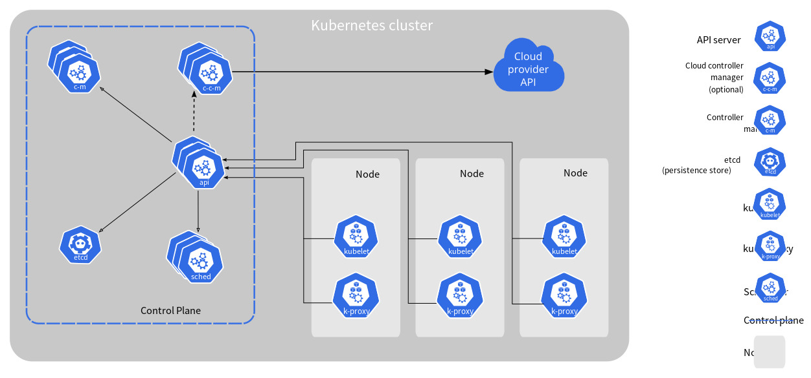

# [1/2] Kubernetes (minikube, 쿠버네티스의 구성요소)

## minikube 설치 및 실행

```bash
# install
brew install minikube

# start
minikube start

# minikube 실행 확인
minikube dashboard

# 3개의 노드로 구성된 k8s 서버 생성
minikube start --nodes 3 -p k8s-demo

# 노드들 확인
kubectl get nodes -o wide
```

- kubectl : 파드를 생성하고 조회하고 삭제하는 등의 쿠버네티스 명령어 실행 도구

## 쿠버네티스의 구성요소



### 클러스터

- 쿠버네티스 내 가장 큰 단위
- 가상 서버들이 속한 클라우드
- 마스터 노드와 워커 노드를 포함하는 것

### 노드

- 클러스터 내 가상 서버
- 컴퓨팅 엔진 단위
- 마스터 노드와 워커 노드로 구성되어 있음
    - 마스터 노드 : 전체 쿠버네티스 시스템을 관리 및 통제하는 쿠버네티스 컨트롤 플레인을 관장
    - 워커 노드 : 배포하고자 하는 어플리케이션의 실제 실행을 수행
- 일반적으로 3개의 마스터 노드로 구성함

### 파드

- 쿠버네티스에서 생성하고 관리할 수 있는 배포 가능한 가장 작은 컴퓨팅 단위
- 하나 이상의 컨테이너 그룹

### 컨테이너

- 어플리케이션

### 파드 vs 컨테이너

- 컨테이너가 어플리케이션의 일부를 구성하고 있는 경우
    - 여러 개의 컨테이너가 모여 하나의 파드를 구성
- 컨테이너가 완전한 어플리케이션으로 구성되어 있는 경우
    - 하나의 컨테이너로 하나의 파드 구성
