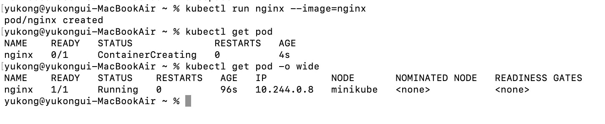
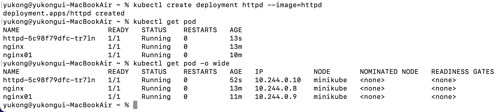
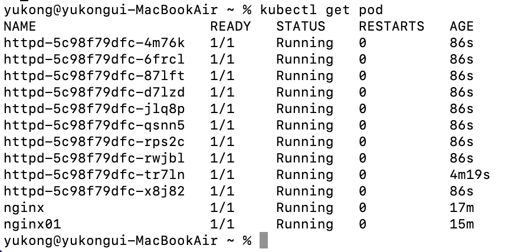
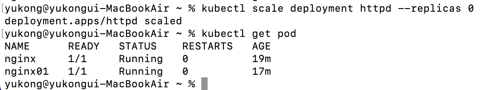
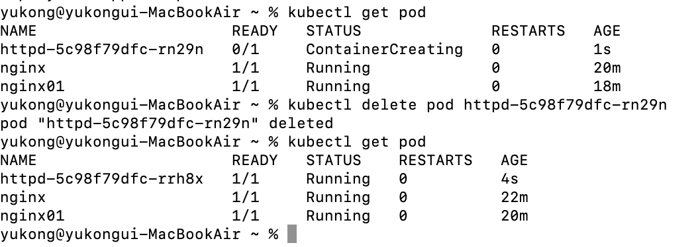
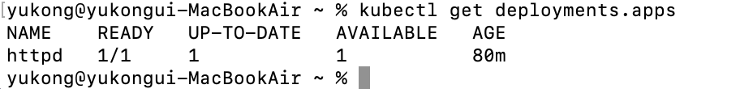
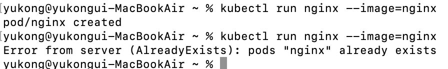
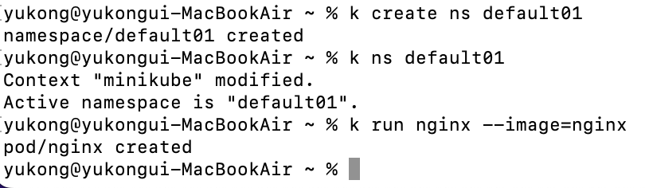

# [1/3] Kubernetes (krew, kubectl, 쿠버네티스 오브젝트, 파드, 디플로이먼트, 네임스페이스, kube-neat, YML 파일을 이용한 파드 배포, 트러블 슈팅 프로세스)

## 쿠버네티스 krew 를 이용한 플러그인 관리

- kubectl 커맨드라인 환경에서 사용 가능한 다양한 플러그인을 설치, 삭제, 조회하는 기능을 제공
- kube-ctx, kube-ns, 다양한 플러그인 등
- krew 설치 후 사용하고자 하는 플러그인 설치 과정 필요
- https://krew.sigs.k8s.io/docs/user-guide/setup/install/
- krew 플러그인 설치

    ```bash
    (
      set -x; cd "$(mktemp -d)" &&
      OS="$(uname | tr '[:upper:]' '[:lower:]')" &&
      ARCH="$(uname -m | sed -e 's/x86_64/amd64/' -e 's/\(arm\)\(64\)\?.*/\1\2/' -e 's/aarch64$/arm64/')" &&
      KREW="krew-${OS}_${ARCH}" &&
      curl -fsSLO "https://github.com/kubernetes-sigs/krew/releases/latest/download/${KREW}.tar.gz" &&
      tar zxvf "${KREW}.tar.gz" &&
      ./"${KREW}" install krew
    )
    ```

- `.zshrc` 파일에 환경 변수 추가

    ```bash
    vi ~/.zshrc
    
    export PATH="${KREW_ROOT:-$HOME/.krew}/bin:$PATH"
    
    source ~/.zshrc
    ```

- 설치 확인

    ```bash
    kubectl krew
    ```


## 자동완성 기능 설정

- https://kubernetes.io/ko/docs/tasks/tools/included/optional-kubectl-configs-zsh/
- `.zshrc` 파일에 alias 설정 추가

    ```bash
    source <(kubectl completion zsh)
    alias k=kubectl
    complete -F __start_kubectl k
    alias ka='kubectl apply --recursive -f'
    alias kgp='kubectl get pods -o wide'
    alias kgd='kubectl get deploy -o wide'
    alias kgs='kubectl get service -o wide'
    alias kgn='kubectl get nodes -o wide'
    alias kge='kubectl get events -w --field-selector type=Warning'
    alias kgv='kubectl get pvc -o wide'
    alias kgpa='kubectl get pods -o wide -A'
    alias kgpw='kubectl get pods -o wide -w'
    alias kgpaw='kubectl get pods -o wide -A -w'
    
    alias krn='kubectl run nginx --image=nginx --restart=Never'
    alias kcn='kubectl create deployment nginx --image=nginx'
    alias krb='kubectl run busybox --image=busybox --restart=Never -- sleep 1d'
    ```


## kubectl 주요 명령어

- 명령어를 이용하여 쿠버네티스 오브젝트를 생성하고 생성한 리스트를 확인할 수 있음
- run, create : 파드와 디플로이먼트 생성
- get, exec : 생성된 파드 현황 조회 및 파드 내 bash 스크립트 실행 (파트 접속)
- scale, delete : 파드의 수량 증가 / 감소 및 오브젝트 삭제
- create namespace : 네임스페이스 생성

## 쿠버네티스 오브젝트

- 쿠버네티스 API 서버로 생성하는 영속성을 가지는 모든 실체
- 어플리케이션을 실행하고 어플리케이션에 필요한 추가 리소스를 지정하고 고가용성 관련 설정
- 모든 쿠버네티스 작업은 다양한 오브젝트와 해당 오브젝트 옵션의 조합으로 실행됨
- 파드, 디플로이먼트, 네임스페이스 등
    - 파드(pod) : 쿠버네티스 환경에서 컨테이너 어플리케이션을 실행하는 기본 단위
    - 디플로이먼트(deployment) : 파드가 배포되는 방법을 정의하는 오브젝트
        - 파드의 개수, 이미지 종류, 배포 방법 등을 정의
    - 네임스페이스(namespace) : 클러스터를 구분하는 가상 클러스터 단위

## Nginx 파드 실행 실습

- 실습을 시작하기 전에 미니큐브 실행 필요 (minikube start)
- nginx 컨테이너 이미지를 갖는 파드 생성

    ```bash
    kubectl run nginx --image=nginx
    ```

    ```bash
    kubectl run {파드 이름} --image={컨테이너 이미지}
    ```

- 생성된 파드 조회

    ```bash
    kubectl get pod
    ```

    ```bash
    kubectl get {쿠버네티스 오브젝트}
    ```

  

- 이처럼 파드는 고유의 IP 주소를 가짐
- 또한 각 파드는 각각 고유의 볼륨(데이터)을 사용함
- 생성한 파드에 접속
    - 파드 접속 == 배시(bash) 를 실행(exec) 하는 것과 동일

    ```bash
    kubectl exec -it nginx -- bash
    ```

    ```bash
    kubectl exec -it {파드 이름} -- bash
    ```

- 생성한 파드 삭제

    ```bash
    kubectl delete pod nginx nginx01
    ```

    ```bash
    kubectl delete pod {파드 이름1} {파드 이름2} ...
    ```


## 디플로이먼트의 파드 개수 변경과 삭제 실습

- 디플로이먼트 생성

    ```bash
    kubectl create deployment httpd --image=httpd
    ```

    ```bash
    kubectl create deployment {디플로이먼트 이름} --image={이미지 이름}
    ```

  

    - 디플로이먼트 = 디플로이먼트 이름 + 임의 해쉬값
- 파드 개수 변경

    ```bash
    kubectl scale deployment httpd --replicas 10
    ```

    ```bash
    kubectl scale deployment {디플로이먼트 이름} --replicas {개수}
    ```

  

    - 실시간으로 관리되고 있는 파드의 개수를 조회하고 싶은 경우 w 옵션 추가
- 파드 개수 변경
    - 동일하게 파드 설정 명령어를 이용하여 변경하고 싶은 개수로 설정함

  

- 파드 삭제

    ```bash
    kubectl delete pod httpd-5c98f79dfc-rn29n
    ```

    ```bash
    kubectl delete pod {삭제할 파드 이름}
    ```

  

    - 지정한 파드는 삭제되었으나 파드 목록을 조회하면 새로운 파드가 생성되어 실행중
    - 쿠버네티스는 항상 의도한 상태를 자동으로 유지하기 때문에 지정한 개수만큼의 파드를 유지함 (자동 복구)
- 디플로이먼트에서 현재 지정한 파드 수량과 실행 중인 파드 수량 조회

    ```bash
    kubectl get deployments.apps
    ```

  

- 디플로이먼트 삭제

    ```bash
    kubectl delete deployments.app httpd
    ```

    ```bash
    kubectl delete deployments.app {디플로이먼트 이름}
    ```


## 네임스페이스 생성

- **현업에서는 네임스페이스를 주로 어플리케이션을 구분하는 단위로 사용**
- **또한 네임스페이스간 접근 권한을 설정할 수 있기 때문에 담당자 별로 권한을 제한할 때 구분하는 단위로 주로 사용**
- 같은 네임스페이스 내에서는 같은 이름의 오브젝트 생성 불가능

    ```bash
    kubectl run nginx --image=nginx
    kubectl run nginx --image=nginx # 에러 발생
    ```

  

- 네임스페이스가 다르면 같은 이름의 오브젝트를 생성할 수 있음

    ```bash
    # 네임스페이스 생성
    kubectl create ns default01
    
    # 현재 네임스페이스 변경
    kubectl ns default01
    
    # 파드 생성
    kubectl run nginx --image=nginx
    ```

    - 네임스페이스를 사용하기 위해서는 ns 설치 필요

        ```bash
        kubectl krew install ns
        ```


  


## YAML 파일 export 플러그인 kube-neat 설치

- 실무에서는 현재 실행 중인 상세 설정을 YAML 파일로 확인하는 경우가 있음
- 다만 아래 명령어를 사용하여 YAML 파일 조회 시 불필요한 status 정보까지 포함되어 조회됨

    ```bash
    k get pod busybox -o yaml
    ```

- kube-neat 플러그인은 익스포트된 YAML 파일에서 불필요한 정보를 제거함
- kube-neat 을 사용하면 가독성이 향상되어 익스포트한 YAML 파일을 재사용하기 쉬움

    ```bash
    k krew install neat
    ```

- kube-neat 플러그인을 포함하여 YAML 파일을 조회할 때 아래와 같이 옵션을 추가

    ```bash
    k get pod busybox -o yaml|k neat
    ```


## YAML 파일을 이용한 파드 배포

- 실행중인 파드의 정보를 yml 파일로 추출하여 수정 후 재사용 가능

    ```bash
    k get pod busybox -o yaml|k neat > busybox-pod.yml
    ```

- 이전에 생성한 파드 삭제 후 yml 파일을 이용하여 재생성

    ```bash
    # 이전에 존재하던 파드 삭제
    k delete pod busybox
    
    # 수정한 yml 파일을 이용하여 파드 재생성
    k apply -f busybox-pod.yml
    
    # 파드 목록 조회 > 새로 생성한 파드 존재
    k get pod -o wide
    NAME      READY   STATUS    RESTARTS   AGE   IP            NODE       NOMINATED NODE   READINESS GATES
    busybox   1/1     Running   0          8s    10.244.0.25   minikube   <none>           <none>
    ```


## 쿠버네티스 yaml 파일 예시

- https://kubernetes.io/docs/concepts/services-networking/service/

```yaml
apiVersion: v1
kind: Service
metadata:
  name: my-service
spec:
  selector:
    app.kubernetes.io/name: MyApp
  ports:
    - protocol: TCP
      port: 80
      targetPort: 9376
```

- yaml 파일을 관리할 때에는 네이밍 규칙이 존재하면 좋음
    - {앱 이름}-{옵션}-{오브젝트 이름}.yml

## 쿠버네티스 트러블 슈팅의 기본 프로세스

```yaml
apply -> get -> describe -> logs -> get event
```

1. `apply` : 원하는 파드 생성

    ```yaml
    yukong@yukongui-MacBookAir ~ % k apply -f https://raw.githubusercontent.com/wikibook/kubepractice/main/ch05/nginx-error-pod.yml
    pod/nginx-19 created
    ```

2. `get` : 생성된 오브젝트 status 확인
    - ImagePullBackOff : 이미지를 가져오는데(pull) 실패함

    ```yaml
    yukong@yukongui-MacBookAir ~ % k get pod -o wide
    NAME       READY   STATUS             RESTARTS   AGE    IP            NODE       NOMINATED NODE   READINESS GATES
    nginx-19   0/1     ImagePullBackOff   0          8s     10.244.0.27   minikube   <none>           <none>
    ```

3. `describe` : 오브젝트 상세정보 조회
    - apply 시 사용한 **yml 파일**에서 잘못됐을 경우 describe 로 오류를 찾아낼 수 있음

    ```yaml
    yukong@yukongui-MacBookAir ~ % k describe pod nginx-19
    (생략)
        Image:          nginx:1.19.19
    (생략)
    Events:
      Type     Reason          Age                    From               Message
      ----     ------          ----                   ----               -------
      Normal   Scheduled       6m53s                  default-scheduler  Successfully assigned default01/nginx-19 to minikube
      Normal   SandboxChanged  6m49s                  kubelet            Pod sandbox changed, it will be killed and re-created.
      Normal   Pulling         5m24s (x4 over 6m53s)  kubelet            Pulling image "nginx:1.19.19"
      Warning  Failed          5m21s (x4 over 6m50s)  kubelet            Failed to pull image "nginx:1.19.19": Error response from daemon: manifest for nginx:1.19.19 not found: manifest unknown: manifest unknown
      Warning  Failed          5m21s (x4 over 6m50s)  kubelet            Error: ErrImagePull
      Warning  Failed          5m6s (x6 over 6m49s)   kubelet            Error: ImagePullBackOff
      Normal   BackOff         104s (x21 over 6m49s)  kubelet            Back-off pulling image "nginx:1.19.19"
    ```

4. `logs` : 파드 로그 확인
    - yml 파일이 아닌 **어플리케이션** 자체에서 문제가 있을 경우 오류 로그를 확인해야 함
    - 어플리케이션에 직접 접근해서 각각의 로그를 찾아야 하는 가상 머신과는 달리 쿠버네티스는 하나의 명령어로 모든 오브젝트에 대한 로그를 추적할 수 있음

    ```yaml
    # 올바른 yml 파일로 파드 재생성
    yukong@yukongui-MacBookAir ~ % k apply -f nginx-modify-pod.yml 
    pod/nginx-19 created
    
    # 생성 성공 확인
    yukong@yukongui-MacBookAir ~ % kgp
    NAME       READY   STATUS              RESTARTS   AGE    IP            NODE       NOMINATED NODE   READINESS GATES
    nginx-19   0/1     Running             0          6s     <none>        minikube   <none>           <none>
    
    yukong@yukongui-MacBookAir ~ % k logs -f nginx-19
    /docker-entrypoint.sh: /docker-entrypoint.d/ is not empty, will attempt to perform configuration
    /docker-entrypoint.sh: Looking for shell scripts in /docker-entrypoint.d/
    /docker-entrypoint.sh: Launching /docker-entrypoint.d/10-listen-on-ipv6-by-default.sh
    10-listen-on-ipv6-by-default.sh: info: Getting the checksum of /etc/nginx/conf.d/default.conf
    10-listen-on-ipv6-by-default.sh: info: Enabled listen on IPv6 in /etc/nginx/conf.d/default.conf
    /docker-entrypoint.sh: Launching /docker-entrypoint.d/20-envsubst-on-templates.sh
    /docker-entrypoint.sh: Launching /docker-entrypoint.d/30-tune-worker-processes.sh
    /docker-entrypoint.sh: Configuration complete; ready for start up
    ^C
    ```

5. `get event` : 전체 클러스터 레벨의 에러 확인
    - 해당 네임스페이스와 관계된 호스트 노드, 네트워크, 스토리지 등 **클러스터** 전반의 이벤트 출력

    ```yaml
    yukong@yukongui-MacBookAir ~ % k get events
    LAST SEEN   TYPE      REASON           OBJECT         MESSAGE
    19m         Normal    Scheduled        pod/nginx-19   Successfully assigned default01/nginx-19 to minikube
    17m         Normal    Pulling          pod/nginx-19   Pulling image "nginx:1.19.19"
    17m         Warning   Failed           pod/nginx-19   Failed to pull image "nginx:1.19.19": Error response from daemon: manifest for nginx:1.19.19 not found: manifest unknown: manifest unknown
    17m         Warning   Failed           pod/nginx-19   Error: ErrImagePull
    19m         Normal    SandboxChanged   pod/nginx-19   Pod sandbox changed, it will be killed and re-created.
    9m14s       Normal    BackOff          pod/nginx-19   Back-off pulling image "nginx:1.19.19"
    17m         Warning   Failed           pod/nginx-19   Error: ImagePullBackOff
    7m48s       Normal    Scheduled        pod/nginx-19   Successfully assigned default01/nginx-19 to minikube
    7m48s       Normal    Pulling          pod/nginx-19   Pulling image "nginx:1.19"
    7m41s       Normal    Pulled           pod/nginx-19   Successfully pulled image "nginx:1.19" in 6.979s (6.979s including waiting)
    7m41s       Normal    Created          pod/nginx-19   Created container nginx-pod
    7m41s       Normal    Started          pod/nginx-19   Started container nginx-pod
    ```


## 노드 상의 에러 발생

- 쿠버네티스는 특정 노드에 문제가 발생하면 자원의 여유가 있는 다른 노드로 자동으로 이전한 후 실행
    - 항상 어플리케이션을 의도한 상태로 유지
- 쿠버네티스 환경에서는 특정 어플리케이션에 문제가 발생하면 해당 어플리케이션 파드를 종료하고 즉각 새로운 파드로 교체
    - 가상 머신 환경에서는 어플리케이션을 실행하는데 리소스가 많이 소요되어 시간이 지연됨
    - 쿠버네티스는 컨테이너 환경으로 매우 가벼워 해당 방식을 선택함
