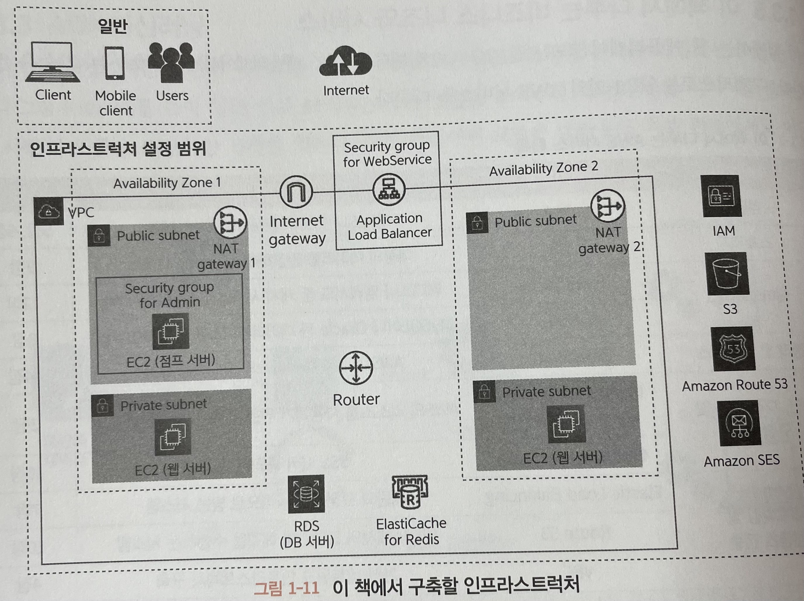

# [12/18] AWS (온프레미스, 클라우드, X as a Service)

- infrastructure : 어플리케이션 / 서비스를 구축하고 운영하는 환경
- 개발한 어플리케이션을 인프라스트럭처 위에 배포함

## 클라우드

- 인터넷 등 네트워크를 통해 서버, 스토리지, 네트워크와 같은 컴퓨터 리소스를 서비스로 제공하는 비즈니스
- 온프레미스 방식 : 필요한 컴퓨터 리소스를 직접 구매하고 관리하는 방식
- 임대 : 컴퓨터 리소스를 빌려주는 기업과 계약을 맺고 필요한 만큼 컴퓨터 리소스를 빌리는 방식
- 클라우드 : 브라우저 기반의 관리 화면을 통해 임대 계약 처리

## X as a Service

- IaaS(Infrascructure as a Service) : 서버나 네트워크를 임대 형식과 마찬가지로 서비스 제공
    - 구축된 서버에 OS 나 미들웨어를 설치하거나 네트워크를 설정하는 등의 작업은 클라우드 이용자가 직접 수행
    - AWS 초기에 제공하던 형태
    - **인프라스트럭처** - OS - 미들웨어 - 어플리케이션
- PaaS(Platform as a Service) : 어플리케이션을 작동하는 데 필요한 플랫폼(웹 서버, 데이터베이스 등) 자체를 서비스로 제공
    - 클라우드 이용자는 해당 플랫폼에서 작동하는 어플리케이션만 작성해서 배포
    - 서버에 배치를 할당하거나 데이터베이스 백업을 하는 등 인프라스트럭처 운영 범주에 포함되는 작업은 클라우드 제공자가 담당
    - **인프라스트럭처** - **OS** - **미들웨어** - 어플리케이션
- SaaS(Software as a Service) : 클라우드 제공자가 전용 어플리케이션까지 제공
    - 클라우드 이용자는 어플리케이션이 제공하는 서비스에 대한 대가만 지불
    - **인프라스트럭처** - **OS** - **미들웨어** - **어플리케이션**

