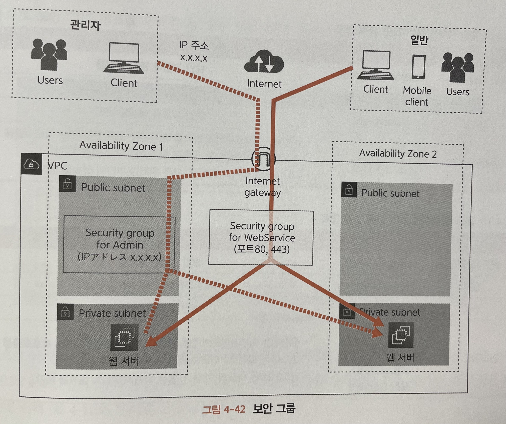

# [12/19] AWS (VPC, 서브넷, 게이트웨이, 라우팅 테이블, 보안그룹, 점프 서버)

## VPC (Virtual Private Cloud)

- 서버 환경을 직접 구축하지 않고 사용할 수 있는 가상의 private 네트워크
- AWS 의 데이터센터에 있는 전용 기기에서 서버나 네트워크 장비가 가진 기능을 에뮬레이션하는 소프트웨어를 작동
- 물리적인 기기를 이용하지 않고 가상의 네트워크 구축 가능

### IPv4 CIDR 블록

- VPC 에서 사용하는 프라이빗 네트워크용 IP 주소의 범위
    - 24 비트 블록 : 10.0.0.0 ~ 10.255.255.255
    - 20 비트 블록 : 172.16.0.0 ~ 172.31.255.255
    - 16 비트 블록 : 192.168.0.0 ~ 192.168.255.255
- VPC 로 지정할 수 있는 서브넷 마스크는 최대 16비트

## 서브넷 (Subnet)

- VPC 의 IP 주소 범위를 나누는 단위

### 역할에 따라 분리

- 리소스가 담당하는 역할에 따라 분리
- 예를 들어, 로드밸런싱을 도입했을 때 로드밸런서는 외부에서 접근 가능해야 하며 하위 서버들은 외부 접근을 허용하지 말아야 함
- public/private 을 기준으로 서브넷을 분리할 경우 리소스가 포함된 그룹 전체에 대해 할당하면 설정 누락 등을 피할 수 있음

### 기기에 따라 분리

- AWS 안에서 물리적인 이중화(다중화)를 수행
- 내결함성을 줄이기 위해 분리
    - 내결함성 : 하드웨어 고장 등 예측할 수 없는 사태가 발생했을 때 **시스템 자체를 사용하지 못하게 되는 것을 방지하는 능력**
- 클라우드라도 최종적으로는 물리적으로 존재하는 서버이기 때문에 기기에 고장이 발생할 경우 서브넷 안의 리소스를 이용할 수 없게됨
- **가용영역(availability zone, 각 리전 안의 여러 독립된 위치)별로 서브넷을 제공하면 여러 서브넷을 동시에 이용하지 못하는 경우를 방지할 수 있음**

## IPv4 CIDR 설계 방법

- AWS 에서 제공하는 VPC 스펙은 최대 3개, 16비트임
- 남은 16비트 내에서 서브넷과 리소스를 적절히 분배하여 사용해야 함
- 설계할 때 고려해야 하는 두 가지는 트레이드 오프 관계임
    - 생성할 서브넷의 수
    - 서브넷 안에 생성할 리소스 수

- 서브넷 4비트를 사용할 경우 아래와 같이 설계할 수 있음
- 최대 16개 중에서 4개의 서브넷 사용

## 인터넷 게이트웨이

- VPC 에서 생성된 네트워크와 인터넷 사이의 통신을 가능하게 하는 것

## NAT 게이트웨이 (Network Address Translation Gateway)

- 인터넷 게이트웨이의 경우 VPC 내 모든 경로로 접근 가능 → private 설정이 어려움
- NAT : 네트워크 주소 변환 시스템
- NAT 게이트웨이는 퍼블릭 서브넷에 대해 생성됨
- 여러개의 NAT 게이트웨이를 생성하여 이중성을 확보할 수 있음
- NAT 게이트웨이는 퍼블릭 서브넷에 생성함
- 가정집에서는 공유기가 NAT 게이트웨이 역할을 수행함
- AWS 에서 NAT 게이트웨이는 무료로 제공하지 않아 EC2 를 이용하여 NAT 인스턴스로 대체할 수 있음

## 라우팅 테이블

- 현재까지의 구조는 리소스를 생성할 장소를 준비했을 뿐 통신 경로가 설정되어 있지 않음
- 어느 지점으로 왔을 때 어느 리소스에 접근할 것인지에 대해 정의하는 테이블 (라우팅 테이블)
- 모든 서브넷에 대해 라우팅 테이블을 정의해야 함
    - 여러 서브넷이 같은 라우팅 테이블을 공유할 수도 있음
- 퍼블릭 서브넷에서는 게이트웨이를 공유하고, 프라이빗 서브넷에서는 분리할 경우

  

## 보안그룹

- 외부로부터의 접근에 대해 제한을 설정하는 방식
- 인바운드 포트를 설정할 경우 외부에서 접근하는 서비스에 대한 접근을 제한
- 아웃바운드 포트를 설정할 경우 현재 서버에서 외부 서버에 대한 서비스 접근을 제한
- 인바운드 IP 를 설정할 경우 외부에서 접근하는 네트워크에 대한 접근을 제한
- 아웃바운드 IP 를 설정할 경우 현재 서버에서 외부 네트워크에 대한 접근을 제한

## 점프 서버

- 모든 리소스에 접속할 수 있는 입구 역할을 하는 서버 (보통 EC2 로 구축)
    - EC2 는 가상 서버로, CPU, 메모리, 디스크 등이 제공되며 리눅스나 윈도우 등의 OS 를 설치할 수 있음
- 점프 서버를 이용하여 외부에서 접근하는 요청에 대해 필터링하는 역할
    - 보안 그룹 등을 이용하여 외부 접근을 제한할 수 있으나,
    - 점프 서버를 이용할 경우 보안 그룹 미설정에 대한 대비를 미리 해둘 수 있음
