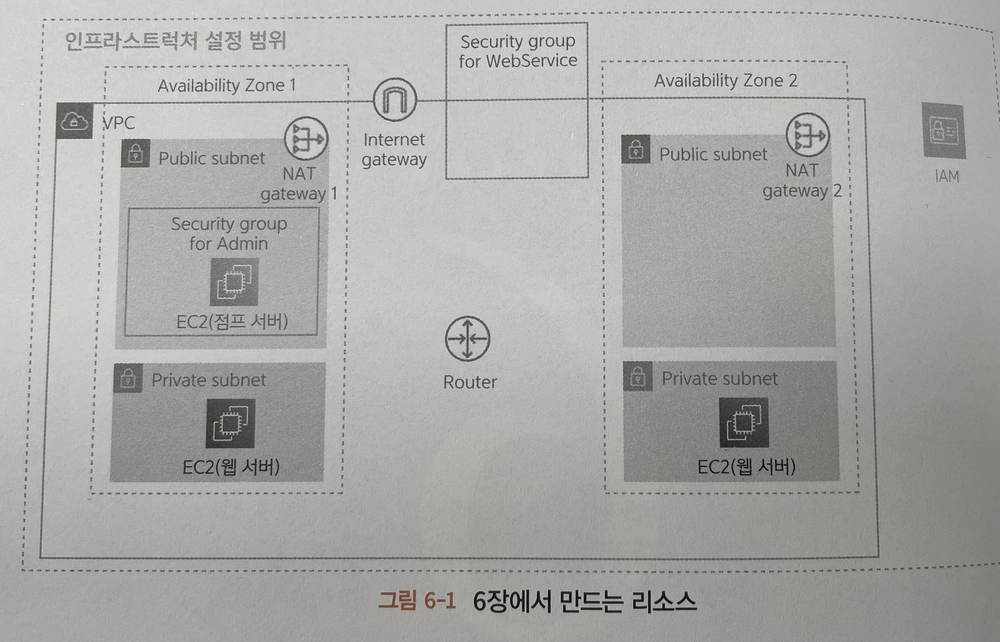
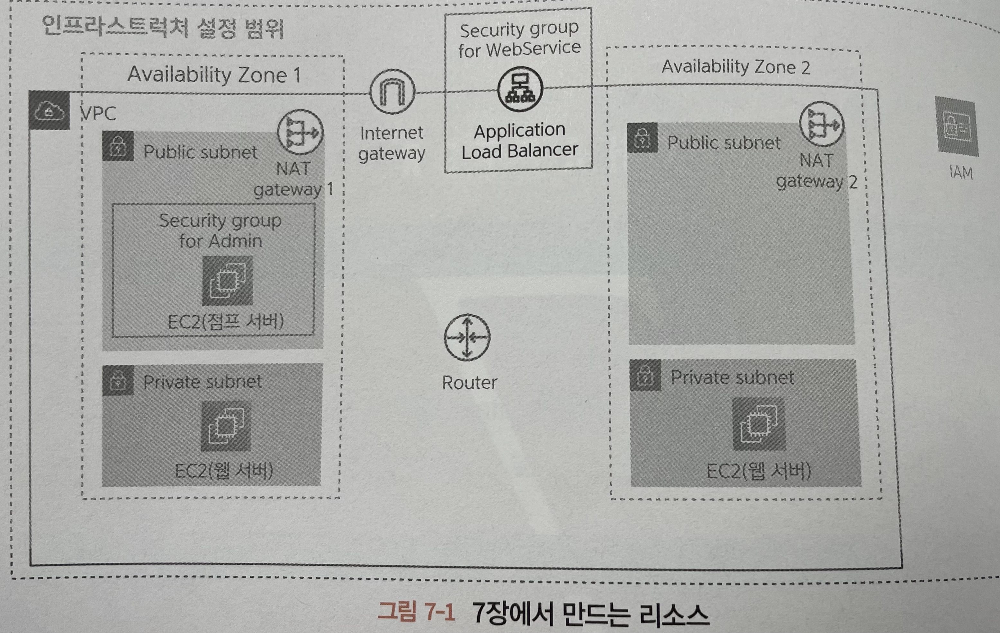

# [12/20] AWS (웹 서버, 로드 밸런서)

## 웹 서버 (Web Server)

- 브라우저나 어플리케이션으로 부터 요청을 받아서 HTML 이나 JSON 등의 응답을 반환하는 역할
- 저장되어 있는 HTML 을 직접 반환하거나 PHP 나 루비 등으로 만들어진 프로그램의 실행 결과를 반환하기도 함

### 웹 서버 vs 점프 서버

- 점프 서버는 시스템 관리자가 가끔 이용
- 웹 서버는 웹 서비스 사용자가 항상 연결을 시도
- 점프 서버는 인터넷에서 직접 연결
- 웹 서버는 로드밸런서를 통해 간접 연결

| 항목           | 점프 서버       | 웹 서버             |
|--------------|-------------|------------------|
| 인스턴스 유형      | 최소 성능       | 이용자 수에 맞게 적절한 성능 |
| 서브넷          | 퍼블릭 서브넷     | 프라이빗 서브넷         |
| 퍼블릭 IP 자동 할당 | 필요          | 불필요              |
| 보안 그룹        | 기본 + SSH 접속 | 기본 (default)     |

## 로드 밸런서 (Load Balancer)

- 제공하는 서비스에 요청이 많아질 경우 웹 서버에게 가해지는 부하를 줄이기 위해 웹 서버의 대수를 늘릴 수 있음 (스케일 아웃)
- 증가한 웹 서버로의 요청을 연결하는 주체를 로드 밸런서라고 함

## 로드 밸런서의 역할

- 요청 분산 : 인터넷으로부터 전송된 요청을 여러 웹 서버에 균등하게 분산하는 것
- SSL(Secure Sockets Layer) 처리 : 정보를 안전하게 보내기 위해 HTTPS 프로토콜로 통신 수행 (SSL 통신)
- 부정 요청 대응 : 외부로부터 들어온 요청을 선별

## AWS 에서 제공하는 로드 밸런서 (Elastic Load Balancing)

### Application Load Balancer (ALB)

- HTTP 나 HTTPS 를 이용한 접근을 분산하는데 최적화된 로드 밸런서
- SSL 처리를 수행하거나 URL 패턴과 같은 복잡한 조건에서 분산 대상지를 바꾸는 등의 고도의 기능을 제공

### Network Load Balancer

- 기본적인 분산 처리 기능만을 제공하지만, 다양한 통신 프로토콜에 대응하는 로드 밸런서
- 실시간 게임 등에서 양방향 통신을 구현할 때 쓰이는 소켓 통신 등을 분산할 때 이용

### Classic Load Balancer

- ALB 나 Network Load Balancer 가 등장하기 전에 쓰이던 예전의 로드 밸런서
- 기존의 AWS 시스템을 사용해야 하는 특별한 경우가 아닌 이상 사용하지 않음

## 로드 밸런서를 이용한 요청 라우팅

- 웹 어플리케이션을 인터넷에 공개할 때는 보통 HTTP(80) 나 HTTPS(443) 을 이용
- 다만 로드 밸런서 내부의 웹 서버는 반드시 이 설정을 맞출 필요는 없음
- 실제로는 HTTP 라는 조건을 이용해 다른 포트로 조건 로드밸런서로부터 요청을 받음
- 공개한 프로토콜과 포트 번호의 조합을, 내부의 웹 서버가 받는 프로토콜과 포트 번호로 변환하는 기능을 제공 (request routing, 요청 라우팅)
- HTTPS 를 HTTP 로 변환하는 이유는 HTTPS 를 이용한 통신의 암호 및 복호 처리를 웹 서버가 아니라 로드 밸런서에서 수행하기 때문
- 또한 웹 서버의 부하를 줄이거나 인증서 등의 비용을 줄일  수 있음
- 포트 번호는 웹 서버의 보안을 높이기 위해서 변환
    - 리눅스 등의 OS 에서는 0~1023 포트 번호는 강력한 권한을 가진 사용자로 프로그램을 작동해야 함

