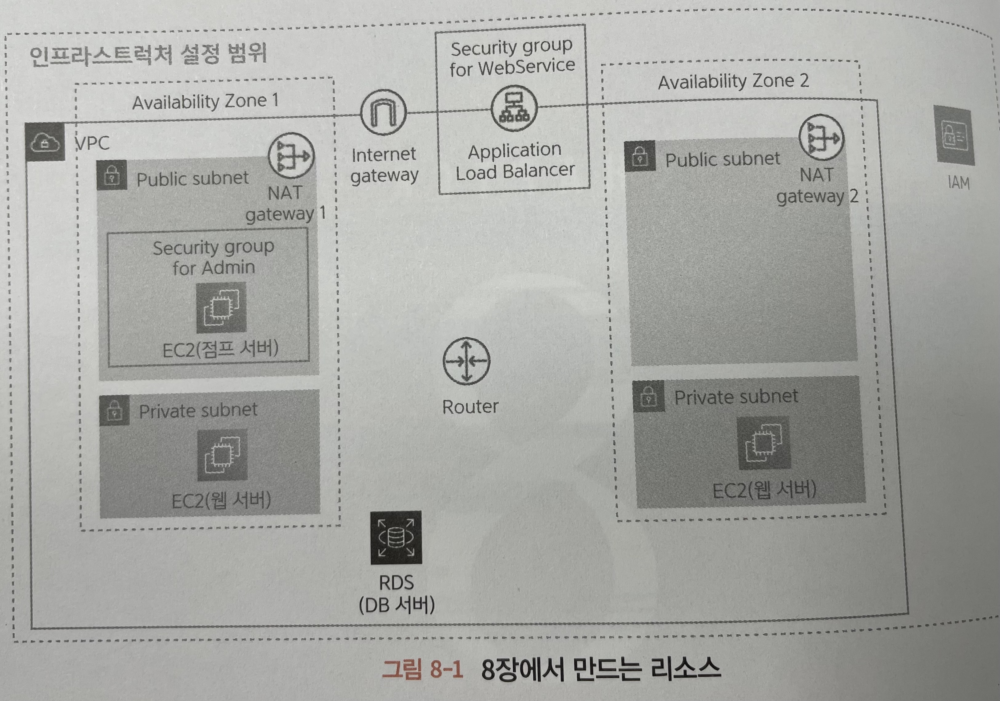
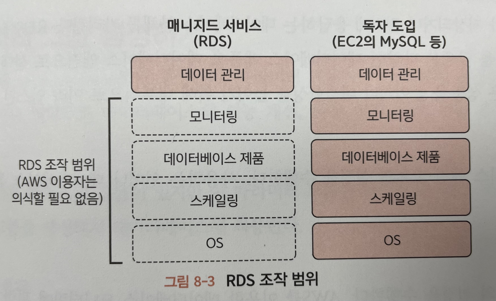
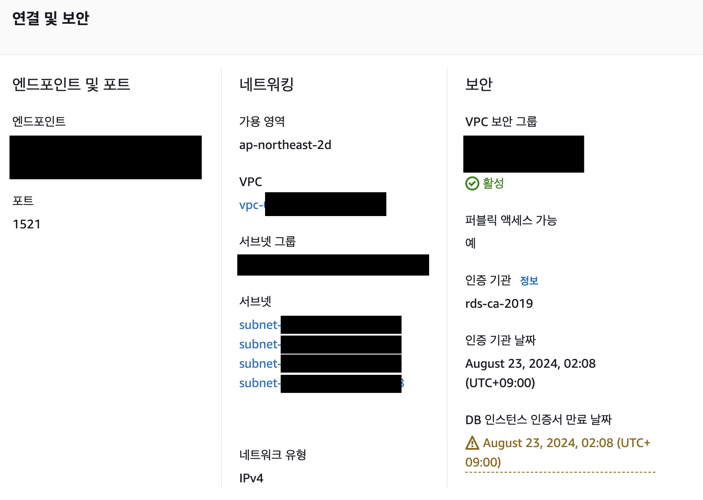
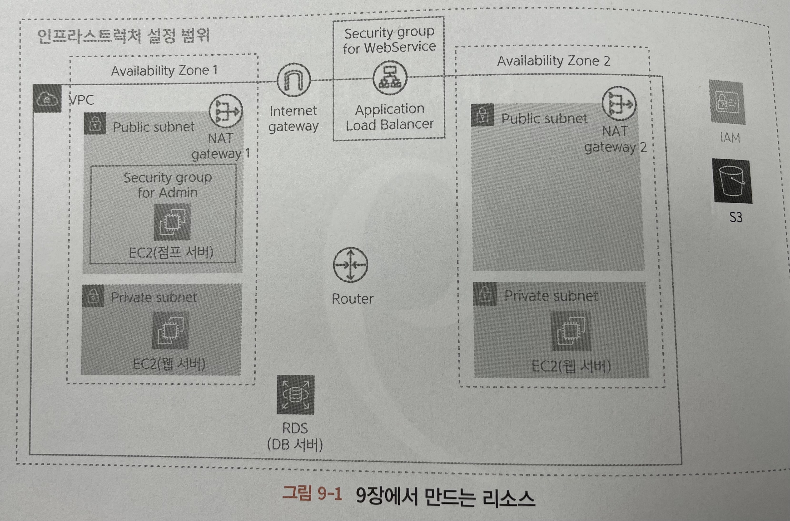
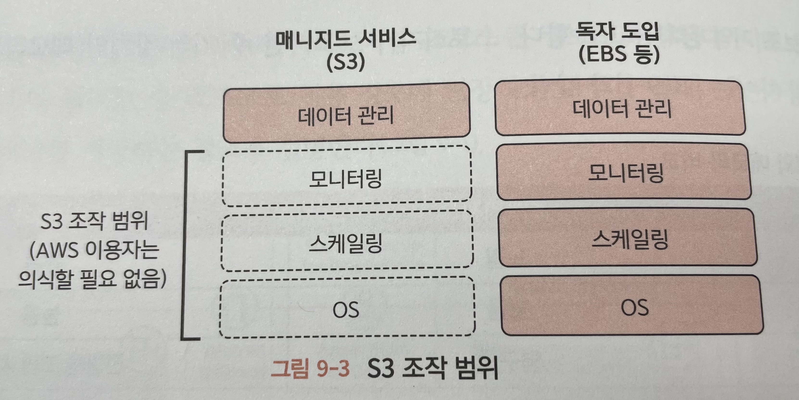
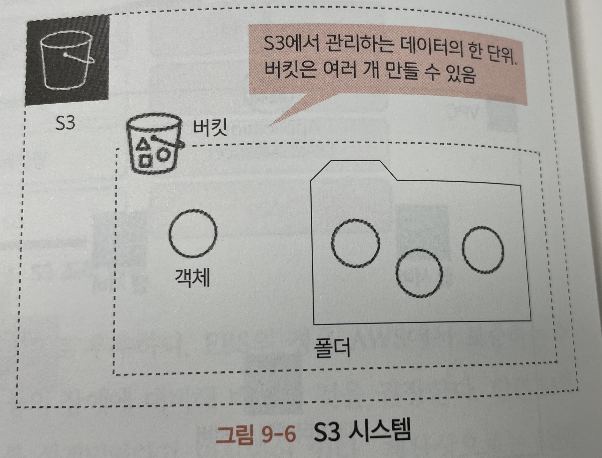

# [12/21] AWS (RDS, S3)

## 데이터베이스 서버

- 관계형 데이터베이스 제품은 리눅스나 윈도우 등의 OS 가 작동하는 서버 상에 설치하여 작동하는 프로그램으로 제공됨
- EC2 로 생성한 서버에 이 제품들을 설치해서 데이터베이스 서버로 제공할 수도 있음
- 하지만 EC2 위에 데이터베이스를 설치하여 사용할 경우
    - 직접 설치하는 과정이 필요함
    - EC2 의 OS 자체를 관리해야 함 (보안 대책 등)
    - 예측하지 못한 장애 발생에 대응할 준비 필요
- AWS 에는 관계형 데이터베이스용 서버 RDS 를 제공함
- AWS 에서는 이와 같이 작동하는 서버나 OS 를 의식하지 않고 필요한 서비스를 구축할 수 있는 시스템을 매니지드 서비스라고 부름
    - 검색 엔진, 캐시 서버 등

## RDS 시스템

### 데이터베이스 엔진

- 실제로 데이터가 저장되거나 질의에 응답하는 데이터베이스 본체
- 성능을 높이거나 내결함성을 높이기 위해 내부적으로 여러 인스턴스로 구성됨

### 파라미터 그룹

- 데이터베이스 엔진 고유의 설정
    - 사용하는 언어, 데이터베이스 튜닝 등
    - 데이터베이스의 성능 개선, 사용 현황 파악, 기능 추가 등

### 옵션 그룹

- RDS 고유의 설정
    - AWS 를 이용한 데이터베이스 모니터링에 관한 설정 등

### 서브넷 그룹

- 데이터베이스 서버를 여러 개의 가용 영역에 분산 배치할 때 이용되는 설정
- 여러 데이터베이스 서버를 분산시켜 제공할 수 있는 서브넷들을 서브넷 그룹으로 설정

## S3 (Amazon Simple Storage Service)

- EC2 인스턴스는 SSD 나 하드 디스크에 해당하는 스토리지를 제공
- EBS(Amazon Elastic Block Store)
- EBS 를 스토리지로 사용할 경우
    - EC2 인스턴스의 OS 자체도 관리해야 함 (보안 대응 등)
    - 예측하지 못한 장애 발생 시 대응이 필요한 경우에 대한 준비 필요
    - EC2 인스턴스를 사용하지 못할 가능성이 있음 (SLA 에 의하면 1년에 5분 정도 정지될 가능성 존재)
- 스토리지 관리를 수행하는 매니지드 서비스

- S3 는 내결함성과 비용 측면에서 EBS 보다 압도적으로 우수
    - EBS 의 경우 AWS 에서 보증하는 수치가 없음
    - AWS 는 EBS 가 작동하는 하드웨어 등의 장애에 대비해 백업할 것을 권장
    - S3 의 경우 내구성 99.99999999% 를 달성하도록 설계되었다고 명시

### S3 와 VPC 의 관계

- 인터넷으로부터 직접 접근
- VPC 로부터 접근
    - VPC 안의 리소스로부터 접근할 때는 S3 버킷에 대한 접근 권한이 필요

### S3 시스템

- 버킷(Bucket) : S3 에서 관리하는 데이터를 하나로 모든 단위
- 객체(Object) : 버킷에 저장하고자 하는 데이터 파일 (텍스트, 이미지, 음성, 동영상 등)
