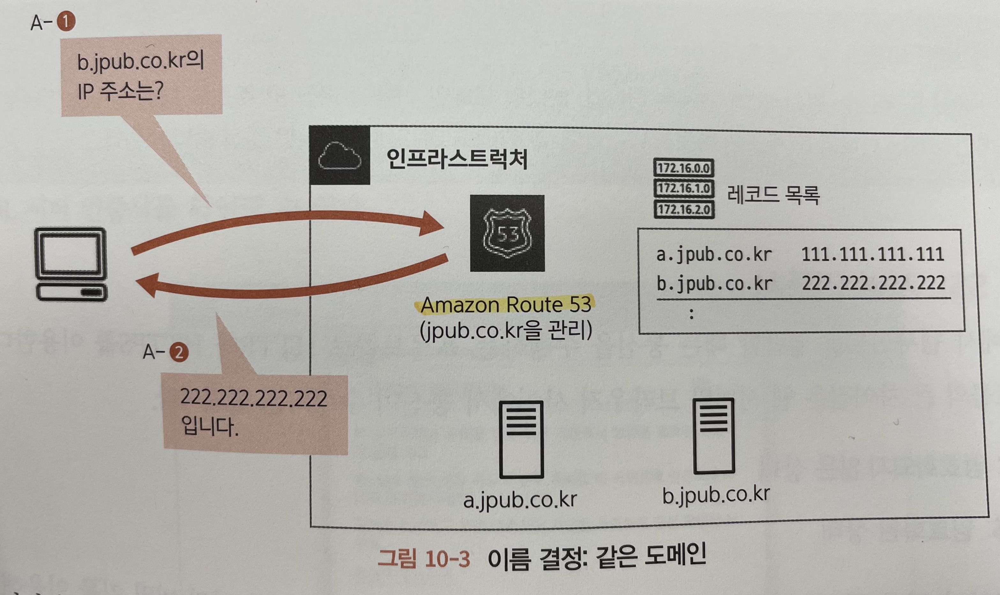
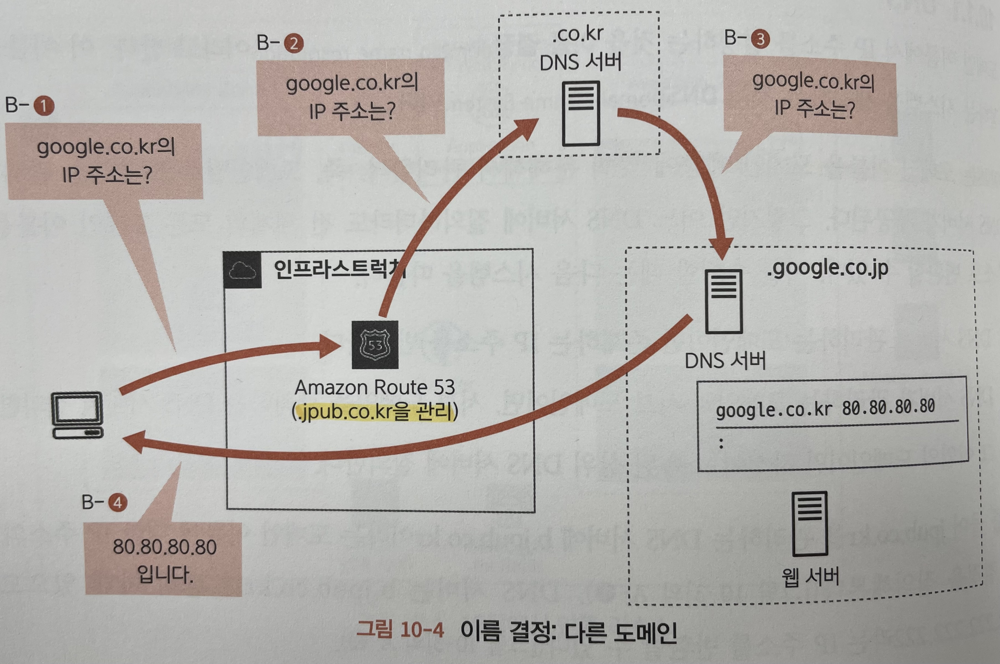
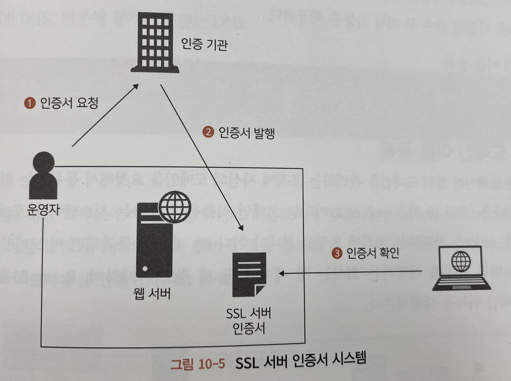
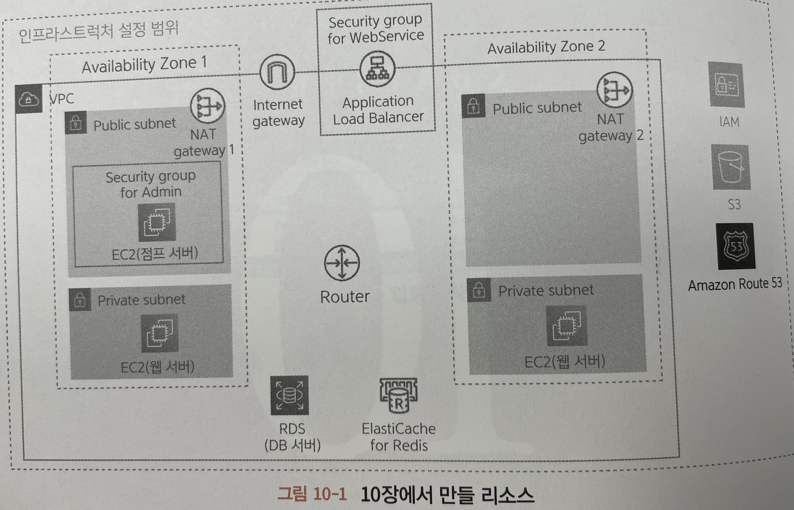
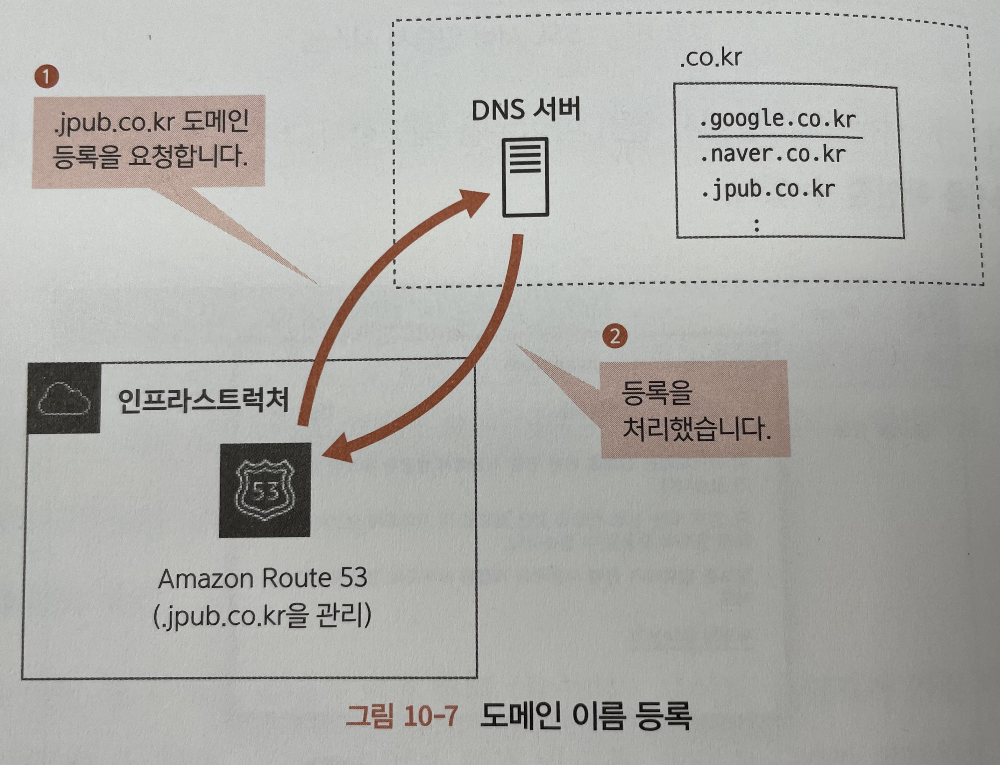
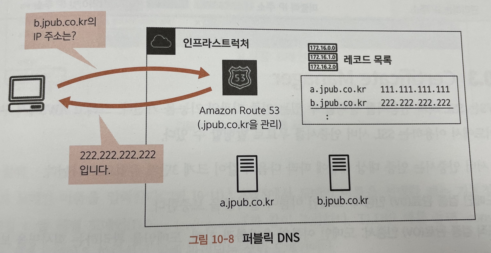
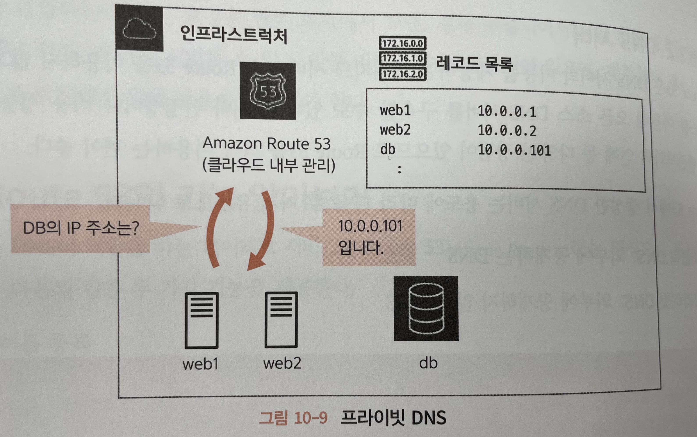
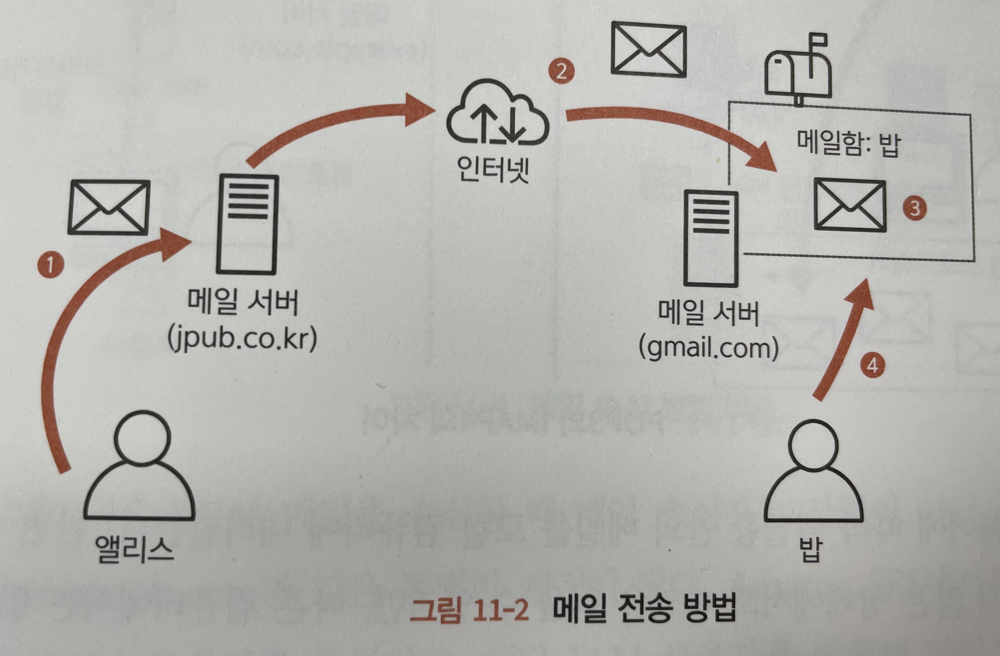
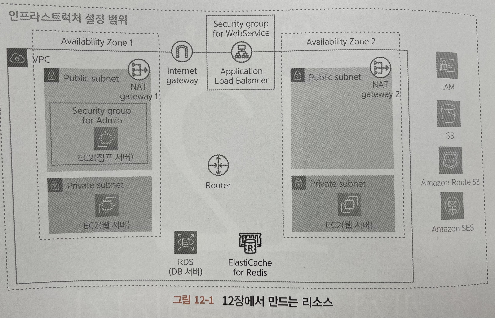
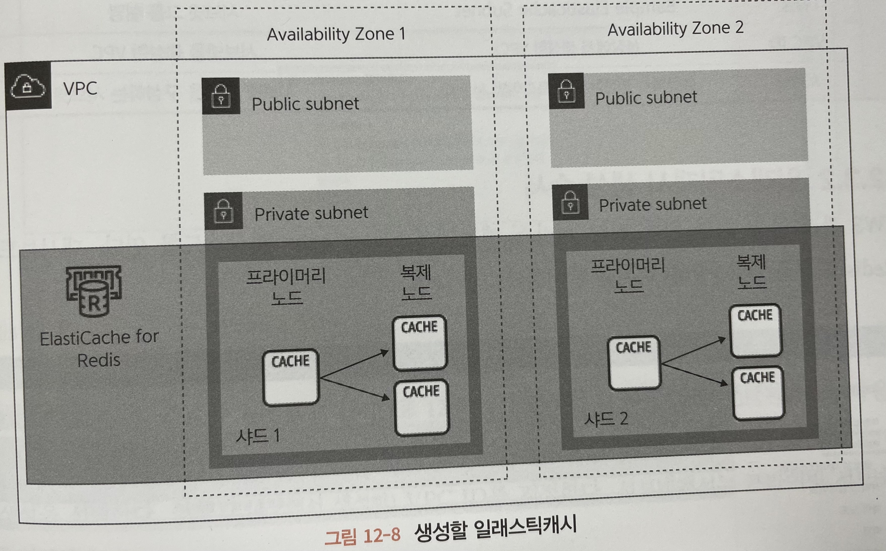

# [12/22] AWS (DNS, HTTPS, ACM, Route 53, Amazon SES, 캐시 서버)

## DNS (Domain Name System)

- DNS 는 도메인 이름을 도메인 계층에 맞춰 분해해서 관리함
- 어느 DNS 서버에 질의하더라도 전 세계의 모든 도메인 이름을 IP 주소로 변환할 수 있음
    - DNS 서버가 관리하는 도메인이면 존재하는 IP 주소를 반환
    - DNS 서버가 관리하는 도메인의 서브 도메인이면, 서브 도메인을 관리하는 DNS 서버에 질의
    - 그 외의 도메인이면 자신이 소속된 상위 DNS 서버에 질의
- jpub.co.kr 을 관리하는 도메인 서버에게 질의했을 경우
    - 하위 도메인 b.jpub.co.kr 을 관리하는 서브 도메인 서버에게 질의

- 다루지 않는 도메인 주소를 질의했을 경우
    - 본인의 상위 도메인인 co.kr 에게 질의
    - 해당 서버의 하위 도메인에게 질의하여 응답

## SSL 서버 인증서

- https://aws.amazon.com/ko/what-is/ssl-certificate/
- 브라우저에서 웹 사이트를 열람할 때는 통신을 수행하는 프로토콜로 HTTP 와 HTTPS 를 이용
    - HTTP : 암호화되지 않은 상태
    - HTTPS : 암호화된 상태
- 브라우저로부터 어떤 웹 서버로 보내진 암호화된 데이터는 사이트 운영자가 가진 비밀 키를 이용해 원래 데이터로 복구 가능
- 다만 운영자 외에 악의를 가진 누군가가 운영자로 위장한(피싱) 사이트를 구축해 데이터를 훔칠 수 있음
- SSL 서버 인증서 시스템 과정
    - 운영자는 인증 기관에 사이트 도메인을 증명하는 인증서 발급 요청
    - 인증 기관은 운영자에게 SSL 서버 인증서 발행
    - 사이트를 열람한 사람은 이 인증서를 브라우저로 확인 가능

- 인증 기관은 SSL 인증서를 통해 해당 웹 서버가 위장하지 않았음을 보장
    - 브라우저와 웹 사이트 간의 모든 통신을 암호화
    - 도메인 이름, 인증 기관, 인증 기관의 디지털 서명, 발급 날짜, 만료 날짜, 퍼블릭 키, SSL/TLS 버전
- 인증 기관은 웹 서버에 SSL/TLS 인증서를 설치하여 SSL/TLS 보안 웹 사이트를 만듬
    - 웹 브라우저의 자물쇠 아이콘 및 녹색 주소 표시줄
    - 브라우저의 웹 사이트 주소에 HTTPS 접두사 포함
    - 유효한 TLS 인증서 URL 주소 표시줄의 자물쇠 아이콘을 클릭하여 펼치면 SSL/TLS 인증서가 유효한지 확인 가능
    - 암호화된 연결이 설정되면 클라이언트와 웹 서버만 전송된 데이터를 확인할 수 있음

## SSL/TLS 인증서 기술의 주요 원칙

### 암호화

- 의도한 수신자만 암호를 복호화할 수 있도록 원본 메시지를 스크램블링하는 것
- 두 개의 서로 다른 키를 사용하여 메시지를 암호화하고 복호화하는 퍼블릭 키 암호화 기술을 사용
- 양쪽 모두가 인증 기관으로 알려진 타사를 신뢰하는 경우, PKI 는 한쪽에서 인증서를 사용하여 다른 쪽의 자격 증명을 설정할 수 있는 방법을 제공
- 인증 기관은 통신을 시작하기 전에 인증서를 검증하고 양 당사자를 모두 인증함

### 퍼블릭 키

- 브라우저와 웹 서버는 퍼블릭 키 페어와 프라이빗 키 페어를 사용하여 정보를 인코딩 및 디코딩 하는 방식으로 통신
- 퍼블릭 키는 웹 서버가 SSL/TLS 인증서를 통해 **브라우저에 제공하는 암호화 키**
- 브라우저는 웹 서버로 보내기 전에 이 키를 사용하여 정보를 암호화

### 프라이빗 키

- **웹 서버에 존재하는 키**
- 프라이빗 키로 암호화된 파일은 퍼블릭 키로만 복호화할 수 있으며 그 반대의 경우도 동일
- 해당 파일의 암호를 복호화할 수 있다는 것은 의도한 수신자와 발신자라는 것을 신뢰할 수 있음을 의미

### 인증

- 서버는 SSL/TLS 인증서를 통해 퍼블릭 키를 브라우저로 전송
- 브라우저는 신뢰할 수 있는 서드 파티의 인증서 확인
- 웹 서버의 신원을 신뢰할 수 있는지 확인할 수 있음

### 디지털 서명

- 디지털 서명은 모든 SSL/TLS 인증서에 대해 고유한 번호
- 수신자는 새 디지털 서명을 생성하고 원래 서명과 비교함으로써, 외부 당사자가 네트워크를 통해 전송되는 인증서를 조작하지 않았는지 확인

## HTTPS 동작 과정

- HTTP 는 웹 브라우저가 일반 텍스트로 된 정보를 웹 서버로 전송하는데 사용하는 프로토콜
    - 암호화되지 않은 데이터 전송
    - 브라우저에서 전송된 정보를 제3자가 가로채고 읽을 수 있음
- 브라우저는 SSL/TLS 인증서를 사용하여 **SSL/TLS 핸드셰이크를 통해 웹 서버와의 보안을 연결 시작**
    - HTTPS 통신 기술의 기능 요소 중 하나로, HTTP 와 SSL/TLS 의 조합

### SSL/TLS 핸드셰이크

- 브라우저가 SSL/TLS 보안 웹 사이트를 열고 웹 서버에 연결
- 브라우저는 식별 가능한 정보를 요청하여 웹 서버의 진위 여부를 확인하려고 시도
- 웹 서버는 공개 키가 포함된 SSL/TLS 인증서를 회신으로 보냄
- 브라우저는 SSL/TLS 인증서가 유효하고 웹 사이트 도메인과 일치하는지 확인
    - 브라우저가 SSL/TLS 인증서에 만족하면 공개 키를 사용하여 비밀 세션 키가 포함된 메시지를 암호화하고 전송
- 웹 서버는 개인 키를 사용하여 메시지를 해독하고 세션 키를 검색
    - 세션 키를 사용하여 암호화하고 브라우저에 승인 메시지를 보냄
- 이제 브라우저와 웹 서버 모두 동일한 세션 키를 사용하여 메시지를 안전하게 교환하도록 전환

### 세션 키

- 초기 SSL/TLS 인증이 완료된 후 브라우저와 웹 서버 간의 암호화된 통신을 유지
- 세션 키는 대칭 암호화를 위한 암호 키
    - 대칭 암호화는 암호화와 복호화에 모두 동일한 키 사용
    - 비대칭 암호화는 엄청난 컴퓨팅 성능을 필요로 함
- 웹 서버는 SSL/TLS 연결을 유지하기 위해 계산이 덜 필요한 대칭 암호화로 전환

## AWS Certificate Manager (ACM)

- AWS 서비스 및 연결된 내부 리소스에 사용할 공인 및 사설 SSL/TLS 인증서를 손쉽게 프로비저닝, 관리 및 배포할 수 있도록 지원하는 서비스
- SSL/TLS 인증서 구매, 업로드 및 갱신하는 데 드는 시간 소모적인 수동 프로세스를 대신 처리해줌
- 사용자가 신속하게 인증서를 요청하고, Elastic Load Balancing, Amazon CloudFront 배포 또는 Amazon API Gateway 기반 API 와 같은 ACM 통합 AWS 리소스에 배포 후 AWS Certificate Manager 가 인증서 갱신을 처리할 수 있도록 함
- 내부 리소스에 대한 사설 인증서를 생성하고 중앙에서 인증서 수명 주기를 관리할 수도 있음
- 조직에서는 ACM 을 사용하여 SSL/TLS 인증서의 신청, 배포 및 갱신을 간소화
- 인증서 서명 요청(CSR) 을 생성하여 인증 관에 제출하는 일반적인 프로세스 대신, 클릭 몇 번으로 ACM 관리형 SSL/TLS 인증서를 손쉽게 생성 가능

### SSL 인증서 유형

- 도메인 검증 완료(DV) 인증서 : 도메인 이름이 올바름을 보증
- 조직 검증 완료(OV) 인증서 : 도메인의 이름을 올바름과 함께, 도메인을 관리하는 회사명을 보증
- 확장 인증(EV) 인증서 : 도메인을 관리하는 회사의 실제 존재 여부와 신뢰성까지 보증
- AWS 는 도메인 검증 완료 인증서에만 대응

## Route 53

- AWS 에서 제공하는 DNS(도메인 이름 시스템) 웹 서비스
- 제공하는 기능
    - 도메인 이름 등록
    - 인터넷 트래픽을 도메인의 리소스로 라우팅
    - 리소스의 상태 확인
    - DNS 서버

### 도메인 이름 등록

- 상위 도메인을 관리하는 조직에 자신의 도메인을 요청해서 등록하는 것
- Route 53 을 이용하면 AWS 가 도메인 취득을 대행함

### DNS 서버

- Route 53 은 DNS 서버의 기능을 제공하는 매니지드 서비스
- Route 53 을 이용하지 않고 EC2 인스턴스를 이용해 오픈 소스 DNS 서버를 구축할 수도 있음
- Route 53 은 안정성이나 비용 성능, 그리고 로드 밸런서와의 연계 등 다양한 장점 존재
- 퍼블릭 DNS 서버
    - 인터넷을 경유하는 외부로부터의 통신에 대해 퍼블릭하게 공개하는 서버의 도메인 이름을 결정
    - 웹 서버나 로드 밸런서 등을 공개할 때 이용되는 서버
    - 도메인 이름 취득 필요
    - 퍼블릭 IP 반환

- 프라이빗 DNS 서버
    - 시스템 내부에 생성한 리소스에 이름을 붙여 관리할 때 사용
    - 데이터베이스 서버 등 시스템 내부에서만 참조되는 것을 전제로 하는 서버
    - 퍼블릭 DNS 서버와 마찬가지로 외부 도메인 주소와 일치하면 안됨
        - 외부 퍼블릭 도메인 주소와 동일한 주소를 이용할 경우 퍼블릭 도메인 주소로 전달될 수 있음
        - corp, home, mail, internal → 중복되지 않음을 보증하는 서브 도메인 주소
        - internal 의 경우 AWS 내에서 사용하는 경우가 있으므로 지양
    - 하나의 VPC 내에서만 접근 가능
        - 다른 VPC 와의 설정은 각각의 프라이빗 DNS 서버를 생성하여 관리
    - 도메인 이름 취득 불필요
    - 프라이빗 IP 반환

## 메일 서버

- 1) 앨리스가 자신이 속한 조직의 메일 서버(jpub.co.kr) 에 밥을 수신자로 한 메일 송신 요청
- 2) 수신지인 밥의 메일 서버(gmail.com) 을 검색하고 해당 메일 서버에 메일을 전송
- 3) 수신지 메일 서버의 메일함에 저장
- 4) 밥이 자신의 메일함을 확인

## 메일 프로토콜

| 사양    | 프로토콜                                               |
|-------|----------------------------------------------------|
| 메일 송신 | SMTP (Simple Mail Transfer Protocol)               |
| 메일 수신 | POP3 (Post Office Protocol Version 3)              |
|       | IMAP4 (Internet Message Access Protocol Version 4) |

- SMTP 프로토콜
    - 송신자가 송신한 메일이 수신자의 메일함에 도착하기까지의 과정을 담당
    - 위의 그림에 1~3번을 담당
- POP3 프로토콜
    - 메일 소프트웨어에 따라 메일함 안의 메일을 로컬 컴퓨터에 내려받음
    - 네트워크에 연결되지 않은 상태에서도 메일을 읽을 수 있지만, 다른 컴퓨터에서는 읽을 수 없음
- IMAP4 프로토콜
    - 브라우저 등을 이용해 직접 메일함의 메일을 읽음
    - 인터넷에 연결되어 있지 않으면 메일을 확인할 수 없음

## Amazon SES (Amazon Simple Email Service)

- 메일 송수신 기능을 제공하는 AWS 의 매니지드 서비스
- 사용자가 아닌 어플리케이션에서 메일을 송수신하는데 활용하기 좋은 기능

### 메일 송신

- 일반적인 메일 송신의 경우 사용자가 메일 서버에 SMTP 로 접속해 메일을 송신
- Amazon SES 는 어플리케이션으로부터 메일을 송신할 때 AWS IAM 사용자를 이용해 메일을 송신
    - system@example.com 또는 no-reply@example.com
- Amazon SES API
    - Amazon SES 가 제공하는 API 를 경유해서 직접 Amazon SES 와 데이터를 주고 받음
    - **이용하는 프로그램 언어용 SDK 와 AWS 커맨드라인 인터페이스를 이용해 메일 송신**
- Amazon SES SMTP 인터페이스
    - **일반적인 메일 서버와 같은 SMTP 를 사용해 메일 송신**

### 메일 수신

- 일반적인 메일 수신의 경우 도착한 메일을 각 사용자의 메일함에 저장
    - 수신자는 POP3 나 IMAP4 와 같은 프로토콜을 이용해 메일을 수신해서 읽음
- Amazon SES 는 일반적인 메일 수신 프로토콜이 아닌 **Action 을 처리하여 실행**
    - 액션을 이용해 어플리케이션에서 제공하는 커스텀 API 활용 가능

## 캐시 서버

- 처리에 시간이 걸리는 결과 데이터를 저장해두고, 다음에 같은 처리를 수행할 때는 저장된 결과 데이터를 사용해 결과를 빠르게 반환하는 시스템
- 시간이 걸리는 처리 결과 데이터가 캐시 데이터와 어긋날 수 있음
- 서버에 캐시 데이터 저장 영역이 필요함
    - 지나치게 많은 데이터를 캐시에 저장하면 서버 자체의 부하가 높아지고 심지어 처리가 지연될 수도 있음

## Amazon ElastiCache

- AWS 에서 제공하는 캐시 서버 매니지드 서비스
- 일래스틱캐시는 기본적으로 임의의 키에 대해 캐시된 데이터를 반환하는 간단한 키/값 시스템을 제공
- 그러나 **내부적으로는 다루는 데이터양이나 유형에 따라 성능을 높이는 구성을 제공**

## 일래스틱캐시의 계층 시스템

### 노드 (node)

- 일래스틱캐시의 최소 단위
- 캐시된 데이터가 실제로 저장되는 영역을 확보
- 노드별로 캐시 엔진(레디스, 맴케시드), 시스템, 용량 등을 설정할 수 있음

### 샤드 (shard)

- 1~6개의 노드로 구성된 단위
- 노드는 하나의 프라이머리 노드(primary node) 와 여러 복제 노드(replica node) 로 구성됨
    - 프라이머리 노드 : 데이터 갱신과 참조를 수행
    - 복제 노드 : 프라이머리 노드에 수행한 업데이트 내용이 복제되어 동일한 상태를 유지
- 데이터 참조는 프라이머리 노드와 마찬가지로 수행됨
- 데이터 갱신 시에는 복제 노드에 복사되는 시간이 걸리지만 데이터 참조 시에는 노드 숫자 만큼의 성능이 향상됨
- 프라이머리 노드에 장애가 발생했을 때도 복제 노드를 계속 참조할 수 있으므로 내결함성이 향상함
    - 일정한 조건을 만족했을 떄 임의의 복제 노드를 프라이머리 노드로 승격시킬 수 있음

### 클러스터 (Cluster)

- 여러 개의 샤드로 구성된 단위
- 클러스터를 이용해 일래스틱캐시를 구성하면 샤드의 내용이 공유됨
- 멀티 AZ 기능을 이용하면 **여러 가용 영역으로 분산할 수도 있음**
- 한 가용 영역에서 장애가 발생했을 때는 짧은 시간 내에 다른 가용 영역으로 페일오버를 수행
    - 페일오버(failover) : 이용 중인 환경이 이용 불가능한 상태가 되었을 때 미리 준비한 대체 환경으로 자동 전환되는 시스템
