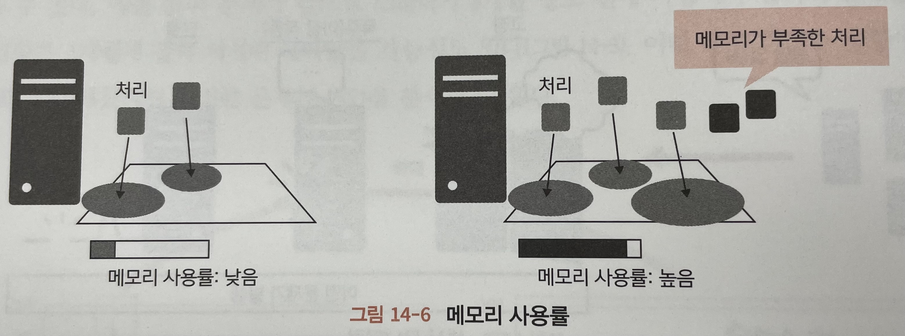
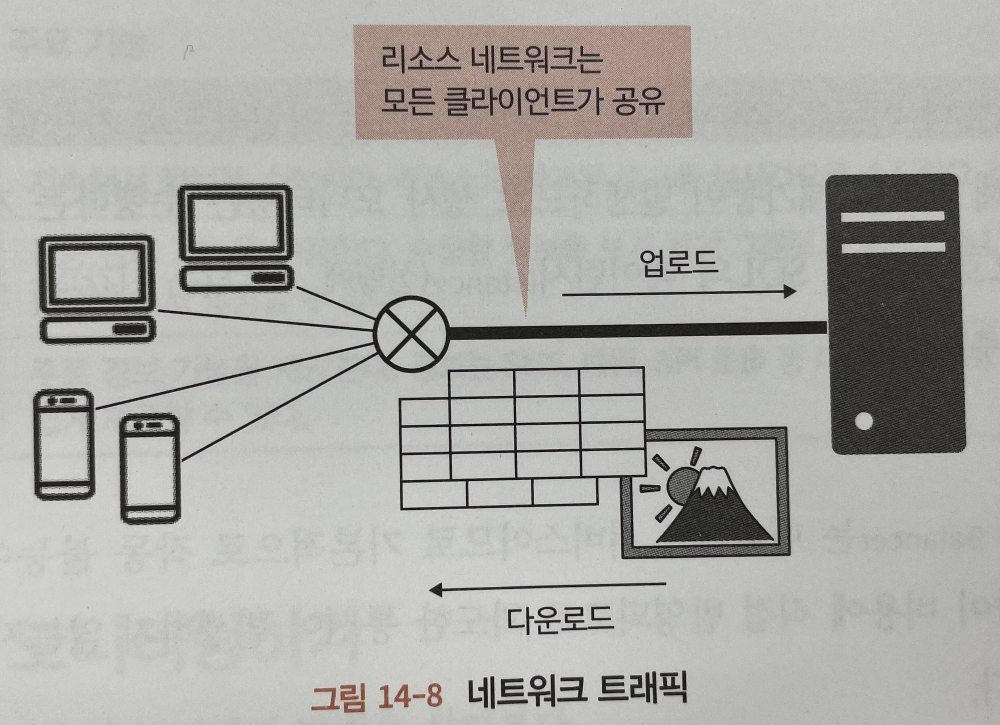

# [12/26] AWS (모니터링, CloudWatch, 요금 관리)

## 모니터링

- 웹에 공개하는 웹 서버나 데이터베이스 서버 등 다양한 리소스가 조합되어 작동
- 어느 하나에서 장애가 발생할 경우 시스템이 정상 동작 하지 않을 수 있음
- 이를 대비하기 위해 모니터링 서비스 구축 가능

### 집중 관리

- 여러 개로 분리되어 있는 서버를 한 곳에서 집약하여 관리할 수 있음

### 경보

- 서버가 장애를 일으키거나 이용자가 갑자기 증가해 반응이 지연되는 등 무언가 대응이 필요한 경우 이를 감지하여 알리는 서비스 제공

### 지속적인 정보 수집

- 서비스에 문제가 발생할 경우 해당 문제의 원인은 발생 시점 뿐만 아니라 지속적으로 발생할 수 있음
- 리소스 상황에 직전의 정보만 기록해왔다면 이러한 문제의 원인을 분석할 수 있음

## 주요 모니터링 항목

### 생사 모니터링

- 해당 리소스가 작동하는지 모니터링
- 물리적인 장애나 운영체제 오류, 네트워크 단절 등 다양한 원인으로 발생함
- 가장 신속하게 오류 발생을 확인하고 대응해야할 장애

### CPU 사용률

- 리소스에서 과도한 작업을 수행하는지 모니터링
- 리눅스 등 서버로 이용되는 OS 에서는 여러 처리를 동시에 처리할 수 있는 멀티태스크 기능을 제공
- 그러나 지나치게 많은 태스크를 동시 실행하면 CPU 가 이를 감당하지 못해 결과적으로 실행이 지연될 수 있음
- 100%가 계속 유지되면 실행이 지연되고 있는 가능성이 있을 수 있음

### 메모리 사용률

- 리소스에 제공되는 메모리가 많이 쓰이는지 아닌지 모니터링
- 메모리는 리소스가 처리를 실행할 때 이용하는 작업 영역과 같은 역할
- 메모리에는 제한이 있으므로, 여유가 없으면 처리가 되지 않아 지연될 수 있음

### 디스크 용량

- 리소스에 연결된 디스크의 빈 용량이 충분한지 모니터링
- 디스크에는 다음과 같은 정보가 저장
    - 크게 증가하지 않는 정보 : 서비스를 구축하는 프로그램이나 설정 파일 등
    - 시간이 흐름에 따라 증가하는 정보 : 서비스에 등록되는 데이터나 로그 등
- 디스크 용량이 부족하면 저장되어야 할 정보가 저장되지 않아 서비스가 이상 종료되기도 함

### 네트워크 트래픽

- 네트워크를 경유해 리소스에 접근하거나, 리소스에서 나오는 통신량을 모니터링
- 일반적인 웹 서비스 등의 서비스는 네트워크를 통해 사용자로부터 요청을 받아 결과를 반환
- 그러나 리소스가 네트워크를 통해 주고받을 수 있는 데이터양에는 제한이 있음
- 많은 사용자가 동시에 이용하거나, 한 사용자가 대량의 데이터를 다운로드하면 다른 사용자는 리소스를 이용하거나 통신하기 어려움

## 리소스별 모니터링 항목

- 모니터링 기준 : 장애 발생 및 비용
- 모니터링을 할 때에는 대응책이 준비되어 있을 경우에만 의미가 있음

|     | 생사 모니터링 | CPU 사용률 | 메모리 사용률 | 디스크 용량 | 네트워크 트래픽 | 기타                                   |
|-----|---------|---------|---------|--------|----------|--------------------------------------|
| EC2 | O       | O       | O       | O      | △        |                                      |
| RDS | O       | O       | O       | △      | △        | SQL 레이턴시(latency), 처리량(throughput) 등 |
| ALB | -       | -       | -       | -      | O        |                                      |
| S3  | -       | -       | -       | O      | O        |                                      |

### EC2

- 설치된 OS 자체의 관리를 수행해야 하므로 OS 나 미들웨어가 원인이 되는 서버 다운이 발생할 가능성이 있음
- 또한 CPU, 메모리, 디스크 등에도 제한이 있으므로 모두 사용하게 될 가능성이 있음
- 네트워크 트래픽을 제외하고는 모니터링 하는 것이 좋음
    - 네트워크 트래픽의 경우 EC2 는 보통 직접 인터넷에 연결하지 않음

### RDS

- EC2 와 거의 동일
- OS 나 미들웨어는 매니지드 서비스이므로 안정적으로 가동할 수 있지만, 실제로는 보안 대응을 위해 때때로 재기동이 발생하므로 생사 모니터링은 수행하는 것이 좋음
- 데이터베이스 서버의 경우 SQL 레이턴시, 처리량을 추가로 모니터링 하면 좋음
    - SQL 레이턴시 : 실행에 소요되는 시간
    - 처리량 : 일정 시간당 처리량

### ALB

- 매니지드 서비스이므로 기본적으로 작동 불능이 되는 경우는 거의 없음
- 하지만 통신량이 비용에 직접 반영되므로 과도한 통신이 발생하지 않는지 네트워크 트래픽은 모니터링하는 것이 좋음

### S3

- 매니지드 서비스이므로 작동 불능이 되는 경우는 거의 없음
- 하지만 디스크 사용량이나 통신량에 의해 비용이 발생하므로 디스크 용량과 네트워크 트래픽은 모니터링 하는 것이 좋음

## CloudWatch

- AWS 의 모니터링 매니지드 서비스
- 리소스와 관계된 로그를 실시간으로 수집하고 기록
- 수집한 정보를 보기 쉽게 그래프로 표현하거나, 이러한 그래프를 모아 한 장소에서 열람할 수 있도록 집중 관리 기능 제공
- SNS, 메일, API 호출 등 다양한 형태로 이용자가 즉시 확인할 수 있도록 경보 기능 제공

## 요금 관리 방식

- 서비스 가동 전에는 예상 비용(견적)을 통해 요금을 가늠할 수 있음
- 예상 비용이란 대략적인 비용을 산정하고 그 추정값을 계산하는 것
- 서비스 가동 중에는 PDCA 를 통해 요금을 추정
    - Plan (계획) - Do (실행) - Check (평가) - Act (개선)

### 서비스 가동 전 견적

- 대략적인 예산을 산정
- AWS 에서 비용이 발생할 수 있는 항목
    - CPU 나 메모리 사용 : 인스턴스나 로드밸런서 등
    - 스토리지 사용 : 디스크나 S3 등
    - 네트워크 사용 : 게이트웨이나 로드밸런서 등
    - 기타 : 탄력적 IP(ElasticIP) 나 DNS 등

### 서비스 가동 중 PDCA

- 월초에는 해당 월에 어느 정도의 요금이 들지 계획을 산정
    - 계획에 기반한 비용을 예산이라고 칭함
    - 미리 필요한 리소스를 산정한 뒤 그 이용료에 단가를 곱해서 더함
- 예산을 수립했다면 서비스 실행
    - 실행 중에는 매일 이용료 실적을 모니터링하고, 예산과 실적이 크게 어긋나지 않는지 확인
- 월말이 가까워지면 이용료를 평가
    - 구체적으로는 예산을 수립했을 때 누락된 항목이 없었는지, 잉여나 부족은 없었는지 확인
- 마지막으로 잉여나 부족 발생에 대해 어떻게 대응할지 개선
    - 예산 뿐만 아니라 모니털이 정보도 활용
    - EC2 인스턴스의 CPU 사용률이 낮을 경우 EC2 인스턴스를 줄이거나 RDS 인스턴스의 성능을 낮출 수 있음

## Billing and Cost Management

| 요금    | 기능                         |
|-------|----------------------------|
| 예상 비용 | AWS 요금 계산기                 |
| 예산    | 예산                         |
| 월 요금  | 비용 탐색기 (Cost Explorer), 경보 |
| 판단    | 청구, CloudWatch             |
| 개선    | (특별히 없음)                   |

### AWS 요금 계산기

- AWS 가 제공하는 예상 비용 계산 도구
- AWS 계정이 필요 없으며 무료 이용 가능

### Cost Explorer

- AWS 이용 내역 관리
- 일자별, 서버별 등 항목 단위로 자세하게 비용 모니터링 가능
