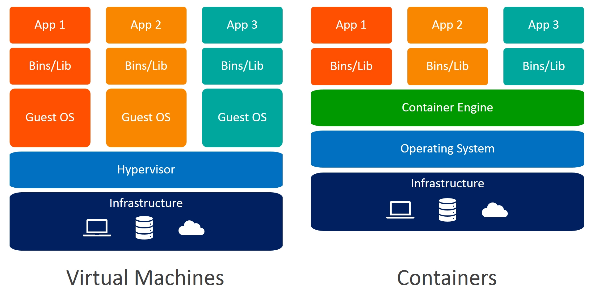

# [12/26] Docker (도커 용어, 가상화 기술과의 차이, 도커의 구조, 이미지, 허브, 생애주기)

## 도커 관련 주요 용어

### 컨테이너

- 작은 단위로 분할하여 관리하는 창고 (데이터나 프로그램)
- 컨테이너를 만들기 위해서는 원하는 프로그램의 상태가 담긴 이미지 필요 (혹은 그 반대도 가능)
- **컨테이너는 리눅스 환경으로 구성됨**
    - 컨테이너 안에서 동작하는 프로그램도 리눅스용 프로그램

### 도커

- 컨테이너를 다루는 기능을 제공하는 소프트웨어
- 데이터 또는 프로그램을 격리시키는 기능을 제공하는 소프트웨어
- 다양한 프로그램과 데이터를 각각 독립된 환경에 격리하는 기능을 제공
- 운영체제와 유사한 형태로 통째로 격리하는 것

### 도커 엔진

- 도커를 사용하기 위해 필요한 도커 소프트웨어 본체
- 컨테이너를 생성하고 구동시킬 수 있음

### 이미지

- 어플리케이션 실행에 필요한 독립적인 환경을 포함하여, 런타임 환경을 위한 템플릿
- 메모리에 올라온 상태 그대로 캡쳐하여 정보를 담고 있는 도커 파일
- 외부(ex. 허브) 에 올라온 이미지를 받아 로컬 컨테이너에서 실행하므로 설치 과정이 간단함

## 도커란?

- 도커를 이용하면 물리적 환경의 차이, 서버 구성의 차이를 무시할 수 있으므로 운영 서버와 개발 서버의 환경 차이로 인한 문제를 줄일 수 있음

## 도커 vs 가상화기술 vs AWS EC2

- 가상화 기술
    - VirtualBox, VMware 등
    - 가상의 물리 서버를 생성
    - 메인보드와 CPU, 메모리 등의 물리적인 부품을 소프트웨어로 구현
    - 운영체제의 종류에 종속받지 않고 설치 가능하며 그 위에 구동하는 소프트웨어 또한 자유
- 도커
    - 운영체제의 기능 중 일부를 호스트 역할을 하는 물리 서버에 맡김
    - 도커는 리눅스 환경에서 동작하기 때문에 물리 서버에도 리눅스 기능이 필요함
    - 컨테이너의 내부 구성도 리눅스 운영체제에 맞게 구성해야 함
- AWS EC2
    - 가상화 기술의 한 종류
    - 각각의 인스턴스가 완전히 독립된 컴퓨터처럼 동작함
    - 인스턴스는 컨테이너와 마찬가지로 AMI 라는 이미지로부터 생성하므로 인스턴스를 배포하는 방법은 도커와 유사

## 도커의 구조

- 호스트 컴퓨터 + 호스트(서버) 운영체제 + 도커 엔진 + 컨테이너들
- 프로그램 및 데이터는 컨테이너에 위치
- 운영체제 위에 도커가 실행되고 도커 위에 어플리케이션이 실행됨
- 도커 내부에는 운영체제와 유사한 것으로 이루어져 있음 (실제 운영체제는 X)
    - 운영체제 : 소프트웨어나 프로그램의 명령을 하드웨어에 전달하는 역할 수행
    - 컨테이너 내부에는 어플리케이션을 처리하기 위한 별도의 운영체제의 일부가 포함되어 있음
        - 실제 컴퓨터의 일부 자원을 할당받아 사용하는 운영체제와는 별개로 컨테이너 내부 운영체제가 있음
        - 도커 엔진 위에서 동작하는 것일뿐 다른 컴퓨터에서 실행되는 환경과 동일
- 컨테이너 내부에는 운영체제 전체가 아닌 일부만 포함되어 있기 때문에 비교적 가벼움
    - 호스트 컴퓨터의 운영체제와 컨테이너의 운영체제, 컨테이너 사이의 운영체제는 버전 및 운영체제 종류가 달라도 가능

## 도커의 이미지

- 메모리에 실행되고 있는 현재의 상태를 그대로 파일로 저장한 형태
- 이미지로부터 컨테이너 생성 가능 (그 반대의 경우도 가능)
- 하나의 이미지로 동일한 컨테이너 무한 생성 가능
- 다운로드 받은 이미지를 활용하여 새로운 버전의 이미지 생성 가능
- 보안 및 유지 관리 측면에서 하나의 이미지에는 하나의 프로그램만 사용하는 것이 원칙

## 도커 허브

- https://hub.docker.com/
- 도커의 이미지를 배포하는 서비스
- 도커 레지스트리

## 도커 컨테이너의 생애주기 (Lifecycle)

- 도커의 컨테이너는 한번 사용하고 폐기되는 일회용품으로 취급
- 사용하던 컨테이너를 새로운 버전에 맞춰 업데이트 하는 것보다 새로 생성하여 사용하는 것이 편리하기 때문
- 생성 → 실행 → 종료 → 폐기 → 생성 → …

## 데이터 저장

- 데이터를 컨테이너에 저장하면 컨테이너 폐기 시 데이터도 함께 폐기되는 문제가 발생할 수 있음
- 도커가 설치된 물리적 서버(호스트)의 디스크를 마운트해 이 디스크에 데이터를 저장하여 보존
    - 마운트 : 디스크를 연결해 데이터를 기록할 수 있도록 한 상태
- 디스크에 마운트하여 데이터를 저장할 경우 여러 컨테이너가 데이터를 공유할 수 있음
- 운영체제나 소프트웨어 부분은 컨테이너 형태로 만들어 일회성으로 사용하고, 데이터는 다른 고에 저장해두고 계속 사용
- 다만 마운트 방식을 사용할 경우 컨테이너를 폐기하기 전 중요한 데이터가 컨테이너에 포함되어 있는지 확인해야 함

## 도커의 장점

- 한 대의 물리 서버에 여러 대의 서버를 띄울 수 있음
- 서버 관리가 용이
- 서버 고수가 아니어도 다루기 쉬움

## 도커의 단점

- 리눅스용 소프트웨어밖에 사용할 수 없음
- 호스트 서버에 문제가 발생하면 모든 컨테이너에 영향을 미침
- 컨테이너 하나를 장기간에 걸쳐 사용할 경우 도커의 장점을 느끼기 어려움
    - 도커 엔진이 오버헤드로 취급될 수 있음

## 도커의 주 용도

- 팀원 모두에게 동일한 개발 환경 제공
- 새로운 버전의 테스트
    - 격리된 환경을 이용
- 동일한 서버가 여러 대 필요한 경우
    - 컨테이너 밖과 독립된 성질을 이용

## 도커 설치하기

- 도커 데스크탑 : 도커 + 리눅스 운영체제
- 리눅스 운영체제 환경에서는 도커 엔진만 설치해도 가능하나, 그 외의 환경에서는 도커 데스크탑 설치 필요
- 윈도우용 도커 데스크탑의 경우 윈도우 내부에 가상환경(Hyper-V) 가 포함되어 있어 가상환경이 포함되어 있지 않음 (도커 엔진 + 리눅스 운영체제)
- mac 용 도커 데스크탑의 경우 가상환경이 포함되어 있음 (도커 엔진 + 리눅스 운영체제 + 가상환경)
