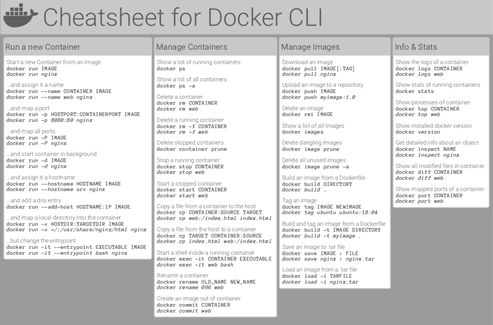

# [12/27] Docker (도커 컨테이너 명령어, 이미지 명령어, 네트워크 명령어)

## 도커 컨테이너 명령어

- 도커 엔진은 컨테이너를 실행 중이 아니라면 컴퓨터의 리소스를 거의 차지하지 않음
    - 도커 데스크탑은 별개로 다소 무거운 편
- 도커 엔진은 설정에 따라 부팅 시 자동 시작이 가능하나, 컨테이너는 별도로 시작하는 과정이 필요
- 도커 컨테이너 시작

    ```bash
    docker run {컨테이너 이름}
    ```

    - docker 명령어 이후 container 생략 가능하나 되도록 붙일 것

    ```bash
    docker container run {컨테이너 이름}
    ```

    - 받아온 이미지를 이용하여 특정 이름의 컨테이너를 생성 및 실행 시 name 옵션 설정

    ```bash
    docker run --name {컨테이너 이름}
    ```

- 도커 컨테이너 중지

    ```bash
    docker (container) stop {컨테이너 이름}
    ```

- 도커 컨테이너 제거
    - 동작중인 컨테이너는 제거할 수 없으므로 중지 후 제거해야 함

    ```bash
    docker (container) rm {컨테이너 이름}
    ```

- 컨테이너 목록 조회

    ```bash
    docker ps
    ```

    - 모든 상태의 컨테이너를 포함하여 목록을 조회하고 싶은 경우

    ```bash
    docker ps -a
    ```

- 도커 명령어는 커맨드 또는 상위 커맨드 + 하위 커맨드 조합으로 이루어져 있음
    - 상위 커맨드 : container, image, volume, network



## 컨테이너의 통신

- 컨테이너는 기본적으로 외부에서 접근할 수 없음
    - 터미널에서 바로 접근은 가능하나 웹 브라우저 등의 외부 접근은 불가

## 포트 설정 방법

```bash
-p (호스트 포트 번호):(컨테이너 포트 번호)
```

- 컨테이너 이름 : webserver02
- 포트 설정 : 8080 으로 접근 시 도커 내 80 포트 어플리케이션 실행
- 이미지 : httpd

```bash
docker run --name webserver02 -p 8080:80 -d httpd
```

## 기본 제공되는 이미지 사용하여 컨테이너 생성

- apache

    ```bash
    docker run --name webserver02 -p 8080:80 -d httpd
    ```

    - 컨테이너 이름 : webserver02
    - 포트 설정 : 8080 으로 접근 시 도커 내 80 포트 어플리케이션 실행
    - 이미지 : httpd
- nginx

    ```bash
    docker run --name nginx -p 8080:80 -d nginx
    ```

- mysql

    ```bash
    docker run --name mysqlserver -dit -e MYSQL_ROOT_PASSWORD={MYSQL_ROOT_PASSWORD} mysql
    ```


## 이미지 삭제

- docker container rm 명령어의 경우 컨테이너를 제거할 뿐 이미지는 남아있음
- 이미지를 이용하여 컨테이너를 구동중인 경우 이미지 삭제 불가
- 이미지 목록 조회 명령어

    ```bash
    docker image ls
    ```

- 이미지 제거 명령어
    - 동일한 이름의 버전이 다른 이미지가 존재할 경우 어떤 이미지를 제거해야 하는지 알 수 없기 때문에 제거하지 않음

    ```bash
    docker image rm {이미지 이름}
    ```


## 네트워크 생성

- 기본적으로 도커 컨테이너 간의 통신은 불가함
- 두 개 이상의 컨테이너를 연결하기 위해 가상 네트워크를 생성하여 컨테이너를 연결함
- 네트워크 생성 명령어

    ```bash
    docker network create {네트워크 이름}
    ```

- 네트워크 연결 명령어

    ```bash
    docker network connect/disconnect {네트워크 이름}
    ```

- 네트워크 목록 조회 명령어

    ```bash
    docker network ls
    ```

- 네트워크 제거 명령어

    ```bash
    docker network rm {네트워크 이름}
    ```

- 도커 컨테이너 실행 시 네트워크 설정
    - mysql 실행

        ```bash
        docker run --name mysqlwp -d --net=wpnet1 -e MYSQL_ROOT_PASSWORD={MYSQL_ROOT_PASSWORD} -e MYSQL_DATABASE={MYSQL_DATABASE} -e MYSQL_USER={MYSQL_USER} -e MYSQL_PASSWORD={MYSQL_PASSWORD} mysql --character-set-server=utf8mb4 --collation-server=utf8mb4_unicode_ci --default-authentication-plugin=mysql_native_password
        ```

    - wordpress 실행

        ```bash
        docker run --name wordpress -d --net=wpnet1 -p 8085:80 -e WORDPRESS_DB_HOST={WORDPRESS_DB_HOST} -e WORDPRESS_DB_NAME={WORDPRESS_DB_NAME} -e WORDPRESS_DB_USER={WORDPRESS_DB_USER} -e WORDPRESS_DB_PASSWORD={WORDPRESS_DB_PASSWORD} wordpress
        ```
