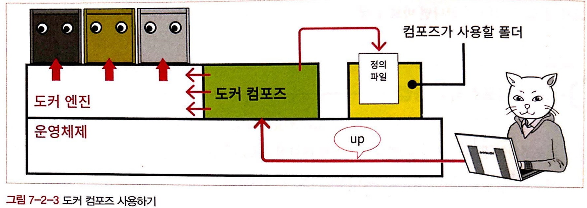

# [12/28] Docker (파일 복사, 컨테이너 터미널 접근, 컨테이너 실행 명령어들, 볼륨, 마운트, 볼륨 마운트, 바인드 마운트, 이미지 생성, 도커 허브, 도커 컴포즈)

## 파일 복사

- 어플리케이션 성격에 따라서 호스트 컴퓨터와 도커 컨테이너 사이의 파일을 주고받아야 하는 경우가 있을 수 있음
- `호스트 → 도커 컨테이너` 혹은 `도커 컨테이너 → 호스트` 등 파일 전달 가능
- 호스트에서 컨테이너로 파일을 복사하는 경우

    ```bash
    docker cp {호스트 경로} {컨테이너 이름}:{컨테이너 경로}
    ```

- 컨테이너에서 호스트로 파일을 복사하는 경우

    ```bash
    docker cp {컨테이너 이름}:{컨테이너 경로} {호스트 경로}
    ```


## 파일 복사 실습

- apache 실행

    ```bash
    docker run --name apache -d -p 8089:80 httpd
    ```

- 호스트에서 컨테이너로 파일 복사

    ```bash
    # 절대경로
    docker cp /Users/yukong/index.html apache:/usr/local/apache2/htdocs/
    
    # 상대경로
    docker cp ./index.html apache:/usr/local/apache2/htdocs/
    ```

- 컨테이너에서 호스트로 파일 복사

    ```bash
    docker cp apache:/usr/local/apache2/htdocs/index.html .
    ```


## 터미널로 컨테이너 실행

- exec 를 이용하여 실행중인 컨테이너 내부의 터미널로 접근

```bash
docker exec -i -t apache /bin/bash
```

- 컨테이너 내부에 존재하는 파일에 접근 가능
    - 이전 실습에서 복사한 파일 조회

```bash
yukong@yukongui-MacBookAir ~ % docker exec -i -t apache /bin/bash
root@12147541c7e3:/usr/local/apache2# ls
bin  build  cgi-bin  conf  error  htdocs  icons  include  logs	modules
root@12147541c7e3:/usr/local/apache2# cat htdocs/index.html 
<html>
	<head>
		<meta charset="utf-8"/>
	</head>
	<body>
		<h1>안녕하세요</h1>
	</body>
</html>
```

- 다시 호스트로 되돌아가기

```bash
exit
```

## 컨테이너를 실행하는 명령어들의 차이

### run

- **새로운 컨테이너를 생성하고 실행**
- 이미지를 기반으로 새로운 컨테이너를 만들고 해당 컨테이너의 프로세스를 실행
- **`docker run`** 은 **`docker create`** 와 **`docker start`** 를 한 번에 수행하는 역할

### start

- 중지된 컨테이너를 시작
- 컨테이너를 시작하면 해당 컨테이너의 프로세스가 실행
- **`docker run`** 과 달리 이미지에서 **새로운 컨테이너를 생성하지 않고, 기존에 생성한 컨테이너를 시작**

### attach

- 실행 중인 컨테이너에 연결하기 위해 사용
- **컨테이너의 프로세스에 직접 연결**되어 상호작용 진행 가능
- 컨테이너에 연결하여 표준 입력(standard input), 출력(standard output), 에러(standard error) 스트림을 붙임

### exec

- 실행 중인 컨테이너 내에서 **새로운 프로세스를 실행**
- 이미 실행 중인 컨테이너에 접속하여 추가적인 명령을 실행할 때 사용
- **`docker exec`** 를 사용하면 실행 중인 컨테이너에서 새로운 명령을 실행할 수 있음

## 볼륨 (Volume)

- 스토리지를 논리적으로 다루기 위한 단위
- 스토리지를 추상화한 것
- 볼륨을 이용하여 다른 컨테이너와 데이터 공유 가능
    - 컨테이너를 제거하더라도 볼륨은 보존
- 도커 엔진 설치 시 볼륨을 생성하지 않아도 기본 볼륨이 생성되어 있음

## 마운트 (Mount)

- 운영체제나 시스템의 관리하에 두는 것
- 보통 스토리지 관련하여 사용
- 어떤 방식을 사용하여 마운트하던 컨테이너 실행 시 방법은 동일
    - 스토리지는 외부에 있지만 컨테이너 내부에 있는 것처럼 취급

### 볼륨 마운트

- 생성된 볼륨 위치 : 도커 엔진
- 도커 엔진이 관리하는 영역 내에 만들어진 볼륨을 컨테이너에 디스크 형태로 마운트
- 직접 조작하기 어려워 임시로 사용하거나 자주 쓰지는 않지만 지우면 안되는 파일일 경우 주로 사용
- 도커 엔진의 관리 하에 있으므로 사용자가 파일 위치를 신경쓸 필요가 없음
- 운영체제에 따라 명령어가 달라지는 등의 의존성 문제도 발생하지 않음

### 바인드 마운트

- 생성된 디렉터리 위치 : 운영체제
- 도커가 설치된 컴퓨터의 문서 폴더 또는 바탕화면 폴더 등 **도커 엔진에서 관리하지 않는 영역의 기존 디렉터리를 컨테이너에 마운트**
    - 디렉터리가 아닌 파일 단위로도 마운트 가능
    - **디렉터리로 마운트할 경우 마운트 되어 있기 때문에 해당 디렉터리에 파일을 추가로 생성할 경우 별도의 작업 없이 컨테이너에 반영됨**
- 폴더 속에 파일을 직접 두거나 열어볼 수 있기 때문에 자주 사용하는 파일을 두는 데 사용
- 도커가 관리하지 않는 영역 어디라도 위치할 수 있음
- 기존과 동일한 방식(운영체제)으로 파일을 사용할 수 있어 다른 소프트웨어를 사용하여 쉽게 편집 가능
- 지정한 경로에 디렉터리가 없을 경우 디렉터리 자동 생성

| 항목      | 볼륨 마운트        | 바인드 마운트          |
|---------|---------------|------------------|
| 스토리지 영역 | 볼륨            | 디렉터리 또는 파일       |
| 물리적 위치  | 도커 엔진의 관리 영역  | 어디든지 가능          |
| 마운트 절차  | 볼륨을 생성한 후 마운트 | 기존 파일 또는 폴더를 마운트 |
| 내용 편집   | 도커 컨테이너를 통해   | 일반적인 파일과 동일      |
| 백업      | 절차 복잡         | 일반적인 파일과 동일      |

### 임시 메모리(tmpfs) 마운트

- 디스크가 아닌 주 메모리 영역에 마운트
- 디스크보다 훨씬 빠른 속도로 읽고 쓰기가 가능하여 접근 속도를 높일 수 있음
- 도커 엔진이 정지되거나 호스트가 재부팅하면 소멸됨

## 볼륨 마운트 명령어

- 볼륨 생성

    ```bash
    docker volume create {볼륨 이름}
    ```

- 볼륨 삭제

    ```bash
    docker volume rm {볼륨 이름}
    ```

- 마운트 되지 않은 볼륨 제거

    ```bash
    docker volume prune
    ```

- 볼륨 상세정보 조회

    ```bash
    docker volume inspect {볼륨 이름}
    ```


## 마운트 실습

- 바인드 마운트
    - apa_folder 에 다른 파일을 저장하더라도 컨테이너 내부에 그대로 반영

    ```bash
    docker run (생략) -v {스토리지 실제 경로}:{컨테이너 마운트 경로} (생략)
    ```

    ```bash
    docker run --name apache -d -p 8090:80 -v /Users/yukong/apa_folder:/usr/local/apache2/htdocs httpd
    ```

- 볼륨 마운트
    - 볼륨을 지정한 경로에 파일을 저장할 경우 해당 볼륨에 파일이 저장됨
    - 다른 컨테이너에서 해당 볼륨에 접근할 경우 데이터 공유

    ```bash
    docker run (생략) -v {볼륨 이름}:{컨테이너 마운트 경로} (생략)
    ```

    ```bash
    # 볼륨 생성
    docker volume create apache_volume
    
    # 볼륨 마운트
    docker run --name apache03 -d -p 8091:80 -v apache_volume:/usr/local/apache2/htdocs httpd
    
    # docker 를 생성할 때 지정한 컨테이너 마운트 경로에 파일 이동
    docker cp index.html apache03:/usr/local/apache2/htdocs/
    
    # 컨테이너 사이에 볼륨을 공유하므로 새로운 컨테이너를 생성하더라도 이전의 컨테이너에서 이동한 파일이 존재
    docker run --name apache04 -d -p 8081:80 -v apache_volume:/usr/local/apache2/htdocs httpd
    ```


## 마운트 백업

- 볼륨 마운트 백업

    ```bash
    docker run --rm -v {볼륨명}:/moto -v {백업 저장 폴더명}:/target busybox tar cvzf /sake/{백업파일이름}.tar.gz -C /source .
    ```


## 컨테이너로 이미지 생성

### commit 커맨드로 생성

- 실행하고 있는 컨테이너를 그대로 이미지로 변환
- 기존 컨테이너 복제, 이동, 백업 등에 유용
- **현재 컨테이너 그 자체를 이미지로 생성하고 싶은 경우 유용**

```bash
docker commit {컨테이너 이름} {새로운 이미지 이름}
```

### Dockerfile 스크립트로 생성

- 이미지나 실행할 명령어 등을 기재
- Dockerfile 생성 후 컨테이너에 같이 포함할 파일들을 같은 경로에 위치
- **기존의 도커 이미지에서 일부 수정하여 생성하고 싶은 경우 유용**

```bash
docker build -t {생성할 이미지 이름} {Dockerfile 폴더 경로}
```

```bash
yukong@yukongui-MacBookAir myapache % docker build -t hdapache:alpha .
[+] Building 0.1s (7/7) FINISHED                                                                                                                                                     docker:desktop-linux
 => [internal] load build definition from Dockerfile                                                                                                                                                 0.0s
 => => transferring dockerfile: 92B                                                                                                                                                                  0.0s
 => [internal] load .dockerignore  # .gitignore 과 같이 build 시 제외하는 파일들                                                                                                                                                                  0.0s
 => => transferring context: 2B                                                                                                                                                                      0.0s
 => [internal] load metadata for docker.io/library/httpd:latest                                                                                                                                      0.0s
 => [internal] load build context                                                                                                                                                                    0.0s
 => => transferring context: 158B                                                                                                                                                                    0.0s
 => [1/2] FROM docker.io/library/httpd                                                                                                                                                               0.0s
 => [2/2] COPY index.html /usr/local/apache2/htdocs                                                                                                                                                  0.0s
 => exporting to image                                                                                                                                                                               0.0s
 => => exporting layers                                                                                                                                                                              0.0s
 => => writing image sha256:1cbc599b63e271c1c053f1a29bdd73b921ca04a91971906361fb16d79436e5e3                                                                                                         0.0s
 => => naming to docker.io/library/hdapache:alpha                                                                                                                                                    0.0s

View build details: docker-desktop://dashboard/build/desktop-linux/desktop-linux/b1y8go92px6rkdhdotzurdje0

What's Next?
  View a summary of image vulnerabilities and recommendations → docker scout quickvie
```

- Dockerfile 명령어

    ```bash
    from {이미지 이름}
    copy {원본 경로} {대상 경로}
    run {리눅스 명령어}
    ```

  | 명령어        | 용도                          |
  |------------|-----------------------------|
  | FROM       | base 이미지 설정                 |
  | WORKDIR    | 작업 디렉터리 설정                  |
  | RUN        | 이미지 빌드 시 커맨드 실행             |
  | ENTRYPOINT | 이미지 실행 시 항상 실행되야 하는 커맨드 설정  |
  | CMD        | 이미지 실행 시 디폴트 커맨드 또는 파라미터 설정 |
  | EXPOSE     | 컨테이너가 리스닝할 포트 및 프로토콜 설정     |
  | COPY/ADD   | 이미지의 파일 시스템으로 파일 또는 디렉터리 복사 |
  | ENV        | 환경 변수 설정                    |
  | ARG        | 빌드 시 넘어올 수 있는 인자 설정         |
- Dockefile 예시 1

    ```bash
    from httpd
    
    copy index.html /usr/local/apache2/htdocs
    ```

- Dockerfile 예시 2

    ```bash
    FROM maven:3.6-jdk-11 as build
    
    # Copy the project files into the container
    COPY src /home/app/src
    COPY pom.xml /home/app
    
    WORKDIR /home/app
    
    # WAR 파일로 빌드 하면서 테스트 스킵
    RUN mvn -e clean package -DskipTests
    
    FROM tomcat:9.0-jdk11-openjdk
    
    # TimeZone 변경
    ENV TZ=Asia/Seoul
    
    RUN rm -rf /usr/local/tomcat/webapps/*
    
    COPY --from=build /home/app/target/*.war /usr/local/tomcat/webapps/ROOT.war
    
    EXPOSE 8080
    ```


## 컨테이너의 개조

- 컨테이너 안에서 패키지를 설치하거나 파일을 생성하는 등의 변경하는 작업
- 파일 복사 또는 마운트 등도 컨테이너 개조에 포함
- 또 다른 방법으로는 컨테이너에서 리눅스 명령어를 직접 실행하는 방법이 있음

## 컨테이너에서 리눅스 명령 실행

- 컨테이너에서 리눅스 명령어를 실행하기 위해서는 shell(셸) 이 필요
    - 셸 : 사용자의 명령을 해석하여 커널을 작동시키는 프로그램
- 컨테이너 내부 운영체제는 리눅스 환경이나, 별도로 설정하지 않으면 bash 가 동작하지 않는 상태로 실행됨
- bash 셸을 사용하기 위해서는 docker 컨테이너를 생성하거나 실행할 때 옵션을 추가해야 함
    - docker 컨테이너 생성 시 bash 에 접근

        ```bash
        docker run --name {컨테이너 이름} -it -p {외부 접근 포트}:{컨테이너 내부 실행 포트} {이미지 이름} /bin/bash
        ```

    - docker 컨테이너 실행 시 bash 에 접근

        ```bash
        docker exec {컨테이너 이름} /bin/bash
        ```

    - docker 컨테이너 실행 시 특정 리눅스 명령어 실행

        ```bash
        docker exec {컨테이너 이름} {리눅스 명령어}
        ```


## 도커 엔진 vs 컨테이너 내부 명령의 차이

- 명령어를 실행하는 위치의 운영체제 맞는 명령어 사용
- 도커 엔진을 통한 명령 : 컨테이너 시작 및 종료, 외부 작업 등
- 컨테이너 내부에서 실행하는 명령 : 컨테이너에서 필요한 파일 관련 작업 등


## 도커 허브

- 도커 제작사에서 운영하는 공식 도커 레지스트리


## 도커 레지스트리

- 이미지를 배포하는 장소
- 일반에 공개되어 있든 비공개이든 상관없이 이미지가 배포되는 곳은 모두 도커 레지스트리

### 레지스트리 vs 레포지토리

- 레포지토리 : 레지스트리를 구성하는 단위


## 이미지 업로드

- 도커 허브에 공개적으로 업로드를 하거나 레지스트리에 비공개적으로 업로드를 할 경우 모두 이미지에 태그 부여 필요
- 태그 구성
    - **{레지스트리 주소(도커 허브는 ID)}/{레포지토리 이름}:{버전}**

## 태그를 부여하여 이미지 복제

- 레지스트리 주소가 포함되었지만 그 자체로 새로운 이름으로 처리됨

```bash
docker (image) tag {원본 이미지 이름} {레지스트리 주소}/{레포지토리 이름}:{버전}
```

## 이미지 업로드

- 존재하지 않는 레포지토리로 생성할 경우 이미지 업로드 시 레포지토리 자동 생성

```bash
docker push {레지스트리 주소}/{레포지토리 이름}:{버전}
```

## 비공개 레포지토리 생성

- 레지스트리용 컨테이너(registry) 를 이용하여 비공개 레지스트리 생성
- 레지스트리도 컨테이너이므로 도커를 통해 운영 가능
- 컨테이너를 만들면 사용자는 레지스트리에 로그인한 다음 이미지를 내려받을 곳으로 이 레지스트리를 지정

```bash
docker run -d -p 5000:5000 registry
```

## 도커 컴포즈

- **시스템 구축과 관련된 명령어를 하나의 텍스트 파일(정의 파일) 에 기재**해 명령어 한번에 시스템 전체를 실행하고 종료와 폐기까지 한번에 하도록 도와주는 도구
- yaml 포맷의 정의 파일에 저장하여 사용
- 도커 명령어와 유사하지만 도커 명령어는 아님
- 도커 컴포즈는 파이썬으로 작성된 소프트웨어로, 파이썬 설치가 필요

```bash
# python install
sudo apt install -y python3 python3-pip

# docker compose install
sudo pip3 install docker-compose

# docker compose 설치 확인
docker-compose --version
```

### 도커 컴포즈 vs Dockerfile 스크립트

- Dockerfile : 이미지를 build 하기 위해 명시하는 파일
- 도커 컴포즈 : 컨테이너와 주변 환경의 생성, 종료, 삭제를 제어하는 파일

## 도커 컴포즈 실행 과정

- `docker-compose.yml` 이름으로 정의 파일 생성



- 정의 파일을 생성하여 도커 컴포즈를 실행하면 도커 컴포즈는 docker-compose.yml 파일에 작성된 내용을 읽어 도커 엔진 명령으로 사용

## 도커 컴포즈 파일 작성

- docker-compose.yml 파일 기본 구조

    ```yaml
    version: "3" # 컴포즈 파일 포맷의 버전
    
    services: # 컨테이너 관련 정보
      컨테이너_이름1: 
      컨테이너_이름2:
    networks: # 네트워크 관련 정보
      네트워크_이름1:
    volumes: # 볼륨 관련 정보
      볼륨_이름1:
      볼륨_이름2:
    ```

- docker-compose.yml 파일 세부 정보 구조
    - 항목 값의 경우 한칸 띄어쓰기 후 작성
    - 들여쓰기 시 tab 이 아닌 두 칸 띄어쓰기로 작성

    ```yaml
    version: "3"
    services: # 컨테이너 관련 정보
      컨테이너_이름1:
        image: 이미지_이름
        networks:
          - 네트워크_이름
        ports:
          - 포트_설정
        volumes:
          - 볼륨_이름:컨테이너_내부_경로
      
      컨테이너_이름2:
        image: 이미지_이름
    
    networks: # 네트워크 관련 정보
      네트워크_이름1:
    volumes: # 볼륨 관련 정보
      볼륨_이름1:
      볼륨_이름2:
    ```


## 도커 컴포즈 실습

### docker-compose.yml 파일 생성

```yaml
version: "3"
services:
  mysql00:
    platform: linux/x86_64 # m1 의 경우 platform 명시 필요
    image: mysql:5.7
    networks:
      - wordpress00net
    volumes:
      - mysql00vol:/var/lib/mysql
    restart: always
    environment:
      MYSQL_ROOT_PASSWORD: myrootpass
      MYSQL_DATABASE: wordpress00db
      MYSQL_USER: wordpress00
      MYSQL_PASSWORD: kunpass
  wordpress00:
    depends_on: 
      - mysql00
    image: wordpress
    networks:
      - wordpress00net
    volumes:
      - wordpress00vol:/var/www/html
    ports:
      - 8085:80
    restart: always
    environment:
      WORDPRESS_DB_HOST: mysql00
      WORDPRESS_DB_NAME: wordpress00db
      WORDPRESS_DB_USER: wordpress00
      WORDPRESS_DB_PASSWORD: kunpass
networks:
  wordpress00net:
volumes:
  mysql00vol:
  wordpress00vol:

```

- https://unluckyjung.github.io/develop-setting/2021/03/27/M1-Docker-Mysql-Error/

### docker-compose 파일 실행

- 해당 위치에 있는 docker-compose 실행

```bash
docker-compose up -d
```

- 해당 위치에 있는 docker-compose 종료

```bash
docker-compose down
```
