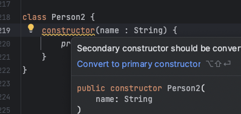
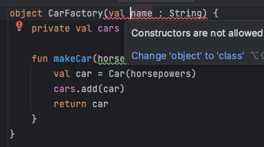
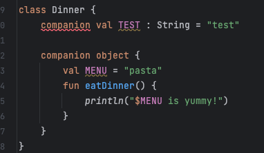
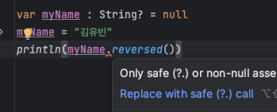

# [1/11] Android (Kotlin 기본 문법, Class, 접근 제한자, object, companion, data class, 추상 클래스와 인터페이스, null 처리, 람다식, 코틀린 기본 객체 타입)

## Class

- 자바와는 달리 new 키워드 X
- 클래스 내부 프로퍼티(자바의 필드)는 괄호 안에 정의
    - 코틀린에서는 getter, setter 를 포함하는 값을 의미하기 위해 프로퍼티로 명칭

```kotlin
class Car(val color : String)

val car = Car("red")
println("My car color is ${car.color}") // My car color is red
```

- **생성자를 이용하여 클래스의 프로퍼티로 선언하고 싶은 경우 var 나 val 같은 키워드를 붙여주어야 함**
- 생성자에 var 나 val 키워드를 붙이지 않은 값이 있을 경우

```kotlin
class Car(val color : String, name : String)
```

- 생성자 매개변수로 해당 값을 받아오지만 필드로 정의하지는 않음

```java
public class ConstructorProperties extends ScriptTemplateWithArgs {
   public static final void main(String[] var0) {
      RunnerKt.runCompiledScript(ConstructorProperties.class, var0);
   }

   public ConstructorProperties(String[] var1) {
      super(var1);
   }

   public static final class Car { 
      // val 키워드를 붙인 값
      @NotNull
      private final String color;

      @NotNull
      public final String getColor() {
         return this.color;
      }

      public Car(@NotNull String color, @NotNull String name) {
         Intrinsics.checkNotNullParameter(color, "color");
         Intrinsics.checkNotNullParameter(name, "name");
         super();
         this.color = color;
         // name 은 val 키워드를 붙이지 않아 필드로 저장하지 않음
      }
   }
}
```

### 보조 생성자

- 주 생성자와는 다르게 클래스 바디 내부에서 constructor 키워드를 이용하여 정의
- **주 생성자가 존재할 때는 반드시 this 키워드를 통해 주 생성자 호출**

```kotlin
class Person(name : String) {
    constructor(name : String, age : Int) : this(name) {
        println("I'm $age years old")
    }
}
val person = Person("김유빈", 28)
```

- 주 생성자 없이 보조 생성자만 선언할 수 있으나 주 생성자를 사용하는 것을 권장



```kotlin
// 변경 전 코드
class Person2 {
    constructor(name : String) {
        println("My name is $name")
    }
}

// 변경 후 코드
class Person2(name: String) {
    init {
        println("My name is $name")
    }
}
```

### 초기화 블록

- 자바의 인스턴스 블록
- init 내부의 코드는 객체 생성 시 가장 먼저 실행되고 주 생성자의 매개변수를 사용할 수 있음

```kotlin
class Person3(name : String) {
    val name : String
    init {
        if (name.isEmpty()) {
            throw IllegalArgumentException("이름이 없어요.")
        }
        this.name = name
    }
}
// val person3 = Person3("") // error
val person3 = Person3("김유빈")
```

## 클래스의 상속

- 자바에서는 대부분의 경우에 상속이 열려있으며, 상속을 허용하고 싶지 않은 경우 final 을 선언
- 코틀린에서는 반대로 상속을 허용하는 경우에만 `open` 키워드를 이용하여 명시
- 클래스의 상속과 메서드의 상속 모두 마찬가지로 open 키워드 사용

```kotlin
open class Flower {
    open fun waterFlower() {
        println("water flower")
    }
}

class Rose : Flower() { // Flower 클래스의 기본 생성자 호출하여 상속
    override fun waterFlower() {
        super.waterFlower() // water flower 출력
        println("Rose is happy now") // Rose is happy now 출력
    }
}

val rose = Rose()
rose.waterFlower()
```

- 매개변수가 존재하는 생성자를 호출하는 경우 다음과 같이 매개변수 입력 필요

```kotlin
open class Flower(val name : String) {
    open fun waterFlower() {
        println("water flower")
    }
}

class Rose(name : String, val color : String) : Flower(name) {
    override fun waterFlower() {
        super.waterFlower()
        println("Rose is happy now")
    }
}
```

## 접근 제한자

- public : 어디에서나 접근 가능 (코틀린의 기본값)
- internal : 같은 모듈 내 접근 가능 (자바의 default)
- protected : 자식 클래스에서는 접근 가능
- private : 클래스 내부에서만 접근 가능

## object 키워드

- 단 하나의 객체만을 생성하도록 보장하는 키워드
- 자바에서는 직접 구현해야 했던 싱글톤 패턴을 코틀린에서는 문법적으로 지원

```kotlin
object CarFactory {
    private val cars = mutableListOf<Car>()

    fun makeCar(horsepowers: Int): Car {
        val car = Car(horsepowers)
        cars.add(car)
        return car
    }
}

class Car(power : Int)
```

- 자바로 표현된 코드를 보면 INSTANCE 라는 이름의 단일 객체가 만들어진 것을 확인할 수 있음

```java
public class ObjectKeyword extends ScriptTemplateWithArgs {
   public static final void main(String[] var0) {
      RunnerKt.runCompiledScript(ObjectKeyword.class, var0);
   }

   public ObjectKeyword(String[] var1) {
      super(var1);
   }

   public static final class CarFactory {
      private static final List cars;
      @NotNull
      public static final CarFactory INSTANCE;

      @NotNull
      public final Car makeCar(int horsepowers) {
         Car car = new Car(horsepowers);
         cars.add(car);
         return car;
      }

      private CarFactory() {
      }

      static {
         CarFactory var0 = new CarFactory();
         INSTANCE = var0;
         cars = (List)(new ArrayList());
      }
   }

   public static final class Car {
      public Car(int power) {
      }
   }
}
```

- 싱글톤 패턴을 지원하기 때문에 생성자를 추가할 수 없어 매개변수를 추가할 수 없음



## 컴패니언 객체 : companion 키워드

- 자바의 static 블록
- 자바에서 static 을 붙여 선언했던 요소(필드, 블록, 메서드 등) 을 하나의 범위 내에 모두 적용
- companion object 블록 내부에 선언한 것들은 객체를 생성하지 않고도 접근 가능

```kotlin
class Dinner {
    companion object {
        val MENU = "pasta"
        fun eatDinner() {
            println("$MENU is yummy!")
        }
    }
}
println(Dinner.Companion.MENU) // pasta
println(Dinner.MENU) // pasta
Dinner.eatDinner() // pasta is yummy!
```

- 클래스 내 상수 값 하나를 선언하더라도 companion object 블록 내에 선언해야 함
    - 블록 외부에서 companion 호출 시 에러 발생



- 코틀린에서 상수를 정의할 때에는 const 를 포함하여 const val 로 정의
    - 자바의 static final 과 동일
- companion object 는 자바의 static 블록과 같은 역할을 함
- 즉, companion object 내에서 val 로 선언하든, const val 로 선언하든 동일하게 상수 역할을 함

```kotlin
class Dinner {
    companion object {
        const val TEST = "test"
        val MENU = "pasta"
        fun eatDinner() {
            println("$MENU is yummy!")
        }
    }
}
```

- 위의 코틀린 코드를 자바로 디컴파일 했을 때 다음과 같이 두 상수 모두 static final 로 정의되었음을 확인할 수 있음
- 또한 companion “object” 이기 때문에 클래스 내부에 별도의 객체가 생성됨
    - 이름을 지정하지 않으면 Companion 으로 생성

```java
// 코틀린 파일명에 매칭되는 자바 클래스 생성
public class CompanionObject extends ScriptTemplateWithArgs {
   public static final void main(String[] var0) {
      RunnerKt.runCompiledScript(CompanionObject.class, var0);
   }

   public CompanionObject(String[] var1) {
      super(var1);
   }

   // 코틀린에서 정의한 클래스는 내부 클래스로 생성
   public static final class Dinner { 
      // const val 로 선언한 상수
      @NotNull
      public static final String TEST = "test";
      // val 로 선언한 상수
      @NotNull
      private static final String MENU = "pasta";
      @NotNull
      public static final Companion Companion = new Companion((DefaultConstructorMarker)null);

      public static final class Companion {
         @NotNull
         public final String getMENU() {
            return CompanionObject.Dinner.MENU;
         }

         public final void eatDinner() {
            String var1 = ((Companion)this).getMENU() + " is yummy!";
            System.out.println(var1);
         }

         private Companion() {
         }

         public Companion(DefaultConstructorMarker $constructor_marker) {
            this();
         }
      }
   }
}
```

## 추상 클래스

- 자바와 마찬가지로 abstract 키워드 사용
- 추상클래스는 어차피 상속을 받아야 사용할 수 있는 클래스이기 때문에 open 키워드를 사용하지 않음

```kotlin
abstract class Game {
    fun startGame() {
        println("게임을 시작했습니다.")
    }
    
    abstract fun printName()
}

class OverWatch : Game() {
    override fun printName() {
        println("오버워치 입니다.")
    }
}

val overWatch = OverWatch()
overWatch.startGame() // 게임을 시작했습니다.
overWatch.printName() // 오버워치 입니다.
```

## 데이터 클래스

- 메서드의 실행보다는 데이터 전달에 목적을 둔 클래스
- 자바의 DTO 의 역할을 하며 최근 17버전에 추가된 record 와 유사
- toString() : 객체의 정보 출력 (자바와 동일)
- copy() : 객체의 속성들을 복사하여 반환하는 메서드 (코틀린에서 추가)
    - 내부의 속성을 일부 가져와 새로운 객체를 생성

```kotlin
data class Memo(val title : String, val content : String, var isDone : Boolean)

var memo1 = Memo("마트 가기", "계란, 우유, 빵", false)
var memo2 = memo1.copy(content = "칫솔, 과자")

println(memo1.toString()) // Memo(title=마트 가기, content=계란, 우유, 빵, isDone=false)
println(memo2.toString()) // Memo(title=마트 가기, content=칫솔, 과자, isDone=false)

println(memo1 == memo2) // false
```

## 인터페이스

```kotlin
interface Car2 {
    abstract fun drive()
    fun stop() // abstract 생략 가능
    fun destroy() = println("차가 파괴되었습니다.") // 자바의 default method
}

class Ferrari : Car2 {
    override fun drive() {
        println("페라리가 달립니다.")
    }

    override fun stop() {
        println("페라리가 멈춥니다.")
    }
}
val myFerrari = Ferrari()
myFerrari.drive() // 페라리가 달립니다.
myFerrari.stop() // 페라리가 멈춥니다.
myFerrari.destroy() // 차가 파괴되었습니다.
```

### 클래스 상속과 다중 인터페이스 구현

```kotlin
interface Animal {
    fun breath()
    fun eat()
}

interface Human {
    fun think()
}

open class Name(val name : String) {
    fun printName() {
        println("제 이름은 $name")
    }
}

// 부모 클래스 생성자에 필요한 인수 전달
class Korean(name : String) : Name(name), Animal, Human {
    override fun breath() {
        println("후-하 후-하")
    }

    override fun eat() {
        println("한식 먹기")
    }

    override fun think() {
        println("생각하기")
    }
}

val yuneen = Korean("김유빈")
yuneen.breath()
yuneen.printName()
```

## Null 처리하기

- 코틀린에서는 기본적으로 객체에 null 을 정의할 수 없음
    - 선언과 동시에 초기화를 해주어야 함
- 객체에 null 을 대입하고 싶다면 타입 뒤에 `?` 기호를 붙여 명시적으로 null 이 올 수 있음을 알려야 함
- 또한 코틀린은 컴파일 시점에 null 가능성을 체크하여 방어적인 코드를 작성하도록 유도



### 세이프 콜 연산자 ?

- null 이 될 수 있는 타입에 대한 처리를 할 때에는 세이프 콜 연산자 `?` 사용

```kotlin
fun reverseName(name : String?) : String? {
		// 세이프 콜 연산자
    return name?.reversed()
}
println(reverseName("김유빈")) // 빈유김
println(reverseName(null)) // null
```

### 엘비스 연산자 ?:

- null 일 경우 null 을 반환하는 것이 아닌 다른 값으로 처리하고 싶은 경우 사용

```kotlin
fun reverseName(name : String?) : String {
    return name?.reversed() ?: "이름을 확인해주세요."
}
println(reverseName("김유빈")) // 빈유김
println(reverseName(null)) // 이름을 확인해주세요.
```

### 확정 연산자 !!

- 해당 값이 절대 null 이 아님을 보증하는 연산자
- 만약 해당 값에 null 이 대입될 경우 NPE 발생될 수 있으므로 되도록 지양

```kotlin
fun reverseName(name : String?) : String {
    return name!!.reversed()
}
println(reverseName("김유빈")) // 빈유김
println(reverseName(null)) // NPE 발생
```

### lateinit 키워드

- 코틀린은 기본적으로 변수에 null 을 할당할 수 없으므로 선언과 동시에 초기화 필요
- 해당 변수를 나중에 할당하기 위해 `lateinit` 키워드 사용

```kotlin
lateinit var lunch : String
lunch = "waffle"

println(lunch) // waffle
```

- 주의 사항
    - var 변수에서만 사용 가능
    - **nullable 자료형과 함께 사용할 수 없음**
    - 초기화 전에 변수를 사용하면 에러 발생
    - **원시 자료형(Int, Double, Float) 등에는 사용 불가**
    - ::변수명.isInitailized() 함수로 초기화 되었는지 확인 가능

### lazy 키워드

- 보통 객체가 생성될 때 초기화되나, lazy 키워드를 사용하면 처음 호출도리 때 lazy{} 안의 코드가 실행되면서 초기화
- lazy 키워드를 이용하면 val 변수도 늦은 초기화 가능

```kotlin
val lazyBear : String by lazy {
    println("곰이 일어났습니다.") // 해당 변수 호출 시 할당되기 전 실행
    "bear" // lazyBear 변수에 할당
}

// 곰이 일어났습니다.
// bear
println(lazyBear)
println(lazyBear) // bear
```

## 람다식

- 값처럼 다룰 수 있는 익명 함수
- 람다식의 인수가 하나일 경우 해당 값의 변수명을 `it` 로 사용할 수 있음

```kotlin
val sayHello = fun() { println("안녕하세요") } // 안녕하세요
sayHello()

val squareNum : (Int) -> (Int) = { number -> number * number }
println(squareNum(12)) // 144

val squareNum2 = { number : Int -> number * number }
val squareNum3 : (Int) -> Int = { it * it }
```

### 람다를 표현하는 다양한 방법

```kotlin
val paramLambda : (Int) -> Boolean = { num -> num == 10 }
println(invokeLambda(paramLambda)) // false

// 람다식 바로 넣어주기
println(invokeLambda({ num -> num == 10 })) // false
// 인수가 하나일 때 it 으로 변경 가능
println(invokeLambda({ it == 10 })) // false
// 만약 함수의 마지막 인수가 람다일 경우 밖으로 뺄 수 있음
println(invokeLambda() { it == 10 }) // false
// 그 외 인수가 없을 때 () 생략 가능
println(invokeLambda { it == 10 }) // false
```

### SAM (Single Abstract Method) 변환

- 안드로이드에서는 다음과 같은 이벤트를 자주 호출함

```kotlin
button.setOnClickListener {
	// 버튼이 눌렸을 때 작동하는 코드
}
```

- 자바에서는 함수형 인터페이스를 람다식으로 표현할 수 있음
    - 함수형 인터페이스 : 추상 메서드를 하나만 가지는 자바의 인터페이스
- 즉, 자바의 함수형 인터페이스를 코틀린의 람다식 매개변수로 대입 가능 (SAM 변환)
    - 반드시 코틀린 인터페이스가 아닌 자바 인터페이스여야 함

```kotlin
// 람다를 사용하지 않았을 때
button.setOnClickListener(object : OnClickListener {
	override fun onClick(view : View) {
		doSomething()
	}
}

// 람다 사용 1
button.setOnClickListener({ view -> doSomething() })

// 람다 사용 2 : 코틀린 컴파일러가 인수를 미리 알기 때문에 생략
// (인수가 여러 개일 때) 마지막 인수가 람다인 경우 {} 를 밖으로 이동
button.setOnClickListener() { doSomething() }

// 람다 사용 3 : 유일한 인수인 경우 () 생략
button.setOnClickListenter { doSomething() }
```

## 코틀린의 기본 객체 타입

### Any

- 최상위 객체 타입
- 자바의 Object 에 기능이 더해진 객체

### Unit

- 자바의 void
- 메서드에서 반환 값이 없는 경우에 사용
- 코틀린은 모든 것이 객체이기 때문에 Unit 또한 객체이며 싱글톤 인스턴스

### Nothing

- 어떠한 값도 포함하지 않는 타입
- 어떠한 상황에서도 리턴될 상황이 아닌 경우에 사용
    - 다음과 같이 무한루프로 인해 종료될 가능성이 없는 경우에 사용할 수 있음

    ```kotlin
    fun infiniteLoop(): Nothing {
        while (true) {
            println("Hi there!")
        }
    }
    ```

- 예외를 던지는 경우에 사용

    ```kotlin
    fun throwException(): Nothing {
        throw IllegalStateException()
    }
    ```

- null 이 발생하는 경우에 사용
    - Nothing 또한 객체이기 때문에 null 이 될 가능성이 있으면 `?` 기호를 사용해야 함

    ```kotlin
    fun mayThrowAnException(throwException: Boolean): Nothing? {
        return if (throwException) {
            throw IllegalStateException()
        } else {
            println("Exception not thrown :)")
            null
        }
    }
    ```
  
