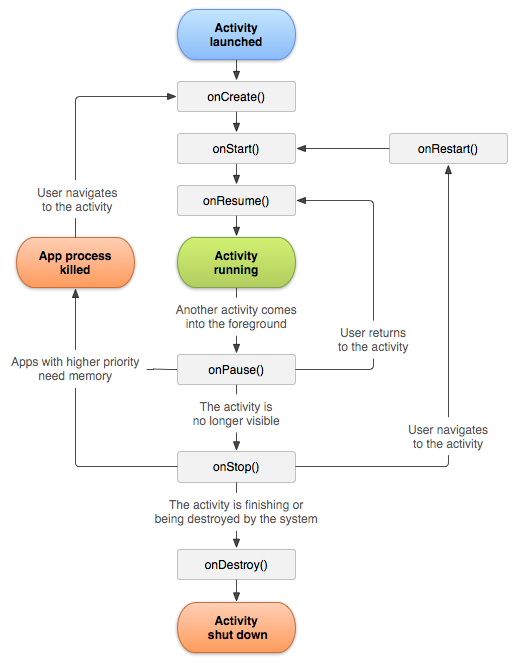
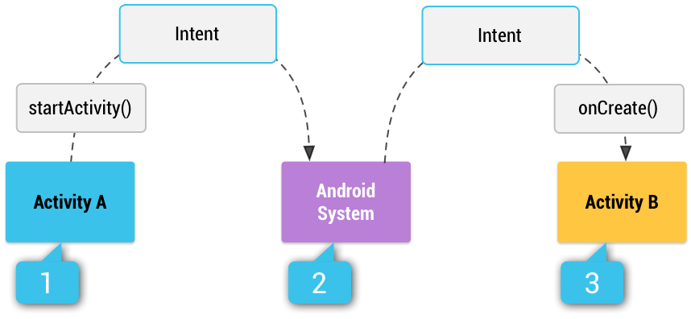
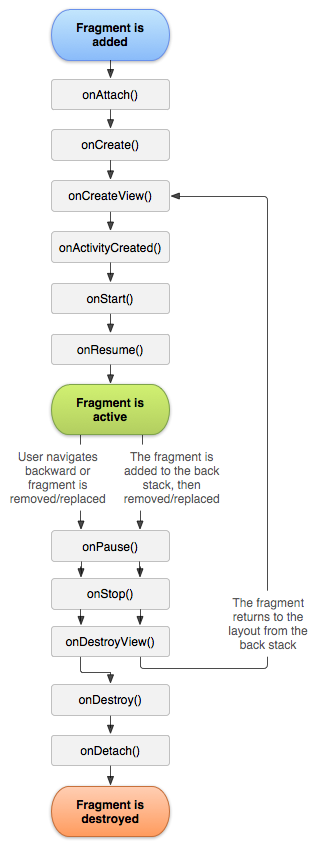

# [1/12] Android (안드로이드 구성요소, Activity, Fragment, 생명주기, Intent, 뷰 바인딩, dp)

## 안드로이드 4대 구성요소

- 액티비티(Activity) : 사용자에게 사용자 인터페이스 제공
- 서비스(Service) : 백그라운드 조작을 수행
- 브로드캐스트 리시버(Broadcast Receiver) : 앱의 밖에서 일어나 이벤트를 앱에 전달
- 콘텐트 프로바이더(Content Provider) : 데이터를 관리하고 다른 앱의 데이터를 사용할 수 있게 함

## Activity 생명주기

- 생명주기의 각 상태마다 할 수 있는 행동, 해야 하는 행동이 다름
- 각 상태에 진입하기 위해서는 그에 맞는 콜백 함수가 호출되어야 함
- 앱의 경우 동시에 사용하는 기능이 매우 많으며, 우선순위를 고려하여 생명주기를 조절해야 함
    - 전화가 걸려와 다른 앱을 종료하는 경우
    - 전화 도중 녹음 기능을 수행하는 경우
    - 앱을 사용하다가 다시 되돌아왔을 때 이전의 진행 상태를 보여주는 경우
    - 가로 방향과 세로 방향 간에 회전했을 때 이전의 진행 상태를 보여주는 경우



### onCreate()

- 생성된 상태로 변경
- 시스템이 액티비티를 처음 시작할 때 실행
- 액티비티에 필요한 초기 설정 수행 (기본적인 앱 시작 로직)
    - 레이아웃 지정이나, 클래스 범위 변수를 초기화 등
- **전체 수명 주기 동안 한 번만 발생해야 하는 기본 애플리케이션 시작 로직을 실행**
    - 데이터를 목록에 바인딩하고, 활동을 ViewModel 과 연결하고, 일부 클래스 범위 변수를 인스턴스화 등

### onStart()

- 액티비티가 시작된 상태에 들어가기 직전에 실행
- 액티비티가 사용자에게 보이지만 사용자와의 상호작용은 준비하는 단계
- UI 관련 로직을 초기화하는 코드 작성

### onResume()

- 액티비티가 재개된 상태로 들어가기 직전에 실행
- **액티비티와 사용자의 상호작용이 가능**

### onPause()

- 사용자가 액티비티를 떠나는 경우 처음 실행되는 콜백 함수
- 액티비티가 보이지 않을 때 실행할 필요가 없는 부분 비활성화
- 해당 상태는 지속되는 시간이 굉장히 짧으므로 중요하거나 시간이 오래 걸리는 작업을 수행하면 안됨

### onStop()

- 액티비티가 사용자에게 더 이상 표시 안되는 중단된 상태에 들어가기 직전에 실행되는 콜백 함수
- 부하가 큰 작업 수행

### onDestroy()

- 액티비티가 완전히 소멸되기 직전에 호출되는 콜백 함수

## 액티비티 간 화면 전환

- Intent(인텐트) : 안드로이드 요소 간 상호작용을 정의하는 객체
    - 인텐트를 사용하여 무엇을 하고 싶은지에 대한 의지를 나타낼 수 있음
    - 예) 액티비티 간 화면 전환



### 화면 전환 시 생명 주기 변화

- Main 에서 Sub 로 이동
    - Main onPause -> Sub onCreate -> Sub onStart -> Sub onResume -> Main onStop
- Main 에서 앱 종료
    - Main onPause -> Main Stop -> Main Destroy
- Sub 에서 Sub 만 종료
    - Sub onPause -> Main onRestart -> Main onStart -> Main onResume -> Sub onStop -> Sub onDestroy
- Sub 에서 앱 종료
    - Sub onPause -> Main onDestroy -> Sub onStop -> Sub onDestroy

## 프래그먼트

- 액티비티의 일정 부분
- 액티비티에 종속되어 액티비티의 생명주기에 영향을 받음
- 프래그먼트 자체 생명주기 또한 존재

## 프래그먼트의 생명주기

- 액티비티의 생명주기에서 onAttach(), onCreateView(), onActivityCreated() 추가



### onAttach()

- 프래그먼트가 호스트 액티비티에 더해지고(attach) 나서 호출되는 함수

### onCreate()

- 프래그먼트가 최초로 생성된 시점에 호출되는 함수

### onCreateView()

- 프래그먼트에 그릴 뷰를 생성할 때 호출되는 함수

### onActivityCreated()

- 액티비티의 onCreate() 함수가 완료되고 실행되는 함수
- 액티비티와 프래그먼트의 뷰가 생성된 후이기 때문에 뷰를 변경할 수 있음

## 뷰 바인딩

- resource 에서 정의해둔 요소(버튼, 텍스트 등) 에 접근할 때 항상 동일한 과정이 반복됨
- findViewById 는 setContentView 이후에 호출해야 하기 때문에 lateinit 사용

```kotlin
class MainActivity : AppCompatActivity() {

	// 모든 메서드에서 접근 가능하도록 프로퍼티로 선언
	lateinit var mButton : Button

	override fun onCreate(savedInstanceState : Bundle?) {
		super.onCreate(savedInstanceState)
		setContentView(R.layout.activity_main)

		// id 로 resource 에 있는 요소 접근
		mButton = findViewById(R.id.my_button)

		...
	}
}
```

- 뷰 요소의 개수가 많아질 수록 해당 과정이 반복되어 이를 도와주는 **뷰 바인딩 라이브러리**를 사용할 수 있음

```groovy
android {
	buildFeatures {
      viewBinding true
  }
}
```

- xml 에서 레이아웃 정의 후 프로젝트를 빌드하면 다음과 같은 자바 클래스 파일이 생성됨

```
build/generated/data_binding_base_class_source_out/debug/out/net/developia/activityandfragment/databinding/{클래스명}.java
```

```java
public final class ActivityViewbindingTestBinding implements ViewBinding {
  @NonNull
  private final ConstraintLayout rootView;

  @NonNull
  public final Button button1;

  @NonNull
  public final Button button2;

  private ActivityViewbindingTestBinding(@NonNull ConstraintLayout rootView,
      @NonNull Button button1, @NonNull Button button2) {
    this.rootView = rootView;
    this.button1 = button1;
    this.button2 = button2;
  }

  ...

  @NonNull
  public static ActivityViewbindingTestBinding bind(@NonNull View rootView) {
    // The body of this method is generated in a way you would not otherwise write.
    // This is done to optimize the compiled bytecode for size and performance.
    int id;
    missingId: {
      id = R.id.button1;
      Button button1 = ViewBindings.findChildViewById(rootView, id);
      if (button1 == null) {
        break missingId;
      }

      id = R.id.button2;
      Button button2 = ViewBindings.findChildViewById(rootView, id);
      if (button2 == null) {
        break missingId;
      }

      return new ActivityViewbindingTestBinding((ConstraintLayout) rootView, button1, button2);
    }
    String missingId = rootView.getResources().getResourceName(id);
    throw new NullPointerException("Missing required view with ID: ".concat(missingId));
  }
}
```

- 자바 클래스 파일에 접근하여 뷰 요소에 쉽게 접근 가능

```kotlin
package net.developia.activityandfragment

class ViewBindingTestActivity : AppCompatActivity() {

    private lateinit var binding: ActivityViewbindingTestBinding

    override fun onCreate(savedInstanceState: Bundle?) {
        super.onCreate(savedInstanceState)
        binding = ActivityViewbindingTestBinding.inflate(layoutInflater)
        setContentView(binding.root)

				// binding 객체에 미리 정의되어 있는 button1 에 접근하여 이벤트 설정
        binding.button1.setOnClickListener {
            Log.d("viewbinding", "clicked~ button1")
            Toast.makeText(applicationContext, "clicked~ button1", Toast.LENGTH_SHORT).show()
        }

        binding.button2.setOnClickListener {
            Log.d("viewbinding", "clicked~ button2")
            Toast.makeText(applicationContext, "clicked~ button2", Toast.LENGTH_SHORT).show()
        }
    }
}
```

## dp (density-independent pixel)

- 안드로이드는 기기마다 규격이 다양하기 때문에 뷰 요소의 사이즈가 제각각 다르게 보임
- 사이즈 규격에 관계 없이 동일한 크기로 보이도록 **해상도에 따른 비율을 나타내는 단위**를 만들어냄
- 해상도가 높아질 수록 1dp 가 가지는 px 크기가 커짐
