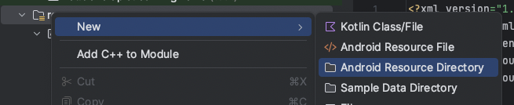
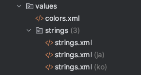
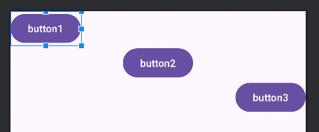
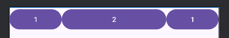
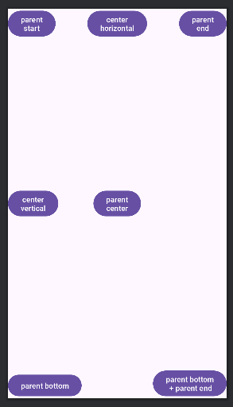
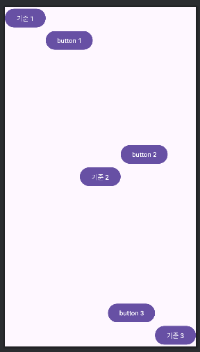

# [1/15] Android (sp, values, 레이아웃, 가이드라인, 스레드, SDK)

## sp (scale-independent pixels)

- dp 는 해상도에 관계없이 동일한 크기로 뷰를 보여주기 위해 안드로이드에서 정한 단위
- sp 는 텍스트 크기를 지정하는 단위
- 안드로이드에서 설정한 시스템 텍스트 크기 반영

## strings.xml 와 colors.xml

- xml 에서 사용하는 value 값을 정의하는 xml
- res 폴더 아래  values 에 위치
- 색상, 텍스트 등 변경이 자주 일어나거나 의미있는 값에 대해 분리하여 관리

```xml
<?xml version="1.0" encoding="utf-8"?>
<LinearLayout xmlns:android="http://schemas.android.com/apk/res/android"
    android:orientation="vertical"
    android:layout_width="match_parent"
    android:layout_height="match_parent">

    <TextView
        android:id="@+id/textView"
        android:layout_width="wrap_content"
        android:layout_height="wrap_content"
        android:text="@string/greeting" <!-- string 태그에 있는 name 이 greeting 인 값 -->
        android:textColor="@color/colorMain" <-- color 태그에 있는 name 이 colorMain 인 값 -->
        android:textSize="20sp"
        android:textStyle="bold"/>
</LinearLayout>
```

- 환경에 따라 다른 value 값을 설정하고 싶은 경우 values 폴더를 분리하여 관리할 수 있음
    - 예) 설정한 나라별로 다른 값을 보여주고 싶은 경우
- 안드로이드 리소스 폴더를 values-ko, values-ja 로 생성하여 xml 파일 관리



- 사용자가 설정한 언어에 따라 적절한 strings.xml 파일 선택하여 실행



## 버튼

- 레이아웃의 전환이나 사용자와 앱이 상호작용을 하는 데 사용하는 뷰
- 사용자의 행동을 유도하는 용도
- 텍스트뷰를 상속하고 있기 때문에 텍스트뷰의 속성과 기능을 대부분 그대로 사용할 수 있음

## 에디트텍스트

- 사용자의 입력을 받는 뷰
- 텍스트뷰를 상속하고 있음
- 속성
    - textPassword : 비밀번호
    - phone : 전화번호
    - textEmailAddress : 이메일
    - datetime : 날짜와 시간 형식

## 레이아웃

- 리니어 레이아웃(Linear Layout) : 수직 방향(위에서 아래로) 혹은 수평 방향(왼쪽에서 오른쪽으로) 차례로 주어진 뷰를 정렬
- 상대적 레이아웃(Relative Layout) : 상대적 레이아웃을 사용하면 뷰들이 다른 뷰들로부터 위치를 지정하거나 자신이 속한 레이아웃을 기준으로 위치를 정함
    - A 뷰의 오른쪽에 위치, 부모 레이아웃의 정중앙에 위치
- 컨스트레인트 레이아웃(Constraint Layout) : 뷰 사이에 수평, 수직 방향의 제약을 주어 뷰들을 위치시킴
- 테이블 레이아웃(Table Layout) : 뷰를 행과 열로 구성하여 표(테이블)의 형태로 표현
- 프레임 레이아웃(Frame Layout) : 뷰들을 액자처럼 쌓아놓음
    - 여러 뷰들을 추가하더라도 가장 나중에 추가한 뷰가 가장 위에 위치
    - 레이아웃 내 여러 뷰들을 배치시키는 데 적합하지 않음
    - 주로 화면에 표시될 하나의 뷰를 바꿔가며 표시하는 데 적합

## 리니어 레이아웃 (Linear Layout)

- `orientation` : 레이아웃 내 요소들 정렬 방향
    - vertical(수직), horizontal(수평)
- `layout_gravity` : 레이아웃 내에서 위치 설정
    - vertical : start, center, end
    - horizontal : top, center, bottom

  

- `layout_weight` : 비중을 지정
    - weightSum : 레이아웃 내에서 사용할 최대 weight 합계를 지정
    - 각 요소별로 weight 비율을 지정할 수 있음
    - 각 요소의 합이 weightSum 보다 적어도 가능

  


## 상대적 레이아웃 (Relative Layout)

- 다른 뷰를 기준으로 상대적 위치를 지정하는 레이아웃
- 내부에 뷰를 배치할 때 기준이 되는 뷰가 존재해야 함
    - 다른 뷰, 부모 레이아웃 등

### 부모 레이아웃을 기준으로 배치하기

```xml
<?xml version="1.0" encoding="utf-8"?>
<RelativeLayout xmlns:android="http://schemas.android.com/apk/res/android"
    android:layout_width="match_parent"
    android:layout_height="match_parent">

    <Button
        android:layout_width="wrap_content"
        android:layout_height="wrap_content"
        android:layout_alignParentStart="true"
        android:text="parent\nstart"
        />

    <Button
        android:layout_width="wrap_content"
        android:layout_height="wrap_content"
        android:layout_alignParentStart="true"
        android:text="parent\nstart"
        />

    <Button
        android:layout_width="wrap_content"
        android:layout_height="wrap_content"
        android:layout_alignParentEnd="true"
        android:text="parent\nend"
        />

    <Button
        android:layout_width="wrap_content"
        android:layout_height="wrap_content"
        android:layout_alignParentBottom="true"
        android:text="parent bottom"
        />

    <Button
        android:layout_width="wrap_content"
        android:layout_height="wrap_content"
        android:layout_alignParentEnd="true"
        android:layout_alignParentBottom="true"
        android:text="parent bottom\n + parent end"
        />

    <Button
        android:layout_width="wrap_content"
        android:layout_height="wrap_content"
        android:layout_centerInParent="true"
        android:text="parent\ncenter"
        />

    <Button
        android:layout_width="wrap_content"
        android:layout_height="wrap_content"
        android:layout_centerHorizontal="true"
        android:text="center\nhorizontal"
        />

    <Button
        android:layout_width="wrap_content"
        android:layout_height="wrap_content"
        android:layout_centerVertical="true"
        android:text="center\nvertical"
        />

</RelativeLayout>
```



### 자식 뷰끼리 기준으로 배치하기

```xml
<?xml version="1.0" encoding="utf-8"?>
<RelativeLayout xmlns:android="http://schemas.android.com/apk/res/android"
    android:layout_width="match_parent"
    android:layout_height="match_parent">

    <Button
        android:id="@+id/standard_1"
        android:layout_width="wrap_content"
        android:layout_height="wrap_content"
        android:layout_alignParentStart="true"
        android:text="기준 1"
        />

    <Button
        android:id="@+id/standard_2"
        android:layout_width="wrap_content"
        android:layout_height="wrap_content"
        android:layout_centerInParent="true"
        android:text="기준 2"
        />

    <Button
        android:id="@+id/standard_3"
        android:layout_width="wrap_content"
        android:layout_height="wrap_content"
        android:layout_alignParentBottom="true"
        android:layout_alignParentEnd="true"
        android:text="기준 3"
        />

    <Button
        android:layout_width="wrap_content"
        android:layout_height="wrap_content"
        android:layout_below="@id/standard_1"
        android:layout_toRightOf="@id/standard_1"
        android:text="button 1"
        />

    <Button
        android:layout_width="wrap_content"
        android:layout_height="wrap_content"
        android:layout_above="@id/standard_2"
        android:layout_toRightOf="@id/standard_2"
        android:text="button 2"
        />

    <Button
        android:layout_width="wrap_content"
        android:layout_height="wrap_content"
        android:layout_above="@id/standard_3"
        android:layout_toStartOf="@id/standard_3"
        android:text="button 3"
        />

</RelativeLayout>
```



## 컨스트레인트 레이아웃 (Constraint Layout)

- 한 화면을 구성하는 뷰들에 서로 제약을 둠
- 반응형 UI 를 쉽게 구성할 수 있음
- 자식 뷰의 수직/수형 방향에 대한 제약 조건을 각각 하나 이상 추가해야 함
- 다른 레이아웃과는 달리 컨스트레인트 레이아웃에서 마진 설정을 할 때에는 해당 방향으로 제약이 존재해야 함
- 0dp = match_constraint : 제약에 뷰 크기를 맞추는 것

## Guideline

- 레이아웃 사이에 가이드라인을 추가하여 반응형 UI 를 표현할 수 있음
- 가이드라인은 두께를 가지지 않음
- 가이드라인을 기준으로 제약 조건을 설정할 수도 있음

## 스레드

### 메인 스레드

- 앱이 처음 시작될 때 시스템이 생성하는 스레드
- 액티비티의 모든 생명 주기 관련 콜백 실행을 담당
- 에디트텍스트와 같은 UI 위젯을 사용한 사용자 이벤트와 UI 드로잉 이벤트를 담당
- UI 와 관련된 작업

### 백그라운드 스레드

- 메인 스레드에서 처리하기 어려운 작업을 대신 처리해주는 스레드
    - 작업량이 큰 연산이나 네트워크 통신, 데이터베이스 쿼리 등
- **단, UI 관련 작업은 백그라운드 스레드에서 할 수 없음**
    - 하나의 자원에 대해 두 개 이상의 스레드에서 접근하여 UI 를 변경한다면 각 스레드가 언제 처리를 끝내고 UI 에 접근할 지 순서를 알 수 없음
    - 두 개 이상의 스레드에서 하나의 자원에 접근하는 경우 데드락이 발생할 가능성도 있음
- 백그라운드 스레드에서 UI 에 접근해야 하는 경우 메인 스레드에게 요청하여 처리

## build.gradle sdk 버전

- `compileSdk` : Gradle 에 어떤 안드로이드 SDK 버전으로 앱을 컴파일할 것인지 명시
    - 가장 최신 API 버전으로 지정하면 개발 시점 기준으로 모든 API 를 사용할 수 있음
    - 컴파일 SDK 버전이므로 런타임에는 영향을 미치지 않음
    - deprecated 된 API 체크나 기존 코드의 컴파일 체크 또는 새로운 API 에 대비하려면 최신 버전으로 사용하는 것이 좋음
- `minSdk` : 앱을 사용할 수 있는 최소한의 API 레벨을 명시
    - 안드로이드는 앱을 서리하려는 기기의 API 레벨이 minSdk 버전보다 낮으면 설치되지 않음
- `targetSdk` : 앱이 기기에서 동작할 때 사용하는 SDK 버전
    - 기기 버전이 API 28 이고 targetSdk 버전이 API 24 이면 앱은 API 24 를 기본으로 동작함
    - 새로운 안드로이드 API 버전이 출시될 때마다 보안과 성능이 좋아지고 사용자 환경이 전반적으로 개선
    - 구글에서는 앱 개발 당시의 최신 API 를 targetSdk 로 지정할 것을 권장
