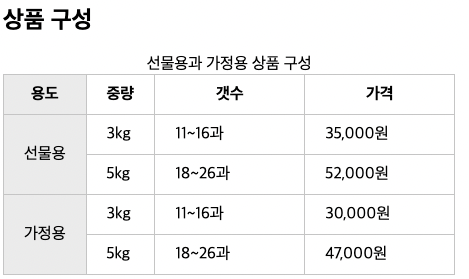

# [11/6] HTML (HTML 의 기초, emmet, Tag)

- visual studio code 설치
- [책 예제코드 깃허브](https://github.com/Eun-Sook-Kim/doit_html_css_javascript)
- HTML : HyperText Markup Language

## HTML 문서의 기본 구조

- `<!DOCTYPE html>` : 브라우저에게 해당 문서가 html5 임을 알림
- `<html> ~ </html>` : html 문서의 범위 지정
    - `<html lang=”ko”>` : 문서에서 사용할 언어 지정
        - 통합 검색 시 언어 필터링을 판단하는 기준
- 반응형 : 디바이스의 해상도에 따라 웹 사이트의 크기가 변경되는 것
- 적응형 : 디바이스용 화면 별도 구축

## emmet 단축키

- [참고 사이트](https://www.hanl.tech/blog/emmet-%EB%8B%A8%EC%B6%95%ED%82%A4-%EB%B0%8F-%ED%8A%B8%EB%A6%AD-9%EA%B0%80%EC%A7%80/)

### ****하위 요소 생성: “>” 사용****

```html
table>tr*2>tb*3
```

```html
<table>
  <tr>
    <tb></tb>
    <tb></tb>
    <tb></tb>
  </tr>
  <tr>
    <tb></tb>
    <tb></tb>
    <tb></tb>
  </tr>
</table>
```

### ****동급 요소 생성: “+” 사용****

```html
div>p+p
```

```html
<div>
  <p></p>
  <p></p>
</div>
```

### ****CSS class 와 id 설정: “.” 와 “#”사용****

```html
ul#menu>li.item*3
```

```html
<ul id="menu">
  <li class="item"></li>
  <li class="item"></li>
  <li class="item"></li>
</ul>
```

### ****Grouping (그룹화) : “( )” 사용****

```html
.container>(header>nav>ul>li*5>a)+(#content>section)+footer
```

```html
<div class="container">
  <header>
    <nav>
      <ul>
        <li><a href=""></a></li>
        <li><a href=""></a></li>
        <li><a href=""></a></li>
        <li><a href=""></a></li>
        <li><a href=""></a></li>
      </ul>
    </nav>
  </header>
  <div id="content">
    <section></section>
  </div>
  <footer></footer>
</div>
```

### ****속성 [attribute] 있는 태그: “[]”사용****

```html
td[title="name" colspan="5"]
```

```html
<td title="name" colspan="5"></td>
```

### ****텍스트가 있는 태그: {} 중괄호 안에 {텍스트}를 입력****

```html
a.button{Click Me}
```

```html
<a href="" class="button">Click Me</a>
```

### ****넘버링(숫자를 순서대로 나열): “$”사용****

```html
ul.list>li.item$*5>{$}
```

```html
<ul class="list">
  <li class="item1">1</li>
  <li class="item2">2</li>
  <li class="item3">3</li>
  <li class="item4">4</li>
  <li class="item5">5</li>
</ul>
```

## 시멘틱(semantic) 태그

- 이름만 봐도 태그의 의미를 파악할 수 있는 태그

### 장점

- 시각장애인이 웹 사이트를 이용할 때 사용하는 화면 낭독기와 같은 보조 기기에서 사이트의 구조를 제대로 이해할 수 있음
    - 최근에는 일반 태그와 큰 차이는 없음
- 문서 구조가 정확하게 나누어져 PC 나 모바일의 웹 브라우저와 여러 스마트 기기의 다양한 화면에서 웹 문서를 표현하기 쉬움
- 인터넷에서 웹 사이트를 검색할 때 필요한 내용을 정확히 찾을 수 있음
    - 필요한 영역에서만 검색

## 태그

- `<blockquote>` : 다른 텍스트 단락보다 안으로 들여쓴 태그 (인용문 태그)
- `<ol>` 의 type, start 속성
    - type : 순서 표기 시 순서의 타입 지정 (1, a, A, i, I…)
    - start : 순서 표기 시 시작 순서 지정
- `<dl>` : 설명 목록 태그 (description list)
    - `<dt>` : 설명 목록 태그의 이름 태그
    - `<dd>` : 설명 목록 태그의 값 태그

    ```html
    <h2>상품 구성</h2>
    <dl>
      <dt>선물용 3kg</dt>
      <dd>소과 13~16과</dd>
      <dd>중과 10~12과</dd>
    </dl>
    <dl>
      <dt>선물용 5kg</dt>
      <dd>중과 15~19과</dd>
    </dl>
    ```

    ```html
    상품 구성
    선물용 3kg
    	소과 13~16과
    	중과 10~12과
    선물용 5kg
    	중과 15~19과
    ```

- `<col>` 과 `<colgroup>` 을 이용한 전체 컬럼 스타일 지정

    ```html
    <table>
      <caption>선물용과 가정용 상품 구성</caption>
      <colgroup>
        <col style="background-color:#eee;">
        <col>
        <col style="width:150px">
        <col style="width:150px">
      </colgroup>
      <thead>
        <tr>
          <th>용도</th>
          <th>중량</th>
          <th>갯수</t>
          <th>가격</th>
        </tr>
      </thead>
    	...
    </table>
    ```

  

- 다양한 멀티미디어 파일 삽입하는 `<object>` 와 `<embed>` 태그
    - `<embed>` 태그는 초기 버전부터 존재하여 대부분의 브라우저에서 사용 가능
    - HTML 의 `<audio>`, `<video>`, `<object>` 태그를 지원하지 않는 브라우저 시 사용
- 폼 요소를 그룹으로 묶는 `<fieldset>`, `<legend>`
    - `<fieldset>` : 하나의 폼 안에서 여러 구역으로 나누어 표시
    - `<legend>` : fieldset 의 이름
- 폼 요소에 레이블을 붙이는 `<label>`
    - `<input>` 태그와 같은 폼 요소에 붙이는 이름
- 날짜 타입을 지정하는 `<input type=”date || month || week”>`
    - `<datetime-local>` : 지역에 맞는 날짜와 시간 입력

    ```html
    <form>
      <h1>날짜 지정하기</h1>
      <input type="date">
      <input type="month">
      <input type="week">
      <hr>
      <h1>시간 지정하기</h1>
      <input type="time">
      <input type="datetime-local">
      <hr>
      <h1>범위 제한하기</h1>
      <input type="date" min="2020-02-01" max="2020-02-15">
      <input type="time">
    </form>
    ```

  
