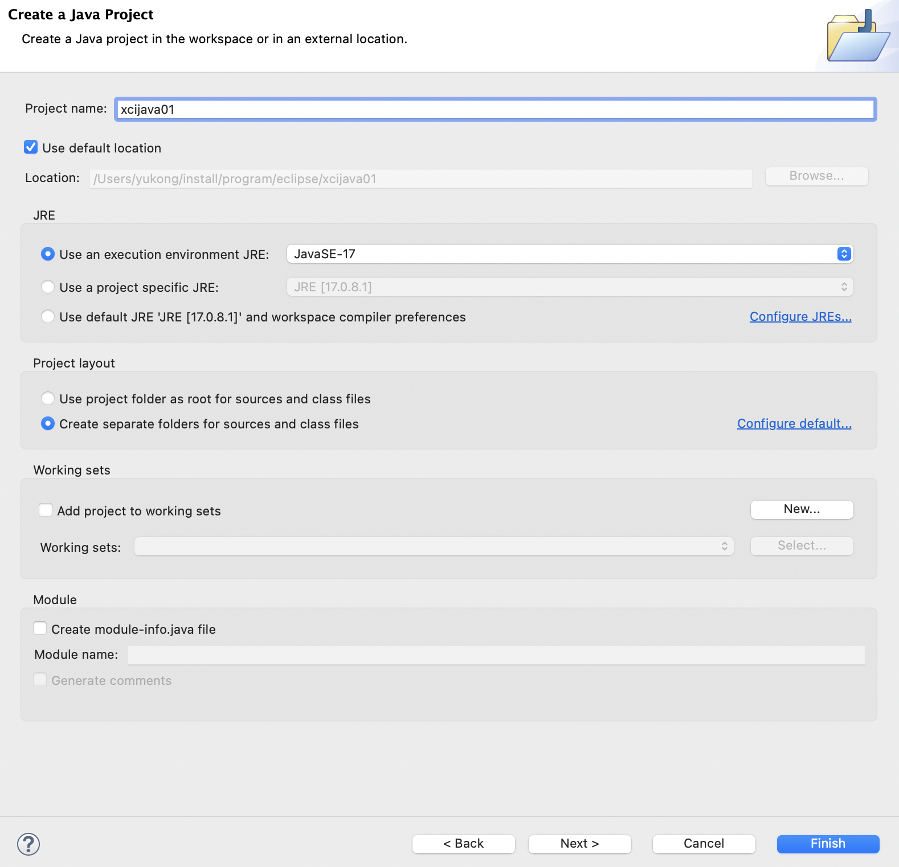
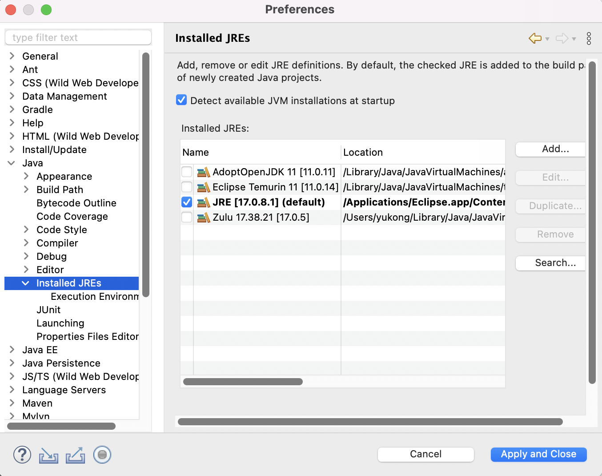

# [10/16] Java (환경설정, 자료형)

## 환경설정

- 교육 과정에는 Java 17 버전 사용
    - https://adoptium.net/temurin/archive/?version=17
    - C:\Program Files\Java\jdk-17.0.8 → Windows 기준
    - eclipse
        - C:\dev\workspace

Eclipse 프로젝트 생성

## Java 특징

- OS 에 독립적인 JVM
    - java.exe + jre → JVM 역할 수행
    - javaw.exe → window 용 JVM

JRE 변경 (Preferences)

## Java 자료형

- 기본자료형(primitive type)
    - boolean : true/false 를 나타낼 때 1bit 를 사용하지만 메모리 상에서는 byte 영역 할당
        - 변수에 byte 단위로 저장되기 때문에 나머지 7bit 는 사용되지 않는다
- 참조자료형(reference type)
    - Boxed Primitive Class
