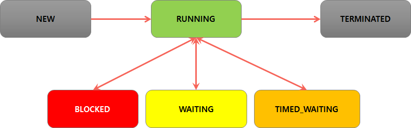

# [10/23] Java (Thread, Runnable, 동기화, Generic)

## Thread

- Thread 는 동시성과 병렬성을 갖음
    - 동시성 : 여러 작업이 짧은 시간 내 빠르게 전환되어 실행
    - 병렬성 : 두 개의 작업 공간에서 각각의 작업 실행

## Thread 의 start()

- **Thread 생성 시** JVM Runtime Memory Area 에 Stack Area 가 생성
    - new Thread(); → 단순히 Thread 의 인스턴스 생성
    - **thread.start(); → Stack Area 생성**
    - Thread 종료 후 Stack Area 는 종료하는 것이 아닌 할당만 해제하고 재사용
- Thread 의 start() 를 호출하여 Thread 내부의 run() 을 실행
    - start() 는 재사용 할 수 없음 (단 한번만 실행)
    - start() = 새로운 쓰레드 생성/추가하기 위한 모든 준비 + 새로운 쓰레드 위에 run() 실행
    - **start() 가 아닌 run() 을 실행할 경우 같은 Stack Area 에서 일반 메서드처럼 실행됨**

## Thread 의 속성

- static Thread Thread.currentThread() : 현재 실행되는 쓰레드의 정보 반환
- static int Thread.activeCount() : 현재 실행중(active)인 쓰레드의 개수 반환
- Runtime.*getRuntime*().availableProcessors() : 현재 PC 의 CPU 반환
- 우선순위 : 1~10, 기본 5 → OS 마다 다를 수 있음
    - 우선순위를 설정하더라도 CPU 에 할당되는 쓰레드는 무작위로 할당
    - 우선순위를 기준으로 개발 시 의도대로 동작하지 않을 수 있음

## Daemon Thread

- 일반적으로 프로그램이 종료되더라도 Thread 의 동작을 모두 마친 이후에 동작 완료 → 일반 쓰레드
- 데몬 쓰레드 : 일반 쓰레드가 **모두** 종료되면 함께 종료되는 쓰레드

## synchronized

- 동기화 : 하나의 작업이 완전히 완료된 후 다른 작업을 수행하는 것
- 메서드 동기화
    - 메서드에 Lock 을 걸어 다른 Thread 에 접근하지 못하도록 설정
    - 메서드를 기준으로 Lock 을 걸었기 때문에 동일한 자원에 대해 수정할 때 다른 메서드를 사용하면 당연히 동기화가 설정이 안됨
    - 인스턴스 메서드에 synchronized 를 추가할 경우 특정 인스턴스를 기준으로 Lock 공유
    - static 메서드에 synchronized 를 추가할 경우 클래스를 기준으로 Lock 공유
    - 클래스와 인스턴스 Lock 은 별개로, 클래스에 Lock 을 걸어도 인스턴스에는 영향 없음
- 블록 동기화
    - 인스턴스마다 동기화를 구분할 수 있음
    - synchronized (**Object ob**) { … }
        - 괄호 안에 있는 인스턴스끼리의 동기화 설정 → 인스턴스가 다를 경우 동기화가 되지 않음

## Thread 의 State

- NEW : 생성 되어있지만 실행 되지 않은 상태
- RUNNABLE(RUNNING) : 작업 수행 중
    - Thread 의 start() 호출 시의 상태 → JVM 에 Stack Area 생성
    - 실행 대기와 실행 상태를 번갈아가며 실행됨 (CPU 공유)
    - yield() : 자신의 차례를 딱 한번 양보, 잣니의 차례가 돌아오면 다시 CPU 점유
- TERMINATED : 종료됨
    - 클래스에 정의된 run() 메서드 실행 완료
    - 쓰레드의 실행이 종료되면 재사용할 수 없음
        - 쓰레드의 동작이 아닌 단순 메서드 호출정도로 인식
- BLOCKED : 다른 스레드의 Lock 해제를 기다리는 중
    - 동기화 메서드 또는 동기화 블록 등
- WAITING : wait(), join(),park() 메서드로 대기중
    - join() —(RUNNABLE)—> join 대상의 쓰레드 종료 또는 interrupt()
    - wait() —(RUNNABLE)—> nofity() 또는 notifyAll()
- TIMED_WAITING : WAITING과 같지만, 정해진 시간만 대기
    - Thread.sleep(long millis) : 이 메서드를 호출한 쓰레드를 지정 시간동안 잠시 대기
    - 인스턴스.join(long millis) : 다른 Thread 에 CPU 할당
    - 정해진 시간이 끝나거나 또는 interrupt() 를 통해 다시 RUNNABLE 상태로 돌아감
    - interrupt() 실행 시 InterruptedException 이 발생하기 때문에 예외 처리 필요

## Generic

- JDK5 에 추가됨
- Generic 으로 타입을 지정하면 컴파일 시에 체크 → 잘못된 동작 방지
- 제네릭 메서드 : 메서드를 호출하는 시점에 타입 설정
    - 컴파일 시점에는 어떤 타입의 객체으로 호출했는지 알 수 없기 때문에 Object 의 메서드만 사용 가능

## Generic 타입 범위 제한

- 제네릭 요소의 타입을 제한
- class Name <T extends T2> {}
    - T2 : T 에 해당할 수 있는 타입의 최상위 클래스/인터페이스명
    - 허용하는 타입의 범위를 제한함으로써 최상위 클래스/인터페이스에서 제공하는 메서드 호출 가능

## Number

- Boolean, Character 를 제외한 모든 6개의 참조형 타입은 Number 을 상속하여 구현
    - Byte, Short, Integer, Long, Float, Double
    - BigDecimal, BigInteger 포함
