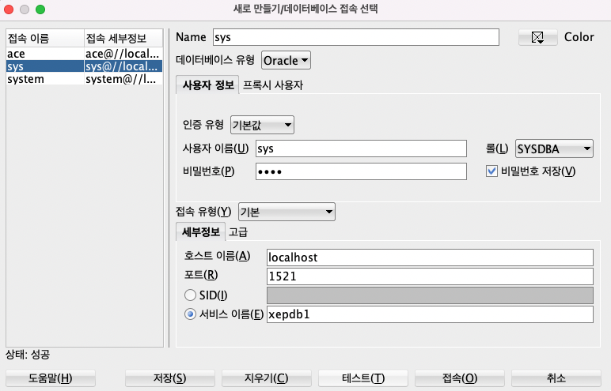
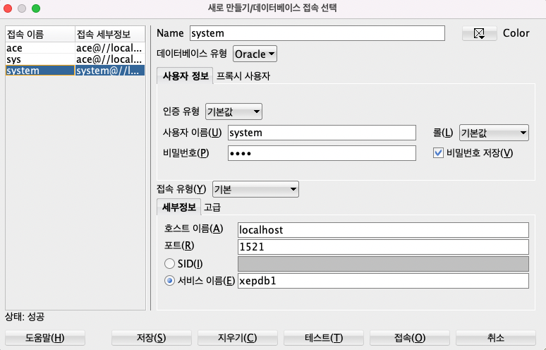
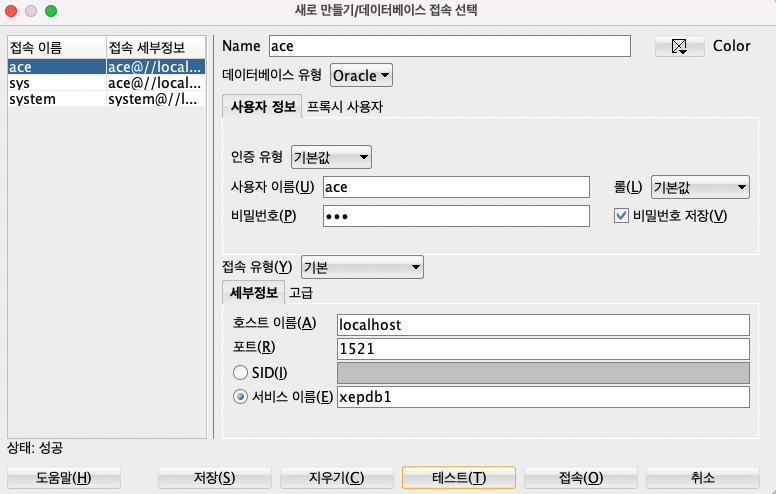
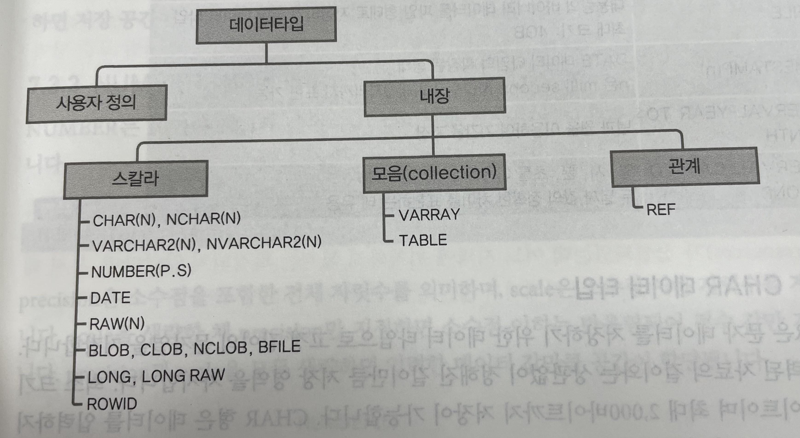

# [10/26] Oracle (환경설정, 기본문법, 계정, 데이터타입, 제약 조건, SELECT, FROM, WHERE)

## Oracle 기본 설정

- sqlplus 접속 시 계정 정보 감추기 (/nolog)

```bash
$ docker exec -it {컨테이너명} sqlplus /nolog
```

- 콘솔 출력 시 포맷팅 설정 (30칸 기준)

```bash
SQL> col name format a30
SQL> col pdb  format a30
```

- docker 의 sqlplus 에서 특정 계정으로 접속

```bash
$ docker exec -it {컨테이너명} sqlplus

sql> conn ace/{비밀번호}@localhost:1521/xepdb1
```

## Oracle SQL Developer

- [설치 사이트](https://www.oracle.com/database/sqldeveloper/technologies/download/)

  <details>
  <summary>oracle 관리자 계정으로 접속</summary>
  <div>

  
  
  </div>
  </details>

  <details>
  <summary>oracle system 계정으로 접속</summary>
  <div>

  

  </div>
  </details>
  
  <details>
  <summary>oracle 특정 사용자 계정으로 접속 (ace)</summary>
  <div>

  

  </div>
  </details>

## Oracle 기본 문법

- select : 원하는 형태의 데이터를 Oracle 에게 질의하는 것
    - 관점에 따라 DML 로 볼 수 있음
    - DB 의 데이터를 변경하지 않을 뿐 원하는 형태로 변경하여 조회할 수 있기 때문
- view : 쿼리를 저장하는 Object
    - 일반적으로 데이터를 저장하지 않음
- 대소문자 구분
    - 소문자로 사용했으면 그대로 소문자로, 대문자로 사용했으면 그대로 대문자로 사용하는 것이 성능에 이점
    - 쿼리문 실행 시 쿼리 파싱 과정에서 내부적으로 해당 토큰들을 캐싱함
    - 쿼리를 실행할 때마다 대소문자를 변경한다면 캐싱이 별개로 인식
    - 일반적으로 명령어는 대문자, 컬럼 및 테이블 등은 소문자로 사용

## 데이터베이스 개념

- 자료를 저장하는 자료의 집합
- 파일 시스템 문제를 극복

## Oracle

- 관계형 데이터베이스 시스템 (RDBMS)
- Oracle 12c 버전에서 아키텍처 변화 및 클라우드 지원 시작

## SQL 명령어 유형

- DML : INSERT, UPDATE, DELETE, SELECT
- DDL : CREATE, ALTER, DROP, RENAME, TRUNCATE
- TCL : COMMIT, ROLLBACK, SAVEPOINT
- CDL : GRANT, REVOKE

## Oracle 계정

- 오라클에서는 user == schema 같은 개념
- DBA 권한 : 사용자를 생성하거나 삭제, 변경하는 등의 시스템 권한 보유
    - sys : 오라클 super 사용자 계정, 오라클 최상위 계정
    - system : 오라클 데이터베이스 유지보수 사용자 계정, 데이터베이스 생성 권한 없음
    - 테이블에 “dba_” 가 붙은 경우 DBA 권한을 가진 사용자만 접근 가능

## 계정 생성

- 계정 생성

    ```sql
    create user tester1
    identified by 1234
    account unlock;
    ```

- 계정 비밀번호 변경

    ```sql
    alter user tester1
    identified by 1234
    ```

- 생성한 계정 조회

    ```sql
    select username from dba_users
    where username like '%TESTER%';
    ```

- 권한 부여

    ```sql
    grant connect, resource to tester1;
    ```

    - connect : session 생성 및 테이블 생성, 조회
    - resource : 기본 개체(Table, View 등)을 생성, 변경, 삭제
- tablespace 변경

    ```sql
    	alter user tester1
    default tablespace users
    temporary tablespace temp
    quota unlimited on users;
    ```

- 모든 테이블 정보 조회

    ```sql
    select * from tab;
    
    ```


## 데이터 타입



- CHAR : size 크기의 **고정 길이 문자** 데이터 타입 (1~2,000byte)
- VARCHAR2 : size 크기의 **가변 길이 문자** 데이터 타입 (1~4,000byte)
- NVARCHAR2 : 국가별 문자 집합에 따른 size 크기의 문자 또는 바이트의 가변 길이 문자 데이터 타입 (1~4,000byte)
- NUMBER : 정밀도(p)와 스케일(s)로 표현되는 숫자 데이터 타입
    - p : 1~38 / s : -84~127
- DATE : 날짜 형식을 저장하기 위한 데이터 타입 (YY/MM/DD)
    - 정확한 년도를 파악하기 위해 to_char() 함수를 사용하여 데이터 형식 변환 필요
        - to_char(column, ‘YYYY/MM/DD’)
        - 'YYYY-MM-DD HH24:MI:SS’
- ROWID : **테이블 내 행의 고유 주소**를 가지는 64진수 문자 타입
    - 테이블의 레코드마다 자동으로 생성되는 물리적 주소
    - ROWNUM : 테이블의 레코드 번호 (1번부터 시작)
    - 이처럼 테이블에 자동으로 생성되는 컬럼을 pseudo column 이라 부름
- BLOB : **대용량의 바이너리 데이터**를 저장하기 위한 데이터 타입 (최대 4GB)
    - 일반적으로 많이 사용하지 않음 (보통 경로 저장)
- CLOB : **대용량의 텍스트 데이터**를 저장하기 위한 데이터 타입 (최대 4GB)
    - ex) 게시판의 본문 → VARCHAR2 가 4천자로 제한되어 있어 최근에는 CLOB 사용
- BFILE : **대용량의 바이너리 데이터를 파일 형태**로 저장하기 위한 데이터 타입 (최대 4GB)
- TIMESTAMP : DATE 데이터 타입의 확장된 형태 (milli second)
- INTERVAL YEAR TO MONTH : 년과 월을 이용하여 기간을 저장
- INTERVAL DAY TO SECOND : 일, 시, 분, 초를 이용하여 기간을 저장
    - 두 날짜 값의 정확한 차이를 표현하는 데 유용

## 데이터 무결성과 제약 조건

- not null 제약 조건
- primary key (기본키 제약 조건)
    - not null + unique 조건과 동일
    - 이상(anomaly) 현상이 발생하지 않도록 설정하는 방법
    - 인공 키 : 컬럼의 값의 의미는 없지만 중복되지 않는 값을 갖도록 생성한 컬럼(키)
- foreign key (외래키 제약 조건)
    - 다른 테이블의 컬럼을 참조하도록 걸어둔 제약 조건

## null

- null : 할당받지 않은 값, 아직 무엇인지 모르는 값 ≠ Java 의 null
- null 은 어떤 값인지 확정지을 수 없으므로 연산을 할 수 없음 → null 반환
- nvl(column, 대체값) : 해당 컬럼이 null 일 경우 값을 대체하는 함수
- 조건에 null 이거나 null 이 아닐 경우에는 is 사용
    - column is null / column is not null

| OR    | TRUE | FALSE | NULL |
|-------|------|-------|------|
| TRUE  | TRUE | TRUE  | TRUE |
| FALSE | TRUE | FALSE | NULL |
| NULL  | TRUE | NULL  | NULL |

| AND   | TRUE  | FALSE | NULL  |
|-------|-------|-------|-------|
| TRUE  | TRUE  | FALSE | NULL  |
| FALSE | FALSE | FALSE | FALSE |
| NULL  | NULL  | FALSE | NULL  |

## SELECT

- 에스테리스크(*) 는 지양할 것
- 원하는 데이터 형식으로 얻을 수 있도록 오라클 서버에게 요청하는 문법
- ALLAS(별칭) : select 한 컬럼의 네임을 변경
    - 대소문자 구분 시 쌍따옴표(””) 사용 → SQL 내에서 쌍따옴표는 여기만 씀
- Concatenation 연산자 : 여러 개의 컬럼 연결 (||)

    ```sql
    SELECT ename || '의 직급은 ' || job || '입니다.' as 직급
    FROM emp;
    ```

    - concat() 함수도 동일
    - 단 concat() 은 파라미터가 2개로 제한

    ```sql
    select concat(last_name, first_name) from employees;
    ```

- DISTINCT 키워드 : 중복되는 값 제외

    ```sql
    SELECT DISTINCT deptno FROM emp;
    
    SELECT UNIQUE deptno FROM emp;
    ```


## FROM

- dual table : dummy 데이터 하나만 존재하는 sys 의 기본 테이블
    - Oracle 의 경우 select 시 무조건 from 절을 포함해야 하기 때문에 특정 테이블이 필요 없을 경우 dual 테이블 사용 가능

    ```sql
    SELECT TO_CHAR(sysdate, 'YYYY-MM-DD HH24:MI:SS') AS thistime 
    FROM dual;
    ```


## WHERE

### 비교 연산자

- 다르다 : <>, ≠. ^=
- 날짜 데이터 조회

    ```sql
    SELECT *
    FROM emp
    WHERE hiredate < TO_DATE('2005/01/01', 'YYYY/MM/DD');
    ```

    - TO_DATE() : 문자열 → DATE 타입으로 변환

### 논리 연산자

- NOT 연산자 : 특정 조건의 반대 조건 설정

    ```sql
    SELECT *
    FROM emp
    WHERE NOT deptno = 10;
    
    SELECT *
    FROM emp
    WHERE deptno <> 10;
    ```


### BETWEEN AND 연산자

- BETWEEN AND 의 NOT 이 포함될 경우 미만과 초과로 처리

    ```sql
    SELECT *
    FROM emp
    WHERE sal NOT BETWEEN 400 AND 500;
    ```

- 해당 날짜 범위의 레코드 조회

    ```sql
    select *
    from emp
    where hiredate between to_date('2003/01/01', 'YYYY/MM/DD')
    and to_date('2003/12/31', 'YYYY/MM/DD');
    ```

    - 만약 컬럼에 함수를 적용할 경우 컬럼의 수가 무수히 많아지면 성능 문제 발생

    ```sql
    select *
    from emp
    where to_char(hiredate, 'YYYY') = 2003;
    ```

<details>
<summary>Quiz</summary>
<div>

- Q1.

  ```sql
  select last_name, salary, job_id
  from employees
  where salary >= 10000 and job_id like '%MAN%'
  ;
  ```

- Q2.

    ```sql
    select last_name, salary, job_id
    from employees
    where salary >= 10000 or job_id like '%MAN%'
    ;
    ```

- Q3.

    ```sql
    select last_name, job_id
    from employees
    where job_id not in('IT_PROG', 'ST_CLERK', 'SA_REP')
    ;
    ```

- Q4.

    ```sql
    select last_name, commission_pct
    from employees
    where commission_pct is not null
    ;
    ```

- Q5.

    ```sql
    select last_name, job_id, salary
    from employees
    where (job_id = 'ST_CLERK' or job_id = 'SA_REP')
    and salary not in (2500, 3500, 7000)
    ;
    ```

</div>
</details>
